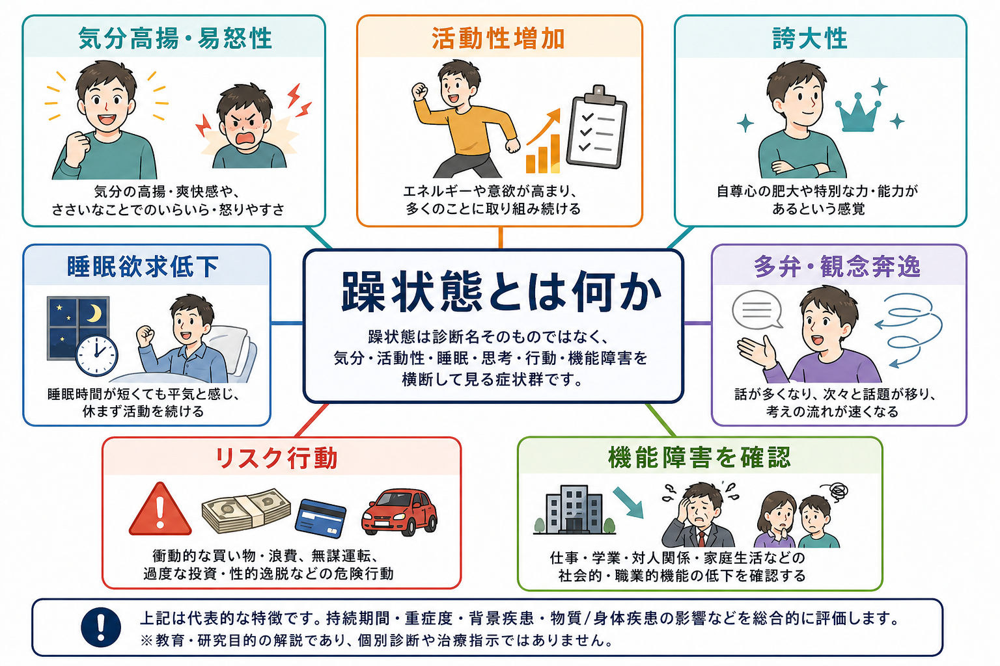
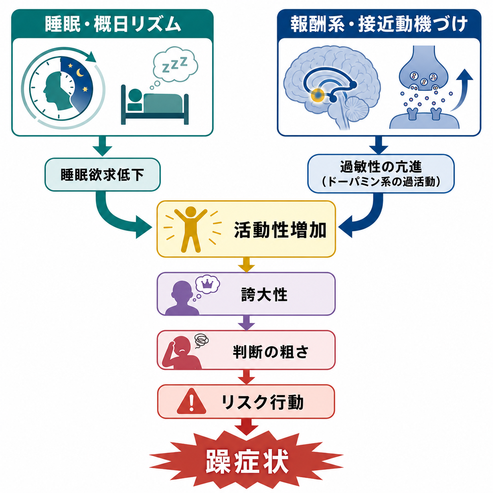

# 躁状態とは何か

## 要点

- 躁状態は、単なる「元気」「機嫌がよい」状態ではなく、気分の高揚・易怒性、活動性またはエネルギーの増加、睡眠欲求低下、誇大性、多弁、観念奔逸、注意散漫、リスク行動がまとまって現れる症候群である[1][2]。
- DSM-5 以降の躁病エピソードでは、気分変化だけでなく、活動性またはエネルギーの増加が中核に置かれる[1]。
- 躁状態では本人が快調と感じることもあるため、本人の主観だけでなく、家族・周囲から見た普段との差、機能障害、危険行動、精神病症状を確認する必要がある[3][4]。
- 睡眠・概日リズムの乱れと、報酬系・接近動機づけの過敏性は、躁症状を理解するうえで重要な研究仮説である[5][6]。
- 本稿は教育・研究目的の整理であり、個別診断や治療指示ではない。

## この記事で答える問い

1. 躁状態では、どのような気分・活動性・睡眠・思考・行動の変化が起こるのか。
2. 躁状態と軽躁状態、通常の元気さはどこが違うのか。
3. なぜ睡眠欲求低下や誇大性、リスク行動が同時にまとまりやすいのか。
4. 臨床・研究では、躁症状をどのように観察し、重症度として扱うのか。

## まず結論

躁状態とは、気分の高揚だけでなく、活動性・エネルギー・睡眠・思考・行動・対人機能が同時に変化する状態である。中心にあるのは、「気分が上がっているか」だけではない。むしろ、普段より活動量が増え、眠らなくても平気に感じ、考えや話題が速く流れ、自己評価が過度に高まり、結果として仕事・学業・対人関係・金銭・安全に影響が出るかどうかが重要である[1][4]。

したがって、躁状態の評価では「本人が楽しいと言っているか」よりも、持続期間、普段との差、周囲から見た変化、機能障害、精神病症状、物質・身体疾患の影響を合わせてみる。とくに入院を要する程度、著しい機能障害、妄想・幻覚などがあれば、軽躁ではなく躁状態として扱われる[1][2]。

## 背景

躁状態は、双極I型障害の診断において中心的なエピソードである。DSM 系の分類では、少なくとも一度の躁病エピソードが双極I型障害の診断に必要とされる[1]。ICD-11 でも、双極I型障害は躁病エピソードまたは混合エピソードの既往を軸に整理される[2]。

ただし、症候学としては「躁状態=双極性障害」と短絡しないことが大切である。躁様の症状は、物質・薬剤、甲状腺機能亢進、神経疾患、睡眠不足、せん妄、精神病性障害、発達特性、人格傾向などと鑑別が必要になる[4]。そのため、[[精神症候学とは何か]] と同じく、まずは症状の形・持続・強度・文脈を記述し、診断名はその後に検討する。

## 基本概念

### 中核は気分変化と活動性増加

DSM-5 の躁病エピソードでは、異常かつ持続的な高揚気分・開放的気分・易怒的気分に加え、異常かつ持続的な目標志向活動またはエネルギーの増加が必要とされる[1]。ICD-11 でも、躁病・軽躁病エピソードの定義では、気分の変化と活動性または主観的エネルギー増加が重要な入口条件として扱われる[2]。

この点は実践的に重要である。「明るい」「よく話す」だけでは躁状態とはいえない。普段と比べて、眠らなくても活動できる、複数の計画を同時に始める、仕事や研究や買い物に過剰に没入する、注意が散りやすい、周囲の制止を受け入れにくい、といった活動面の変化があるかをみる。

### 代表的な症状

躁状態の代表的な症状は、以下のように整理できる[1][3][4]。

| 領域 | 観察すること | 例 |
|---|---|---|
| 気分 | 高揚、開放性、易怒性、気分の不安定さ | 妙に楽観的、些細な制止で怒る |
| 活動性 | 目標志向活動、精神運動性焦燥 | 仕事・学業・計画を過剰に始める |
| 睡眠 | 睡眠欲求低下 | 数時間睡眠でも疲れを感じない |
| 自己評価 | 誇大性、自尊心の肥大 | 特別な能力・使命があると確信する |
| 思考・発話 | 多弁、観念奔逸、思考促迫 | 話題が次々に飛び、遮りにくい |
| 注意 | 注意散漫 | 外的刺激で会話や作業がすぐ逸れる |
| 行動 | リスク行動 | 浪費、無謀運転、性的逸脱、無計画な事業 |
| 重症度 | 機能障害、入院、精神病症状 | 仕事・家庭・安全が大きく損なわれる |

## 仕組み

### 睡眠・概日リズム

躁状態で目立つ特徴のひとつが、睡眠時間の短縮ではなく「睡眠欲求の低下」である。これは、眠れなくて苦しい不眠とは異なり、本人が「ほとんど眠らなくても平気」「休まなくても動ける」と感じる点に特徴がある[1][4]。

双極性障害では、睡眠覚醒リズム、メラトニン、社会的リズム、時計遺伝子などを含む概日リズムの乱れが、病相の出現や維持に関係する可能性が示されている[5]。このため、[[精神科診察で睡眠をどう評価するか]] と接続して、睡眠時間だけでなく、就寝・起床時刻、生活リズム、夜間活動、光曝露、生活イベントを確認することが重要になる。

### 報酬系と接近動機づけ

もうひとつの有力な見方は、報酬系・接近動機づけの過敏性である。報酬や成功の手がかりに対して接近行動が強く駆動されると、目標追求、活動量、自己効力感、リスク選好が過剰に高まり、躁症状として現れやすくなるという仮説である[6]。

この仮説は、誇大性やリスク行動を単なる「性格」ではなく、報酬への反応性、行動制御、睡眠不足、社会的制止の弱まりが組み合わさった状態として理解する助けになる。ただし、躁状態を単一の神経機構だけで説明できるわけではない。前頭前野、線条体、扁桃体、自律神経、ストレス、薬剤、遺伝的脆弱性、生活リズムが重なって病相が形成されると考える方が妥当である[4][6]。

## 図解

躁状態を観察するときは、次の順に見ると整理しやすい。

| 観点 | 見るポイント |
|---|---|
| いつから | 数日から1週間以上の持続か、急な変化か |
| 何が変わったか | 気分、睡眠、活動性、発話、思考、判断、対人行動 |
| 普段との差 | 本人の通常の性格・生活リズムとの違い |
| 周囲からの観察 | 家族・同僚・支援者が気づく変化 |
| 危険性 | 自傷他害、浪費、事故、性的リスク、法的問題 |
| 鑑別 | 物質、薬剤、身体疾患、せん妄、精神病性障害 |

## 臨床・研究との接続

臨床では、躁状態を評価するときに、本人の語り、観察される徴候、周囲からの情報、経過を統合する。これは [[症状と徴候は何が違うのか]] の典型例である。本人は「調子がよい」と語っていても、周囲から見れば睡眠不足、怒りっぽさ、浪費、仕事上の混乱、危険運転が目立つことがある。

研究や臨床試験では、躁症状の重症度を定量化するために Young Mania Rating Scale（YMRS）が広く用いられる。YMRS は、気分高揚、運動活動・エネルギー、睡眠、易怒性、発話、思考内容、攻撃性、病識などを評価する臨床家評価尺度として開発された[7]。ただし、尺度は診断そのものではなく、観察と面接を構造化する道具である。

治療ガイドラインでは、急性躁状態は安全確保、物質・身体疾患の評価、抗躁薬・気分安定薬・抗精神病薬などの薬物療法、心理教育、再発予防を含む包括的対応の対象となる[8]。本稿では治療選択の詳細には立ち入らないが、躁状態は本人に快感や万能感を伴うことがある一方で、社会的・身体的損失が大きくなりうるため、早期の評価と安全確認が重要である。

## よくある誤解

### 「元気なら問題ない」

躁状態では、本人が元気に見えたり、主観的には快調に感じたりすることがある。しかし、睡眠欲求低下、判断の粗さ、金銭・対人・安全上のリスク、仕事や学業の破綻が伴う場合は、単なる元気さとは異なる[3][4]。

### 「躁状態は必ず多幸的である」

躁状態は高揚気分だけでなく、易怒性として現れることがある。周囲の制止や予定変更に強く反応し、怒りっぽさ、攻撃性、対人衝突が前景に出る場合もある[1][4]。

### 「短時間睡眠ならすべて躁である」

重要なのは短時間睡眠そのものではなく、睡眠欲求の低下、活動性増加、気分・思考・行動の変化がまとまっているかである。不眠、過労、カフェイン・刺激薬、シフトワーク、身体疾患でも睡眠は変化するため、[[睡眠障害は脳機能にどのような影響を与えるのか]] との区別が必要になる。

### 「躁状態は本人の性格の問題である」

躁状態では報酬系、睡眠・概日リズム、実行制御、ストレス、薬剤、身体疾患などが関与しうる。誇大性やリスク行動を道徳的に評価するより、症状として記述し、安全と機能への影響を評価することが重要である[4][6]。

## 関連ノート

- [[精神症候学とは何か]]
- [[症状と徴候は何が違うのか]]
- [[MSEで気分と感情をどう区別するか]]
- [[精神科診察で睡眠をどう評価するか]]
- [[双極性障害は情動ネットワークの異常として説明できるのか]]
- [[睡眠障害は脳機能にどのような影響を与えるのか]]

### MOC更新候補

- `content/00_MOC/` 配下の精神医学・症候学・双極性障害関連 MOC に、本記事へのリンク追加を検討する。
- 並列記事生成との衝突を避けるため、本ジョブでは MOC 本体は更新しない。

### 関連ノート候補

- 軽躁状態とは何か
- 混合状態とは何か
- 観念奔逸とは何か
- 誇大妄想とは何か
- 精神運動興奮とは何か
- 双極I型障害とは何か

## 理解チェック

1. 躁状態の評価で、気分高揚だけでなく活動性・エネルギー増加を確認するのはなぜか。
2. 睡眠時間の短縮と睡眠欲求低下は、どのように違うか。
3. 軽躁状態と躁状態を分けるとき、機能障害・入院・精神病症状はどのような意味を持つか。
4. 本人が「快調」と話しているときでも、周囲からの情報が重要になるのはなぜか。
5. 報酬系・接近動機づけの過敏性モデルは、誇大性やリスク行動をどう説明するか。

## 参考文献

[1] National Center for Biotechnology Information. *DSM-5 Changes: Implications for Child Serious Emotional Disturbance*, Table 11, DSM-IV to DSM-5 Manic Episode Criteria Comparison. https://www.ncbi.nlm.nih.gov/books/NBK519712/table/ch3.t7/

[2] Angst, J., Ajdacic-Gross, V., & Rössler, W. (2020). Bipolar disorders in ICD-11: current status and strengths. *International Journal of Bipolar Disorders*, 8, 3. https://doi.org/10.1186/s40345-019-0165-9

[3] National Institute of Mental Health. *Bipolar Disorder*. https://www.nimh.nih.gov/health/publications/bipolar-disorder

[4] Dailey, M. W., & Saadabadi, A. (2023). Mania. In *StatPearls*. StatPearls Publishing. https://www.ncbi.nlm.nih.gov/books/NBK493168/

[5] Gold, A. K., & Kinrys, G. (2019). Treating Circadian Rhythm Disruption in Bipolar Disorder. *Current Psychiatry Reports*, 21(3), 14. https://doi.org/10.1007/s11920-019-1001-8

[6] Nusslock, R., & Alloy, L. B. (2017). Reward Processing and Mood-Related Symptoms: An RDoC and Translational Neuroscience Perspective. *Journal of Affective Disorders*, 216, 3-16. https://doi.org/10.1016/j.jad.2017.02.001

[7] Young, R. C., Biggs, J. T., Ziegler, V. E., & Meyer, D. A. (1978). A rating scale for mania: reliability, validity and sensitivity. *The British Journal of Psychiatry*, 133(5), 429-435. https://doi.org/10.1192/bjp.133.5.429

[8] Yatham, L. N., Kennedy, S. H., Parikh, S. V., et al. (2018). Canadian Network for Mood and Anxiety Treatments (CANMAT) and International Society for Bipolar Disorders (ISBD) 2018 guidelines for the management of patients with bipolar disorder. *Bipolar Disorders*, 20(2), 97-170. https://doi.org/10.1111/bdi.12609

## 未解決問題

- 躁状態の中核を、気分、活動性、報酬感受性、睡眠・概日リズムのどの水準で定義するのが最も臨床的に有用か。
- 軽躁状態と「高い生産性」「創造性」「短期的なストレス反応」を、文化差や職業文脈を含めてどう区別するか。
- 睡眠・概日リズム介入やデジタル表現型が、躁状態の予兆検出と再発予防にどこまで有効か。
