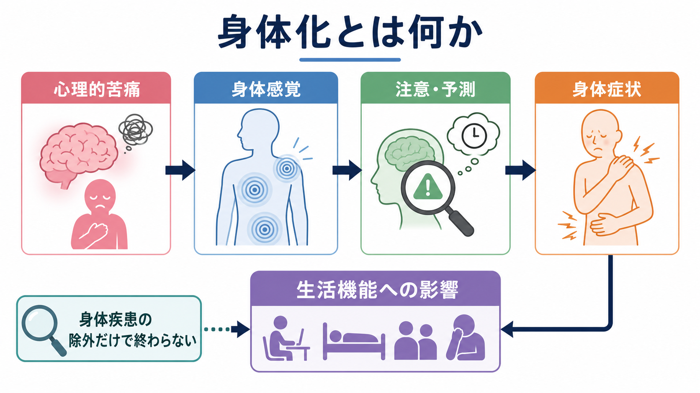
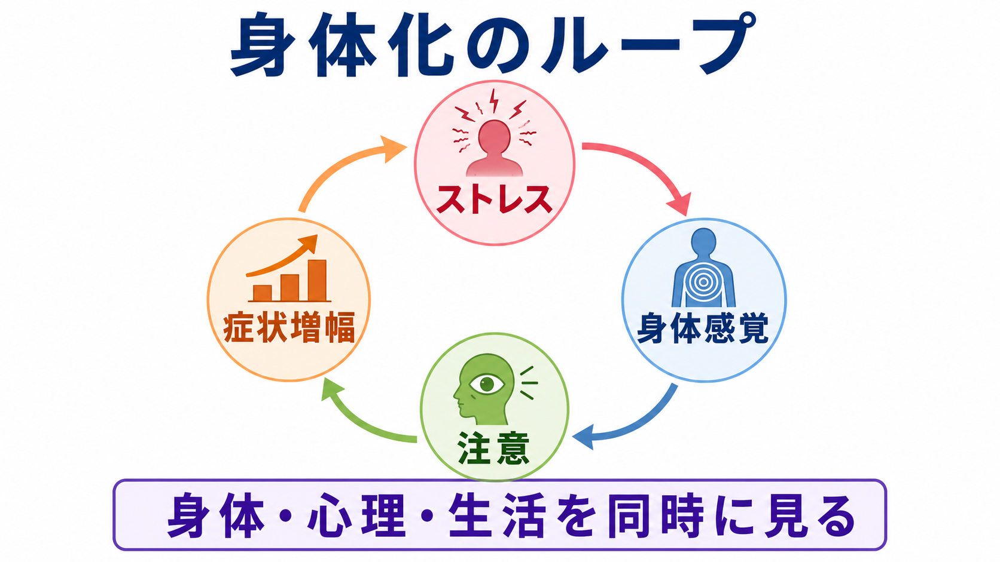

# 身体化とは何か

## 要点

- 身体化とは、心理的苦痛や対人・社会的ストレスが、痛み、疲労、動悸、胃腸症状、しびれなどの身体症状として経験され、語られ、医療につながる現象である[1]。
- 「原因が心理的だ」と決めつける概念ではない。身体疾患、薬剤、神経疾患、睡眠、生活負荷を評価しつつ、症状への注意、予測、不安、回避、生活機能への影響を同時に見る[2][3]。
- DSM-5以降の身体症状症やICD-11のbodily distress disorderでは、症状が医学的に説明できるかどうかだけでなく、症状に向けられる過度な思考・感情・行動と機能障害が重視される[2][4]。
- 仕組みは単一ではなく、[[内受容感覚とは何か]]、[[予測処理とは何か]]、情動、注意、文化的な苦痛表現、医療者との相互作用が重なっている[5][6][7]。

## この記事で答える問い

1. 身体化とは、身体症状症や心気症状と何が違うのか。
2. 心理的苦痛は、どのように身体感覚として経験されるのか。
3. 「気のせい」「詐病」と誤解しないために、どのような見方が必要か。
4. 臨床・研究では、身体化をどう評価し、どう支援に接続するのか。

## まず結論

身体化は、「こころの問題がからだに出る」という単純な一方向モデルではない。より正確には、身体内部からの信号、脳の予測、注意の向け方、情動、過去の経験、文化的な語り方、医療環境が相互作用して、身体症状が苦痛として組織化される過程である。したがって、身体化を理解するうえでは、[[生物心理社会モデルとは何か]]に沿って、身体疾患を見逃さない評価と、心理社会的要因の理解を同時に進める必要がある[3]。

## 背景

身体化は、プライマリケア、救急、内科、神経内科、精神科でよく出会う。たとえば、検査では重大な異常が見つからないが痛みや疲労が続く、ストレス期に胃腸症状や動悸が増える、症状への不安が高まり活動や外出を避ける、といった形で現れる。こうした症状は本人にとって実在する苦痛であり、単に「気にしすぎ」と片づけると、評価も支援も失敗しやすい[3]。

歴史的には、身体化は「医学的に説明困難な症状」と結びつけて語られてきた。しかしこの枠組みには限界がある。医学的説明がまだ不十分なだけかもしれず、慢性疼痛や機能性身体症状のように、明確な組織損傷だけでは説明しきれない神経生理学的変化もある。また、身体疾患が存在していても、症状への不安や回避が生活機能を大きく悪化させることがある[2][3]。

## 基本概念

身体化は症候名であり、診断名そのものではない。心理的苦痛が身体症状として表現される傾向、または身体症状を通じて苦痛が医療や周囲に伝わる過程を指す[1]。

身体症状症は、DSM-5で導入された診断カテゴリで、苦痛を伴う身体症状に加えて、症状に関する過度な思考、健康不安、時間やエネルギーの投入が持続し、生活機能に影響する状態を扱う[2]。ICD-11のbodily distress disorderも、苦痛を伴う身体症状、症状への過度な注意、医療接触、機能障害を重視する[4]。

一方、病気不安症に近い状態では、身体症状そのものよりも「重大な病気ではないか」という不安が中心になる。変換症では、運動・感覚機能の症状が神経疾患のように現れる。[[身体化認知とは何か]]は、認知が身体に埋め込まれているという認知科学の理論であり、臨床的な身体化とは区別して読む必要がある。

## 仕組み

身体化の中心には、身体感覚と意味づけの循環がある。身体内部からの信号は、心拍、呼吸、胃腸運動、筋緊張、痛み、疲労感などとして上がってくる。脳はそれを受動的に読むだけではなく、過去の経験や現在の文脈から「いま身体で何が起きているはずか」を予測する。[[内受容感覚は感情にどう関わるのか]]で扱うように、内受容感覚は情動経験と深く結びつく[5]。

ストレスが高いと、自律神経系や[[HPA軸は精神疾患にどう関わるのか]]の活動が変化し、動悸、発汗、胃腸症状、筋緊張、睡眠障害が出やすくなる。そこに「これは危険な症状ではないか」という予測が加わると、注意は身体感覚へ集中する。注意が集中すると、普段なら背景に退く感覚が前景化し、症状が強く、持続的に感じられやすくなる[5][6]。

この循環は、回避行動によって維持されることがある。症状が怖いために運動、外出、仕事、対人場面を避けると、一時的には安心する。しかし長期的には体力低下、睡眠リズムの乱れ、孤立、症状への警戒が強まり、症状と生活機能の悪循環が生じる。これは[[回避行動とは何か]]や[[不安とは何か]]とも接続する。

## 図解

| 見る水準 | 具体例 | 評価の焦点 |
|---|---|---|
| 身体 | 痛み、疲労、胃腸症状、動悸、しびれ | 身体疾患、薬剤、睡眠、神経症状、危険サイン |
| 認知・情動 | 「重大な病気かもしれない」、不安、恐怖、絶望 | 症状への予測、注意、破局化、安心確認 |
| 行動 | 受診反復、活動回避、身体チェック | 回避で生活が狭くなっていないか |
| 対人・文化 | 苦痛を身体語彙で語る、家族や職場の反応 | その人の説明モデル、支援資源、スティグマ |
| 生活機能 | 欠勤、学業低下、家事困難、孤立 | 症状の有無だけでなく機能への影響 |

## 臨床・研究との接続

臨床では、まず身体疾患や薬剤性、神経学的疾患、感染症、内分泌疾患などを必要に応じて評価する。急な神経脱落症状、発熱や体重減少、意識障害、自殺リスクなどの危険サインは、心理的説明より先に安全確認を要する。身体化という見立ては、身体評価を省略する理由ではない。

同時に、症状の経過、ストレスとの時間的関係、症状への解釈、安心確認、医療機関の利用、活動回避、睡眠、気分、不安、トラウマ歴、家族や職場の反応を聞く。支援では、症状を否定せず、身体・心理・生活を分けずに説明し、継続的な関係性の中で過剰な検査や不要な治療を避けながら機能回復を目標にすることが推奨される[3]。

心理療法では、認知行動療法が身体症状、心理的苦痛、機能障害の軽減に一定の効果を示している。ただし、これは「症状は心理だけで作られている」という意味ではない。症状への注意、解釈、回避、活動リズム、対人関係を扱うことで、症状と生活の悪循環をゆるめる介入である[8]。

研究面では、身体化は[[身体症状症は脳の予測処理で説明できるのか]]、[[島皮質は内受容感覚ネットワークで何をしているのか]]、[[身体と感情はどのようにつながるのか]]と接続する。内受容感覚の精度、身体信号への反応バイアス、予測誤差、情動調整、文化的な苦痛表現を統合して検討することが重要である[5][6][7]。

## よくある誤解

**誤解1: 身体化は「気のせい」である。**  
身体化で問題になる症状は、本人にとって実際に苦痛である。症状の成立に心理社会的要因が関わることと、症状が偽物であることはまったく別である。

**誤解2: 検査で異常がなければ精神科の問題である。**  
検査で異常がないことは、重大な疾患の可能性を下げる情報ではあるが、それだけで診断は完結しない。経過観察、身体評価、心理社会的評価を組み合わせる必要がある。

**誤解3: 身体疾患があれば身体化ではない。**  
身体疾患があっても、症状への過度な注意、不安、回避、生活機能障害が上乗せされることがある。身体疾患と身体化は排他的ではない[2][4]。

**誤解4: 文化的に身体症状を訴える人は心理化が苦手なだけである。**  
身体症状は、苦痛を表現し、支援を求め、社会的役割を調整するための文化的・対人的な語彙にもなる。個人内の心理機制だけでなく、文化、医療制度、スティグマも見る必要がある[7]。

## 関連ノート

- [[身体症状症は脳の予測処理で説明できるのか]]
- [[内受容感覚とは何か]]
- [[内受容感覚は感情にどう関わるのか]]
- [[予測処理とは何か]]
- [[島皮質は内受容感覚ネットワークで何をしているのか]]
- [[身体と感情はどのようにつながるのか]]
- [[生物心理社会モデルとは何か]]
- [[ストレス脆弱性モデルとは何か]]
- [[不安とは何か]]
- [[解離とは何か]]

## MOC更新候補

- `content/00_MOC/` の精神医学系MOCに、本記事へのリンクを追加する候補。
- `content/00_MOC/MOC｜意識・自己・身体性.md` には、内受容感覚・身体性との関連ノートとして追加候補。
- 並列ジョブとの競合を避けるため、本タスクではMOC本文は更新しない。

## 理解チェック

1. 身体化を「身体疾患がないこと」とだけ定義すると、どのような危険があるか。
2. 身体症状症では、身体症状そのものに加えて何が診断上重視されるか。
3. 内受容感覚と予測処理の観点から、注意が症状を強める仕組みを説明できるか。
4. 身体化を疑う場面でも、先に確認すべき医療安全上のポイントは何か。

## 未解決問題

- 身体化、身体症状症、機能性身体症状、慢性疼痛、病気不安症をどこで線引きするかは、分類体系によって揺れがある。
- 内受容感覚の「精度」と「反応バイアス」を、臨床で簡便かつ信頼性高く測る方法はまだ十分に確立していない。
- 文化的な苦痛表現を尊重しながら、過剰検査やスティグマを避ける説明モデルをどう共有するかは、臨床実践上の重要課題である。

## 参考文献

[1] Al Busaidi, Z. Q. (2010). The concept of somatisation: A cross-cultural perspective. *Sultan Qaboos University Medical Journal*, 10(2), 180-186. https://pmc.ncbi.nlm.nih.gov/articles/PMC3074701/

[2] Löwe, B., Levenson, J., Depping, M., Hüsing, P., Kohlmann, S., Lehmann, M., Shedden-Mora, M., Toussaint, A., & Henningsen, P. (2022). Somatic symptom disorder: A scoping review on the empirical evidence of a new diagnosis. *Psychological Medicine*, 52(4), 632-648. https://doi.org/10.1017/S0033291721004177

[3] Henningsen, P. (2018). Management of somatic symptom disorder. *Dialogues in Clinical Neuroscience*, 20(1), 23-31. https://doi.org/10.31887/DCNS.2018.20.1/phenningsen

[4] World Health Organization. (2024). *Clinical descriptions and diagnostic requirements for ICD-11 mental, behavioural and neurodevelopmental disorders*. World Health Organization. https://iris.who.int/handle/10665/375767

[5] Barrett, L. F., & Simmons, W. K. (2015). Interoceptive predictions in the brain. *Nature Reviews Neuroscience*, 16, 419-429. https://doi.org/10.1038/nrn3950

[6] Fiene, L., & Brownlow, C. (2022). Interoceptive accuracy and bias in somatic symptom disorder, illness anxiety disorder, and functional syndromes: A systematic review and meta-analysis. *Neuroscience & Biobehavioral Reviews*, 132, 1010-1024. https://doi.org/10.1016/j.neubiorev.2021.11.016

[7] Kirmayer, L. J., & Young, A. (1998). Culture and somatization: Clinical, epidemiological, and ethnographic perspectives. *Psychosomatic Medicine*, 60(4), 420-430. https://doi.org/10.1097/00006842-199807000-00006

[8] Liu, J., Gill, N. S., Teodorczuk, A., Li, Z. J., & Sun, J. (2019). The efficacy of cognitive behavioural therapy in somatoform disorders and medically unexplained physical symptoms: A meta-analysis of randomized controlled trials. *Journal of Affective Disorders*, 245, 98-112. https://doi.org/10.1016/j.jad.2018.10.114
