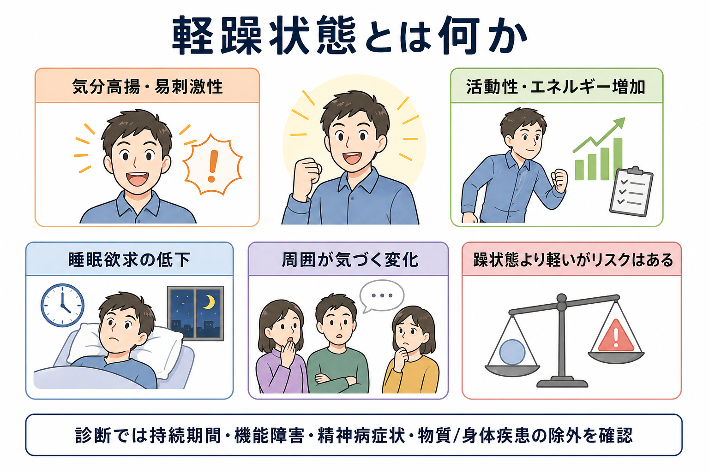
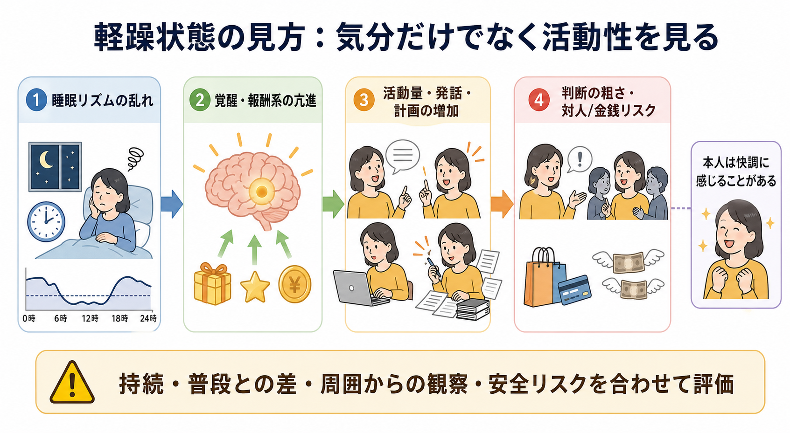
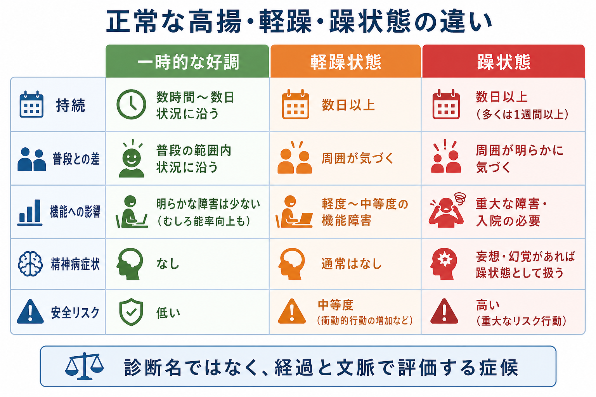

# 軽躁状態とは何か

## 要点

- 軽躁状態とは、普段とは明らかに異なる気分高揚・開放性・易刺激性と、活動性または主観的エネルギーの増加が続く状態である[1][2]。
- DSM-5 系の整理では、軽躁エピソードは少なくとも4日間続き、睡眠欲求の低下、多弁、観念奔逸、注意散漫、目標志向活動の増加、危険な行動などを伴う[1][3]。
- 躁状態との重要な違いは、著しい機能障害、入院の必要、精神病症状が前景に出るほど重くない点である。精神病症状があれば、軽躁ではなく躁状態として扱う[1][2]。
- 本人には「調子がよい」「頭が回る」と感じられることがあるため、[[MSEで外観と行動から何を観察するか]]、[[MSEで話し方から何がわかるのか]]、周囲からの情報が重要になる。
- この記事は教育・研究目的の整理であり、個別の診断や治療指示ではない。

## この記事で答える問い

1. 軽躁状態は、単なる「元気」「明るい気分」と何が違うのか。
2. どの症状がそろうと、軽躁エピソードとして考えるのか。
3. 軽躁状態と躁状態は、どこで分けられるのか。
4. 臨床や研究では、軽躁状態をどのように観察し、測定するのか。

## まず結論

軽躁状態は、「気分がよい」だけではない。中心にあるのは、普段のその人と比べて、気分、エネルギー、活動量、発話、睡眠、判断、対人行動がまとまって変化することである。DSM-5 系の診断基準では、異常かつ持続的な気分高揚・開放性・易刺激性と、活動性またはエネルギーの増加が少なくとも4日間続き、その期間に複数の症状が明らかな変化として現れる[1][3]。

ただし、軽躁状態は躁状態より軽い。入院が必要になるほどの危険、著しい社会的・職業的機能障害、妄想や幻覚などの精神病症状があれば、診断体系上は軽躁ではなく躁状態として扱う[1][2]。この境界は、双極I型と双極II型の区別にも関わるため、[[DSMとICDは何が違うのか]]や[[鑑別診断とは何か]]と強く接続する。

## 背景

日常語では「躁っぽい」「テンションが高い」という表現が広く使われる。しかし精神医学でいう軽躁状態は、気分の明るさだけで定義されない。DSM-5 以降の整理では、気分の変化に加えて、活動性またはエネルギーの増加が中核要件として強調される[1][7]。ICD-11 でも、軽躁エピソードは少なくとも数日間続く気分の軽度高揚または易刺激性と、活動性またはエネルギー増加を中心に記述される[2][7]。

この見方は臨床的に重要である。本人は「睡眠が少なくても平気」「仕事が進む」「人と話したくなる」と感じ、困りごととして自覚しにくいことがある。一方で、周囲からは多弁、予定の詰め込み、浪費、性的逸脱、対人摩擦、判断の粗さとして見えることがある[1][4]。したがって、軽躁状態の評価では、[[気分とは何か]]だけでなく、行動、睡眠、判断、社会的文脈を合わせて見る。

## 基本概念

### 軽躁状態の中核

軽躁状態の中核は、次の二つである。

| 観点 | 内容 |
|---|---|
| 気分の変化 | 高揚、開放性、易刺激性が、普段の本人と比べて明らかに変化する |
| 活動性・エネルギーの変化 | 仕事、学業、対人活動、性的活動、計画、発話、身体活動などが増える |

DSM-5 系の要約では、この期間に、誇大的な自己評価、睡眠欲求の低下、多弁、考えが速く進む感じ、注意散漫、目標志向活動の増加、結果が痛手になりうる活動への過度の関与などが認められる[1][3]。易刺激性だけが前景に出る場合は、必要症状数が増えるという整理も重要である[1]。

### 「元気」との違い

軽躁状態は、よい出来事のあとに一時的に気分が上がることとは異なる。区別の軸は、少なくとも次の四つである。

| 区別の軸 | 一時的な好調 | 軽躁状態 |
|---|---|---|
| 文脈 | 合格、昇進、恋愛など状況に沿うことが多い | 状況に比べて強い、または文脈から外れることがある |
| 持続 | 短く変動しやすい | 数日以上まとまって続く |
| 行動 | 生活全体は大きく崩れにくい | 睡眠、発話、予定、金銭、対人関係が一緒に変わる |
| 他者からの観察 | 「嬉しそう」程度 | 「普段と違う」と周囲が気づく |

### 躁状態との違い

軽躁状態と躁状態は、症状リストだけではかなり重なる。違いは主に重症度、機能障害、精神病症状、入院必要性にある[1][2][4]。

| 観点 | 軽躁状態 | 躁状態 |
|---|---|---|
| 持続 | DSM-5 系では4日以上、ICD-11 では少なくとも数日 | 典型的には1週間以上、または入院を要する期間 |
| 機能 | 変化は明らかだが、著しい障害までは至らない | 社会・職業・家庭生活に重大な障害を起こしうる |
| 精神病症状 | 伴わない | 妄想・幻覚を伴うことがある |
| 安全リスク | 浪費、対人摩擦、過活動などのリスク | 自他への危険、重大な判断障害、入院が問題になりうる |

## 仕組み

軽躁状態の仕組みは、単一の神経伝達物質や一つの脳部位だけで説明できない。双極症の病態研究では、情動調節、報酬処理、睡眠・概日リズム、前頭前野による制御、扁桃体などの情動反応系が関与すると考えられているが、個々の軽躁状態に直接そのまま対応づけられるわけではない[4][5]。

臨床的には、次の循環として理解すると見通しがよい。

1. 睡眠時間が短くなる、または睡眠欲求が低下する。
2. 主観的エネルギーが上がり、活動や計画が増える。
3. 報酬や成功の見込みが大きく感じられ、抑制が弱くなる。
4. 多弁、予定過多、浪費、対人接近、性的行動、危険な意思決定が増える。
5. 周囲との摩擦、疲弊、抑うつへの反転、生活リズムの崩れが起こりうる。

この循環で重要なのは、本人の主観的な快調さと、外から見たリスクがずれる点である。NICE は躁状態または軽躁状態の時期には、重要な決定を回復まで控えることや、刺激を減らした環境を整えることを推奨している[6]。これは軽躁状態が「軽いから問題ない」という意味ではなく、判断や対人行動にリスクが生じうることを示す。

## 図解

3枚目の図は、正常範囲の一時的な高揚、軽躁状態、躁状態の境界を比較している。実際の評価では、表のような単純な三分法だけでなく、発症前の基準線、持続期間、本人の困り感、周囲の観察、身体疾患、薬剤、物質使用、文化的文脈を合わせて考える。

## 臨床・研究との接続

### 臨床評価

軽躁状態を評価するときは、次の質問が核になる。

| 評価軸 | 聞き取ること |
|---|---|
| 持続 | いつから、何日続いたか。途中で戻る時間はあったか |
| 普段との差 | 本人の通常の睡眠、発話、活動量、金銭感覚、対人距離とどれほど違うか |
| 観察可能性 | 家族、友人、同僚、支援者が「いつもと違う」と気づいたか |
| 機能 | 仕事、学業、家庭、対人関係、セルフケアにどの程度影響したか |
| リスク | 浪費、危険運転、性的リスク、衝動的契約、攻撃性、自傷他害リスクがあるか |
| 鑑別 | 物質、薬剤、甲状腺機能亢進、睡眠不足、ADHD、パーソナリティ特性、文化的文脈など |

軽躁状態は、[[精神状態診察MSEとは何か]]の中では、外観・行動、発話、気分と感情、思考過程、病識、判断力の横断的な観察対象になる。たとえば、多弁や話題の飛びやすさは[[MSEで話し方から何がわかるのか]]と[[MSEで思考過程をどう評価するか]]に、判断の粗さは[[MSEで病識と判断力をどう評価するか]]に接続する。

### 双極症との接続

双極II型障害では、軽躁エピソードと抑うつエピソードの既往が中核になる。一方、双極I型障害では躁エピソードが診断上の決定的な位置を持ち、軽躁エピソードは前後に生じることがあるが必須ではない[1][2][4]。このため、「軽躁があるか」は、抑うつだけに見える経過を理解するうえで重要である。

ただし、軽躁症状が少しあるだけで双極症と断定するのは危険である。抗うつ薬、睡眠不足、甲状腺疾患、覚醒剤やアルコール、発達特性、ストレス反応などでも、似た行動変化が見えることがある[1][3]。診断名より先に、経過、文脈、重症度、除外要因を整理する必要がある。

### 研究上の測定

研究では、軽躁状態は面接、自己記入式尺度、経験サンプリング、スマートフォン入力、アクチグラフィ、睡眠・活動量指標などで測定される。スマートフォンを用いた日々の自己報告研究では、DSM-5 の軽躁・躁状態の定義を日次評価に落とし込む試みが行われている[8]。ただし、測定法ごとに捉える層が異なる。自己報告は主観的快調さに敏感で、他者評価は社会的逸脱に敏感で、活動量センサーは睡眠・運動リズムに敏感である。

## よくある誤解

### 誤解1: 軽躁は「良い状態」だから問題ではない

軽躁状態では生産性や社交性が一時的に上がるように見えることがある。しかし、睡眠不足、判断の粗さ、浪費、対人摩擦、抑うつへの反転などが後から問題になることがある[4][6]。「本人が快調に感じるか」だけでなく、「生活にどんな余波が出ているか」を見る必要がある。

### 誤解2: 気分が高くなければ軽躁ではない

軽躁状態は高揚だけでなく、易刺激性として現れることがある。怒りっぽい、急に議論的になる、周囲を急かす、眠らずに活動する、予定を詰め込みすぎる、といった形で見える場合もある[1][2]。

### 誤解3: 軽躁と躁状態は症状の種類で簡単に分けられる

症状の種類はかなり重なる。境界を作るのは、重症度、機能障害、入院必要性、精神病症状である[1][2]。妄想や幻覚を伴う場合、診断体系上は軽躁状態としては扱わない。

### 誤解4: 本人の自己申告だけで十分に判断できる

軽躁状態では病識が保たれにくいことがある。本人は「いつもより調子がよい」と感じるだけで、周囲が先に変化に気づく場合がある。家族や周囲からの情報、過去の基準線、睡眠や支出の客観記録が役立つ。

## 関連ノート

- [[気分とは何か]]
- [[意欲低下とは何か]]
- [[精神症候学とは何か]]
- [[精神状態診察MSEとは何か]]
- [[MSEで気分と感情をどう区別するか]]
- [[MSEで外観と行動から何を観察するか]]
- [[MSEで話し方から何がわかるのか]]
- [[MSEで思考過程をどう評価するか]]
- [[MSEで病識と判断力をどう評価するか]]
- [[精神科診察で睡眠をどう評価するか]]
- [[DSMとICDは何が違うのか]]
- [[鑑別診断とは何か]]

## MOC更新候補

- `content/00_MOC/MOC｜精神医学.md` がある場合は、本記事を「症候学」または「気分症状」周辺に追加する候補。
- 並列ジョブとの競合を避けるため、この作業では MOC は更新していない。

## 理解チェック

1. 軽躁状態を「単なる良い気分」と区別するとき、どのような行動変化を見るか。
2. 軽躁状態と躁状態を分けるうえで、精神病症状と入院必要性はなぜ重要か。
3. 本人が「調子がよい」と言う場合でも、なぜ周囲からの情報が重要になるか。
4. 睡眠欲求の低下は、単なる不眠とどのように違って見えるか。
5. 軽躁症状に似た状態を起こしうる鑑別要因には何があるか。

## 未解決問題

- 軽躁状態の境界は、DSM-5、ICD-11、研究尺度、日常臨床で完全には一致しない。
- 「創造性」「生産性」「気質」と軽躁症状の境界は、文化的価値づけや生活文脈に左右されやすい。
- スマートフォンやウェアラブル指標は有望だが、個人差、プライバシー、偽陽性、臨床判断との統合が課題である。

## 参考文献

[1] Substance Abuse and Mental Health Services Administration. *Impact of the DSM-IV to DSM-5 Changes on the National Survey on Drug Use and Health*. Table 3.8, DSM-IV to DSM-5 Hypomania Criteria Comparison. NCBI Bookshelf. https://www.ncbi.nlm.nih.gov/books/NBK519704/table/ch3.t9/

[2] World Health Organization. *ICD-11 for Mortality and Morbidity Statistics*, Bipolar type II disorder / hypomanic episode descriptions. https://icd.who.int/browse/

[3] Sekhon S, Gupta V. Mood Disorder. *StatPearls*. NCBI Bookshelf. Last update 2023. https://www.ncbi.nlm.nih.gov/sites/books/n/statpearls/article-91517/

[4] Dailey MW, Saadabadi A. Mania. *StatPearls*. NCBI Bookshelf. Last update 2023. https://www.ncbi.nlm.nih.gov/books/NBK493168/

[5] National Institute of Mental Health. Bipolar Disorder. Last reviewed December 2024. https://www.nimh.nih.gov/health/topics/bipolar-disorder

[6] National Institute for Health and Care Excellence. *Bipolar disorder: assessment and management* (NICE guideline CG185). Last updated 2 September 2025. https://www.nice.org.uk/guidance/cg185

[7] Reed GM, First MB, Kogan CS, et al. Innovations and changes in the ICD-11 classification of mental, behavioural and neurodevelopmental disorders. *World Psychiatry*. 2019;18(1):3-19. https://doi.org/10.1002/wps.20611

[8] Faurholt-Jepsen M, Christensen EM, Frost M, Bardram JE, Vinberg M, Kessing LV. Hypomania/Mania by DSM-5 definition based on daily smartphone-based patient-reported assessments. *Journal of Affective Disorders*. 2020;264:272-278. https://doi.org/10.1016/j.jad.2020.01.014
