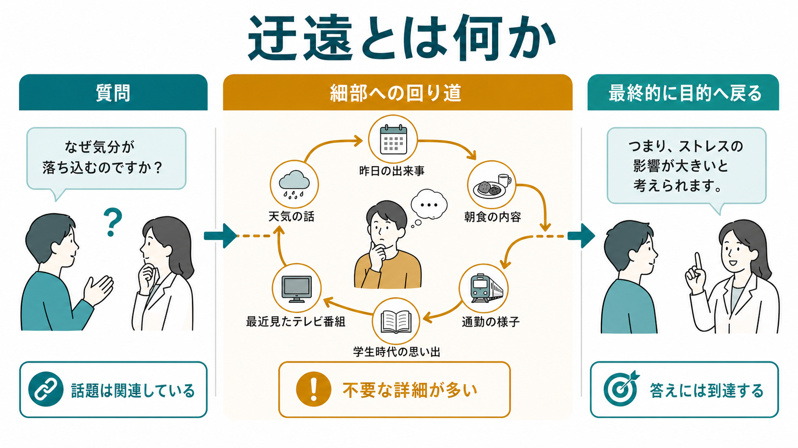
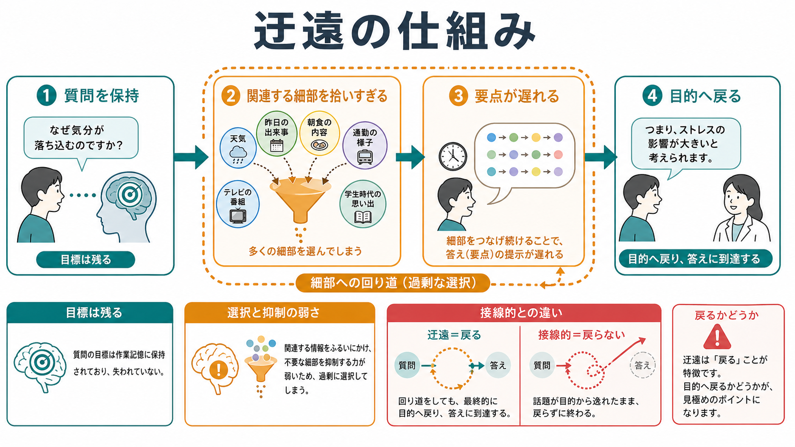
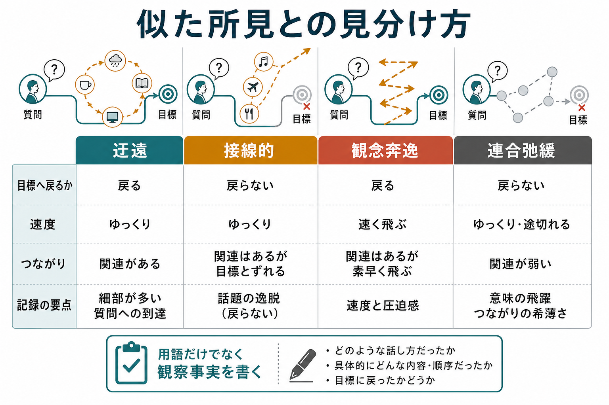

# 迂遠とは何か

## 要点

- 迂遠とは、質問や主題から細部へ回り道し、不要な情報を多く含むが、最終的には元の質問や主題へ戻る思考過程・発話の所見である[1]。
- もっとも重要な鑑別点は「戻るかどうか」である。迂遠は戻る。接線的な発話は戻らない[1][2]。
- 迂遠は、[[精神症候学とは何か|精神症候学]]では思考内容ではなく思考過程の所見として扱う。つまり「何を信じているか」よりも「話がどう進むか」を見る。
- 統合失調症、躁状態、強迫的な文脈、神経認知障害、てんかん、発達・知的機能の背景などで観察されうるが、迂遠だけで診断名は決められない[1][5]。
- 記録では「迂遠あり」だけでなく、「質問から細部へ逸れるが、促しにより回答へ戻る」のように観察事実を添える。

## この記事で答える問い

1. 迂遠とはどのような思考過程・発話の所見か。
2. 接線的、観念奔逸、連合弛緩、滅裂とはどう違うか。
3. なぜ「細部にこだわる話し方」をすぐ病的と決めてはいけないのか。
4. 面接や記録では、どのように観察し、どう書くとよいか。

## まず結論

迂遠は、「話が長い」「細かい」ことそのものではない。質問に対して、関連はあるが本筋から外れた細部が多く、要点に到達するまで時間がかかる発話である。ただし、最終的には質問や主題へ戻る。この点で、話題が逸れたまま戻らない接線性とは区別される[1]。

たとえば「最終学歴は何ですか」と聞かれて、高校時代の先生、部活動、受験の経緯、大学生活の細部を長く語ったあとに「大学卒業です」と答える場合、遠回りだが目的には到達している。これが迂遠の典型である[1]。

臨床的には、迂遠は[[MSEで思考過程をどう評価するか|MSEでの思考過程評価]]の一部である。診断名を即断するためではなく、面接で得られる発話の流れを再現可能に記述するための用語として使う。

## 背景

精神状態診察では、思考を「内容」と「過程」に分けて観察する。思考内容は妄想、強迫観念、希死念慮など、考えられている中身を扱う。一方、思考過程は、まとまり、速度、連想のつながり、目標への到達、話題の逸脱、中断、反復など、考えの進み方を扱う[2]。この区別は[[MSEで思考内容をどう評価するか]]とも関係する。

形式的思考障害の研究では、発話は思考過程を推定する主要な手がかりとして扱われてきた。Andreasen は Thought, Language, and Communication の評価で、脱線、接線性、非一貫性、貧困発話などを定義し、臨床観察をより信頼性高く記述しようとした[3][4]。近年のレビューでも、形式的思考障害は単一の診断に閉じた所見ではなく、言語、意味処理、実行機能、社会的コミュニケーションを含む多次元の現象として整理されている[5]。

## 基本概念

### 迂遠

迂遠は、発話が主題から一時的に逸れ、細部や補足情報が過剰になるが、最終的には質問や主題へ戻る状態である[1]。聞き手から見ると、話の筋は追えるものの、必要な答えに到達するまでに多くの寄り道が入る。

重要なのは、迂遠では話題間のつながりが完全に壊れているわけではないことである。本人の中では関連する情報を順に並べているが、聞き手にとっては「そこまで説明しなくても答えられる」と感じられる。

### 接線的との違い

接線的な発話では、話題が質問から逸れ、最終的に元の質問へ戻らない[1]。迂遠と接線的はどちらも遠回りに見えるが、目的地に着くかどうかが異なる。

- 迂遠: 遠回りするが、質問への答えに戻る。
- 接線的: 遠回りのまま別の方向へ進み、質問への答えに戻らない。

### 観念奔逸との違い

観念奔逸では、話題が速く次々に移り、連想の速度や圧迫感が目立つ。躁状態や物質使用などの文脈で観察されることがある[1]。迂遠では、速度よりも「細部が多く、要点が遅れる」ことが中心になる。[[躁状態とは何か]]や[[軽躁状態とは何か]]では、観念奔逸や多弁が重要な所見になる。

### 連合弛緩・滅裂との違い

連合弛緩や脱線では、発言同士の意味的つながりが弱くなり、聞き手が話の筋を追いにくくなる。滅裂では、語、文、話題のまとまりがさらに失われ、全体の意味把握が困難になる[3][5]。迂遠は、過剰な細部があっても、話の関連と目標への到達が比較的保たれている点で異なる。

## 仕組み

迂遠を機械的に一つの脳部位や一つの病気に還元することはできない。臨床的には、少なくとも次の要素が重なって見える。

1. 質問や主題は保持されている。
2. 関連する細部を拾いすぎる。
3. 重要度の低い情報を抑制しにくい。
4. 要点への到達が遅れる。
5. それでも最終的には目的へ戻る。

このように見ると、迂遠は「目標を完全に失う」所見ではなく、「目標は残っているが、選択と抑制が弱く、細部の回収が過剰になる」所見として理解しやすい。注意、作業記憶、実行機能、語用論的なコミュニケーションの問題が関係しうるが、どの要因が中心かは文脈に依存する[1][5][7]。この点は[[注意障害とは何か]]や[[実行機能障害とは何か]]とも接続する。

## 図解

図1は、迂遠の全体像を「質問から答えへ向かう道筋」として示している。中心は、細部への回り道が多くても、最終的に目的へ戻ることである。

図2は、迂遠の仕組みを、質問保持、細部の過剰な選択、要点の遅れ、目的への復帰として整理している。

図3は、似た所見との見分け方を比較している。臨床記録では、用語だけでなく「戻るか」「速度はどうか」「話題間のつながりはどうか」を短く書くと伝わりやすい。

## 臨床・研究との接続

臨床では、迂遠は情報収集の難しさとして現れる。質問への答えが得られるまで時間がかかるため、面接者は遮りすぎず、しかし要点へ戻す必要がある。StatPearls の解説でも、迂遠な発話では情報が臨床的に有用でありうる一方、必要な答えに到達するために面接技術が求められると整理されている[1]。

観察のポイントは、診断名ではなく文脈である。迂遠は、統合失調症スペクトラム、躁状態、強迫的な順序立て、人格特性、発達・知的機能、神経認知障害、てんかんなど、複数の背景で見られうる[1][5][6]。ICD-11 の臨床記述でも、精神疾患は単一所見ではなく、症状のまとまり、持続、機能障害、除外要因を合わせて判断する枠組みで整理される[8]。そのため、[[精神状態診察MSEとは何か|精神状態診察MSE]]では、発症時期、急性変化、意識水準、睡眠、薬物・物質、神経学的所見、認知機能、生活機能を合わせて評価する。

研究では、形式的思考障害は TLC などの尺度で操作化されてきた[4]。また、統合失調症と双極性障害の比較では、陽性の形式的思考障害が両者で重なりうる一方、持続性や陰性側面には違いがある可能性が示されている[6]。早期精神病研究のレビューでも、形式的思考障害は神経認知や機能転帰と関連する重要な候補所見として扱われている[7]。

## よくある誤解

### 誤解1: 話が長ければ迂遠である

話が長いだけでは迂遠とはいえない。文化、性格、語り方、緊張、説明の丁寧さ、面接者との関係で話が長くなることはある。迂遠と呼ぶには、質問への到達が細部によって遅れ、遠回りの構造が観察される必要がある。

### 誤解2: 迂遠は必ず統合失調症を意味する

迂遠は形式的思考障害の一部として精神病性障害の文脈で論じられることがあるが、それだけで診断は決まらない[1][5]。躁状態、強迫症状、神経認知障害、てんかん、発達・知的機能の背景でも見られうる。診断には、他の症状、経過、機能低下、身体・神経学的要因、物質・薬剤、文化的背景を含めた評価が必要である。

### 誤解3: 迂遠と接線的は同じである

両者は「話が遠回り」という点で似ているが、迂遠は最終的に戻る。接線的は戻らない[1]。この違いは、面接で要点を得られるか、促しで戻れるか、記録上どの用語を使うかに直結する。

### 誤解4: 用語を書けば記録として十分である

「迂遠あり」だけでは、程度や場面が伝わりにくい。記録では、観察事実を一文添える。

- 簡潔な例: 「思考過程は迂遠。質問から細部へ逸れるが、促しにより要点へ戻る。」
- 具体的な例: 「既往歴を尋ねると、受診時の交通手段や家族の予定を詳述した後、最終的に入院歴なしと回答した。」
- 避けたい例: 「話が変」「まとまりがない」「支離滅裂」だけで終える。

## 関連ノート

既存ノート:

- [[精神症候学とは何か]]
- [[精神状態診察MSEとは何か]]
- [[MSEで思考過程をどう評価するか]]
- [[MSEで思考内容をどう評価するか]]
- [[MSEで話し方から何がわかるのか]]
- [[躁状態とは何か]]
- [[軽躁状態とは何か]]
- [[注意障害とは何か]]
- [[認知機能障害とは何か]]
- [[失語とは何か]]
- [[せん妄とは何か]]

今後の作成候補:

- 接線的とは何か
- 観念奔逸とは何か
- 連合弛緩とは何か
- 形式的思考障害とは何か
- 思考途絶とは何か
- 保続とは何か

MOC 更新候補:

- `content/00_MOC/` 配下の精神医学、精神症候学、精神科面接・MSE 関連 MOC に本記事を追加候補とする。並列ジョブとの競合を避けるため、本記事では MOC 本体は更新しない。

## 理解チェック

1. 迂遠と接線的を分けるもっとも重要な基準は何か。
2. 「話が長い」だけでは迂遠といえないのはなぜか。
3. 迂遠、観念奔逸、連合弛緩では、それぞれ何を観察するとよいか。
4. 「迂遠あり」を、観察事実を含む記録文に書き換えるとどうなるか。
5. 迂遠だけで診断名を決めてはいけない理由は何か。

## 未解決問題

- 迂遠、接線性、脱線などの境界を、自然言語処理でどこまで再現性高く識別できるか。
- 文化、教育歴、母語、発達特性が、迂遠の臨床評価にどの程度影響するか。
- 面接者の質問形式や時間制限が、迂遠の見え方をどの程度変えるか。
- 迂遠な発話を、患者中心性を保ちながら効率よく要点へ戻す面接技術をどう標準化できるか。

## 参考文献

[1] Balaram K, Marwaha R. Circumstantiality. *StatPearls*. Updated 2024-12-11. NCBI Bookshelf. https://www.ncbi.nlm.nih.gov/books/NBK532945/

[2] Voss RM, Das JM. Mental Status Examination. *StatPearls*. NCBI Bookshelf. https://www.ncbi.nlm.nih.gov/books/NBK546682/

[3] Andreasen NC. Thought, language, and communication disorders. I. Clinical assessment, definition of terms, and evaluation of their reliability. *Archives of General Psychiatry*. 1979;36(12):1315-1321. https://doi.org/10.1001/archpsyc.1979.01780120045006

[4] Andreasen NC. Scale for the assessment of thought, language, and communication (TLC). *Schizophrenia Bulletin*. 1986;12(3):473-482. https://doi.org/10.1093/schbul/12.3.473

[5] Kircher T, Bröhl H, Meier F, Engelen J. Formal thought disorders: from phenomenology to neurobiology. *The Lancet Psychiatry*. 2018;5(6):515-526. https://doi.org/10.1016/S2215-0366(18)30059-2

[6] Yalincetin B, Bora E, Binbay T, Ulas H, Akdede BB, Alptekin K. Formal thought disorder in schizophrenia and bipolar disorder: A systematic review and meta-analysis. *Schizophrenia Research*. 2017;185:2-8. https://doi.org/10.1016/j.schres.2016.12.015

[7] Oeztuerk OF, Pigoni A, Antonucci LA, Koutsouleris N. Association between formal thought disorders, neurocognition and functioning in the early stages of psychosis: a systematic review of the last half-century studies. *European Archives of Psychiatry and Clinical Neuroscience*. 2022;272:381-393. https://doi.org/10.1007/s00406-021-01295-3

[8] World Health Organization. *Clinical descriptions and diagnostic requirements for ICD-11 mental, behavioural and neurodevelopmental disorders*. WHO. 2024. https://www.who.int/publications/i/item/9789240077263
