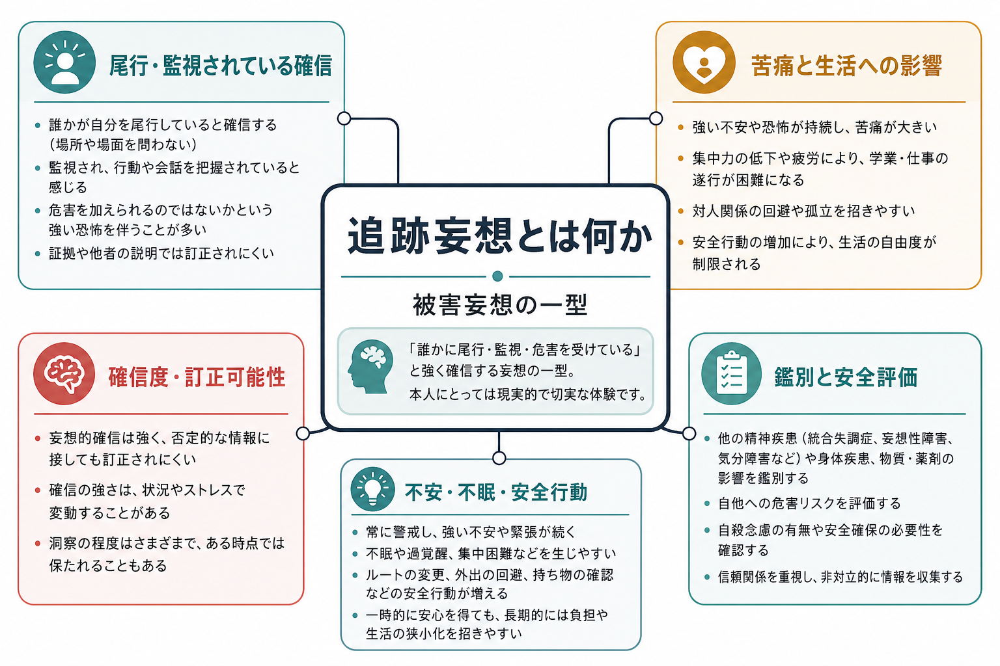
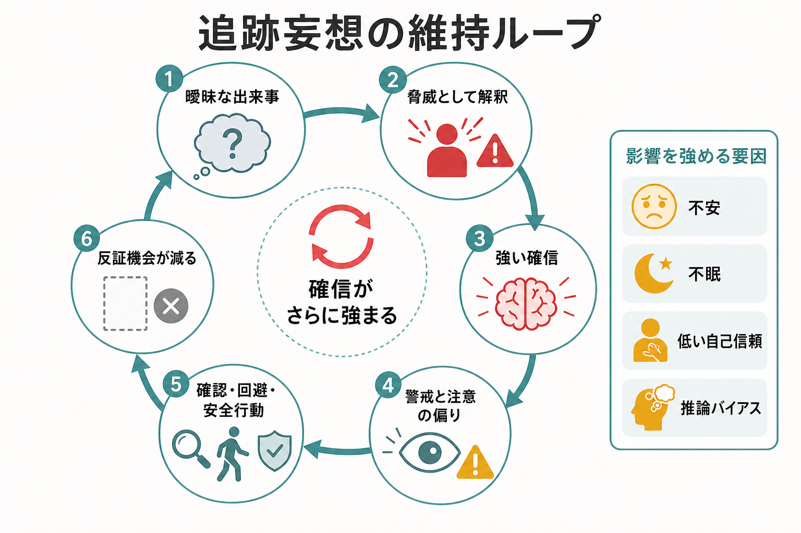
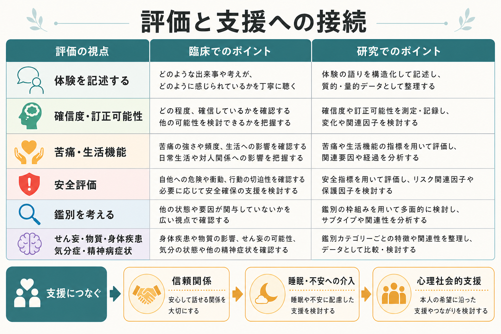

# 追跡妄想とは何か

## 要点

- 追跡妄想とは、「誰かに尾行されている」「見張られている」「自分を害するために後をつけられている」と強く確信する[[被害妄想とは何か|被害妄想]]の一型である。DSM-5-TR では、被害型の妄想内容として、迫害、だまし、監視、悪意ある扱いなどが挙げられる[1]。
- 中心にあるのは、単なる心配ではなく、**害が起こるという予測**と、**他者に害意があるという帰属**が強く結びつくことである。Freeman と Garety は、被害妄想の核心を「危害が起こり、それが他者によって意図されている」という二点で整理している[4][5]。
- 追跡妄想は、統合失調症スペクトラムだけに限られない。気分症、せん妄、物質・薬剤、身体疾患、睡眠不足、トラウマ関連症状などの文脈でも、被害的確信に近い体験が出ることがある[2][3]。
- 維持には、不安、心配、睡眠障害、低い自己評価、対人過敏、異常な身体・知覚体験、推論バイアス、安全行動や回避が関わりうる[4][5][7]。
- 本稿は教育・研究目的の整理であり、個別の診断や治療指示ではない。現実のストーキングやハラスメントが存在する場合もあるため、臨床では内容を即座に否定せず、安全と証拠の扱いを分けて評価する。

## この記事で答える問い

1. 追跡妄想は、通常の警戒心や不安と何が違うのか。
2. 「尾行されている」という確信は、どのような仕組みで維持されるのか。
3. 臨床では、真偽を一気に決めつけずに何を確認するべきか。
4. 研究では、追跡妄想をどのような症状次元やメカニズムとして扱うのか。

## まず結論

追跡妄想は、「誰かが自分の後をつけているかもしれない」という一過性の疑いではなく、「特定または不特定の他者が、自分に害を与える目的で尾行・監視している」と強く確信され、反証や別解釈によっても変わりにくい状態である。これは[[妄想とは何か|妄想]]の内容分類としては被害的テーマに属し、追跡・尾行という形をとる。

ただし、追跡妄想を理解するうえで大切なのは、内容を奇妙かどうかで裁くことではない。現実にはストーキング、DV、職場・学校でのハラスメント、差別、監視、犯罪被害が存在する。したがって臨床では、「それは妄想です」と即断するより、本人が何を根拠にし、どの程度確信し、どの反証をどう扱い、どれほど苦痛や生活障害があり、安全上のリスクがあるかを分けて確認する。

## 背景

NICE の成人精神病・統合失調症ガイドラインは、精神病を統合失調症、統合失調感情障害、統合失調症様障害、妄想性障害などを含む精神病性障害群として扱い、陽性症状には幻覚と妄想が含まれると説明している[2]。NIMH も、妄想を「客観的には真でない強い信念」と説明し、他者が自分を害しようとしているという信念を例に挙げる[3]。

被害妄想は、精神病症状のなかでも臨床的に重要である。Freeman と Garety のレビューでは、被害妄想は一般人口にみられるパラノイア傾向の重症端として位置づけられ、心配、自己についての否定的信念、対人過敏、睡眠障害、異常な内的体験、推論バイアスなどが近接要因として整理されている[5]。

追跡妄想は、この被害的テーマのなかでも、空間的・行動的に「後をつけられる」「行く先を把握される」「逃げても追ってくる」と感じられる形で現れる。関連するテーマとして、周囲から見られていると感じる[[注察妄想とは何か|注察妄想]]、テレビやSNSの発言が自分に向けられていると感じる関係妄想、脅迫・監視・盗聴に関する被害妄想がある。

## 基本概念

### 追跡妄想と通常の警戒心

通常の警戒心は、状況や追加情報によって変化しやすい。夜道で足音が近づけば警戒し、相手が別方向へ曲がれば安心する、というように、判断は証拠によって更新される。

追跡妄想では、曖昧な出来事が「自分を狙っている証拠」として強く組み込まれやすい。たとえば、同じ車を何度も見た、通行人がこちらを見た、スマートフォンを触っている人がいた、といった出来事が、尾行・監視の証拠として解釈される。ここでは、出来事そのものよりも、**その出来事が自分への害意を示すものとして固定される**点が重要である。

### 追跡妄想と不安

追跡妄想はしばしば[[不安とは何か|不安]]を伴うが、不安そのものとは異なる。不安は「危険かもしれない」という予測状態であり、確率や根拠が揺れやすい。追跡妄想では、「危険がある」「誰かが意図している」という信念がより固定化し、行動や生活範囲を強く規定する。

ただし、不安は追跡妄想の維持に深く関わる。被害妄想を対象にした研究では、心配の強さが妄想の持続に関わり、心配を減らす介入が被害妄想の軽減と関連することが示されている[5][8]。

### 追跡妄想と現実の被害

「追跡妄想」という語は、現実の被害がないと決めつけるために使うべきではない。実際のストーキング、DV、差別、いじめ、ハラスメント、犯罪被害がある場合、本人の警戒は現実的根拠をもつ。臨床では、本人の語りを尊重しながら、証拠、第三者情報、時系列、生活上の安全、身体的危険、支援資源を確認する必要がある。

## 仕組み

追跡妄想は、単一の原因で説明できるものではない。研究上は、複数の近接要因が重なり、本人にとって「追跡されている」という説明がもっとも切迫したものとして立ち上がると考えるほうが実用的である。

### 1. 曖昧な出来事への脅威解釈

人は曖昧な情報を、過去経験、現在の不安、身体状態、社会的文脈に基づいて解釈する。ストレスや孤立、不眠が強いと、周囲の視線、音、偶然の一致、スマートフォンの通知などが、脅威の手がかりとして目立ちやすくなる。

Freeman の認知モデルでは、パラノイアは「他者を信頼できるかどうか」という社会的判断の難しさの重症端として整理される。追跡妄想は、この判断が強い確信を伴って「相手は自分を害する意図をもつ」と固定された状態と理解できる[4]。

### 2. 心配と不眠

心配は、脅威の可能性を何度も頭の中で反復させる。尾行されているかもしれないと考え始めると、「どこから見られているのか」「誰が関わっているのか」「明日はどうなるのか」という予測が連鎖し、眠れなくなることがある。睡眠不足は、注意の偏り、情動調整の低下、知覚の曖昧さを増やし、さらに脅威解釈を強める。

Freeman と Garety は、心配、睡眠障害、否定的自己信念、対人過敏を被害妄想の重要な近接要因として挙げている[5]。これは追跡妄想にもそのまま応用しやすい。

### 3. 確認・回避・安全行動

追跡されていると感じると、人は安全を確保しようとして、後ろを何度も見る、経路を変える、外出を避ける、検索を繰り返す、窓やスマートフォンを確認する、誰かに証拠を説明し続けるといった行動をとることがある。

これらは短期的には安心につながる。しかし、危険が過大評価されている場合、[[回避行動とは何か|回避行動]]や安全行動によって「確認したから助かった」「外に出なかったから被害が起きなかった」と学習され、反証機会が減る。結果として、追跡されているという確信が維持されやすくなる。

### 4. 推論バイアスと信念の柔軟性

妄想研究では、少ない証拠から早く結論に飛ぶ傾向、反証証拠を十分に統合しにくい傾向、別解釈を検討しにくい傾向が検討されてきた。McLean らのメタ分析では、現在妄想を経験している統合失調症群で、jumping to conclusions や証拠統合に関するバイアスがより強いことが示されている[7]。

ただし、推論バイアスは「その人の考え方が悪い」という意味ではない。不安、睡眠、脅威経験、社会的孤立、認知負荷が重なると、誰でも脅威を優先して判断しやすくなる。追跡妄想では、この脅威優先の判断が、本人にとって切迫した現実感をもつ信念として固定される。

## 図解

図1は、追跡妄想を「被害妄想の一型」「尾行・監視されている確信」「苦痛と生活への影響」「鑑別と安全評価」という四つの軸から整理している。

図2は、曖昧な出来事、脅威解釈、強い確信、警戒、確認・回避・安全行動、反証機会の減少が循環する維持ループを示している。

図3は、臨床・研究で追跡妄想を扱うとき、体験内容の真偽だけに絞らず、確信度、訂正可能性、苦痛、生活機能、安全、鑑別、支援への接続を並行して見るための補助図である。

## 臨床・研究との接続

### 面接で確認する軸

追跡妄想を評価するときは、[[MSEで思考内容をどう評価するか|MSEでの思考内容評価]]として、次の点を分けて確認する。

| 観点 | 確認すること |
|---|---|
| 内容 | 誰が、どこで、どのように追跡していると感じるのか |
| 確信度 | どの程度確信しているか、揺らぎはあるか |
| 根拠 | 何を証拠と感じているか、反証をどう扱うか |
| 経過 | いつ始まり、睡眠、ストレス、薬剤、物質、身体症状とどう関係するか |
| 苦痛 | 恐怖、怒り、疲弊、孤立、抑うつ、希死念慮の有無 |
| 行動 | 回避、確認、録音・撮影、検索、対決、通報、外出制限 |
| 安全 | 自傷・他害リスク、被害の現実性、支援者、緊急性 |
| 鑑別 | せん妄、薬剤・物質、気分症、トラウマ、神経疾患、実被害 |

ここで重要なのは、本人の確信に同意することでも、頭ごなしに否定することでもない。[[精神科面接とは何か|精神科面接]]では、本人がどれほど恐れているかを理解しながら、生活と安全に関わる情報を共同で整理する。

### 鑑別との関係

急性に始まり、注意障害、見当識障害、意識の変動を伴う場合は[[せん妄とは何か|せん妄]]を考える。薬剤変更、ステロイド、ドパミン作動薬、抗コリン薬、物質使用・離脱などとの時間関係がある場合は[[薬剤性精神症状とは何か|薬剤性精神症状]]を検討する。抑うつや躁状態に一致して強まる場合は気分症の精神病症状も鑑別に入る。

実際のストーキングや暴力、虐待、ハラスメントが疑われる場合は、精神症状の評価と安全確保を切り離さない。本人の話に妄想的確信が含まれるとしても、現実の危険が併存しないとは限らない。

### 研究上の位置づけ

研究では、追跡妄想を診断名そのものではなく、パラノイアや被害妄想という症状次元の一部として扱うことが多い。Freeman らの流れでは、被害妄想を、心配、自己評価、対人過敏、睡眠、異常体験、推論バイアスといった可変的な要因の組み合わせとして理解し、特定要因への心理的介入を検討してきた[4][5][8]。

Worry Intervention Trial では、持続する被害妄想をもつ患者に対して心配を標的にした介入を行い、心配と被害妄想の低下が報告された[8]。これは、妄想内容を直接論破するのではなく、維持要因に働きかける発想の重要性を示している。

## よくある誤解

### 誤解1: 追跡妄想は「ただの思い込み」である

不十分である。本人にとっては強い現実感、恐怖、疲弊を伴う体験であり、外出、対人関係、睡眠、仕事、学業、安全行動に大きく影響しうる。単なる「考えすぎ」と扱うと、苦痛とリスクの評価を見落としやすい。

### 誤解2: 追跡されている訴えは、すべて妄想である

誤りである。現実のストーキング、虐待、ハラスメント、差別、犯罪被害は存在する。追跡妄想という概念は、現実被害を否定する道具ではない。評価では、本人の主観的苦痛と、客観的安全確認の両方が必要である。

### 誤解3: 説得すればすぐ訂正できる

強い確信を伴う妄想では、正面からの反論が不信や孤立を強めることがある。支援では、内容の真偽を争うより、睡眠、不安、確認行動、生活範囲、安全、支援者とのつながりを扱うほうが入り口になりやすい。

### 誤解4: 追跡妄想がある人は危険である

一律には言えない。多くの場合、本人は恐怖と苦痛を抱えている側である。もちろん、切迫した恐怖、物質使用、衝動性、武器へのアクセス、自傷他害念慮、現実の対人トラブルがある場合は安全評価が必要である。症状名だけで危険性を決めつけず、具体的な行動と状況を見る。

## 関連ノート

既存ノート:

- [[妄想とは何か]]
- [[被害妄想とは何か]]
- [[注察妄想とは何か]]
- [[MSEで思考内容をどう評価するか]]
- [[MSEで病識と判断力をどう評価するか]]
- [[鑑別診断とは何か]]
- [[不安とは何か]]
- [[回避行動とは何か]]
- [[せん妄とは何か]]
- [[薬剤性精神症状とは何か]]
- [[認知バイアスとは何か]]
- [[予測処理とは何か]]
- [[妄想は予測誤差処理の異常として説明できるのか]]

今後の作成候補:

- 「関係妄想とは何か」
- 「被害妄想と現実の被害をどう区別するか」
- 「妄想の確信度をどう評価するか」
- 「安全行動は精神病症状でどう働くのか」

MOC更新候補:

- `content/00_MOC/` 配下の精神医学・症候学・精神科面接関連 MOC に、バッチ統合時に `[[追跡妄想とは何か]]` を追加する。

## 理解チェック

1. 追跡妄想と通常の警戒心を、確信度、反証可能性、生活影響の観点から区別できるか。
2. 「害が起こる」と「他者が意図している」という二つの要素を説明できるか。
3. 確認行動や回避行動が、短期的安心と長期的維持の両方に関わる理由を説明できるか。
4. 実際の被害が存在する可能性を残しながら、妄想的確信を評価するには何を聞くべきか。
5. 追跡妄想の評価で、せん妄、薬剤・物質、気分症、身体疾患、安全リスクを確認する理由を説明できるか。

## 参考文献

[1] American Psychiatric Association. (2022). *Diagnostic and Statistical Manual of Mental Disorders* (5th ed., text rev.; DSM-5-TR). American Psychiatric Association Publishing. https://doi.org/10.1176/appi.books.9780890425787

[2] National Institute for Health and Care Excellence. (2014, updated 2019). *Psychosis and schizophrenia in adults: prevention and management* (NICE guideline CG178). NCBI Bookshelf. https://www.ncbi.nlm.nih.gov/books/NBK555203/

[3] National Institute of Mental Health. (2024). *Schizophrenia*. https://www.nimh.nih.gov/health/publications/schizophrenia

[4] Freeman, D. (2016). Persecutory delusions: a cognitive perspective on understanding and treatment. *The Lancet Psychiatry, 3*(7), 685-692. https://doi.org/10.1016/S2215-0366(16)00066-3

[5] Freeman, D., & Garety, P. (2014). Advances in understanding and treating persecutory delusions: a review. *Social Psychiatry and Psychiatric Epidemiology, 49*, 1179-1189. https://doi.org/10.1007/s00127-014-0928-7

[6] Garety, P. A., Kuipers, E., Fowler, D. G., Freeman, D., & Bebbington, P. E. (2001). A cognitive model of the positive symptoms of psychosis. *Psychological Medicine, 31*(2), 189-195. https://doi.org/10.1017/S0033291701003312

[7] McLean, B. F., Mattiske, J. K., & Balzan, R. P. (2017). Association of the jumping to conclusions and evidence integration biases with delusions in psychosis: a detailed meta-analysis. *Schizophrenia Bulletin, 43*(2), 344-354. https://doi.org/10.1093/schbul/sbw056

[8] Freeman, D., Dunn, G., Startup, H., Pugh, K., Cordwell, J., Mander, H., Cernis, E., Wingham, G., Shirvell, K., & Kingdon, D. (2015). Effects of cognitive behaviour therapy for worry on persecutory delusions in patients with psychosis (WIT): a parallel, single-blind, randomised controlled trial with a mediation analysis. *The Lancet Psychiatry, 2*(4), 305-313. https://pmc.ncbi.nlm.nih.gov/articles/PMC4698664/

## 未解決問題

- 追跡妄想に特有の空間的・身体的な「後をつけられている感じ」は、一般的な被害妄想の枠組みでどこまで説明できるか。
- 現実の被害経験、差別、トラウマ、デジタル監視環境が、追跡妄想の内容と確信度にどう影響するか。
- 心配、不眠、自己評価、安全行動への介入が、どの患者群・どの段階で最も有効か。
- 追跡妄想の評価で、本人の安全とプライバシーを守りながら第三者情報をどう扱うべきか。
