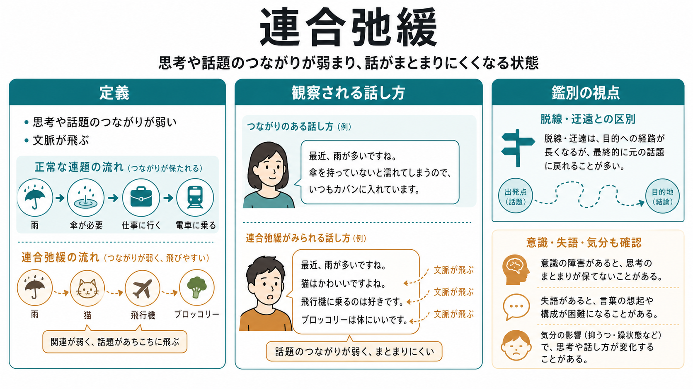
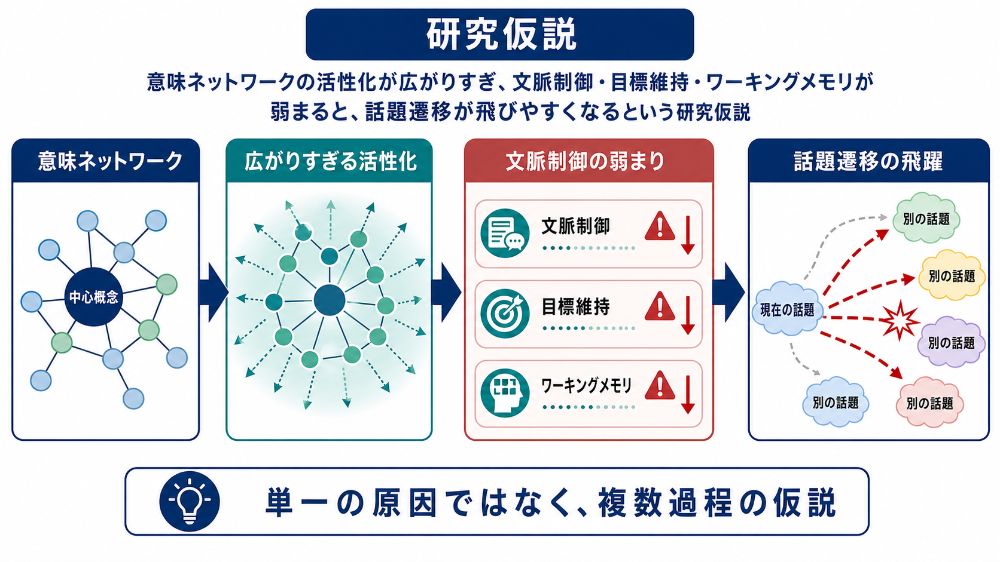
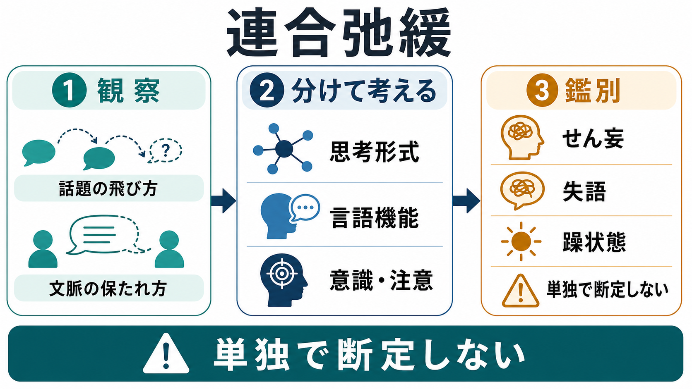

# 連合弛緩とは何か

## 要点

- 連合弛緩とは、話題・概念・文脈のつながりが弱くなり、聞き手から見ると話が飛びやすく、まとまりにくくなる状態を指す。
- 精神医学では、妄想や幻覚の「内容」ではなく、思考や発話の「形式」の乱れとして扱う。したがって、[[妄想とは何か]]や[[幻覚とは何か]]とは別の観察軸である。
- 統合失調症でよく論じられるが、形式的思考障害は躁状態、抑うつ、器質性疾患、物質・薬剤、発達特性、重い不安や疲労などでも似た形で現れうる。
- 臨床では、発話だけで断定せず、意識、注意、言語機能、気分、薬剤、身体疾患、生活機能、経過を合わせて評価する。

## この記事で答える問い

- 連合弛緩は、単に「話がわかりにくい」ことと何が違うのか。
- 「脱線」「迂遠」「支離滅裂」「失語」「意識障害」とどう見分けるのか。
- なぜ精神医学・心理学研究で、思考の内容ではなく発話のまとまりが重視されるのか。

## まず結論

連合弛緩は、考えと考えを結びつける連想の流れがゆるみ、話題が遠い関連へ飛んだり、文脈のつながりが保てなくなったりする症状である。重要なのは、本人が「変なことを言っている」という意味ではなく、聞き手が発話を追ったときに、文法は比較的保たれていても、話題間の意味的な接続が弱く見えることである。

診断名そのものではなく、[[精神症候学とは何か|精神症候学]]で記述される観察所見である。DSM-5 系の統合失調症基準では、頻回の脱線やまとまりのなさは「まとまりのない発話」の例として位置づけられるが、これだけで疾患を決めるものではない[1][2]。

## 背景

連合弛緩は、英語ではしばしば *loosening of associations* と呼ばれ、形式的思考障害の古典的概念の一つである。形式的思考障害とは、「何を信じているか」よりも、「考えがどのように組み立てられ、言葉として伝えられているか」の乱れを扱う枠組みである[3]。

統合失調症の説明では、幻覚・妄想と並んで、思考障害やまとまりのない発話が重要な症状群として説明される。NIMH も、思考障害では考えや発話を整理しにくく、途中で話が止まったり、話題から話題へ飛んだり、意味のない語を作ったりすることがあると説明している[2]。ただし、形式的思考障害は統合失調症だけに限定されず、精神病性障害、気分障害、神経認知障害、身体疾患、薬剤・物質の影響などとの関係で評価する必要がある[4]。

## 基本概念

### 何が「弛緩」しているのか

ここでいう「連合」とは、ある考えから次の考えへ移るときの意味的・文脈的なつながりである。通常の会話では、「雨が多い」から「傘が必要」、そこから「通勤が大変」といったように、聞き手が追える程度の関連が保たれる。

連合弛緩では、この関連が弱くなる。たとえば「雨が多いですね」から「猫はかわいい」「飛行機に乗るのは好き」「ブロッコリーは体にいい」といったように、個々の文は理解できても、話題遷移の理由が共有されにくい。これは[[認知機能障害とは何か|認知機能]]、[[注意障害とは何か|注意]]、言語、気分、文脈維持の問題が重なって見えることがある。

### 思考内容の異常との違い

[[妄想とは何か|妄想]]は信念の内容、[[幻聴とは何か|幻聴]]は知覚体験の内容を中心に記述する。一方、連合弛緩は「話題のつながり方」の問題である。したがって、奇妙な内容があるかどうかだけでは判断できない。内容が現実的でも、話題の連結が極端に弱ければ連合弛緩として記述されることがある。

## 仕組み

連合弛緩の機序は単一原因として確定していない。研究では、意味ネットワークの活性化、文脈制御、実行機能、ワーキングメモリ、言語産出、注意制御などの複数過程が関与すると考えられている。

一つの有力な見方は、意味ネットワークの活性化が広がりすぎる、または制御されにくくなるという仮説である。統合失調症の意味プライミング研究では、形式的思考障害をもつ群で、近い意味だけでなく遠い関連へも活性化が広がりやすい可能性が議論されてきた[5][6]。ただし、メタ分析では結果は一様ではなく、全体としては「思考障害をもつ群で増大した意味プライミングがみられる可能性はあるが、反応時間の遅さなどの交絡も残る」と慎重にまとめられている[7]。

もう一つの見方は、文脈を保ちながら発話を組み立てる制御機能の弱まりである。発話中には、今の話題、質問の目的、相手が知っている情報、どこまで説明したかを保つ必要がある。ワーキングメモリや実行機能の負荷が高いと、話題の焦点が保ちにくくなり、結果として遠い連想へ移りやすくなる[6]。

## 図解

連合弛緩を図にすると、正常な会話では「中心話題」から近い関連へ順に移るのに対し、連合弛緩では遠い関連語・音の連想・偶然の刺激・個人的連想が入りやすく、聞き手が文脈を再構成しにくくなる。

ただし、図は理解の補助であり、実際の面接では発話の一部分だけで判断しない。疲労、緊張、文化差、発達特性、言語背景、教育歴、薬剤、睡眠不足、急性の身体疾患でも、会話のまとまりは変わりうる。

## 臨床・研究との接続

臨床では、連合弛緩を「ある／ない」で見るより、どの場面で、どの程度、どれくらい持続し、生活機能にどう影響しているかを観察する。質問に対する答えがどれくらい関連しているか、話題が逸れたあと戻れるか、文法や語彙は保たれているか、本人が逸脱に気づけるかが手がかりになる。

研究では、Andreasen の Thought, Language, and Communication scale のように、発話の貧困、内容の貧困、脱線、迂遠、まとまりのなさ、音連合、新語、保続などを細かく評定する試みが行われてきた[3]。近年は、自然言語処理を用いて発話の意味的一貫性や語彙ネットワークを測定し、形式的思考障害を定量化する研究も進んでいる[8]。

## よくある誤解

### 「話が長い」だけで連合弛緩なのか

違う。話が長くても、話題が目的地へ戻り、論点が追えるなら連合弛緩とは限らない。細部が多く遠回りする場合は、むしろ迂遠に近いことがある。

### 「支離滅裂」と同じか

完全には同じではない。連合弛緩では、個々の文や語は理解できることが多いが、文脈の連結が弱い。支離滅裂や語 salad に近づくほど、文や語のまとまり自体が崩れ、意味を追うことがさらに難しくなる。

### 統合失調症のサインと決めてよいか

決めてはいけない。連合弛緩は統合失調症で重要な症状として扱われるが、躁状態、[[意識障害とは何か|意識障害]]、[[せん妄とは何か|せん妄]]、[[失語とは何か|失語]]、神経疾患、物質・薬剤、強い不安や疲労でも似た会話の乱れが生じうる。教育・研究上の概念としては有用だが、個別診断や治療判断は包括的評価に基づく。

## 関連ノート

- [[精神症候学とは何か]]
- [[妄想とは何か]]
- [[幻覚とは何か]]
- [[幻聴とは何か]]
- [[認知機能障害とは何か]]
- [[注意障害とは何か]]
- [[意識障害とは何か]]
- [[せん妄とは何か]]
- [[失語とは何か]]
- [[躁状態とは何か]]

MOC 更新候補: `content/00_MOC/` 配下の精神医学・症候学系 MOC に、本記事 `[[連合弛緩とは何か]]` を追加する。

## 理解チェック

1. 連合弛緩は、思考の「内容」と「形式」のどちらに主に関係するか。
2. 脱線・迂遠・支離滅裂は、話題が戻れるか、文脈が追えるかという点でどう違うか。
3. 連合弛緩らしい発話があったとき、意識障害・失語・気分・薬剤・身体疾患を確認する必要があるのはなぜか。

## 参考文献

[1] American Psychiatric Association. (2022). *Diagnostic and Statistical Manual of Mental Disorders, Fifth Edition, Text Revision (DSM-5-TR)*. American Psychiatric Association Publishing. https://doi.org/10.1176/appi.books.9780890425787

[2] National Institute of Mental Health. (2024). *Schizophrenia*. https://www.nimh.nih.gov/health/publications/schizophrenia

[3] Andreasen, N. C. (1986). Scale for the assessment of thought, language, and communication (TLC). *Schizophrenia Bulletin, 12*(3), 473-482. https://doi.org/10.1093/schbul/12.3.473

[4] Özyurt, Ö. F., et al. (2022). Association between formal thought disorders, neurocognition and functioning in the early stages of psychosis: A systematic review of the last half-century studies. *Frontiers in Psychiatry, 13*, 841720. https://pmc.ncbi.nlm.nih.gov/articles/PMC8938342/

[5] Minzenberg, M. J., Ober, B. A., & Vinogradov, S. (2002). Semantic priming in schizophrenia: A review and synthesis. *Journal of the International Neuropsychological Society, 8*(5), 699-720. https://doi.org/10.1017/S1355617702801357

[6] Salisbury, D. F. (2008). Semantic activation and verbal working memory maintenance in schizophrenic thought disorder: Insights from electrophysiology and lexical ambiguity. *Clinical EEG and Neuroscience, 39*(2), 103-107. https://pmc.ncbi.nlm.nih.gov/articles/PMC2681260/

[7] Pomarol-Clotet, E., Oh, T. M. S. S., Laws, K. R., & McKenna, P. J. (2008). Semantic priming in schizophrenia: Systematic review and meta-analysis. *The British Journal of Psychiatry, 192*(2), 92-97. https://doi.org/10.1192/bjp.bp.106.032102

[8] Elvevåg, B., Foltz, P. W., Weinberger, D. R., & Goldberg, T. E. (2007). Quantifying incoherence in speech: An automated methodology and novel application to schizophrenia. *Schizophrenia Research, 93*(1-3), 304-316. https://doi.org/10.1016/j.schres.2007.03.001
