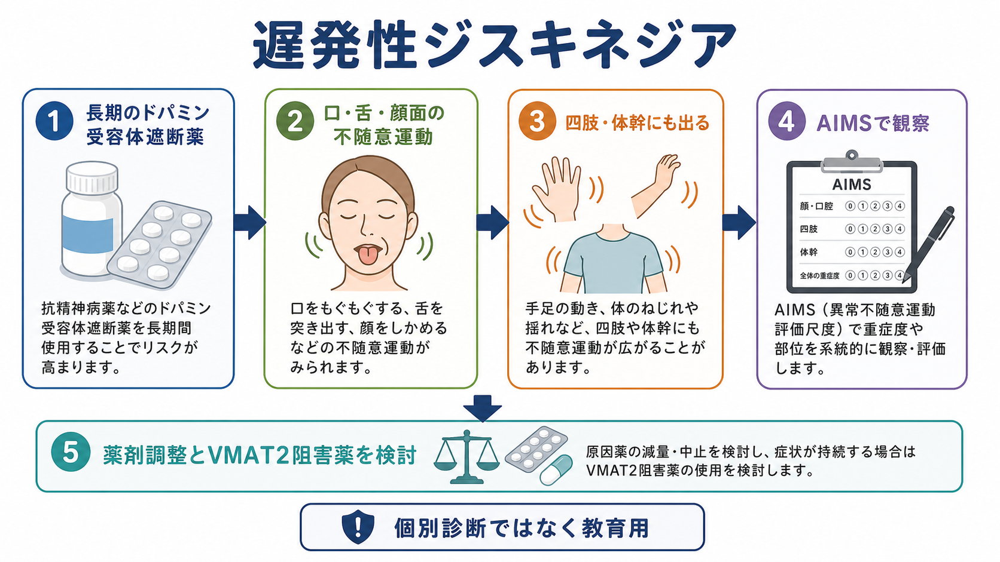
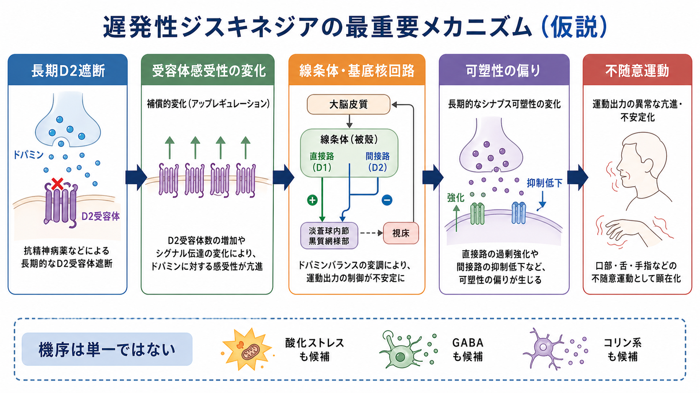

# 遅発性ジスキネジアとは何か

## 要点

- 遅発性ジスキネジアは、抗精神病薬などのドパミン受容体遮断薬を長期に使用した後に出現しうる、不随意で反復的な運動症状である[1]。
- 典型的には、口をもぐもぐする、舌を突き出す、口唇をすぼめる、顔をしかめるなどの口・舌・顔面の動きとして気づかれるが、手指、足、体幹、呼吸や発声に関わる運動として現れることもある[1]。
- 機序は単一ではない。長期のD2受容体遮断に伴うドパミン過感受性、線条体・大脳基底核回路の可塑性変化、酸化ストレス、GABA系・コリン系の不均衡などが候補として議論されている[1][2]。
- 評価では、AIMSのような尺度で部位と重症度を系統的に観察し、薬剤歴、発症時期、機能障害、本人の苦痛、他の薬剤性運動症状との鑑別を合わせて考える[1][3]。
- 治療方針は、原因薬の必要性、精神症状の再燃リスク、生活への影響、本人の価値観を含めた個別判断になる。VMAT2阻害薬はRCTとメタ解析で症状軽減効果が示されているが、ここでは個別の治療指示としては扱わない[4][5][6]。

## この記事で答える問い

1. 遅発性ジスキネジアは、どのような動きとして観察されるのか。
2. なぜ抗精神病薬などの長期使用後に出ると考えられているのか。
3. 薬剤性パーキンソニズム、アカシジア、急性ジストニアとどう区別して考えるのか。
4. 臨床では、評価・説明・研究知見をどのようにつなぐのか。

## まず結論

遅発性ジスキネジアは、診断名というよりも「薬剤曝露と時間経過を背景にもつ不随意運動の症候群」として理解するとよい。重要なのは、見た目の動きだけで決めないことである。いつから、どの薬剤の開始・増量・減量と関係するか、睡眠や緊張で変わるか、口腔・嚥下・発語・歩行・対人場面にどの程度影響しているかを、[[精神症候学とは何か|精神症候学]]と[[MSEで外観と行動から何を観察するか|MSEの外観と行動]]の視点で記述する。

同時に、原因薬を単純にやめればよい、とも言い切れない。抗精神病薬が精神病症状や躁状態の再燃予防に必要な場合、減量・中止は利益とリスクを丁寧に比較する必要がある。したがって、遅発性ジスキネジアの評価は、運動症状だけでなく、[[統合失調症とは何か|統合失調症]]などの基礎疾患、薬剤の必要性、生活機能、本人の希望を合わせて扱う作業である。

## 背景

「遅発性」とは、原因薬を使ってすぐではなく、一定期間の曝露の後に現れやすいという意味である。典型的には数か月から年単位の使用後に出現するが、薬剤の減量・中止後に目立つこともある。原因薬としては、第一世代・第二世代の抗精神病薬が中心だが、制吐薬・消化管運動改善薬として用いられるメトクロプラミドなど、ドパミン受容体遮断作用をもつ薬剤でも問題になる[1][7]。

第一世代抗精神病薬の方がリスクは高い傾向にあるが、第二世代抗精神病薬なら起こらないわけではない。比較RCTを集めたメタ解析では、第二世代抗精神病薬は第一世代に比べて遅発性ジスキネジアのリスクが低いとされた一方、リスクがゼロではないことも示されている[8]。そのため、薬剤の種類だけで安心せず、長期使用では定期的な観察が必要になる。

メトクロプラミドについては、米国DailyMedの添付文書でも、遅発性ジスキネジアのリスクは治療期間と累積用量で増えること、通常は12週を超える使用を避けることが強調されている[7]。これは「抗精神病薬だけの副作用」と考えないための重要な例である。

## 基本概念

### どのような動きか

典型例は、口・舌・顔面を中心とする反復的で目的のない動きである。たとえば、口唇をすぼめる、舌を突き出す、舌が口腔内で動き続ける、咀嚼のような動きが続く、顎が左右に動く、顔をしかめる、といった形で観察される[1]。

ただし、口周囲だけに限られない。手指のピアノを弾くような動き、足踏み様の動き、体幹の揺れやねじれ、骨盤の動き、発声や呼吸の不規則さとして出ることもある[1]。このため、評価では「口だけを見る」のではなく、顔面、口腔、四肢、体幹を分けて観察する。

### 何が「遅発性」なのか

薬剤性の運動症状には、急性ジストニア、アカシジア、薬剤性パーキンソニズム、遅発性ジスキネジアなどがある。急性ジストニアは数時間から数日、アカシジアは数日から数週、薬剤性パーキンソニズムは数日から数か月で出やすい。一方、遅発性ジスキネジアは長期使用後に徐々に現れ、原因薬を減らしたり中止したりしても持続することがある[1][3]。

### 誰に起こりやすいか

リスクは、累積曝露、長期使用、高齢、女性、気分障害、糖尿病、過去の錐体外路症状、第一世代抗精神病薬使用などで高くなるとされる[1][8]。ただし、リスク因子は予測を助けるだけであり、個人で必ず起こる、あるいは起こらないと断定するものではない。

## 仕組み

遅発性ジスキネジアの代表的仮説は、長期のD2受容体遮断により、線条体のドパミン受容体やシグナル伝達が代償的に変化し、運動出力の制御が不安定になるというものである[1][2]。この見方は、[[ドパミンは報酬だけの物質なのか|ドパミン]]と[[大脳基底核ループとは何か|大脳基底核ループ]]をつなぐ理解に役立つ。

大脳基底核は、運動を単に「始める」だけでなく、不要な運動を抑え、適切な運動を選ぶ回路である。線条体、淡蒼球、視床、大脳皮質の相互作用が変わると、運動出力の選択と抑制が乱れ、不随意運動が目立ちやすくなる。ここでは、直接路・間接路、D1・D2受容体、視床皮質ループなどのバランスが関係する。

ただし、D2受容体過感受性だけでは説明しきれない。酸化ストレス、ミトコンドリア機能、グルタミン酸興奮毒性、GABA系の抑制低下、コリン作動性調節、神経炎症、長期的なシナプス可塑性なども候補として検討されている[1][2]。したがって、「D2遮断が原因」と覚えるより、「長期のドパミン遮断を背景に、基底核回路の可塑性が偏る」と理解する方が正確である。

## 図解

遅発性ジスキネジアを見たときは、次の3層で整理すると混乱しにくい。

| 層 | 見ること | 目的 |
|---|---|---|
| 症候 | どの部位が、どのように、いつ動くか | 口・舌・顔面、四肢、体幹、発声・呼吸を分ける |
| 時間経過 | 薬剤開始・増量・減量・中止との関係 | 急性ジストニア、[[アカシジアとは何か|アカシジア]]、薬剤性パーキンソニズムと区別する |
| 生活への影響 | 食事、会話、嚥下、歩行、対人場面、苦痛 | 治療目標と支援点を決める |

## 臨床・研究との接続

### 評価ではAIMSがよく使われる

AIMS（Abnormal Involuntary Movement Scale）は、顔面・口部、四肢、体幹、全般重症度、本人の自覚などを観察する尺度である[3]。尺度を使う意義は、点数を出すことだけではない。部位、強度、経時変化、治療前後の変化を同じ枠組みで記録できる点にある。

実際には、会話中、安静時、注意をそらしたとき、口を開けたとき、舌を出したとき、手を前に出したとき、歩行時などで動きが変わる。本人が自覚していない場合もあり、家族や支援者が先に気づくこともある。

### 治療研究ではVMAT2阻害薬が中心になっている

VMAT2阻害薬は、シナプス小胞へのモノアミン取り込みを調節し、ドパミン放出を抑える方向に作用する薬剤群である。バルベナジンの第III相RCTでは、6週時点のAIMSスコアがプラセボより有意に改善した[5]。デュテトラベナジンのARM-TD試験でも、12週時点でAIMSスコアの改善が示された[6]。

さらに、VMAT2阻害薬に関するRCTのメタ解析では、バルベナジンとデュテトラベナジンがAIMSスコアをプラセボより改善し、急性期試験ではうつや自殺関連有害事象の明確な増加は示されなかったと報告されている[4]。ただし、薬剤選択、禁忌、相互作用、精神症状、費用、本人の希望は個別に評価される。

### 原因薬の扱いは単純ではない

原因薬を減らす、やめる、別薬に切り替えるという発想は自然だが、精神症状の再燃や入院リスクを高める可能性がある。抗精神病薬が必要な人では、遅発性ジスキネジアの重症度だけでなく、精神病症状、再発歴、服薬アドヒアランス、家族や支援体制、本人の価値観を合わせて検討する必要がある。ここは[[薬剤性精神症状とは何か|薬剤性精神症状]]と[[鑑別診断とは何か|鑑別診断]]の両方に接続する。

## よくある誤解

### 誤解1: 第二世代抗精神病薬なら遅発性ジスキネジアは起こらない

第二世代抗精神病薬は第一世代よりリスクが低い傾向にあるが、ゼロではない[8]。長期使用、累積曝露、高齢、過去の錐体外路症状などが重なる場合、定期的な観察が必要である。

### 誤解2: 口が動いていればすべて遅発性ジスキネジアである

口や顔面の動きには、歯科的問題、義歯の不適合、チック、常同行動、不安、薬剤性パーキンソニズム、ジストニア、神経疾患なども関係する。[[ジストニアとは何か|ジストニア]]や急性の喉頭・頸部症状が疑われる場合は、緊急性の評価も必要になる。

### 誤解3: 本人が困っていなければ評価しなくてよい

本人が気づいていない、または恥ずかしさから言い出せないことがある。見た目の問題だけでなく、発語、嚥下、食事、睡眠、対人関係、服薬継続に影響することもある。観察と本人の語りを両方扱う必要がある。

### 誤解4: 原因薬を中止すれば必ず治る

遅発性ジスキネジアは、薬剤中止後も持続したり、減量・中止時に一時的に目立ったりすることがある[1]。一方で、原因薬の継続が必要な場合もある。したがって、薬剤の調整は、運動症状と精神症状の両方のリスクを見て行う。

## 関連ノート

- [[精神症候学とは何か]]
- [[MSEで外観と行動から何を観察するか]]
- [[精神状態診察MSEとは何か]]
- [[薬剤性精神症状とは何か]]
- [[アカシジアとは何か]]
- [[ジストニアとは何か]]
- [[統合失調症とは何か]]
- [[ドパミンは報酬だけの物質なのか]]
- [[大脳基底核ループとは何か]]
- [[運動ネットワークは随意運動をどう生み出すのか]]
- [[鑑別診断とは何か]]

## MOC更新候補

- `content/00_MOC/MOC・精神医学.md`
- `content/00_MOC/MOC・臨床実践・治療.md`
- `content/00_MOC/MOC・脳・神経科学.md`

並列実行時の競合を避けるため、本稿ではMOC本体の更新は行わない。

## 理解チェック

1. 遅発性ジスキネジアで典型的に観察される口・舌・顔面の動きを3つ挙げられるか。
2. 急性ジストニア、アカシジア、薬剤性パーキンソニズム、遅発性ジスキネジアを、発症時期と動きの質で区別できるか。
3. D2受容体過感受性仮説だけでなく、大脳基底核回路の可塑性として説明する利点は何か。
4. AIMSを使うと、どの部位と重症度を系統的に記録できるか。
5. 原因薬の減量・中止を考えるとき、精神症状の再燃リスクを同時に考える必要があるのはなぜか。

## 未解決問題

- 遅発性ジスキネジアの発症を、個人レベルで高精度に予測できるバイオマーカーはまだ確立していない。
- D2受容体過感受性、酸化ストレス、GABA系、コリン系、神経炎症、シナプス可塑性のうち、どの機序がどの患者群で中心になるかは十分に分かっていない。
- VMAT2阻害薬の長期的な機能改善、社会参加、服薬継続、費用対効果については、さらに実臨床データが必要である。

## 参考文献

[1] Raza M, Mars JA. *Tardive Dyskinesia*. StatPearls. Last Update: 2026-01-31. NCBI Bookshelf. https://www.ncbi.nlm.nih.gov/books/NBK448207/

[2] Bhidayasiri R, Jitkritsadakul O, Friedman JH, Fahn S. Updating the recommendations for treatment of tardive syndromes: A systematic review of new evidence and practical treatment algorithm. *Journal of the Neurological Sciences*. 2018;389:67-75. doi:10.1016/j.jns.2018.02.010

[3] Guy W. *Abnormal Involuntary Movement Scale (AIMS)*. ECDEU Assessment Manual for Psychopharmacology, revised. NIMH Psychopharmacology Research Branch, 1976. PDF hosted by Oregon Health & Science University. https://www.ohsu.edu/sites/default/files/2019-10/%28AIMS%29%20Abnormal%20Involuntary%20Movement%20Scale.pdf

[4] Solmi M, Pigato GG, Kane JM, Correll CU. Treatment of tardive dyskinesia with VMAT-2 inhibitors: a systematic review and meta-analysis of randomized controlled trials. *Drug Design, Development and Therapy*. 2018;12:1215-1238. doi:10.2147/DDDT.S133205

[5] Hauser RA, Factor SA, Marder SR, et al. KINECT 3: A Phase 3 Randomized, Double-Blind, Placebo-Controlled Trial of Valbenazine for Tardive Dyskinesia. *American Journal of Psychiatry*. 2017;174(5):476-484. doi:10.1176/appi.ajp.2017.16091037

[6] Fernandez HH, Factor SA, Hauser RA, et al. Randomized controlled trial of deutetrabenazine for tardive dyskinesia: The ARM-TD study. *Neurology*. 2017;88(21):2003-2010. doi:10.1212/WNL.0000000000003960

[7] DailyMed. *REGLAN- metoclopramide hydrochloride tablet*. Updated 2026-02-09. https://dailymed.nlm.nih.gov/dailymed/drugInfo.cfm?setid=de55c133-eb08-4a35-91a2-5dc093027397

[8] Carbon M, Kane JM, Leucht S, Correll CU. Tardive dyskinesia risk with first- and second-generation antipsychotics in comparative randomized controlled trials: a meta-analysis. *World Psychiatry*. 2018;17(3):330-340. doi:10.1002/wps.20579
