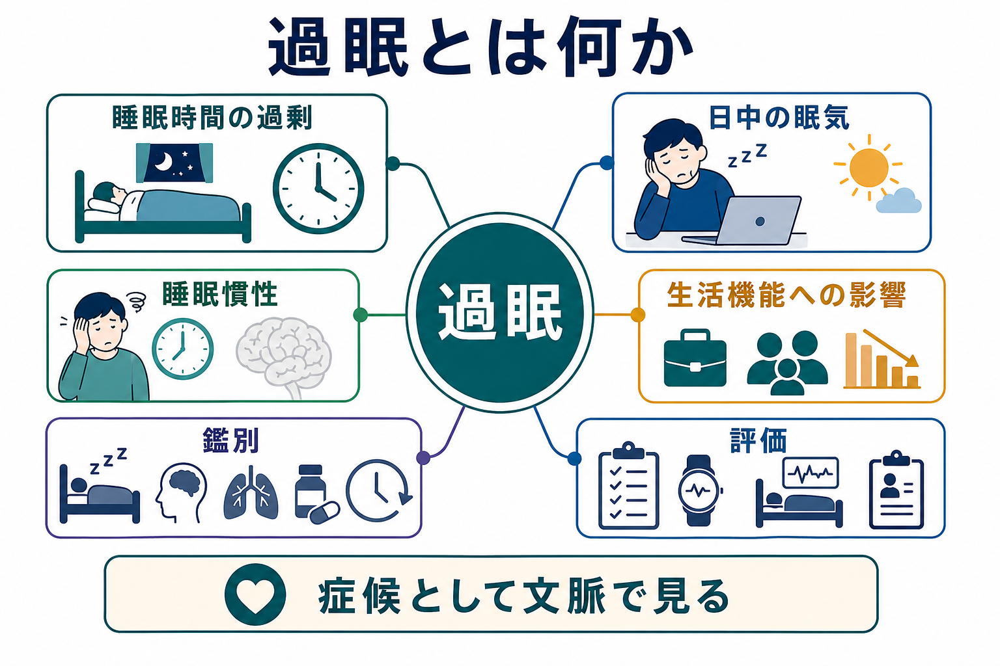
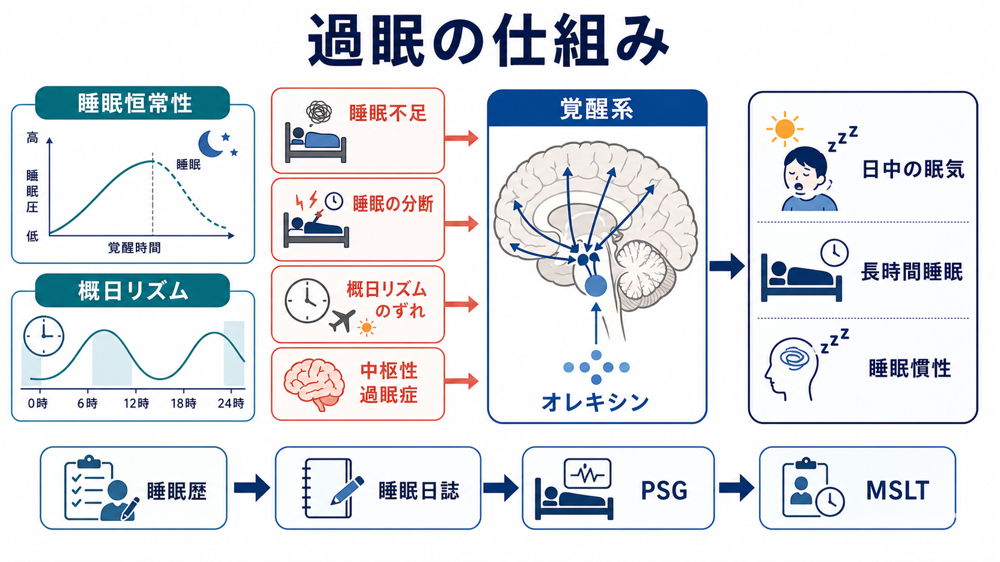

# 過眠とは何か

## 要点

- 過眠は、単に「よく眠る人」を指す語ではなく、長い睡眠時間、日中の強い眠気、居眠り、起床困難、睡眠慣性が生活機能を妨げる症候として整理される[1][2]。
- 睡眠不足、睡眠時無呼吸などによる睡眠の分断、概日リズムのずれ、薬剤・物質、身体疾患、精神疾患、中枢性過眠症を区別する必要がある[2][3][4]。
- 中枢性過眠症には、ナルコレプシー、特発性過眠症、Kleine-Levin 症候群などが含まれ、ICSD-3 では「中枢性過眠症群」として分類される[1][2]。
- 評価では、睡眠歴、睡眠日誌、アクチグラフィ、終夜睡眠ポリグラフ検査（PSG）、反復睡眠潜時検査（MSLT）を、症状の文脈に応じて組み合わせる[5]。
- 本稿は教育・研究目的の整理であり、個別の診断や治療指示ではない。持続する眠気、運転中の眠気、急な睡眠発作、呼吸停止の疑いがある場合は専門的評価が優先される。

## この記事で答える問い

1. 過眠は「睡眠時間が長いこと」と「日中の眠気」のどちらを指すのか。
2. 過眠を、[[不眠とは何か]]や[[睡眠障害とは何か]]とどう関係づけて考えるのか。
3. 睡眠不足、精神疾患、身体疾患、薬剤、中枢性過眠症をどう鑑別するのか。
4. 臨床・研究では、過眠をどのような指標で評価するのか。

## まず結論

過眠は、睡眠時間の長さだけで決まる状態ではない。重要なのは、眠気が「覚醒しているべき時間帯」に現れ、学校、仕事、対人関係、安全行動、自己管理を妨げるかどうかである。睡眠が長くても日中の機能が保たれていれば体質的な長時間睡眠に近いことがある。一方、十分に眠っているように見えても、日中の強い眠気、居眠り、起床困難、頭が働くまで長くかかる状態が持続すれば、過眠症状として評価対象になる[2][3]。

したがって、過眠を見たときの第一歩は「眠い」という訴えをすぐ診断名に変換することではない。[[精神症候学とは何か]]で扱うように、症候は、時間経過、生活文脈、身体状態、睡眠リズム、薬剤、精神症状、検査所見と結びつけて記述する必要がある。

## 背景

日中の眠気はありふれた訴えである。睡眠時間が足りない、夜間に何度も目が覚める、勤務や学業で睡眠リズムがずれる、鎮静性の薬剤を使っている、抑うつや不安で疲労感が強い、といった状況でも起こる。過眠が問題になるのは、眠気が本人の努力不足では説明できず、反復的・持続的に生活を圧迫するときである[3][4]。

ICSD-3 は睡眠障害を、不眠症群、睡眠関連呼吸障害群、中枢性過眠症群、概日リズム睡眠・覚醒障害群などに分類する[1]。この分類は、過眠を「ひとつの病名」として見るのではなく、睡眠不足、睡眠の質の低下、リズムのずれ、中枢神経系の覚醒制御の問題などを分けて考えるための枠組みである。

精神医学では、過眠は抑うつエピソード、双極性障害の抑うつ相、季節性の気分変動、薬剤性鎮静、物質使用、身体疾患と重なりやすい。[[抑うつ気分とは何か]]や[[躁状態とは何か]]の評価では、気分そのものだけでなく、睡眠時間、睡眠の質、日中の活動量、起床困難を合わせてみることが重要になる。

## 基本概念

### 過眠、眠気、疲労

「眠気」は、眠りに入りやすい状態であり、覚醒を保つ力が低下していることを指す。これに対して「疲労」は、エネルギー不足、消耗感、身体の重さ、意欲低下として語られやすい。両者は重なるが、同じではない。過眠評価では、「横になると眠ってしまうのか」「活動はつらいが眠れるわけではないのか」を分けて聞く必要がある[3][7]。

### 長時間睡眠

長時間睡眠は、夜間睡眠や昼寝を含めた総睡眠時間が長い状態である。ただし、長く眠ること自体は病的とは限らない。問題になるのは、睡眠を延ばしても回復感が乏しい、起きられない、起きても混乱やぼんやりが続く、日中に不可抗的な眠気が出る、という組み合わせである[2][8]。

### 睡眠慣性

睡眠慣性とは、目覚めた後もしばらく覚醒機能が十分に立ち上がらない状態である。特発性過眠症では、長く眠ってもすっきりせず、起床困難、混乱、自動行動、再入眠が目立つことがある[8]。これは単なる「朝が弱い」とは異なり、生活機能への影響を含めて評価する。

### 過眠症状と過眠症

過眠症状は、多くの原因で生じる横断的な症候である。一方、特発性過眠症やナルコレプシーなどは、一定の診断基準を満たす睡眠障害である。つまり、過眠症状があるからといって、ただちに中枢性過眠症と診断されるわけではない。睡眠不足、閉塞性睡眠時無呼吸、概日リズム障害、薬剤、身体疾患、精神疾患を除外または併存評価する必要がある[2][4][8]。

## 仕組み

過眠は、複数の経路が同じ「眠い」という出口に集まる現象として理解しやすい。

1. 睡眠恒常性  
起きている時間が長くなるほど睡眠圧が高まり、眠りやすくなる。慢性的な睡眠不足では、本人が慣れているつもりでも日中の眠気、注意低下、反応時間の低下が生じうる[3]。

2. 概日リズム  
睡眠・覚醒は体内時計に強く影響される。夜型化、交代勤務、時差、社会的時差ぼけでは、十分な睡眠時間を確保しにくく、起きるべき時間に眠気が出やすい。これは[[概日リズムの乱れは精神疾患にどう関わるのか]]とも接続する。

3. 睡眠の分断  
睡眠時無呼吸、周期性四肢運動、疼痛、頻尿、環境要因などで睡眠が細切れになると、総睡眠時間が長く見えても回復感が乏しくなる。本人は夜間覚醒を覚えていないこともある。

4. 覚醒系の障害  
中枢性過眠症では、覚醒を維持する神経機構の異常が関与する。ナルコレプシー1型ではオレキシン／ヒポクレチン系の低下が中心的に位置づけられる一方、ナルコレプシー2型や特発性過眠症では未解明の点が多い[2][4]。

5. 精神・身体・薬剤要因  
抑うつ、不安、双極性障害、神経疾患、内分泌疾患、感染後状態、鎮静性薬剤、アルコールや他の物質は、眠気、疲労、活動低下を複雑に重ねる。ここでは「眠い」と「動けない」を分けつつ、どちらも実際の苦痛として扱う必要がある。

## 図解

1枚目は、過眠を「睡眠時間の過剰」「日中の眠気」「睡眠慣性」「生活機能への影響」「鑑別」「評価」に分ける概念地図である。過眠を睡眠時間だけに還元しないための全体像として読む。

2枚目は、睡眠恒常性、概日リズム、睡眠不足、睡眠の分断、中枢性過眠症、覚醒系をつなげた機序図である。図中の「PSG」「MSLT」は、それぞれ終夜睡眠ポリグラフ検査と反復睡眠潜時検査を指す。

## 臨床・研究との接続

### 評価の流れ

過眠評価では、まず睡眠歴を詳しく取る。就床時刻、入眠時刻、起床時刻、昼寝、休日の睡眠、仕事・学業のスケジュール、カフェイン、アルコール、薬剤、運転中の眠気、いびき、無呼吸の目撃、むずむず脚、気分症状を確認する。[[精神科診察で睡眠をどう評価するか]]と同じく、睡眠は単独項目ではなく、生活リズムと精神状態の交点としてみる。

次に、睡眠日誌やアクチグラフィで、本人の記憶だけでは見えにくい睡眠・覚醒パターンを確認する。中枢性過眠症を疑う場合、PSGで睡眠時無呼吸や睡眠の分断を評価し、その翌日にMSLTで標準化された条件下の眠りやすさを測ることがある。AASM の成人 MSLT/MWT プロトコルでは、検査前の睡眠日誌やアクチグラフィ、十分な睡眠確保、薬剤・カフェイン・併存睡眠障害の影響確認が重視される[5]。

### 鑑別の見取り図

| 観点 | 確認すること | 典型的な論点 |
|---|---|---|
| 睡眠不足 | 平日・休日の睡眠時間、睡眠負債 | まず睡眠機会が足りているか |
| 睡眠の質 | いびき、無呼吸、疼痛、頻尿、睡眠中の運動 | 長く寝ても回復しない理由 |
| 概日リズム | 就寝・起床時刻、交代勤務、夜型化 | 体内時計と社会的予定のずれ |
| 精神状態 | 抑うつ、不安、躁状態、過覚醒 | 眠気、疲労、意欲低下の区別 |
| 身体疾患 | 内分泌、神経、感染後、疼痛 | 身体要因による眠気・疲労 |
| 薬剤・物質 | 抗不安薬、抗精神病薬、抗ヒスタミン薬、アルコールなど | 鎮静作用や離脱の影響 |
| 中枢性過眠症 | 睡眠発作、情動脱力発作、睡眠麻痺、入眠時幻覚、睡眠慣性 | ナルコレプシー、特発性過眠症など |

### 精神医学との接続

精神科臨床では、過眠は「寝すぎ」として過小評価されやすい。だが、抑うつでは過眠と不眠のどちらも起こりうるし、双極性障害では睡眠欲求の低下が躁状態の重要な手がかりになる一方、抑うつ相では過眠が前景化することがある。[[不眠とは何か]]、[[過覚醒とは何か]]、[[意識障害とは何か]]、[[注意障害とは何か]]と並べてみると、睡眠・覚醒・注意・気分は切り離せない。

また、過眠は安全性の問題でもある。運転、機械操作、見守り業務、医療・介護、長時間勤務では、眠気が事故リスクに直結しうる[3][7]。教育記事としては治療指示を出さないが、機能障害や危険行動の評価が必要であることは強調してよい。

### 治療研究との接続

中枢性過眠症の治療については、AASM の診療ガイドラインが、ナルコレプシー、特発性過眠症、Kleine-Levin 症候群などに対する薬物療法・非薬物療法のエビデンスを GRADE に基づいて整理している[6]。ただし、治療選択は診断、併存症、薬剤相互作用、年齢、妊娠可能性、安全性、本人の価値観によって変わる。症候学の記事では、治療名を暗記するより、眠気の原因と評価の前提を明確にすることが重要である。

## よくある誤解

### 誤解1: 長く眠る人は全員、過眠である

長時間睡眠だけでは病的とはいえない。生活機能への影響、回復感、日中の眠気、起床困難、睡眠慣性、背景疾患を合わせて評価する。

### 誤解2: 過眠は怠けや意志の弱さである

過眠は、睡眠不足、睡眠の分断、概日リズム、薬剤、身体疾患、精神疾患、覚醒系の問題などから生じる症候である。本人の努力だけで説明すると、必要な評価が遅れる。

### 誤解3: 眠気と疲労は同じである

眠気は「眠りに入りやすい」状態であり、疲労は「消耗している」状態である。両者は重なるが、鑑別や研究指標では分けて扱う必要がある[3][7]。

### 誤解4: MSLTだけで診断が決まる

MSLTは有用だが、単独で過眠の全体像を決める検査ではない。AASM のプロトコルでも、検査前の睡眠量、薬剤、併存睡眠障害、PSG、臨床歴と合わせた解釈が必要とされる[5]。

## 関連ノート

- [[睡眠障害とは何か]]
- [[不眠とは何か]]
- [[精神科診察で睡眠をどう評価するか]]
- [[概日リズムの乱れは精神疾患にどう関わるのか]]
- [[抑うつ気分とは何か]]
- [[躁状態とは何か]]
- [[過覚醒とは何か]]
- [[精神症候学とは何か]]
- [[症状と徴候は何が違うのか]]
- [[注意障害とは何か]]
- [[意識障害とは何か]]

今後の作成候補: `ナルコレプシーとは何か`, `特発性過眠症とは何か`, `MSLTとは何か`, `睡眠時無呼吸とは何か`, `睡眠慣性とは何か`, `睡眠不足症候群とは何か`, `交代勤務睡眠障害とは何か`。

## MOC更新候補

- `content/00_MOC/` 配下の精神医学・症候学・睡眠関連 MOC に、バッチ統合時に `[[過眠とは何か]]` を追加する候補。
- 並列生成ジョブとの競合を避けるため、このタスクでは MOC ファイル本体は更新しない。

## 理解チェック

1. 過眠を「長時間睡眠」だけで定義すると、どのような見落としが起こるか。
2. 眠気と疲労を区別するために、面接でどのような質問を加えるとよいか。
3. 睡眠不足、睡眠時無呼吸、概日リズムのずれ、中枢性過眠症は、どの点で鑑別されるか。
4. MSLTを解釈するとき、検査前の睡眠量や薬剤確認が重要なのはなぜか。
5. 抑うつや双極性障害の評価で、過眠がどのような意味を持つか説明できるか。

## 未解決問題

- 特発性過眠症の病態はどこまで単一の機序として説明できるのか。
- 主観的眠気、客観的睡眠潜時、生活機能障害は、どの程度一致するのか。
- 精神疾患に伴う過眠と中枢性過眠症の境界を、臨床的にどう扱うべきか。
- ウェアラブルデータを、睡眠日誌・PSG・MSLTとどのように統合すべきか。

## 参考文献

[1] Sateia, M. J. (2014). International classification of sleep disorders-third edition: highlights and modifications. *Chest, 146*(5), 1387-1394. https://doi.org/10.1378/chest.14-0970

[2] Trotti, L. M. (2020). Central disorders of hypersomnolence. *Continuum, 26*(4), 890-907. https://pmc.ncbi.nlm.nih.gov/articles/PMC9159677/

[3] Murray, B. J. (2016). A practical approach to excessive daytime sleepiness: a focused review. *Canadian Respiratory Journal, 2016*, 4215938. https://pmc.ncbi.nlm.nih.gov/articles/PMC4904525/

[4] Khan, Z., & Trotti, L. M. (2015). Central disorders of hypersomnolence: focus on the narcolepsies and idiopathic hypersomnia. *Chest, 148*(1), 262-273. https://doi.org/10.1378/chest.14-1304

[5] Krahn, L. E., Arand, D. L., Avidan, A. Y., et al. (2021). Recommended protocols for the Multiple Sleep Latency Test and Maintenance of Wakefulness Test in adults: guidance from the American Academy of Sleep Medicine. *Journal of Clinical Sleep Medicine, 17*(12), 2489-2498. https://pmc.ncbi.nlm.nih.gov/articles/PMC8726366/

[6] Maski, K., Trotti, L. M., Kotagal, S., et al. (2021). Treatment of central disorders of hypersomnolence: an American Academy of Sleep Medicine clinical practice guideline. *Journal of Clinical Sleep Medicine, 17*(9), 1881-1893. https://pmc.ncbi.nlm.nih.gov/articles/PMC8636351/

[7] Smith, S., Rossdale, J., Serry, Y., Sekaran, A., Drakatos, P., & Steier, J. (2018). Multiple dimensions of excessive daytime sleepiness. *Journal of Thoracic Disease, 10*(Suppl 1), S170-S176. https://doi.org/10.21037/jtd.2017.11.32

[8] StatPearls. (2024). Idiopathic Hypersomnia. *NCBI Bookshelf*. https://www.ncbi.nlm.nih.gov/books/NBK585065/
