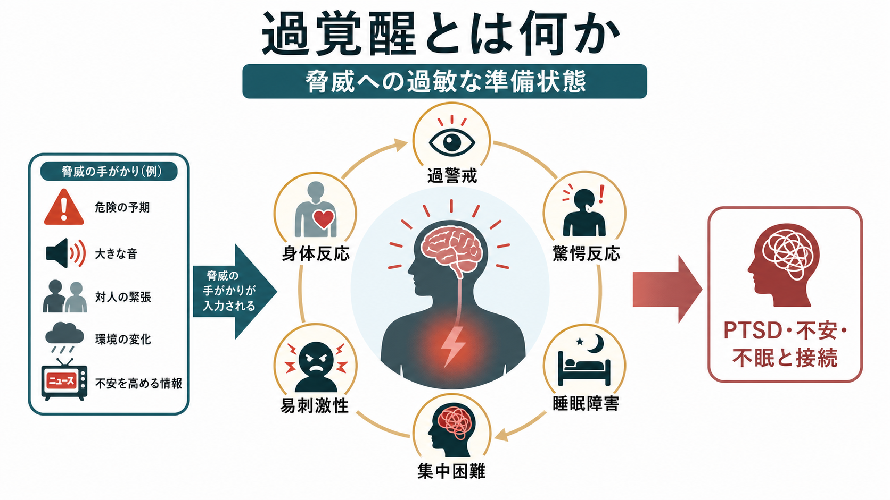
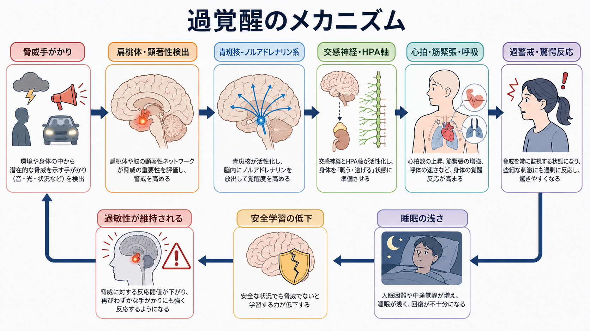
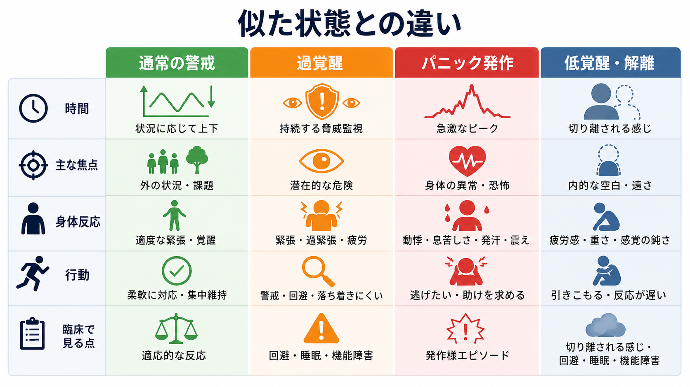

# 過覚醒とは何か

## 要点

- 過覚醒とは、脅威が目前にない場面でも、身体・注意・感情・行動が「危険に備える」方向へ過敏に保たれる状態である[1][2]。
- 代表的には、過警戒、些細な音や動きへの驚愕反応、睡眠の浅さ、入眠困難、中途覚醒、集中困難、易刺激性、怒りっぽさ、筋緊張、動悸などとして現れる[1][2][3]。
- PTSD では、DSM-5-TR の「覚醒度と反応性の著しい変化」や、ICD-11 の「現在も脅威が続いているという感覚」と接続する重要な症候である[3][4]。
- 仕組みとしては、扁桃体などの脅威検出、青斑核-ノルアドレナリン系、自律神経系、HPA軸、睡眠障害、安全学習の低下が相互に関わる[5][6][7]。
- 本稿は教育・研究目的の整理であり、個別の診断や治療指示ではない。

## この記事で答える問い

1. 過覚醒は、通常の警戒や不安と何が違うのか。
2. 過警戒、驚愕反応、睡眠障害、集中困難は、なぜ一つの症候群としてまとまるのか。
3. PTSD・不安・不眠・ストレス反応と、過覚醒はどのようにつながるのか。
4. 臨床や研究では、過覚醒をどのように観察し、どこに注意して記述するのか。

## まず結論

過覚醒は、危険に備えるシステムが「切れにくい」状態である。通常の警戒は、状況に応じて高まり、危険が去れば下がる。過覚醒では、音、視線、人混み、暗がり、身体感覚、ニュース、対人緊張などが脅威の手がかりとして読まれやすく、休む場面でも身体と注意が警戒を続ける。

そのため、過覚醒は単なる「緊張しやすさ」ではない。本人の主観では「落ち着かない」「常に見張っている」「急にびくっとする」「眠っても休まらない」と語られ、観察上はそわそわする、周囲を頻繁に確認する、物音に大きく反応する、話に集中しにくい、怒りっぽく見える、といった形で現れることがある[1][2]。[[精神症候学とは何か]]の観点では、主観的体験、身体反応、行動、睡眠、生活機能を分けて記述する必要がある。

## 背景

過覚醒は、とくに PTSD の症候としてよく知られている。NIMH は PTSD の症状群の一つとして「覚醒・反応性の症状」を挙げ、容易に驚く、緊張している、睡眠困難、怒りの爆発などを説明している[1]。米国退役軍人省の National Center for PTSD も、過覚醒を外傷後にみられる持続的な覚醒増加として整理し、睡眠困難、易刺激性、集中困難、過警戒、誇張された驚愕反応を代表例としている[2]。

ただし、過覚醒は PTSD だけで見られるわけではない。[[不安とは何か]]、[[予期不安とは何か]]、[[パニック発作とは何か]]、不眠、慢性ストレス、物質使用、身体疾患、疼痛、神経疾患などでも、似た覚醒亢進が前景化することがある。したがって、過覚醒は診断名ではなく、脅威監視と生理的覚醒が高まった「症候」として扱うのが安全である。

## 基本概念

### 過警戒

過警戒とは、危険が起こる可能性を見逃さないよう、周囲や身体の変化を過剰に監視する状態である。部屋の出口を確認する、人の表情や声色を細かく読む、背後に注意が向く、音や気配に敏感になる、といった形で現れる。ICD-11 の PTSD では、現在も脅威が続いているという知覚が、過警戒や予期しない音への増強した驚愕反応として表れると整理される[4]。

過警戒は本人を守る試みでもある。しかし、脅威探索が続くほど疲労し、注意資源が削られ、学習や仕事や対人関係に使える余力が減る。これは[[注意障害とは何か]]で扱う集中困難とも接続する。

### 驚愕反応

驚愕反応は、突然の音、光、接触、動きに対して、びくっとする、身体が固まる、心拍が上がる、怒りや恐怖が急に出る、といった反応である。PTSD の心理生理研究では、安静時の心拍・皮膚コンダクタンス、驚愕課題、外傷関連手がかりへの反応などが測定され、PTSD では一部の心理生理指標が高い傾向を示すことがメタ分析で報告されている[5]。

ただし、驚きやすいことだけで PTSD が決まるわけではない。驚愕反応の強さ、持続、誘因、外傷記憶との関係、生活障害、他の症状とのまとまりを確認する必要がある。

### 睡眠障害

過覚醒では、眠るべき時間にも警戒が下がりにくい。入眠困難、中途覚醒、浅い眠り、悪夢、寝ても休まらない感覚が生じやすい。PTSD と不安関連障害の睡眠研究では、睡眠障害と不安・脅威処理が双方向に影響しあう可能性が論じられており、睡眠の乱れは日中の注意、情動調整、脅威感受性をさらに悪化させうる[7]。

### 易刺激性と集中困難

過覚醒では、脅威を監視する負荷が高いため、些細な刺激に苛立ちや怒りが出やすい。集中困難も、能力低下そのものというより、注意が安全確認や身体感覚へ割かれているために起こることがある。[[焦燥とは何か]]のような行動面の落ち着かなさ、[[気分とは何か]]で扱う持続的な情動状態とも重なりうる。

## 仕組み

### 1. 脅威検出が過敏になる

外傷体験や強いストレスの後、脳は「似た危険」を早く見つける方向へ調整されることがある。扁桃体や関連する顕著性ネットワークは、曖昧な刺激を危険の可能性として評価しやすくなる。Yehuda と LeDoux は、PTSD を外傷後の正常なストレス反応から回復しきれない表現型として捉え、恒常性の再確立が重要な問題になると論じている[8]。

### 2. 青斑核-ノルアドレナリン系が注意と覚醒を上げる

青斑核-ノルアドレナリン系は、驚くべき刺激、行動上重要な刺激、脅威手がかりに対して、注意の向け直しや覚醒の調整に関わる[6]。適度な覚醒は、危険を見つけ、素早く反応するために役立つ。一方、覚醒が高いまま固定されると、些細な刺激にも反応し、落ち着いて考える余地が狭くなる。

### 3. 自律神経系とHPA軸が身体を準備させる

過覚醒では、心拍、呼吸、発汗、筋緊張、胃腸反応などが「戦う・逃げる」方向へ動員されやすい。これは身体が危険に備える反応としては理解できるが、休息場面で続くと疲労、睡眠障害、身体不快感を生み、さらに脅威感を強める。[[症状と徴候は何が違うのか]]の観点では、本人の動悸や緊張感という症状と、観察可能な落ち着かなさや驚きやすさという徴候を分けて記述する。

### 4. 睡眠の浅さが過敏性を維持する

睡眠は、覚醒を下げ、感情記憶や身体の回復を支える。睡眠が浅くなると、翌日の疲労、集中困難、情動調整の難しさが増え、脅威手がかりに反応しやすくなる。PTSD と不安関連障害の睡眠レビューでは、睡眠障害と脅威処理・認知的過覚醒が相互に強め合うモデルが提示されている[7]。

### 5. 回避と安全確認が安全学習を妨げる

過覚醒が強いと、危険そうな場所、人、音、身体感覚を避けたり、安全確認を繰り返したりしやすい。これは短期的には安心をもたらす。しかし、避け続けると「実際には安全だった」「驚いても回復できた」という経験が得られにくく、脅威の見積もりが更新されにくい。これは[[不安とは何か]]で扱う回避の維持機構と共通する。

## 図解

過覚醒は、通常の警戒、[[パニック発作とは何か|パニック発作]]、低覚醒・解離と混同されやすい。通常の警戒は状況に応じて上下する。パニック発作は急激なピークを作りやすい。低覚醒・解離では、切り離される感じ、遠さ、鈍さが前景化しやすい。過覚醒は、持続する脅威監視と身体の準備状態が中心になる。

## 臨床・研究との接続

### 評価で見るポイント

過覚醒を評価するときは、症状名を確認するだけでなく、どの刺激で高まるか、どれくらい続くか、睡眠や生活にどう影響するかを具体化する。

| 観点 | 確認すること |
|---|---|
| 誘因 | 音、人混み、視線、対人緊張、暗所、身体感覚、外傷を思い出す手がかり |
| 身体 | 心拍、呼吸、発汗、筋緊張、胃腸症状、疲労、睡眠 |
| 注意 | 周囲確認、出口確認、集中困難、身体感覚への過注意 |
| 感情 | 恐怖、苛立ち、怒り、焦り、落ち着かなさ |
| 行動 | 回避、安全確認、過剰な準備、睡眠前の警戒、対人距離 |
| 文脈 | 外傷体験、現在の安全、身体疾患、薬剤・物質、疼痛、生活ストレス |

### PTSDとの関係

DSM-5-TR では、PTSD の症状群の一つに「覚醒度と反応性の著しい変化」があり、易刺激性、無謀または自己破壊的行動、過警戒、誇張された驚愕反応、集中困難、睡眠障害が含まれる[3]。ICD-11 では、PTSD の中核に、再体験、回避、そして「現在の脅威が高まっているという持続的知覚」が置かれ、過警戒や増強した驚愕反応が例示される[4]。

この違いは、分類体系ごとの整理の違いであり、臨床ではどちらも「今も危険が続いているように身体と注意が反応しているか」を見る助けになる。ただし、過覚醒だけで PTSD と判断してはならない。外傷曝露、再体験、回避、機能障害、経過、鑑別を含めて評価する必要がある。

### 研究での測定

研究では、過覚醒は質問紙や臨床面接だけでなく、驚愕反射、皮膚電気反応、心拍、筋電図、睡眠ポリグラフ、神経画像、日常場面のウェアラブル指標などで検討される。Pole のメタ分析は、PTSD で心理生理学的覚醒が高い傾向を支持しつつ、研究対象が男性退役軍人に偏るなど一般化の限界も指摘している[5]。過覚醒は測定しやすそうに見えるが、主観的苦痛、身体指標、行動上の警戒が常に一致するとは限らない。

## よくある誤解

### 誤解1: 過覚醒は「神経質な性格」である

過覚醒は性格評価ではなく、脅威への準備状態が持続する症候である。もちろん元来の気質や生活史は影響するが、外傷、睡眠、身体状態、環境の安全性、対人ストレスも合わせて理解する必要がある。

### 誤解2: 警戒しているなら危険を正確に見抜けている

警戒は危険検出に役立つことがある。しかし過覚醒では、曖昧な刺激も危険として読まれやすくなる。強い警戒は、必ずしも正確な判断を意味しない。

### 誤解3: 眠れないのは単なる生活習慣の問題である

睡眠習慣は重要だが、過覚醒では「安全に眠れる」という身体感覚そのものが得にくいことがある。睡眠障害は日中の過敏性を高め、過覚醒を維持する要因にもなりうる[7]。

### 誤解4: 過覚醒があるなら必ず PTSD である

過覚醒は PTSD で重要だが、PTSD に特異的ではない。不安症、不眠、物質使用、身体疾患、疼痛、躁状態、せん妄、神経疾患などでも似た状態が起こりうる。診断名に飛ばず、経過と文脈を確認する。

## 関連ノート

- [[精神症候学とは何か]]
- [[症状と徴候は何が違うのか]]
- [[不安とは何か]]
- [[予期不安とは何か]]
- [[パニック発作とは何か]]
- [[焦燥とは何か]]
- [[気分とは何か]]
- [[注意障害とは何か]]

今後の作成候補: `PTSDとは何か`, `過警戒とは何か`, `驚愕反応とは何か`, `青斑核-ノルアドレナリン系とは何か`, `HPA軸は精神疾患にどう関わるのか`, `睡眠障害とPTSDはどう関係するのか`, `解離と低覚醒はどう関係するのか`。

## MOC更新候補

- `content/00_MOC/` 配下の精神医学・症候学・PTSD・不安・睡眠関連 MOC に、バッチ統合時に `[[過覚醒とは何か]]` を追加する候補。
- 並列ジョブとの競合を避けるため、このタスクでは MOC 本体を直接更新していない。

## 理解チェック

1. 過覚醒と通常の警戒を、「状況に応じて下がるか」という観点から説明できるか。
2. 過警戒、驚愕反応、睡眠障害、集中困難が同じ症候としてまとまる理由を説明できるか。
3. 過覚醒だけで PTSD と診断できない理由を説明できるか。
4. 青斑核-ノルアドレナリン系が、注意の向け直しと覚醒に関わることを説明できるか。
5. 睡眠障害が過覚醒を維持しうる理由を説明できるか。

## 未解決問題

- 主観的な警戒感、驚愕反応、心拍・皮膚電気反応、睡眠指標を、個人内でどう統合して評価するべきか。
- PTSD、不安症、不眠、慢性疼痛、物質使用で見られる過覚醒は、どこまで共通の機構で説明できるか。
- 過覚醒と低覚醒・解離が同じ人の中で交互に現れる場合、どのように時間経過として記述すべきか。
- ウェアラブル計測は、日常生活での過覚醒の変動を臨床的に役立つ形で捉えられるか。

## 参考文献

[1] National Institute of Mental Health. (2023). *Post-Traumatic Stress Disorder*. https://www.nimh.nih.gov/health/publications/post-traumatic-stress-disorder-ptsd

[2] U.S. Department of Veterans Affairs, National Center for PTSD. (n.d.). *Hyperarousal*. https://www.ptsd.va.gov/apps/STAIR/Session1/010401---c.htm

[3] American Psychiatric Association. (2022). *Diagnostic and Statistical Manual of Mental Disorders, Fifth Edition, Text Revision (DSM-5-TR)*. American Psychiatric Association Publishing. https://doi.org/10.1176/appi.books.9780890425787

[4] World Health Organization. (2026). *ICD-11 for Mortality and Morbidity Statistics: 6B40 Post traumatic stress disorder*. https://icd.who.int/browse/2026-01/mms/en#2070699808

[5] Pole, N. (2007). The psychophysiology of posttraumatic stress disorder: A meta-analysis. *Psychological Bulletin, 133*(5), 725-746. https://doi.org/10.1037/0033-2909.133.5.725

[6] Sara, S. J., & Bouret, S. (2012). Orienting and reorienting: The locus coeruleus mediates cognition through arousal. *Neuron, 76*(1), 130-141. https://doi.org/10.1016/j.neuron.2012.09.011

[7] Richards, A., Kanady, J. C., & Neylan, T. C. (2020). Sleep disturbance in PTSD and other anxiety-related disorders: An updated review of clinical features, physiological characteristics, and psychological and neurobiological mechanisms. *Neuropsychopharmacology, 45*, 55-73. https://doi.org/10.1038/s41386-019-0486-5

[8] Yehuda, R., & LeDoux, J. (2007). Response variation following trauma: A translational neuroscience approach to understanding PTSD. *Neuron, 56*(1), 19-32. https://doi.org/10.1016/j.neuron.2007.09.006
