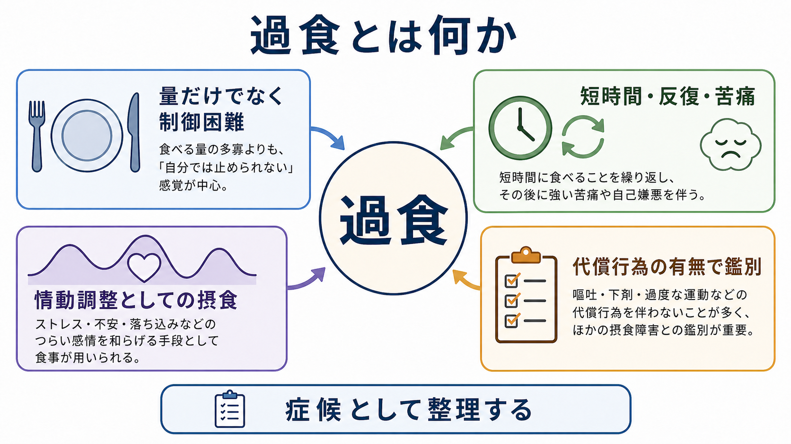
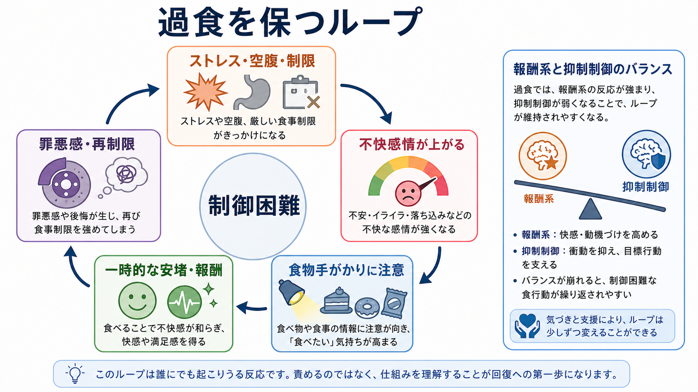
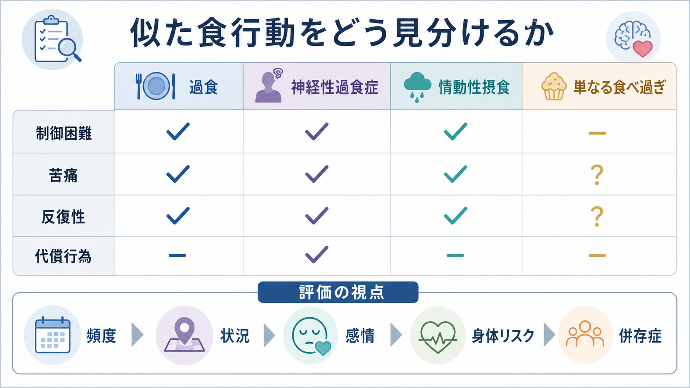

# 過食とは何か

## 要点

- 過食は、単に「多く食べた」という量の問題ではなく、短時間の摂食、制御困難感、反復性、苦痛、代償行為の有無を組み合わせて評価する症候である[1][2]。
- DSM-5/DSM-5-TR の binge-eating disorder では、一定時間内に明らかに多い量を食べることと、その最中の制御困難感が中核であり、苦痛、頻度、代償行為の欠如が診断上重要になる[1][3]。
- ICD-11 では、主観的な制御困難、通常より多いまたは異なる食べ方、強い苦痛、機能障害、神経性過食症のような反復的代償行為がないことが整理されている[2]。
- 過食は、負の感情を一時的に変える情動調整として働くことがあるが、経験サンプリング研究では過食後に負の感情がさらに高まる場合もあり、単純な「食べれば楽になる」モデルでは足りない[4]。
- 神経心理学的には、食物手がかりへの報酬反応、注意の偏り、[[抑制制御とは何か|抑制制御]]、[[実行機能とは何か|実行機能]]、[[情動と認知は分けられるのか|情動と認知]]の相互作用として理解すると見通しがよい[5][6]。
- 本記事は教育・研究目的の整理であり、個別の診断や治療指示ではない。

## この記事で答える問い

1. 過食は、通常の「食べ過ぎ」とどこが違うのか。
2. 過食を症候として見るとき、何を評価すべきか。
3. 情動調整、報酬系、抑制制御はどのように関わるのか。
4. 神経性過食症、情動性摂食、単なる食べ過ぎとはどう区別するのか。
5. 臨床・研究では、過食をどのように扱うと誤解が少ないのか。

## まず結論

過食とは、「たくさん食べた」という出来事名ではなく、「自分では止めにくい摂食エピソードが、苦痛や生活機能への影響を伴って反復する」症候である。量は重要だが、量だけでは足りない。症候学的には、どれくらい食べたかよりも、本人がどの程度制御困難を感じたか、どの状況で起きたか、食後にどのような感情・行動が続いたか、嘔吐・下剤乱用・過度な運動などの代償行為があるかを合わせて見る[1][2]。

したがって、過食を「意志が弱い」「食欲が強い」と説明するのは不十分である。過食は、[[不安とは何か|不安]]、[[抑うつ気分とは何か|抑うつ気分]]、孤立、身体不満、食事制限、睡眠不足、ストレス、食物手がかり、報酬学習、抑制制御の揺らぎが重なって起きることがある。臨床では、責めるよりも、反復する条件を丁寧に記述し、身体リスクと心理社会的背景を同時に評価することが重要である[5][7]。

## 背景

日常語の「過食」は幅が広い。会食で食べ過ぎた、ストレスで甘いものを多く食べた、夜にまとめて食べた、ダイエット後に止まらなくなった、という出来事はいずれも「過食」と呼ばれうる。しかし、精神医学的に問題になるのは、量の多さそのものではなく、制御困難、反復、苦痛、機能障害、身体リスク、他の摂食障害との関係である。

DSM-5 で binge-eating disorder が正式診断として位置づけられたことにより、過食は「神経性過食症の一部」だけではなく、代償行為を伴わない独立した摂食障害としても整理されるようになった[3]。一方で、症候としての過食は、神経性過食症、神経性やせ症の過食・排出型、境界性パーソナリティ症、気分症、不安症、物質使用、睡眠・概日リズムの乱れ、身体疾患や薬剤の影響など、さまざまな文脈で現れうる[1][7]。

この点は、[[精神症候学とは何か|精神症候学]]の基本姿勢と同じである。症候名は、診断名の置き換えではない。過食という言葉を使うときには、「どの診断基準を満たすか」だけでなく、「その人の生活のどの場面で、どの機能を担っているのか」を見る必要がある。

## 基本概念

### 量だけではなく制御困難を見る

DSM 系の基準では、過食エピソードは、限られた時間内に、多くの人が同じ状況で食べる量より明らかに多い量を食べることと、その最中に「止められない」「何をどれだけ食べるか制御できない」という感覚があることから定義される[1]。この「制御困難感」は、本人の主観的体験であるため、外から見た量だけでは判断できない。

たとえば、客観的には大量ではなくても、本人にとって「止められない」感覚が強い場合がある。逆に、宴会やスポーツ後の摂食のように量は多くても、制御困難感や苦痛が乏しい場合もある。症候としての過食を考えるときには、摂食量、時間幅、状況、空腹感、食べる速度、食後感情、秘密性、反復頻度を分けて聞く。

### 苦痛と反復性が臨床的意味をもつ

DSM-5 では、過食エピソードが著しい苦痛を伴い、平均して少なくとも週1回、3か月続くことが診断上の目安になる[1][3]。ICD-11 でも、数か月にわたる頻回反復、強い苦痛、生活機能への影響が重視される[2]。このため、一度の食べ過ぎだけで「過食症」と結論づけるのは誤りである。

一方で、頻度基準を満たさないから問題がないとも言えない。頻度が低くても、糖尿病、脂質異常症、睡眠時無呼吸、胃食道逆流、希死念慮、自己嫌悪、孤立、強い食事制限が重なる場合には、臨床的評価の必要性が高い。[[併存症とは何か|併存症]]と身体リスクを同時に見ることが重要である[7]。

### 代償行為の有無で鑑別する

過食の後に、自己誘発性嘔吐、下剤・利尿薬乱用、絶食、過度な運動などの不適切な代償行為が反復する場合、神経性過食症や神経性やせ症の過食・排出型との鑑別が必要になる[1][2]。一方、binge-eating disorder では、過食エピソードが反復しても、体重増加を防ぐための代償行為が規則的には起こらない[1][2]。

この区別は、診断名を決めるためだけでなく、身体リスクを見落とさないためにも重要である。嘔吐や下剤乱用があれば、電解質異常、脱水、歯牙酸蝕、消化管症状、心血管リスクの評価が必要になる。過食だけを聞いて、代償行為を聞かない評価は不十分である。

## 仕組み

### 情動調整としての摂食

過食は、しばしば負の感情を調整する行動として理解できる。情動調整モデルでは、ストレス、不安、怒り、孤独、恥、抑うつ感などが高まったとき、食べることが注意をそらし、一時的な安堵や快感をもたらすため、過食が学習されると考える[4]。

ただし、このモデルは「過食すると必ず楽になる」という意味ではない。経験サンプリング研究のメタ分析では、過食の前には負の感情が高まりやすい一方、過食後には負の感情がさらに高まる結果も示されている[4]。つまり、過食は短期的には感情を変えるが、罪悪感、自己嫌悪、再制限、孤立を通じて次の過食リスクを高めることがある。

### 報酬系と食物手がかり

過食では、食物そのものの快感だけでなく、食物を見たとき、思い浮かべたとき、手に取りやすい場所にあるときの「手がかり反応」が重要になる。近年のレビューは、binge eating disorder では報酬処理、食物手がかりへの反応、予期的報酬、実際に食べたときの報酬経験が複雑に変化しうることを整理している[5]。

この仕組みは、[[摂食障害は脳の報酬系や身体感覚とどう関わるのか|摂食障害と報酬系・身体感覚]]と接続する。食物手がかりが目立つ環境、強い食事制限、睡眠不足、ストレス、孤独が重なると、「食べたい」という感覚が単なる好みではなく、強い行動誘発性をもつ刺激として働きやすくなる。

### 抑制制御と制御困難

制御困難は、意志の弱さではなく、目標、注意、衝動、報酬予測、情動状態が競合する場面で生じる。過食に関連する研究では、報酬処理と抑制制御の変化が、過食の維持機構や治療標的として注目されている[5]。また、過食・排出型摂食障害では、一般刺激よりも食物・体型関連刺激に対する抑制制御の困難が大きくなる可能性が示されている[6]。

ここで注意すべきなのは、抑制制御の研究結果をそのまま個人の責任論に戻さないことである。抑制制御は、睡眠、空腹、疲労、ストレス、薬剤、環境手がかり、社会的支援によって変動する。したがって、過食の評価では「なぜ我慢できないのか」と詰問するより、「どの条件で制御困難が強まるのか」を記述する方が有用である。

## 図解

| 図 | 読み方 |
|---|---|
| 図1 | 過食を「量」だけでなく、制御困難、短時間・反復・苦痛、情動調整、代償行為の有無から整理する概念地図。 |
| 図2 | ストレス・空腹・制限から不快感情が高まり、食物手がかり、安堵・報酬、罪悪感・再制限を経て再び過食リスクが高まる循環。 |
| 図3 | 過食、神経性過食症、情動性摂食、単なる食べ過ぎを、制御困難、苦痛、反復性、代償行為、評価の視点で見分ける表。 |

## 臨床・研究との接続

### 評価で聞くこと

過食を評価するときは、次のように層を分けると見落としが減る。

| 評価領域 | 確認すること |
|---|---|
| エピソード | いつ、どこで、どれくらいの時間、何を、どれくらい食べたか。 |
| 制御困難 | 食べ始める前、食べている最中、食後に「止められない」感覚がどの程度あったか。 |
| 感情 | 過食の前後に、不安、怒り、孤独、恥、抑うつ、空虚感、安心感がどう変化したか。 |
| 食事制限 | 絶食、極端な糖質制限、食事抜き、厳格なルールが先行していないか。 |
| 代償行為 | 嘔吐、下剤・利尿薬、過度な運動、絶食、体重測定への没頭があるか。 |
| 身体リスク | 体重変化、血圧、糖代謝、脂質、睡眠、消化器症状、月経、薬剤、物質使用。 |
| 併存症 | 気分症、不安症、PTSD、ADHD、物質使用症、強迫症状、自傷・希死念慮。 |

この評価は、[[精神科診断は何のためにあるのか|精神科診断]]のためだけでなく、本人が「自分はだめだ」と全体化している体験を、反復する条件と変えられる要素に分解するためにも役立つ。

### 支援の方向性

NICE ガイドラインでは、成人の binge-eating disorder に対して、過食に焦点化したガイド付きセルフヘルプを提案し、それが不適切または効果不十分な場合に摂食障害焦点化 CBT を提供する流れが示されている[8]。また、CBT-ED では、食事の規則性、過食の手がかり、身体イメージ、再発予防、感情的誘因を扱うことが重視される[8]。

このことは、「体重を減らすこと」だけを治療目標にしないという点でも重要である。NICE は、過食を扱う心理的治療は体重そのものへの効果が限定的であり、体重減少は治療目標そのものではないと説明することを推奨している[8]。過食を症候として扱うときは、[[生物心理社会モデルとは何か|生物心理社会モデル]]に沿って、食行動、感情、身体健康、生活機能、対人関係、スティグマを同時に見る必要がある。

### 研究で扱うときの注意

研究では、客観的過食エピソード、主観的過食エピソード、制御困難を伴う摂食、情動性摂食、夜間摂食、グレージングを混同しないことが重要である。質問紙、食事記録、面接、経験サンプリング、実験室食事課題、神経画像は、それぞれ違う側面を測る。たとえば経験サンプリングは、過食の直前直後の感情変化を捉えやすいが、食事量の客観評価には限界がある[4]。

同様に、神経画像や認知課題で報酬系・抑制制御の差が示されても、それだけで個人診断や治療選択を決められるわけではない。研究知見は、過食を「脳か心理か」の二分法ではなく、食物手がかり、感情、身体感覚、生活環境、学習履歴が相互作用する現象として理解するために使うのが妥当である[5][6]。

## よくある誤解

### 誤解1：過食は意志の弱さである

過食には制御困難が含まれるが、それは人格や努力不足の説明ではない。制御困難は、空腹、制限、情動、報酬予測、食物手がかり、疲労、睡眠、孤立、併存症によって強まる。責めるほど恥や孤立が増え、過食の条件が強まることがある。

### 誤解2：太っている人だけが過食する

過食は体重だけでは判断できない。binge-eating disorder は肥満と関連しやすいが、体重だけで過食の有無や重症度を決めることはできない[7]。標準体重でも過食や代償行為があることはあり、逆に体重が高くても過食がない人もいる。

### 誤解3：代償行為がなければ重くない

代償行為がないことは、神経性過食症との鑑別には役立つが、苦痛や生活機能障害が軽いことを意味しない。過食の反復は、自己嫌悪、社会的回避、抑うつ、不安、身体合併症、睡眠障害と結びつくことがある[3][7]。

### 誤解4：食事制限を強めれば解決する

厳格な食事制限は、短期的には安心感をもたらすことがあるが、空腹、禁止感、失敗感を通じて過食の誘因になることがある。NICE の CBT-ED でも、規則的な食事、過食手がかりの同定、感情的誘因への対処が重視され、治療中の減量努力は過食を誘発しうるものとして注意される[8]。

## 関連ノート

- [[精神症候学とは何か]]
- [[症状と徴候は何が違うのか]]
- [[食欲低下とは何か]]
- [[摂食障害は脳の報酬系や身体感覚とどう関わるのか]]
- [[抑制制御とは何か]]
- [[実行機能とは何か]]
- [[情動と認知は分けられるのか]]
- [[併存症とは何か]]
- [[DSMとICDは何が違うのか]]
- [[生物心理社会モデルとは何か]]

## 関連ノート候補

- 神経性過食症とは何か
- 情動性摂食とは何か
- 食事制限と過食の悪循環とは何か
- 摂食障害の評価面接では何を聞くか
- 体型・体重への過大評価とは何か
- 夜間摂食症候群とは何か

## MOC更新候補

- `content/00_MOC/MOC｜症候学.md`
- `content/00_MOC/MOC｜精神医学.md`
- `content/00_MOC/MOC｜神経科学と精神疾患.md`

並列ジョブとの衝突を避けるため、本記事では MOC 本体は更新していない。

## 理解チェック

1. 過食を「量」だけで評価すると、どのような見落としが起こるか。
2. binge-eating disorder と神経性過食症を区別するとき、代償行為はどのように役立つか。
3. 情動調整モデルは、過食のどの側面を説明し、どの側面では限界があるか。
4. 食物手がかり、報酬系、抑制制御を組み合わせると、過食の制御困難をどう説明できるか。
5. 臨床面接で、本人を責めずに過食の反復条件を把握するには、どの質問が有用か。

## 参考文献

[1] Berkman, N. D., Brownley, K. A., Peat, C. M., et al. (2015). *Management and Outcomes of Binge-Eating Disorder*. Agency for Healthcare Research and Quality. Table 1: DSM-IV and DSM-5 diagnostic criteria for binge-eating disorder. https://www.ncbi.nlm.nih.gov/books/NBK338301/table/introduction.t1/

[2] World Health Organization. (2025). ICD-11 MMS: 6B82 Binge eating disorder. https://icd.who.int/browse/2025-01/mms/en#1673294767

[3] Giel, K. E., Bulik, C. M., Fernandez-Aranda, F., et al. (2022). Binge eating disorder. *Nature Reviews Disease Primers, 8*, 16. https://doi.org/10.1038/s41572-022-00344-y

[4] Haedt-Matt, A. A., & Keel, P. K. (2011). Revisiting the affect regulation model of binge eating: A meta-analysis of studies using ecological momentary assessment. *Psychological Bulletin, 137*(4), 660-681. https://doi.org/10.1037/a0023660

[5] Pasquale, E. K., Boyar, A. M., & Boutelle, K. N. (2024). Reward and inhibitory control as mechanisms and treatment targets for binge eating disorder. *Current Psychiatry Reports, 26*(11), 616-625. https://doi.org/10.1007/s11920-024-01534-z

[6] Wu, M., Hartmann, M., Skunde, M., Herzog, W., & Friederich, H. C. (2013). Inhibitory control in bulimic-type eating disorders: A systematic review and meta-analysis. *PLOS ONE, 8*(12), e83412. https://doi.org/10.1371/journal.pone.0083412

[7] Mars, J. A., Iqbal, A., & Rehman, A. (2024). Binge Eating Disorder. *StatPearls*. NCBI Bookshelf. https://www.ncbi.nlm.nih.gov/sites/books/NBK551700/

[8] National Institute for Health and Care Excellence. (2017, updated 2020). *Eating disorders: recognition and treatment* (NICE guideline NG69), recommendations 1.4. https://www.nice.org.uk/guidance/NG69/chapter/recommendations

## 未解決問題

- 制御困難感を、本人の主観を尊重しながら研究上どのように標準化して測るか。
- 過食、情動性摂食、夜間摂食、グレージングをどこまで連続体として扱えるか。
- 報酬系・抑制制御を標的にした介入が、どのサブグループで有効か。
- 体重スティグマや食文化が、過食の報告、援助希求、治療反応にどのように影響するか。
- デジタル記録や経験サンプリングを、監視感や罪悪感を増やさず臨床支援に使う方法。
