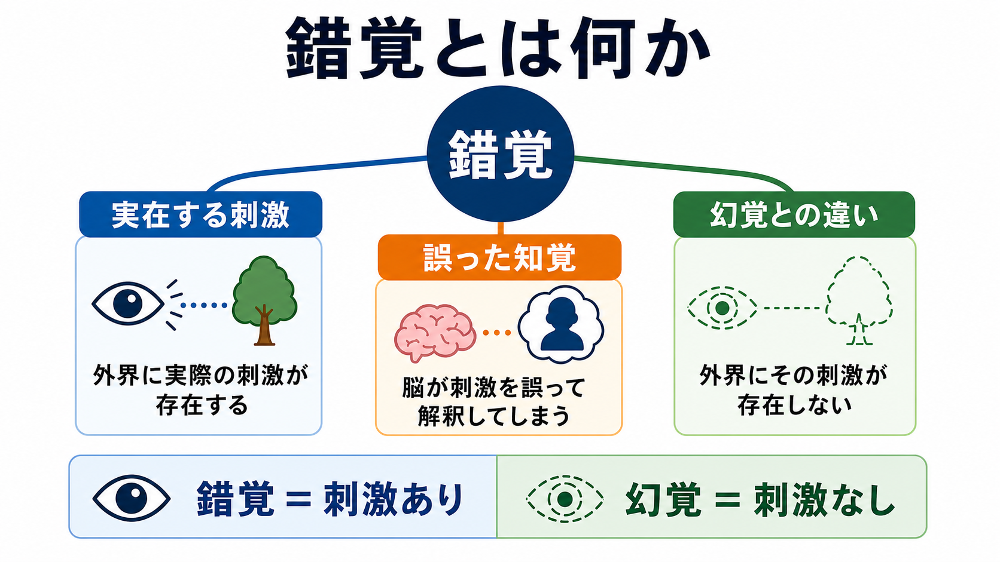
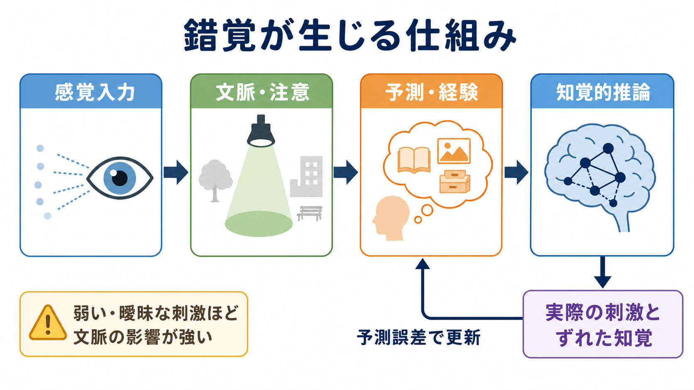
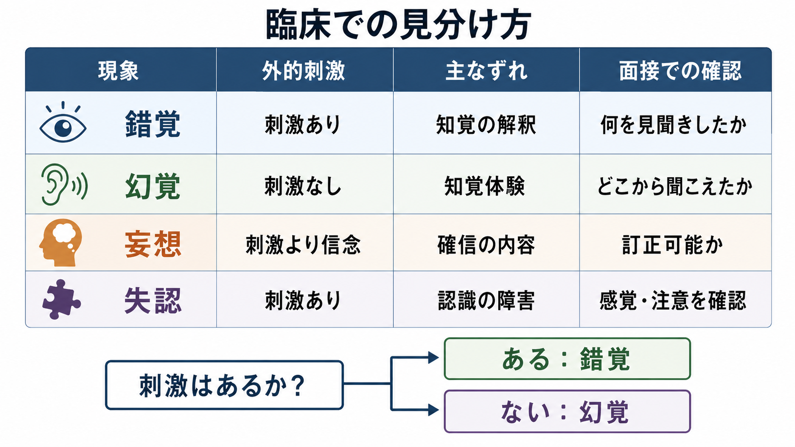

# 錯覚とは何か

## 要点

- 錯覚は、実際に存在する外的刺激を、実際とは異なるものとして知覚する現象である。
- 幻覚との中心的な違いは、錯覚では刺激が「ある」のに対し、幻覚では対応する外的刺激が「ない」点にある[1][2]。
- 錯覚は病的現象に限られず、曖昧な刺激、暗さ、疲労、注意の偏り、期待、文脈によって健常な知覚にも普通に生じる[3][4]。
- 臨床では、錯覚そのものを診断名のように扱うより、「何を刺激として、何として知覚したのか」「訂正可能だったか」「意識障害・せん妄・薬物・神経疾患が背景にないか」を確認する。

## この記事で答える問い

- 錯覚は[[知覚とは何か|知覚]]のどの段階で起こるのか。
- 錯覚と幻覚はどう違うのか。
- 錯覚はなぜ、正常な知覚にも精神医学的評価にも関係するのか。
- [[精神状態診察MSEとは何か|MSE]]では、錯覚をどのように聞けばよいのか。

## まず結論

錯覚とは、「刺激がないのに何かを知覚する」現象ではなく、「刺激はあるが、その意味・形・位置・大きさ・主体感などを誤って知覚する」現象である。たとえば、暗い廊下のコートを人影に見間違える、遠くの物音を自分の名前に聞き違える、水中の棒が曲がって見える、雲や壁の模様が顔に見える、といった体験が典型である。

したがって、錯覚を理解する鍵は「知覚は刺激の写し取りではなく、感覚入力、文脈、注意、過去経験、予測の組み合わせによる推論である」という点にある[3][5]。この推論が、多くの場合は世界を素早く理解する助けになるが、刺激が曖昧なときには誤った知覚として現れる。

## 背景

日常語では「錯覚」は、光学的錯視、思い込み、勘違い、誤解まで広く指すことがある。しかし精神症候学では、錯覚は主に知覚異常の一種として扱われる。ここで重要なのは、錯覚が「外界に刺激が存在する」ことを前提にしている点である[1]。

一方、幻覚は対応する外的刺激なしに生じる知覚体験として定義される[1][2]。この違いは臨床面接で非常に重要である。たとえば「名前を呼ばれた気がした」という訴えでも、実際に雑踏やテレビ音声があったなら錯覚の可能性があり、完全な静寂のなかで明瞭な声として体験されたなら幻覚の評価が必要になる。

ただし、錯覚と幻覚は常に簡単に切り分けられるわけではない。睡眠移行期、せん妄、感覚遮断、強い不安、薬物・身体疾患の影響では、刺激の曖昧さ、注意、覚醒水準が変化し、錯覚様体験と幻覚様体験が連続的に現れることがある。

## 基本概念

### 錯覚・幻覚・妄想・失認の違い

| 現象 | 中心にあるずれ | 外的刺激 | 例 | 評価の焦点 |
|---|---|---:|---|---|
| 錯覚 | 知覚の誤り | ある | 影を人影に見間違える | 何が刺激だったか |
| 幻覚 | 刺激なしの知覚体験 | ない | 誰もいないのに声が聞こえる | 体験の明瞭さ・外在性・確信度 |
| 妄想 | 信念・意味づけの固定化 | 刺激の有無は本質でない | 偶然の出来事を迫害の証拠と確信する | 訂正可能性・確信度 |
| [[失認とは何か|失認]] | 感覚は保たれるが認識できない | ある | 見えている物品を同定できない | 感覚障害・注意障害との鑑別 |

錯覚は「知覚の内容が刺激とずれる」現象であり、妄想のような固定した信念とは異なる。また、失認では視力や聴力などの一次感覚が比較的保たれていても対象認識が障害されるため、単なる見間違いとは評価の焦点が異なる。

### 錯視は錯覚の代表例

視覚領域の錯覚は、しばしば「錯視」と呼ばれる。錯視は、視覚系の欠陥というより、局所的な特徴と全体文脈を統合する脳の仕組みを露出させる実験材料である[4]。線分の長さ、明るさ、運動、輪郭、奥行きが実際と異なって見える現象は、視覚が単なる網膜像の受け取りではなく、文脈に依存した構成過程であることを示す。

## 仕組み

### 1. 感覚入力は不完全で曖昧である

光、音、触覚などの入力は、常にノイズを含み、視点・照明・距離・注意状態によって変化する。脳はこの不完全な入力から「何がそこにあるのか」を推定する必要がある。

### 2. 知覚は過去経験と文脈を使う

Gregory は、知覚を感覚データと過去経験にもとづく「仮説」のように捉えた[3]。たとえば暗がりで縦長の影を人影と見なすのは、危険を素早く検出するうえでは適応的な推論かもしれない。しかし、その推論が外れれば錯覚になる。

### 3. 予測処理として見ると、錯覚は「強い予測」と「曖昧な入力」のずれである

[[予測処理とは何か|予測処理]]の観点では、脳は感覚入力を受け身に読むのではなく、上位の予測と下位の感覚信号の差、すなわち予測誤差を小さくするように知覚を更新すると考えられる[5]。錯覚は、感覚入力が曖昧で、文脈や事前期待が強いときに、予測の側へ知覚が引き寄せられる現象として理解できる。

### 4. 身体感覚の錯覚もある

錯覚は視覚だけに限られない。ラバーハンド錯覚では、見えているゴムの手への触覚刺激と、自分の隠れた手への触覚刺激が同期すると、ゴムの手が自分の手であるかのように感じられる[6]。これは、身体所有感も視覚・触覚・固有感覚の統合によって構成されることを示す。詳しくは[[ラバーハンド錯覚は何を示しているのか]]を参照。

## 図解

### 概念地図

上の図は、錯覚を「実在する刺激」「誤った知覚」「幻覚との違い」の三点から整理したものである。まず刺激の有無を確認し、次にその刺激がどのように解釈されたかを見ると、錯覚と幻覚の混同を減らせる。

### メカニズム図

二枚目の図は、感覚入力、文脈・注意、予測・経験、知覚的推論の流れを示している。ここで大切なのは、錯覚が「脳が壊れたから起こる例外」ではなく、通常の知覚推論が曖昧な条件でずれた結果としても起こる点である。

### 臨床での見分け方

臨床では、錯覚・幻覚・妄想・失認を一問一答で決めつけず、体験の状況を具体化する。[[MSEで知覚異常をどう聞くか]]と接続して、「そのとき周囲に何がありましたか」「暗さや音はありましたか」「あとで見間違いだと思えましたか」「同じ体験が繰り返されますか」と確認する。

## 臨床・研究との接続

錯覚は、それ自体で特定の精神疾患を意味するものではない。疲労、不安、睡眠不足、暗所、感覚低下、強い期待、文化的文脈などでも生じる。したがって、単発の錯覚をただちに病的とみなすのは適切ではない。

一方で、錯覚が頻回で、現実検討が低下し、意識障害や注意障害を伴い、幻覚・妄想・解体した思考などとともに現れる場合は、せん妄、物質・薬剤、神経疾患、精神病性障害などを含めた評価が必要になる[7]。ここでの記述は教育・研究目的であり、個別の診断や治療指示ではない。

研究面では、錯覚は知覚の仕組みを調べる強力な道具である。視覚錯視は、局所的な神経処理、側方抑制、輪郭補完、運動知覚、注意、予測の影響を調べる手がかりになる[4]。また、予測誤差や異常な意味づけの研究は、幻覚や妄想を含む精神病理の計算論的理解とも接続する[8]。

## よくある誤解

### 錯覚はすべて病気のサインである

違う。錯覚は正常な知覚にもよく見られる。錯覚が臨床的に重要になるのは、頻度、苦痛、生活への影響、現実検討、意識水準、薬物・身体疾患、他の精神症状との組み合わせを見たときである。

### 錯覚と幻覚は同じである

違う。錯覚は実在する刺激の誤知覚であり、幻覚は対応する外的刺激なしに生じる知覚体験である[1][2]。ただし、実際の面接では刺激の有無が不明瞭なこともあるため、状況を丁寧に聞く必要がある。

### 錯覚は視覚だけに起こる

違う。聴覚、触覚、身体感覚、自己身体感にも錯覚は起こる。雑音を声に聞き違える、触れられていないのに衣服の動きを虫のように感じる、同期した視触覚刺激によってゴムの手を自分の手のように感じる、といった例がある[6]。

### 錯覚は単なる「間違い」なので研究価値が低い

違う。錯覚は、知覚がどのように世界を構成しているかを示す観察窓である。錯覚がなぜ生じるかを調べることで、通常の知覚、注意、予測、身体所有感、精神病理の連続性を理解しやすくなる。

## 関連ノート

- [[知覚とは何か]]
- [[予測処理とは何か]]
- [[ラバーハンド錯覚は何を示しているのか]]
- [[失認とは何か]]
- [[精神症候学とは何か]]
- [[MSEで知覚異常をどう聞くか]]
- [[幻覚は脳内でどのように生じるのか]]

## MOC更新候補

- `content/00_MOC/` 配下の精神医学・症候学系 MOC
- 認知科学・知覚系 MOC
- 計算論的精神医学・予測処理系 MOC

並列ジョブとの競合を避けるため、この作業では MOC 本体は更新していない。

## 理解チェック

1. 錯覚と幻覚を分ける最初の確認点は何か。
2. 暗がりでコートを人影に見間違える体験は、なぜ錯覚といえるか。
3. 錯覚が病的かどうかを判断するために、頻度以外に何を確認する必要があるか。
4. 予測処理の観点では、曖昧な刺激で錯覚が起こりやすい理由をどう説明できるか。

## 参考文献

[1] Voss RM, Das JM. *Mental Status Examination*. StatPearls. Updated 2023. NCBI Bookshelf. https://www.ncbi.nlm.nih.gov/sites/books/n/statpearls/article-24998/

[2] West LJ, Britannica Editors. *Hallucination*. Encyclopaedia Britannica. Updated 2026-02-13. https://www.britannica.com/science/hallucination

[3] Gregory RL. Knowledge in perception and illusion. *Philosophical Transactions of the Royal Society B*. 1997;352(1358):1121-1127. https://doi.org/10.1098/rstb.1997.0095

[4] Eagleman DM. Visual illusions and neurobiology. *Nature Reviews Neuroscience*. 2001;2:920-926. https://doi.org/10.1038/35104092

[5] Clark A. Whatever next? Predictive brains, situated agents, and the future of cognitive science. *Behavioral and Brain Sciences*. 2013;36(3):181-204. https://doi.org/10.1017/S0140525X12000477

[6] Botvinick M, Cohen J. Rubber hands 'feel' touch that eyes see. *Nature*. 1998;391:756. https://doi.org/10.1038/35784

[7] Arciniegas DB. Psychosis. *Continuum*. 2015;21(3 Behavioral Neurology and Neuropsychiatry):715-736. https://pmc.ncbi.nlm.nih.gov/articles/PMC4455840/

[8] Corlett PR, Honey GD, Fletcher PC. Prediction error, ketamine and psychosis: An updated model. *Journal of Psychopharmacology*. 2016;30(11):1145-1155. https://doi.org/10.1177/0269881116650087

## 未解決問題

- 錯覚、幻覚、妄想を連続的な予測処理の異常としてどこまで統一的に説明できるか。
- 日常的な錯覚と臨床的に問題となる知覚異常を、どの指標で切り分けるのが妥当か。
- 文化、睡眠、感覚障害、加齢、神経疾患が錯覚の頻度と内容にどのように影響するか。
