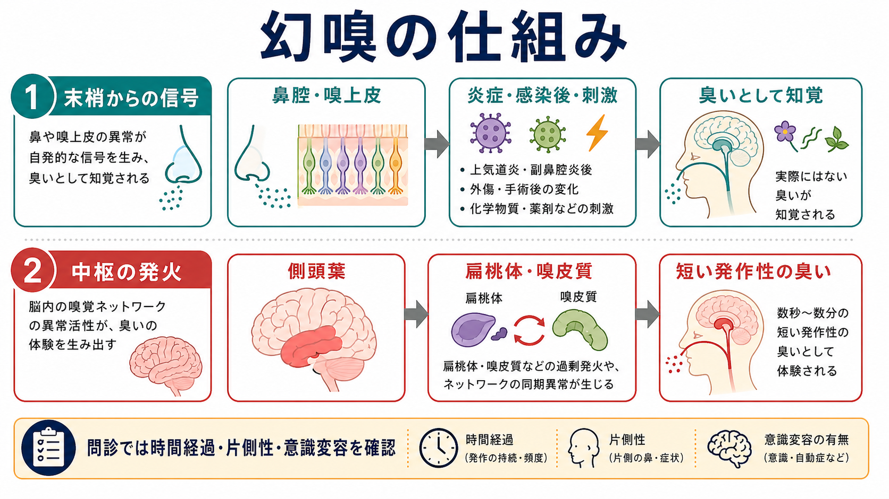
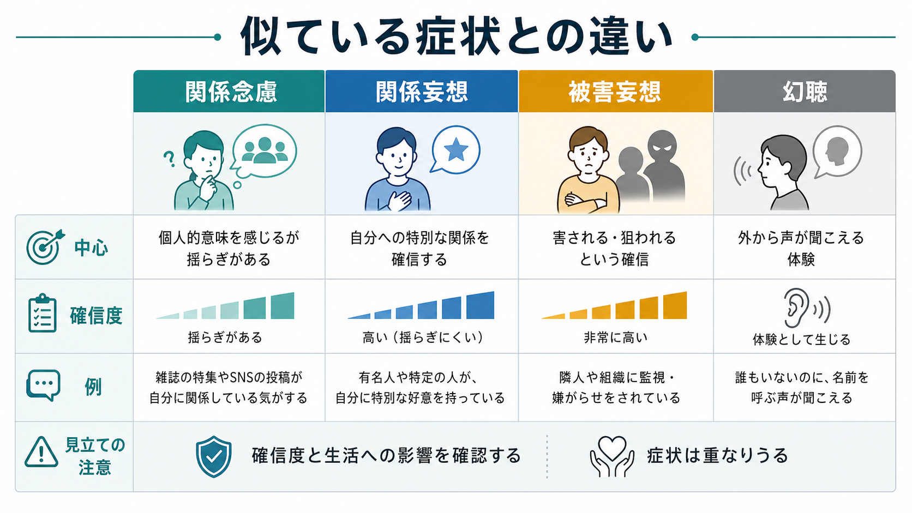
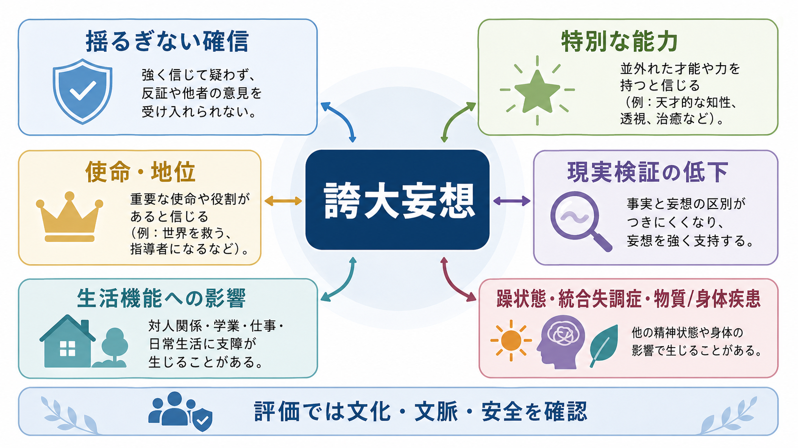

# 関係妄想とは何か

## 要点

- 関係妄想とは、他人の会話、視線、しぐさ、テレビやSNS、偶然の出来事などが「自分に向けられた特別な合図だ」と強く確信される妄想である[1][2]。
- 似た言葉に関係念慮がある。関係念慮では「自分のことかもしれない」という揺らぎが残るが、関係妄想では反証や別解釈が入りにくく、確信度と生活への影響が大きくなる[2][8]。
- 仕組みとしては、偶然の刺激が過剰に重要に感じられる異常サリエンス、自己関連づけ、確証バイアス、回避・確認行動が重なって説明されることが多い[3][4][5]。
- 関係妄想は診断名ではなく症状である。統合失調症スペクトラム、気分障害の精神病症状、物質・薬剤、せん妄、認知症、強いストレスや文化的背景などを含めて[[鑑別診断とは何か|鑑別診断]]する。
- 本稿は教育・研究目的の概説であり、個別の診断や治療指示を行うものではない。

## この記事で答える問い

1. 関係妄想とは、どのような体験を指すのか。
2. 関係念慮、被害妄想、幻聴、単なる気にしすぎとは何が違うのか。
3. なぜ中立的な出来事が「自分への合図」と感じられるのか。
4. [[精神状態診察MSEとは何か|精神状態診察MSE]]や研究では、どのように扱えばよいのか。

## まず結論

関係妄想の中心は、「周囲の出来事」と「自分」とのあいだに、通常は共有されない特別な関係を見いだし、それを強く確信することである。たとえば、通行人の咳払い、同僚の笑い声、ニュースの言葉、SNSの投稿、車のナンバー、店内放送などが「自分を監視している証拠」「自分への暗号」「自分の秘密をほのめかしているメッセージ」と受け取られる。

重要なのは、内容の奇妙さだけで判断しないことである。臨床的には、本人がどれほど確信しているか、別の説明を検討できるか、その信念が不安・怒り・回避・確認行動・対人関係・安全にどう影響しているかを見る[1][8]。関係妄想は[[MSEで思考内容をどう評価するか|MSEで思考内容]]を評価する入口であり、単独で診断名を決めるラベルではない。

## 背景

妄想は一般に、反証があっても変わりにくい強い信念として定義される。StatPearls は、妄想を文化的・宗教的規範から切り離された、反証にもかかわらず持続する固定した誤った信念として整理している[1]。Johns Hopkins Psychiatry Guide も、固定性、虚偽性、個人特有性を妄想の中心特徴として説明し、文化的・宗教的信念を慎重に扱う必要を強調している[8]。

関係妄想は、その主題が「自分への関係づけ」に向かうタイプである。Startup らは、関係妄想を中立的刺激が個人的意味を持つように体験され、非言語的なメッセージとして受け取られ、その内容が自己に関わり、しかもその自己関連的コミュニケーションが信じられる現象として理論化した[2]。つまり、単に「人目が気になる」ことではなく、周囲が自分へ何かを伝えているという意味構造ができる点が特徴である。

## 基本概念

### 関係念慮と関係妄想

関係念慮は、周囲の出来事を自分に結びつけて感じる体験である。疲労、ストレス、不安、孤立、対人緊張が高いときには、誰でも「いま笑われたのではないか」「あの投稿は自分への当てつけではないか」と感じることがある。この段階では、疑い、揺らぎ、別解釈が残る。

関係妄想では、自己関連づけがより固定し、確信度が高くなる。「違うかもしれない」と考えにくくなり、周囲の出来事が次々に証拠として組み込まれる。たとえば、「店員が棚を直した」という出来事が「自分を追い出す合図」に、「テレビの言葉が偶然一致した」ことが「番組が自分を監視している証拠」に変わる。

| 観点 | 関係念慮 | 関係妄想 |
|---|---|---|
| 確信度 | 揺らぎがある | 強い確信がある |
| 反証への反応 | 別解釈を検討できる | 反証が入りにくい |
| 生活への影響 | 一時的な不安に留まることもある | 回避、確認、対人摩擦、受診困難につながることがある |
| 臨床上の扱い | ストレスや不安との関係を見る | 精神病症状、気分症状、物質・身体要因を評価する |

### 被害妄想・幻聴との違い

関係妄想は、しばしば被害妄想と重なる。周囲の合図が「自分を陥れる」「自分を笑っている」「自分を監視している」という内容を持てば、関係妄想は被害的主題を帯びる。ただし、すべての関係妄想が被害妄想というわけではない。宗教的使命、恋愛的意味、誇大的意味、罪業感に関係づけられる場合もある。

幻聴との違いも重要である。幻聴は、外から声が聞こえるように体験される知覚異常である。一方、関係妄想では、実際に存在する視線、しぐさ、音、文章、偶然の一致などに特別な意味が付与される。もちろん両者は併存しうる。たとえば、声が「テレビの暗号を読め」と命じ、その後にテレビ番組を自己関連的に解釈することがある。この場合は、[[MSEで知覚異常をどう聞くか|MSEで知覚異常]]と思考内容の両方を評価する。

## 仕組み

### 異常サリエンス

サリエンスとは、ある刺激が「重要だ」「目立つ」「意味がある」と感じられる度合いである。Kapur は、精神病を異常サリエンスの状態として捉え、通常なら流れていく刺激に過剰な重要性が付与され、それを説明するために妄想的解釈が形成される可能性を論じた[3]。

この見方では、関係妄想は「中立的な出来事に、まず異様な重要感が生じる」ことから始まる。本人にとっては、偶然の咳払い、信号の色、テレビの言葉が、ただの偶然ではなく、何かを告げているように感じられる。その感覚を説明しようとして、「自分への合図だ」という解釈が生まれる。

### 自己関連づけ

関係妄想では、世界の出来事が自己に向かって組織化される。Pankow らの研究は、精神病における異常サリエンスが自己関連処理の変化と関係する可能性を示した[4]。これは、関係妄想を「注意の誤作動」だけでなく、「何が自分に関係するか」を決める処理の問題として見る視点である。

ここで注意したいのは、単一の脳部位や単一の神経伝達物質で説明しきれないことである。異常サリエンス仮説は有用な枠組みだが、臨床では睡眠不足、薬物、孤立、対人不安、抑うつ、トラウマ、文化的文脈、認知機能などが重なる。したがって、本人の体験を「脳の誤作動」とだけ還元せず、生活史と環境の中で理解する必要がある。

### 確証バイアスと確認行動

いったん「周囲が自分に合図している」という仮説が生まれると、その仮説に合う情報が集まりやすくなる。[[認知バイアスとは何か|認知バイアス]]の観点では、確証バイアス、結論への飛躍、反証の軽視、脅威情報への注意偏りが関わりうる。Freeman と Garety は、被害妄想の維持に、心配傾向、自己への否定的信念、対人過敏、睡眠障害、異常体験、推論バイアスが関与しうると整理している[5]。

ただし、関係妄想にどの認知バイアスが必ず関わるかは単純ではない。Menon らは、関係妄想を持つ患者で結論への飛躍バイアスが明確に見られない可能性を報告し、認知バイアスが妄想のサブタイプごとに異なるかもしれないと論じた[6]。この点は、関係妄想を被害妄想の一部としてだけ扱わない理由でもある。

## 図解

上の2枚の図は、関係妄想を「概念地図」と「メカニズムの循環」として整理したものである。3枚目は、似ている症状との違いを比較するための図である。

## 臨床・研究との接続

### MSEでの評価

[[精神科面接とは何か|精神科面接]]では、いきなり「それは妄想です」と断定せず、本人の語りを具体的に聞く。確認したいのは、次のような点である。

- 何が自分に関係していると感じられるのか。
- それは、いつから、どの頻度で、どの場面で起こるのか。
- どれくらい確信しているのか。別の説明を考えられるか。
- その体験に伴う感情は、不安、怒り、恥、恐怖、使命感のどれに近いか。
- 回避、確認、録音、SNS検索、抗議、退職、外出困難などの行動変化があるか。
- 幻聴、被害的確信、気分高揚、抑うつ、睡眠不足、物質使用、身体疾患、せん妄、認知機能低下がないか。

この評価は、[[精神症候学とは何か|精神症候学]]の基本である。症状を正確に記述してから、[[DSMとICDは何が違うのか|DSMとICD]]の診断分類、重症度、安全、支援計画へ接続する。

### 診断分類との関係

ICD-11 CDDR は、妄想を含む精神病症状を統合失調症や妄想性障害などの文脈で扱い、症状の持続、他の精神病症状、気分エピソード、物質・身体疾患による説明可能性を確認する構造を持つ[7]。つまり、関係妄想があるから直ちに特定の診断になるわけではない。

DSM-5-TR でも、妄想の主題として関係妄想、被害妄想、身体妄想、宗教妄想、誇大妄想などが扱われる[8]。しかし診断には、持続期間、他の症状、気分症状との時間関係、物質・薬剤・身体疾患、文化的背景、機能障害を合わせて見る必要がある。

### 支援との接続

関係妄想を持つ人にとって、体験は「考えすぎ」ではなく、現実感を伴う切迫した世界である。支援では、まず安心できる関係を作り、体験を否定的に押し返すよりも、苦痛、睡眠、生活機能、安全、対人関係への影響を共有する。[[心理教育とは何か|心理教育]]では、症状を人格や意志の弱さとして説明せず、ストレス、睡眠、知覚、注意、信念の固定化が相互に影響しうることを扱う。

研究面では、関係妄想は[[社会的認知とは何か|社会的認知]]、自己関連処理、[[予測処理とは何か|予測処理]]、異常サリエンス、推論バイアスを結ぶテーマである。ただし、研究モデルは臨床での個別理解を置き換えるものではない。モデルは「どこを見るか」を助ける地図であり、本人の経験そのものではない。

## よくある誤解

### 「人目が気になる」はすべて関係妄想である

そうではない。人目が気になる体験は、[[不安とは何か|不安]]、社会不安、抑うつ、トラウマ反応、発達特性、実際の対人ストレスでも起こる。関係妄想と呼ぶには、自己関連づけの内容、確信度、反証への反応、生活への影響を確認する必要がある。

### 「奇妙な内容なら妄想で、ありえそうなら妄想ではない」

内容の奇異さだけでは判断できない。たとえば「職場で悪口を言われている」は現実にありうる内容だが、十分な反証にもかかわらず固定し、あらゆる出来事を証拠化し、生活を大きく支配するなら妄想的に扱う必要がある。一方、現実にハラスメントや差別がある場合もあるため、臨床家は事実確認と症状評価を混同しない。

### 「本人に反論すればよくなる」

強い確信を正面から否定すると、孤立や不信を深めることがある。むしろ、体験の意味、苦痛、安全、睡眠、生活への影響、別の説明を少し検討できる余地を丁寧に扱う方が現実的である。これは妄想を肯定することではなく、本人との協働可能性を保つための態度である。

## 関連ノート

- [[精神症候学とは何か]]
- [[MSEで思考内容をどう評価するか]]
- [[精神状態診察MSEとは何か]]
- [[DSMとICDは何が違うのか]]
- [[鑑別診断とは何か]]
- [[認知バイアスとは何か]]
- [[社会的認知とは何か]]
- [[予測処理とは何か]]
- [[不安とは何か]]
- [[侵入思考とは何か]]

## 理解チェック

1. 関係念慮と関係妄想を分けるとき、内容以外にどの軸を見る必要があるか。
2. 関係妄想と幻聴は、どの点で異なり、どのように併存しうるか。
3. 異常サリエンス仮説は、関係妄想のどの部分を説明しやすいか。
4. MSEで関係妄想を聞くとき、なぜ診断名より先に確信度、苦痛、行動化、安全を見るべきなのか。

## MOC更新候補

- `content/00_MOC/MOC｜精神医学.md`
- `content/00_MOC/MOC｜認知科学・心理学.md`
- `content/00_MOC/MOC｜計算論的精神医学.md`

## 未解決問題

- 関係妄想と被害妄想はどの程度独立した症状次元として扱うべきか。
- 異常サリエンス、自己関連処理、推論バイアスのどれが、発症、維持、回復の各段階で最も重要なのか。
- 文化的文脈やSNS環境は、関係妄想の内容と持続にどのように影響するのか。

## 参考文献

[1] Fariba, K. A., & Fawzy, F. (2022). *Delusions*. StatPearls. NCBI Bookshelf. https://www.ncbi.nlm.nih.gov/books/NBK563175/

[2] Startup, M., Bucci, S., & Langdon, R. (2009). Delusions of reference: a new theoretical model. *Cognitive Neuropsychiatry*, 14(2), 110-126. https://doi.org/10.1080/13546800902864229

[3] Kapur, S. (2003). Psychosis as a state of aberrant salience: a framework linking biology, phenomenology, and pharmacology in schizophrenia. *American Journal of Psychiatry*, 160(1), 13-23. https://doi.org/10.1176/appi.ajp.160.1.13

[4] Pankow, A., Katthagen, T., Diner, S., Deserno, L., Boehme, R., Kathmann, N., Gleich, T., Gaebler, M., Walter, H., Heinz, A., & Schlagenhauf, F. (2016). Aberrant salience is related to dysfunctional self-referential processing in psychosis. *Schizophrenia Bulletin*, 42(1), 67-76. https://doi.org/10.1093/schbul/sbv098

[5] Freeman, D., & Garety, P. (2014). Advances in understanding and treating persecutory delusions: a review. *Social Psychiatry and Psychiatric Epidemiology*, 49, 1179-1189. https://doi.org/10.1007/s00127-014-0928-7

[6] Menon, M., Addington, J., & Remington, G. (2013). Examining cognitive biases in patients with delusions of reference. *European Psychiatry*, 28(2), 71-73. https://doi.org/10.1016/j.eurpsy.2011.03.005

[7] World Health Organization. (2024). *Clinical descriptions and diagnostic requirements for ICD-11 mental, behavioural and neurodevelopmental disorders*. https://iris.who.int/bitstream/handle/10665/375767/9789240077263-eng.pdf

[8] Chen-MacLean, A., Barta, P., & Rivkin, P. (2025). *Delusions*. Johns Hopkins Psychiatry Guide. https://www.hopkinsguides.com/hopkins/view/Johns_Hopkins_Psychiatry_Guide/787024/all/Delusions
