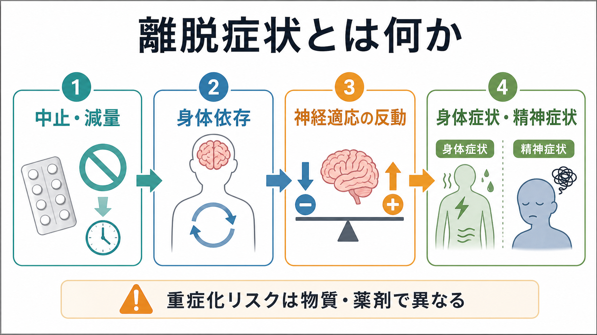
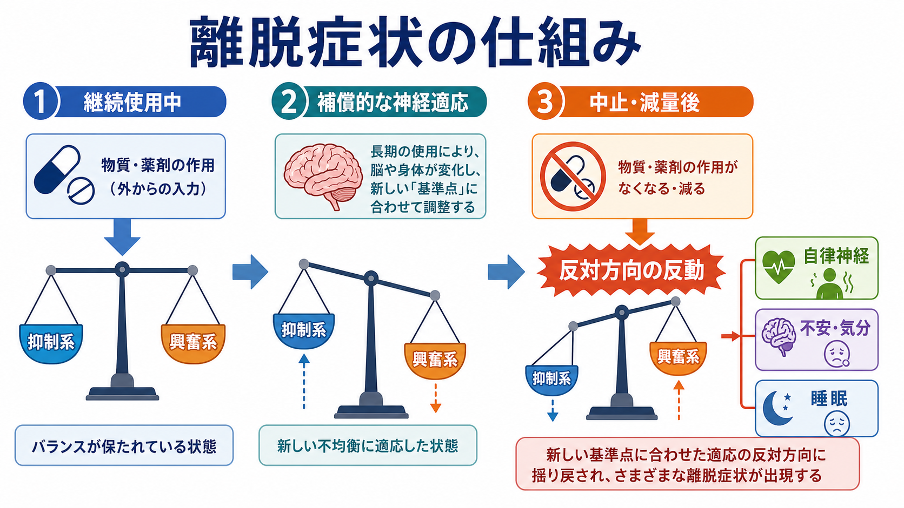

# 離脱症状とは何か

## 要点

- 離脱症状とは、物質や薬剤を継続的に使用したあと、中止・急な減量・血中濃度低下が起きたときに出現する身体症状・精神症状のまとまりである。
- 中核には、身体が物質・薬剤の存在を前提に調整されたあと、それが急に失われることで起こる「反対方向の反動」がある。
- アルコール、ベンゾジアゼピンなどの鎮静薬、オピオイド、ニコチン、カフェイン、抗うつ薬などで問題になるが、時間経過・重症度・危険性は大きく異なる。
- 「離脱症状がある」ことは「依存症である」ことと同じではない。身体依存、耐性、渇望、コントロール困難、生活上の障害は区別して評価する必要がある。
- 意識障害、けいれん、著しい自律神経症状、幻覚、強い希死念慮、重い脱水や身体疾患の悪化が疑われる場合は、単なる不快な反応ではなく医療的評価が必要になる。

## この記事で答える問い

この記事では、離脱症状を、単なる「薬や物質をやめたときのつらさ」ではなく、身体依存、神経適応、症状パターン、鑑別診断、臨床研究の評価対象として整理する。主な問いは次の4つである。

1. 離脱症状は、どのような条件で起こるのか。
2. なぜ中止・減量後に、身体症状と精神症状が同時に出るのか。
3. アルコール、鎮静薬、オピオイド、抗うつ薬中止症状では何が違うのか。
4. 再発、不安、睡眠障害、せん妄、薬剤性精神症状とどう見分けるのか。

## まず結論

離脱症状は、ある物質や薬剤が体内にある状態に脳と身体が慣れたあと、その入力が急に減ることで、調整された神経・自律神経・内分泌・睡眠覚醒系が一時的に不安定になる現象である。診断分類や臨床ガイドラインでは、原因物質の中止・減量と時間的に関連し、臨床的に意味のある苦痛や機能障害をもたらす症状群として扱われる[1][2]。

ただし、離脱症状は一枚岩ではない。アルコール離脱やベンゾジアゼピン離脱では、けいれんや[[せん妄とは何か|せん妄]]を伴うことがあり、重症化すると生命に関わることがある[3][4]。一方、オピオイド離脱は強い苦痛を伴うが、典型的にはアルコール離脱ほど致死的ではないとされる。ただし脱水、併存疾患、再使用時の過量リスクは重要である[5]。抗うつ薬中止症状は、めまい、しびれ様感覚、不眠、悪心、不安などが問題になり、うつ病や不安症状の再発との鑑別が難しい[6]。

## 背景

精神医学では、離脱症状はアルコール使用障害、オピオイド使用障害、鎮静薬使用障害などの物質関連障害だけでなく、処方薬の中止・切替・飲み忘れでも問題になる。したがって、離脱症状は「物質使用の問題」だけではなく、[[薬剤性精神症状とは何か|薬剤性精神症状]]、アドヒアランス、処方変更、身体疾患、救急医療とも接続する。

臨床で重要なのは、原因を単純化しないことである。たとえば、不眠、不安、発汗、動悸、ふるえは離脱でも起こるが、[[不安とは何か|不安]]、[[不眠とは何か|不眠]]、甲状腺機能異常、感染症、疼痛、低血糖、パニック発作、薬物相互作用でも起こる。離脱症状を疑うには、「何を」「どのくらい」「いつから」「どのように減らしたか」と、症状の時間経過を並べて見る必要がある。

## 基本概念

### 離脱症状

離脱症状とは、継続使用により身体が適応した物質・薬剤を中止、減量、または血中濃度低下させたあとに現れる症状群である。症状は、原因物質の薬理作用の「反対方向」に出やすい。鎮静作用をもつ物質の離脱では、不眠、焦燥、ふるえ、発汗、けいれんなどが目立ちやすい。オピオイド離脱では、疼痛、鼻汁、流涙、下痢、悪心、鳥肌、筋肉痛、不安、不眠などが典型的である[5]。

### 身体依存

身体依存は、物質・薬剤がある状態に身体機能が適応し、中止・減量で離脱症状が出うる状態を指す。これは、医療上適切に処方された薬剤でも起こりうる。身体依存があることは、ただちに依存症、乱用、人格の問題を意味しない。依存症では、渇望、コントロール困難、害があっても使用が続くこと、生活上の障害などを含めて評価する[1][7]。

### 耐性

耐性は、同じ効果を得るためにより多い量が必要になる、または同じ量で効果が弱くなる現象である。耐性と離脱症状はしばしば一緒にみられるが、同じ概念ではない。耐性は「使用中の効果の変化」、離脱症状は「中止・減量後の反応」である。

### 反跳と再発

反跳は、中止・減量後に薬理作用と反対方向の症状が一時的に強まる現象である。たとえば睡眠薬を急にやめたあとに眠れなくなることがある。一方、再発はもともとの疾患や症状が戻ることである。抗うつ薬中止症状では、離脱と再発の区別が特に重要で、症状の始まり方、身体症状の有無、再開または漸減での変化、時間経過を総合して判断する[6]。

## 仕組み

離脱症状の基本モデルは、ホメオスタシスとアロスタシスで理解できる。ホメオスタシスは、体内状態を一定範囲に保つ働きである。アロスタシスは、慢性的な負荷に対して、身体が新しい作動水準に移ることで安定を保とうとする仕組みである。依存や離脱の研究では、慢性的な物質曝露によって報酬系、ストレス系、抑制・興奮バランスが変化し、物質がない状態が不快・不安定に感じられるようになると説明される[7][8]。

### 抑制系と興奮系のバランス

アルコールやベンゾジアゼピンなどは、GABA系を含む抑制性の働きと関係する。長期使用では、脳はその抑制入力を前提にバランスを取り直す。そのため急に入力が減ると、相対的に興奮が過剰になり、ふるえ、不眠、焦燥、発汗、頻脈、血圧上昇、けいれん、せん妄が出やすくなる[3][4]。この説明は、[[GABAは脳で何をしているのか]]や[[ノルアドレナリンは覚醒とストレスにどう関わるのか]]と接続して理解できる。

### 報酬系と負の強化

依存研究では、物質使用が快感だけで維持されるわけではなく、離脱による不快感を避けるために使用が続く「負の強化」が重要とされる。慢性的な使用では、報酬系の感受性低下とストレス系の亢進が組み合わさり、物質がない状態が不安、焦燥、抑うつ、身体不快感として経験されやすくなる[7][8]。これは[[ドパミンは報酬だけの物質なのか]]と関連する。

### 時間経過は物質ごとに違う

離脱症状の始まりは、半減期、使用期間、使用量、身体疾患、併用薬、年齢、肝腎機能、睡眠、栄養状態などで変わる。一般に、短時間作用型の物質・薬剤では早く出やすく、長時間作用型では遅れて出ることがある。ただし、ここから個別の中止方法を決めることはできない。離脱の評価では、薬理学的な時間経過と、その人の身体状態を合わせて見る必要がある。

## 図解

上の図は、離脱症状を「何を使っていたか」「いつ減らしたか」「どんな症状か」「重症サインがあるか」という順で見るための整理である。表に示した時間経過は一般的な目安であり、個人差が大きい。とくにアルコール・鎮静薬、複数物質使用、高齢者、妊娠、重い身体疾患、過去のけいれんやせん妄がある場合には、重症化リスクを低く見積もらないことが重要である[3][4]。

## 臨床・研究との接続

### 臨床評価

臨床では、離脱症状を疑った時点で、少なくとも次の点を整理する。

- 原因候補: アルコール、ベンゾジアゼピン、睡眠薬、オピオイド、抗うつ薬、ニコチン、カフェイン、その他の処方薬・市販薬・違法薬物。
- 時間関係: 最後の使用、中止、減量、飲み忘れ、処方切替、入院や環境変化。
- 症状: 身体症状、精神症状、睡眠、意識、幻覚、けいれん、食事・水分摂取。
- リスク: 既往歴、併存疾患、妊娠、高齢、肝腎機能、併用薬、過去の重症離脱。
- 鑑別: 感染症、代謝異常、頭部外傷、てんかん、内分泌疾患、薬剤相互作用、原疾患の再発。

アルコール離脱では、重症度評価、けいれんやせん妄の予防、身体合併症の確認が重要である。ASAMのアルコール離脱管理ガイドラインは、評価、治療環境の選択、重症化リスクの把握を体系化している[3]。ベンゾジアゼピンでは、急な中止で重い離脱が起こりうるため、近年の共同ガイドラインでも、患者の状態に合わせた慎重な漸減とモニタリングが重視されている[4]。

### 研究評価

研究では、離脱症状は、症状尺度、時間経過、再使用リスク、治療継続、機能障害、生活の質と結びつけて評価される。抗うつ薬中止症状については、プラセボ群にも中止様症状が一定割合でみられること、薬剤間でリスクが異なること、症状の期待や再発との区別が研究上の課題であることが報告されている[6]。したがって、離脱症状の研究では、薬理作用だけでなく、期待、文脈、診断、観察期間、測定尺度を含めた設計が重要になる。

### 教育・支援

離脱症状の説明では、「気のせい」「意思が弱い」「薬物依存者の問題」といった道徳的解釈を避ける必要がある。離脱症状は、神経適応と身体反応として説明できる。一方で、症状がつらいからといって自己判断で増量・再開・急な中止を繰り返すと、症状評価が難しくなり、危険が増す場合がある。教育的には、症状を記録し、使用歴と時間経過を整理し、必要に応じて医療者と共有するという方向づけが有用である。

## よくある誤解

### 「離脱症状があるなら依存症である」

これは誤りである。身体依存は、医療上必要な薬剤でも起こりうる。依存症の評価では、渇望、使用制御の困難、害があっても使用が続くこと、生活機能の障害などを含めて判断する[1][7]。

### 「離脱症状は我慢すればよい」

軽い不快感で自然に軽快する場合もあるが、物質・薬剤によっては危険である。アルコールや鎮静薬では、けいれん、せん妄、自律神経不安定が問題になりうる[3][4]。強い症状や重症サインがある場合、我慢の問題として扱わない。

### 「離脱症状と再発はすぐ区別できる」

実際には難しい。抗うつ薬中止症状では、めまい、しびれ、悪心、不眠などの身体症状が手がかりになることがあるが、不安や抑うつが目立つ場合は再発との区別が簡単ではない[6]。時間経過、症状の質、もともとの症状との違い、処方変更との関係を丁寧に見る。

### 「短期間なら離脱は起こらない」

短期間ではリスクが低いことも多いが、薬剤、用量、個人差、併用薬、身体状態によって変わる。とくに高齢者、肝腎機能障害、複数薬剤、過去の離脱歴がある場合には、期間だけで判断しない。

## 関連ノート

- [[薬剤性精神症状とは何か]]
- [[せん妄とは何か]]
- [[不安とは何か]]
- [[不眠とは何か]]
- [[睡眠障害とは何か]]
- [[GABAは脳で何をしているのか]]
- [[ドパミンは報酬だけの物質なのか]]
- [[ノルアドレナリンは覚醒とストレスにどう関わるのか]]

## 関連ノート候補

- アルコール離脱とは何か
- 離脱性精神障害とは何か
- アルコール使用障害とは何か
- オピオイド使用障害とは何か
- 鎮静薬使用障害とは何か
- ストレス回路は脳ネットワークをどう変えるのか

## 理解チェック

1. 離脱症状、身体依存、耐性、依存症はそれぞれ何が違うか。
2. 鎮静薬やアルコールの離脱で、なぜ不眠・ふるえ・けいれん・せん妄が問題になるのか。
3. 抗うつ薬中止症状と原疾患の再発を見分けるとき、どのような時間経過と症状の質を見るべきか。
4. 離脱症状を「意思の弱さ」と説明すると、臨床的にどのような害が生じるか。

## MOC更新候補

- `content/00_MOC/MOC・精神医学.md` がある場合、症候学または物質関連障害の項目に本記事を追加する候補。
- `content/00_MOC/MOC・薬物療法.md` または類似MOCがある場合、薬剤中止・減量時の症状評価として追加する候補。
- 並列作業との競合を避けるため、本ジョブではMOC本体は更新しない。

## 未解決問題

- 離脱症状の発生率は、薬剤、対象集団、観察期間、測定尺度、期待効果の扱いによって大きく変わる。
- 抗うつ薬中止症状では、離脱、再発、ノセボ反応、背景症状の変動をどのように分離して測定するかが研究課題である。
- 依存症治療では、離脱症状の軽減だけでなく、再使用リスク、生活機能、併存精神疾患、社会的支援を統合して評価する必要がある。

## 参考文献

[1] Kosten TR, O'Connor PG. Management of Drug and Alcohol Withdrawal. *New England Journal of Medicine*. 2003;348(18):1786-1795. https://doi.org/10.1056/NEJMra020617

[2] World Health Organization. *Clinical Guidelines for Withdrawal Management and Treatment of Drug Dependence in Closed Settings*. 2009. https://www.ncbi.nlm.nih.gov/books/NBK310652/

[3] The American Society of Addiction Medicine. *The ASAM Clinical Practice Guideline on Alcohol Withdrawal Management*. 2020. https://www.asam.org/quality-care/clinical-guidelines/alcohol-withdrawal-management-guideline

[4] ASAM and partner societies. *Joint Clinical Practice Guideline on Benzodiazepine Tapering*. 2025. https://www.asam.org/quality-care/clinical-guidelines/benzodiazepine-tapering

[5] Shah M, Huecker MR. Opioid Withdrawal. *StatPearls*. Updated 2024. https://www.ncbi.nlm.nih.gov/books/NBK526012/

[6] Henssler J, Heinz A, Brandt L, Bschor T. Antidepressant withdrawal and rebound phenomena. *Deutsches Ärzteblatt International*. 2019;116:355-361. https://doi.org/10.3238/arztebl.2019.0355

[7] Koob GF, Volkow ND. Neurobiology of addiction: a neurocircuitry analysis. *The Lancet Psychiatry*. 2016;3(8):760-773. https://doi.org/10.1016/S2215-0366(16)00104-8

[8] Koob GF, Le Moal M. Drug Addiction, Dysregulation of Reward, and Allostasis. *Neuropsychopharmacology*. 2001;24(2):97-129. https://doi.org/10.1016/S0893-133X(00)00195-0
