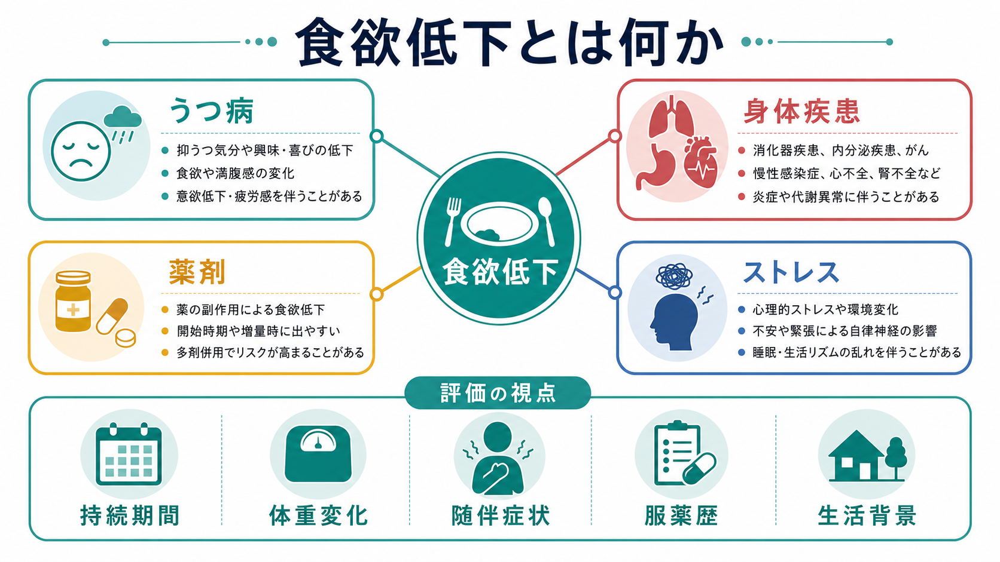
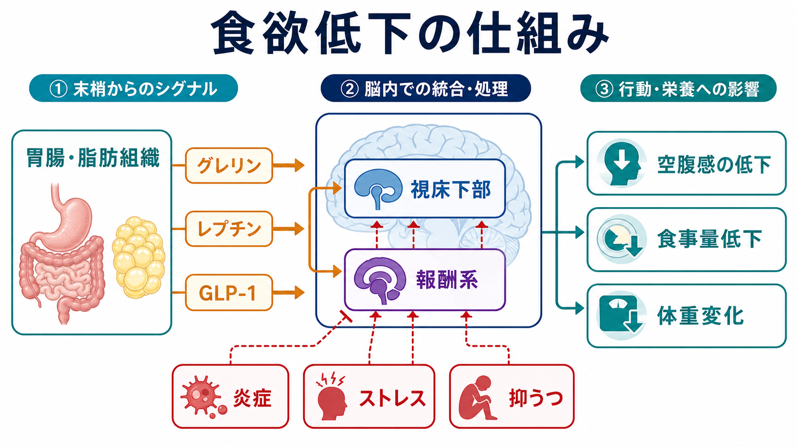
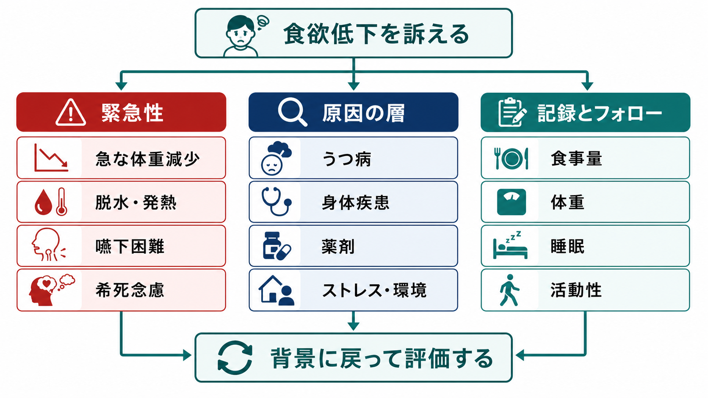

# 食欲低下とは何か

## 要点

- 食欲低下とは、空腹感や「食べたい」という動機づけが弱まり、食事量・食事への関心・体重・日常機能に変化が出る状態である。医学的には anorexia と呼ばれることがあるが、[[摂食障害は脳の報酬系や身体感覚とどう関わるのか|神経性やせ症]]とは同じ意味ではない[1]。
- 評価では、単に「食べない」と見るのではなく、うつ病、身体疾患、薬剤、ストレス・生活環境、嚥下や口腔、社会的孤立などを層に分けて考える[1][2]。
- うつ病では、食欲低下も食欲増加も起こりうる。食欲変化は診断基準上も重要だが、方向や背景は人によって異なる[3][4]。
- 急な体重減少、脱水、発熱、嚥下困難、強い疼痛、意識変容、[[希死念慮とは何か|希死念慮]]を伴う場合は、単なる気分の問題として扱わず、身体面と安全面を優先して評価する。
- 本記事は教育・研究目的の整理であり、個別の診断や治療指示ではない。

## この記事で答える問い

1. 食欲低下は、症状として何を意味するのか。
2. うつ病、身体疾患、薬剤、ストレスは、どのように食欲低下へつながるのか。
3. 食欲低下を評価するとき、どの情報を分けて確認すべきか。
4. 「食欲がない」と「食べることを避ける」は、どのように違うのか。

## まず結論

食欲低下は、胃腸だけの問題でも、意思の弱さでもない。食欲は、胃腸・脂肪組織からのホルモン信号、視床下部によるエネルギー調節、報酬系による「食べたい」感覚、炎症、ストレス反応、睡眠、薬剤、社会環境が重なって生じる調節過程である[5][6]。

したがって臨床的には、「どの病名か」を急いで当てるよりも、次の5つを同時に見るほうが実用的である。

| 視点 | 確認すること |
|---|---|
| 時間経過 | 急性か慢性か。いつから、何の後に始まったか。 |
| 量的変化 | 食事量、体重、脱水、筋力、活動性の変化。 |
| 随伴症状 | 発熱、疼痛、悪心、便通、嚥下、睡眠、疲労、抑うつ、不安。 |
| 原因の層 | うつ病、身体疾患、薬剤、ストレス、生活環境、口腔・嚥下。 |
| リスク | 急な体重減少、悪液質、安全性、希死念慮、セルフケア低下。 |

## 背景

食欲低下は、日常語では「食欲がない」「食べる気がしない」「少し食べると満腹になる」「食べ物がおいしくない」と表現される。医療面接では、この言葉をそのまま病名にせず、空腹感、満腹感、味覚・嗅覚、悪心、腹部症状、疲労、気分、生活環境に分解する必要がある。

Merck Manual は、食欲低下を「空腹がなく、食べたい欲求がない状態」と整理し、急性疾患では一時的に起こりやすく、慢性的な食欲低下ではがん、慢性肺疾患、心不全、腎不全、肝不全、AIDS、脳の食欲調節に関わる病変、薬剤などを考える必要があると説明している[1]。これは、精神症状としての食欲低下を軽視してよいという意味ではない。むしろ、[[症状と徴候は何が違うのか|症状と徴候]]の両方から、精神医学と身体医学をまたいで評価する必要がある。

高齢者の意図しない体重減少では、悪性腫瘍だけでなく、非悪性の身体疾患、薬剤、多剤併用、味覚変化、悪心、社会的孤立、経済的制約も重要な原因になる[2]。食欲低下は、本人の主観的な訴えであると同時に、体重、栄養、筋力、活動性、セルフケアの変化として観察される症候でもある。

## 基本概念

### 食欲低下と神経性やせ症は同じではない

「anorexia」という語は、医学的には食欲低下を指すことがある。一方で anorexia nervosa、すなわち神経性やせ症では、空腹が残っていても体重増加への恐怖や身体像の歪みによって食事を制限することがある[1]。つまり、食欲低下では「食べたい感覚が弱い」のに対し、神経性やせ症では「食べたい感覚」と「食べてはいけないという制御」が分離している場合がある。

この区別は臨床上重要である。食欲がないのか、食べると気持ち悪いのか、太ることが怖いのか、嚥下が難しいのか、食事を用意できないのか、食卓に出ることがつらいのかで、評価すべき背景は大きく変わる。

### うつ病に伴う食欲低下

うつ病では、[[抑うつ気分とは何か|抑うつ気分]]や興味・喜びの低下だけでなく、睡眠、疲労、精神運動、罪責感、集中困難、希死念慮、食欲・体重変化がまとまって現れる。NICE の成人うつ病ガイドラインは、DSM-5 の主要症状の一つとして、1か月で5%を超える意図しない体重減少または体重増加、食欲の低下または増加を挙げている[3]。

ただし、食欲低下があるからうつ病、食欲低下がないからうつ病ではない、と単純には言えない。うつ病では食欲低下型と食欲増加型があり、研究ではそれぞれ報酬系、内受容感覚、コルチゾール、炎症・代謝指標との関係が異なる可能性が示されている[4]。この点は、[[報酬系の異常はうつ病をどう説明するのか]]や[[炎症仮説はうつ病をどう説明するのか]]と接続できる。

### 身体疾患に伴う食欲低下

身体疾患では、急性感染、発熱、疼痛、消化器疾患、内分泌疾患、心不全、腎不全、肝不全、慢性肺疾患、がんなどが食欲低下を起こしうる[1][2]。たとえばがん悪液質では、単なる摂取不足だけでなく、炎症や代謝異常による筋肉量低下が関わる。国際コンセンサスは、がん悪液質を「通常の栄養補給だけでは完全には戻せない骨格筋量の持続的喪失を伴い、機能障害へ進む多因子性症候群」と定義している[7]。

したがって、体重が減っている人に「もっと食べましょう」と言うだけでは不十分な場合がある。食欲、摂取量、体重、筋力、炎症、基礎疾患、治療副作用、心理的苦痛をまとめて見る必要がある。

### 薬剤に伴う食欲低下

薬剤は、悪心、味覚変化、口渇、便秘、眠気、胃排出の変化、倦怠感などを通じて食欲低下を起こしうる。Merck Manual は、食欲低下の原因薬剤の例として digoxin、fluoxetine、quinidine、hydralazine を挙げている[1]。また、高齢者の意図しない体重減少では、薬剤とサプリメントの確認、多剤併用、味覚や悪心への影響を見落とさないことが推奨される[2]。

ここで重要なのは、「薬剤名だけ」を見るのではなく、開始時期、増量時期、服薬アドヒアランス、腎機能・肝機能、薬剤相互作用、食前食後の症状、眠気や活動性低下を時系列で確認することである。[[薬剤性精神症状とは何か]]と同じく、薬剤性の食欲低下も時間関係と代替説明を整理して考える。

### ストレスと生活環境

ストレスは食欲を一方向に変えるわけではない。急性ストレスでは交感神経系やHPA軸の反応により、食事や消化よりも危機対応が優先され、食欲が下がることがある。一方で慢性ストレスでは、エネルギー密度の高い食物を求める、いわゆるストレス食いが起こることもある[8]。そのため、ストレスを食欲低下の原因として扱うときは、「ストレスがあるか」だけでなく、「食事を抜く方向に出るのか、過食方向に出るのか」「睡眠、生活リズム、対人関係、経済状況、孤立がどう変わったか」を聞く必要がある。

この視点は、[[ストレス脆弱性モデルとは何か]]や[[HPA軸は精神疾患にどう関わるのか]]とつながる。食欲低下は、ストレスが身体化したサインである場合も、身体疾患がストレスとして体験されている場合もある。

## 仕組み

食欲は、単一の「食欲中枢」だけで決まるわけではない。少なくとも次の3層を分けて考えると理解しやすい。

### 1. 末梢からの信号

胃、腸、脂肪組織、膵臓などは、栄養状態を脳へ知らせる。グレリンは空腹時に胃から分泌され、視床下部の受容体などを介して摂食を促す方向に働く[5]。一方、レプチン、CCK、GLP-1、PYY などは、満腹感や胃排出、血糖調節、食事量に関わる[6]。GLP-1 は視床下部や迷走神経求心路を介して満腹感に関わり、胃排出を遅らせる作用も持つ[6]。

### 2. 脳内での統合

視床下部はエネルギー恒常性に関わり、報酬系は「食べたい」「おいしそう」という快感価値に関わる。抑うつでは、食物刺激への報酬系反応や内受容感覚の処理が変化し、食欲低下型では食物への動機づけが弱まることがある[4]。この点は、[[感情は身体感覚の予測なのか]]や[[身体と感情はどのようにつながるのか]]とも関係する。

### 3. 炎症・ストレス・睡眠の調整

炎症や慢性疾患では、サイトカイン、倦怠感、疼痛、味覚変化、代謝異常が食欲低下を支えることがある。がん悪液質のように、摂取不足だけでなく異化亢進が関わる場合、食欲低下は栄養不足の「原因」であると同時に、全身性疾患過程の「結果」でもある[7]。

ストレスや睡眠障害も食欲を変える。急性ストレスでは食欲が下がることがあり、慢性ストレスでは過食や嗜好性の高い食物への偏りが起こることもある[8]。したがって、「ストレスがあるから食欲低下」と直線的に考えるのではなく、どの時間軸で、どの食行動が、どの身体感覚と結びついているかを見る必要がある。

## 図解

以下の図は、食欲低下を評価するときの実用的な流れをまとめたものである。医療判断の代替ではなく、面接で見落としやすい層を整理するための地図として読む。

| 評価する層 | 具体的に聞くこと | 意味 |
|---|---|---|
| 食欲の質 | 空腹がない、早期満腹、味がしない、悪心、食事が怖い | 食欲低下、消化器症状、摂食回避を分ける |
| 体重・栄養 | 体重、衣服の緩み、筋力、脱水、食事量 | 客観的な重症度を把握する |
| 気分・意欲 | 抑うつ、興味低下、疲労、罪責感、希死念慮 | うつ病や安全性評価につなげる |
| 身体疾患 | 発熱、疼痛、便通、嚥下、口腔、内分泌、心肺腎肝 | 身体疾患を見落とさない |
| 薬剤 | 開始・増量・中止時期、相互作用、サプリメント | 薬剤性変化を時系列で見る |
| 生活環境 | 孤立、経済、調理能力、介護、食卓のストレス | 食べられない条件を把握する |

## 臨床・研究との接続

### 臨床評価では「原因の単一化」を避ける

食欲低下は、精神症状、身体症状、薬剤副作用、社会的困難が重なって出る。たとえば高齢者では、うつ病、がん、心疾患、消化器疾患、薬剤、認知機能低下、口腔問題、孤立が同時に関わることがある[2]。この場合、「うつだから」「年齢だから」「薬のせいだから」と単一原因に閉じると、実際の支援点を見落とす。

### 研究では「食欲低下型うつ病」が手がかりになる

うつ病研究では、食欲変化の方向が、生物学的サブタイプを考える手がかりとして注目されている。Simmons らの研究では、食欲低下を伴ううつ病群ではコルチゾール高値と食物刺激への腹側線条体反応低下が関連し、食欲増加を伴う群ではインスリン抵抗性、レプチン、CRP、IL-6 などの免疫代謝異常が目立った[4]。これは、うつ病を一つの均質な疾患としてではなく、[[報酬系の異常はうつ病をどう説明するのか|報酬系]]、内受容感覚、炎症、代謝、ストレス反応の組み合わせとして見る方向につながる。

### 悪液質では「食べれば戻る」と限らない

がん悪液質では、食欲低下と摂取不足だけでなく、筋肉量低下、炎症、代謝異常、機能低下が絡む[7]。このため、食欲低下を見たときは、体重だけでなく筋力、活動性、倦怠感、疼痛、治療副作用、食べやすさも評価する必要がある。

## よくある誤解

### 誤解1: 食欲低下は気分の問題である

食欲低下は気分と関係するが、気分だけでは説明できない。身体疾患、薬剤、炎症、内分泌、口腔・嚥下、生活環境も関わる[1][2]。精神医学的評価と身体医学的評価を分けすぎないことが重要である。

### 誤解2: 食べないなら、本人が努力すればよい

食欲低下では、空腹感、味覚、悪心、疲労、報酬感、調理能力、孤立、経済状況が変化していることがある。努力や意志の問題として扱うと、背景の疾患や支援ニーズを見逃す。

### 誤解3: 食欲低下があれば必ずうつ病である

食欲低下はうつ病の重要な症状の一つだが、診断には抑うつ気分、興味・喜びの低下、睡眠、疲労、罪責感、集中困難、精神運動、希死念慮、機能障害などの全体像を見る必要がある[3]。また、身体疾患や薬剤でも同じような訴えが出る。

### 誤解4: 食欲低下と神経性やせ症は同じである

同じではない。食欲低下では空腹感や食べたい欲求が弱くなる。一方、神経性やせ症では、空腹が残っていても体重増加への恐怖、身体像の歪み、食事制限が中心になることがある[1]。評価では、食欲そのもの、体重への恐怖、身体像、食行動を分けて聞く。

## 関連ノート

- [[抑うつ気分とは何か]]
- [[気分とは何か]]
- [[症状と徴候は何が違うのか]]
- [[MSEで気分と感情をどう区別するか]]
- [[薬剤性精神症状とは何か]]
- [[身体合併症は精神科診療でなぜ重要なのか]]
- [[精神科診察で睡眠をどう評価するか]]
- [[ストレス脆弱性モデルとは何か]]
- [[HPA軸は精神疾患にどう関わるのか]]
- [[報酬系の異常はうつ病をどう説明するのか]]
- [[炎症仮説はうつ病をどう説明するのか]]
- [[摂食障害は脳の報酬系や身体感覚とどう関わるのか]]

今後の作成候補:

- 悪液質とは何か
- 食欲と報酬系はどう関わるのか
- 早期満腹感とは何か
- 薬剤性食欲低下をどう評価するか
- うつ病の食欲低下型と食欲増加型は何が違うのか

MOC更新候補:

- `content/00_MOC/MOC｜精神医学.md`
- `content/00_MOC/MOC｜臨床実践.md`
- `content/00_MOC/MOC｜脳・神経科学.md`

## 理解チェック

1. 食欲低下と神経性やせ症を区別するとき、どの質問が役に立つか。
2. うつ病に伴う食欲低下を評価するとき、食欲以外にどの症状を確認するべきか。
3. 身体疾患や薬剤による食欲低下を疑う時系列の手がかりは何か。
4. がん悪液質では、なぜ「食べれば戻る」と単純に考えられないのか。
5. ストレスは、なぜ食欲低下にも食欲増加にもつながりうるのか。

## 未解決問題

- 食欲低下型うつ病を、報酬系、内受容感覚、HPA軸、炎症指標からどこまで臨床的に分類できるか。
- 高齢者の食欲低下で、薬剤、身体疾患、社会的孤立、抑うつの寄与をどのように実用的に重みづけるか。
- 食欲低下の主観的訴えと、摂取量、体重、筋肉量、活動性の客観指標をどのように統合するか。

## 参考文献

[1] Merck Manual Consumer Version. (2024). *Loss of Appetite*. https://www.merckmanuals.com/home/digestive-disorders/symptoms-of-digestive-disorders/loss-of-appetite

[2] Gaddey, H. L., & Holder, K. K. (2021). Unintentional Weight Loss in Older Adults. *American Family Physician, 104*(1), 34-40. https://www.aafp.org/pubs/afp/issues/2021/0700/p34.html

[3] National Institute for Health and Care Excellence. (2022). *Depression in adults: treatment and management. NICE guideline NG222*. https://www.nice.org.uk/guidance/ng222/chapter/Recommendations

[4] Simmons, W. K., Burrows, K., Avery, J. A., Kerr, K. L., Taylor, A., Bodurka, J., Potter, W., Teague, T. K., & Drevets, W. C. (2020). Appetite changes reveal depression subgroups with distinct endocrine, metabolic, and immune states. *Molecular Psychiatry, 25*, 1457-1468. https://doi.org/10.1038/s41380-018-0093-6

[5] Pradhan, G., Samson, S. L., & Sun, Y. (2023). Biochemistry, Ghrelin. *StatPearls*. https://www.ncbi.nlm.nih.gov/books/NBK547692/

[6] Pucci, A., & Batterham, R. L. (2020). Endocrinology of the Gut and the Regulation of Body Weight and Metabolism. *Endotext*. https://www.ncbi.nlm.nih.gov/books/NBK556470/

[7] Fearon, K., Strasser, F., Anker, S. D., Bosaeus, I., Bruera, E., Fainsinger, R. L., Jatoi, A., Loprinzi, C., MacDonald, N., Mantovani, G., Davis, M., Muscaritoli, M., Ottery, F., Radbruch, L., Ravasco, P., Walsh, D., Wilcock, A., Kaasa, S., & Baracos, V. E. (2011). Definition and classification of cancer cachexia: an international consensus. *The Lancet Oncology, 12*(5), 489-495. https://doi.org/10.1016/S1470-2045(10)70218-7

[8] Sominsky, L., & Spencer, S. J. (2014). Eating behavior and stress: a pathway to obesity. *Frontiers in Psychology, 5*, 434. https://doi.org/10.3389/fpsyg.2014.00434
