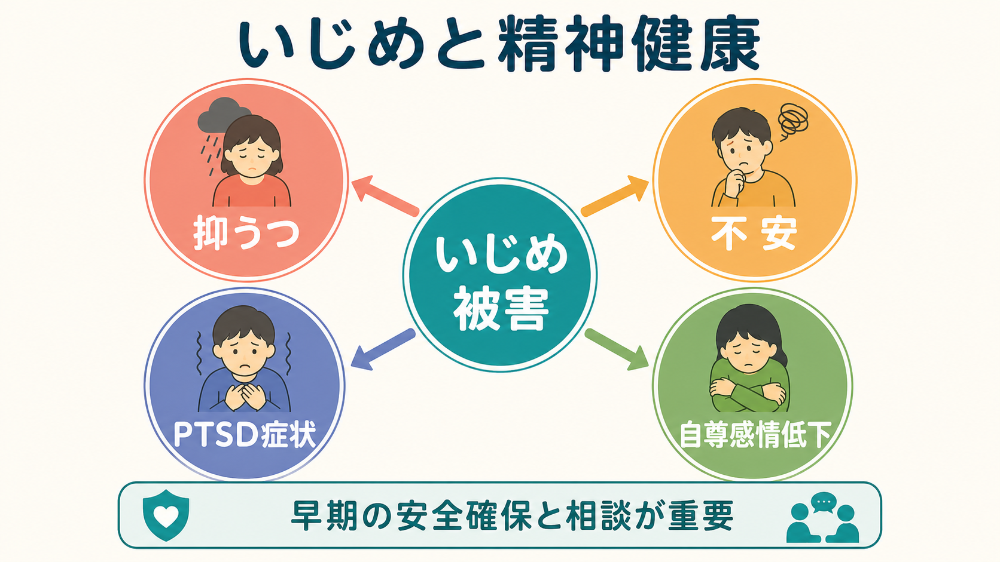
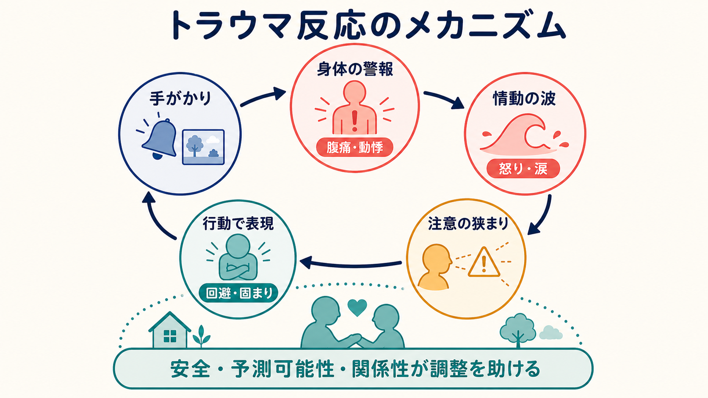

# いじめは精神健康にどう影響するのか

## 要点

- いじめは「嫌がる攻撃」「力の不均衡」「反復または反復可能性」を特徴とする対人ストレスであり、身体的暴力だけでなく、言語的攻撃、仲間外れ、噂、ネット上の攻撃も含む [1]。
- いじめ被害は、抑うつ、不安、孤独、自尊感情の低下、PTSD症状、自傷・自殺関連行動、学校適応の低下と関連する [2][3][4]。
- 影響は「弱い子が傷つく」という単純な話ではなく、反復する脅威、社会的孤立、自己概念の傷つき、回避と反すうの循環として理解できる。
- 研究知見は個別診断を直接決めるものではない。臨床では安全確保、被害の継続性、抑うつ・不安・[[PTSDとは何か]]、自傷リスク、家族・学校の支援資源を分けて評価する。

## この記事で答える問い

この記事では、いじめ被害がなぜ[[うつ病とは何か|抑うつ]]、[[不安とは何か|不安]]、PTSD症状、自尊感情の低下につながりうるのかを説明する。中心に置く問いは三つである。

1. いじめはどのような意味で精神健康上のリスクなのか。
2. どのような心理・社会・生物学的経路で症状が強まるのか。
3. 研究知見を、学校・家族・臨床の支援にどうつなげるべきか。

## まず結論

いじめ被害は、単発の「嫌な出来事」ではなく、逃げにくい生活環境の中で反復される対人ストレスとして働く。被害を受ける子どもや青年は、次に何が起きるかわからない状態で学校やオンライン空間に入り続けるため、警戒、睡眠の乱れ、回避、反すう、孤立が続きやすい。縦断研究とメタ分析では、いじめ被害がその後の内在化問題、つまり抑うつや不安の増加を予測することが示されている [2]。

一方で、精神症状がある子どもほど被害を受けやすくなる経路もある。したがって、いじめの影響は一方向の因果ではなく、「被害が症状を強め、症状や孤立がさらに被害を受けやすくする」という悪循環として見る必要がある [2]。この見方は、本人を責めるためではなく、環境調整と支援を早く入れるために重要である。

## 背景

CDC は、いじめを若者間の望まない攻撃行動で、観察される、または知覚される力の不均衡を含み、複数回反復されるか、反復される可能性が高いものと定義している [1]。この定義では、物理的暴力だけでなく、悪口、からかい、仲間外れ、噂の流布、所有物への損害、電子的ないじめも含まれる。

大規模な系統的レビューとメタ分析では、いじめ被害は精神健康問題、一般的健康状態の悪化、自殺念慮・自殺関連行動と関連し、とくに精神健康問題については因果的関連を支持する根拠が強いと整理されている [3]。また、成人期まで追跡した研究では、児童期・青年期の被害体験が成人期の不安障害、抑うつ、心理的苦痛、社会関係やウェルビーイングの低下と関連する [5]。

ただし、ここでいうリスクは「必ず病気になる」という意味ではない。被害の期間、頻度、逃げ場の有無、家族・友人・教師の支援、もともとの発達特性や精神症状、地域や学校の対応によって影響は大きく変わる。これは[[ストレス脆弱性モデルとは何か]]や[[レジリエンスは発達過程でどう育つのか]]と接続して理解できる。

## 基本概念

### いじめ被害

いじめ被害は、同年代集団の中で一方が他方に対して優位性をもち、相手が止めにくい攻撃や排除を受ける状態である [1]。力の差は身体の大きさだけではない。人気、集団内の地位、秘密情報、SNS上の拡散力、人数差、障害や少数派性なども力の不均衡を作る。

### 抑うつ

いじめ被害は、「自分は価値がない」「どこにいても拒絶される」といった否定的な自己評価や将来予測を強める。メタ分析では、被害と心理社会的不適応の関連の中で、抑うつとの関連がとくに強いことが報告されている [4]。これは[[学習性無力感とは何か]]や反すうの観点からも説明できる。

### 不安

不安は、次に攻撃されるかもしれないという予測、周囲の視線への過敏さ、学校やSNSを確認する前の緊張として現れる。いじめ被害を受けた子どもは、社交場面、登校、休み時間、オンライン通知などを脅威手がかりとして学習しやすい。成人期の追跡研究でも、被害経験は不安障害のリスク上昇と関連している [5]。

### PTSD症状

いじめは、すべての場合に[[PTSDとは何か|PTSD]]を引き起こすわけではない。しかし、反復的で逃げにくく、羞恥や恐怖を伴う被害は、侵入的想起、回避、過覚醒、否定的認知・気分といったPTSD様症状と関連しうる。学校・職場のいじめとPTSD症状に関するレビューとメタ分析では、横断的関連は示される一方、因果判断には縦断研究や臨床診断研究が不足していると整理されている [6]。

### 自尊感情の低下

自尊感情は、自分に価値があり、関係の中で受け入れられるという感覚と深く関係する。縦断研究のメタ分析では、ピア・ビクティミゼーションはその後の低い自尊感情を予測し、低い自尊感情も将来の被害リスクを高めるという双方向性が示されている [7]。そのため、「自信を持てばよい」と本人だけに課題を返すのではなく、本人が尊重される関係と環境を回復することが必要になる。

## 仕組み

いじめが精神健康へ影響する仕組みは、少なくとも四つの経路に分けられる。

第一に、脅威予測の経路である。反復される攻撃や排除は、脳と身体に「ここは安全ではない」という予測を学習させる。すると、登校、教室、通知音、特定の集団を見るだけで緊張や過覚醒が生じる。これは[[HPA軸は精神疾患にどう関わるか]]や[[ノルアドレナリンは覚醒とストレスにどう関わるのか]]の観点からも説明できる。

第二に、社会的孤立の経路である。仲間外れや噂は、単に悲しいだけでなく、助けを求める相手を減らす。孤立は反すうを増やし、抑うつや不安を強める。逆に、信頼できる大人や友人との関係は、被害後の影響を緩和する保護因子になる。これは[[社会的支援は健康にどう影響するか]]と直接つながる。

第三に、自己概念の経路である。いじめは「自分が悪い」「自分は拒絶される人間だ」という意味づけを作りやすい。とくに発達期には、仲間関係が自己理解の材料になるため、反復的な否定は自尊感情やアイデンティティ形成に影響しうる。

第四に、回避と機能低下の経路である。学校、部活動、SNS、人間関係を避けることは短期的には苦痛を減らすが、長期的には学業、睡眠、活動量、所属感を低下させる。すると「できない」「行けない」「また失敗する」という予測が強まり、抑うつ・不安の維持因子になる。

## 図解

1枚目は、いじめ被害が抑うつ、不安、PTSD症状、自尊感情低下へ広がる全体像を示している。重要なのは、これらが別々の問題ではなく、孤立、反すう、過覚醒、回避を介して相互に強まりうる点である。

2枚目は、反復的な対人ストレスが身体の警戒、情動調整、注意、対人認知、回避に影響する経路を示している。臨床的には「症状だけ」を見るよりも、どの場面が脅威手がかりになっているか、どの回避が生活機能を狭めているかを確認する。

3枚目は、評価・理解・支援を分けるための整理である。研究知見は診断名を機械的に付けるためではなく、見落としを減らし、支援方針を作る材料として使う。

## 臨床・研究との接続

臨床では、いじめ被害を聞くときに「いつ、誰に、何をされたか」だけでなく、頻度、期間、逃げ場、ネット上の拡散、傍観者、学校側の対応、家族が知っているかを確認する。抑うつ、不安、睡眠、食欲、身体症状、登校困難、自傷、希死念慮も別々に評価する。自傷や希死念慮がある場合は、[[自殺リスク評価では何を聞くべきか]]の枠組みで安全確認を優先する。

支援では、本人の認知を変える前に、安全確保と被害の停止が前提になる。被害が続いている状況で「気にしないようにする」「考え方を変える」だけを求めると、本人の孤立感や自己責任感を強めることがある。学校、家族、地域、医療が連携し、相談経路と記録、再発時の対応を明確にする必要がある。学校ベースの予防プログラムに関する更新版メタ分析では、いじめ加害と被害の双方を減らす効果が示されており、個人面接だけでなく環境全体への介入が重要である [8]。

研究面では、横断研究では「いじめと症状が同時に関連する」ことはわかっても、因果方向は限定的にしか言えない。縦断研究、介入研究、学校・家庭・個人要因を含む多層モデルが重要になる。とくにPTSD症状については関連は示されるが、臨床診断としてのPTSD、複雑性PTSD、抑うつ・不安との重なりを丁寧に分ける必要がある [6]。

## よくある誤解

### 「いじめは誰でも経験する成長過程である」

いじめは発達上の通過儀礼ではない。いじめの定義には、力の不均衡と反復性が含まれ、通常の葛藤やけんかとは区別される [1]。学校単位の予防介入にも一定の効果が示されており、予防可能な公衆衛生・学校精神保健上の問題として扱う必要がある [8]。

### 「本人が強くなれば解決する」

自尊感情や対人スキルを支えることは有用だが、被害を止める責任を本人だけに置くのは不適切である。いじめは力の不均衡を含むため、本人の努力だけでは止めにくい。環境調整、目撃者の対応、学校のルール、信頼できる大人への接続が必要になる。

### 「PTSD症状があるなら必ずPTSDである」

侵入的想起、回避、過覚醒があっても、診断には症状の種類、持続期間、機能障害、出来事の性質、併存症の評価が必要である。いじめ被害では、PTSD様症状、抑うつ、不安、適応障害、身体症状、解離、発達特性の二次障害が重なることがある。

### 「研究でリスクが高いなら将来は決まっている」

リスクは確率の上昇であり、運命ではない。早期の安全確保、支持的な関係、学校環境の改善、適切な心理教育と治療アクセスは、悪循環を弱める。研究知見は、本人をラベルづけするためではなく、支援を早く届けるために使う。

## 関連ノート

- [[学校精神保健とは何か]]
- [[児童青年期うつ病とは何か]]
- [[児童青年期の不安症はどう現れるのか]]
- [[児童青年期のトラウマ反応はどう現れるのか]]
- [[トラウマは発達にどう影響するのか]]
- [[精神疾患とトラウマ反応はどう関係するのか]]
- [[ストレス脆弱性モデルとは何か]]
- [[社会的支援は健康にどう影響するか]]
- [[自殺リスク評価では何を聞くべきか]]

## MOC更新候補

- `content/00_MOC/` 配下の精神医学、児童青年期、学校精神保健、トラウマ関連MOCに追加候補。
- 並列ジョブとの衝突を避けるため、本記事ではMOC本体は更新しない。

## 理解チェック

1. いじめの定義で重要な三要素は何か。
2. いじめ被害が抑うつや不安につながる心理的経路を二つ挙げられるか。
3. PTSD症状とPTSD診断を区別する必要があるのはなぜか。
4. 「本人が強くなればよい」という理解にはどのような問題があるか。
5. 支援計画を立てるとき、安全確保、症状評価、学校・家族連携をどう分けて考えるか。

## 未解決問題

- どのような学校環境や集団規範が、被害後の抑うつ・不安・PTSD症状を最も強く緩和するのか。
- ネット上のいじめでは、拡散性、匿名性、24時間性がどのように症状の持続に影響するのか。
- 発達特性、性的マイノリティ性、障害、移民背景など、被害リスクが高まりやすい集団に対する支援をどう個別化するか。
- 被害停止後も残る自尊感情低下や回避を、学校復帰・社会参加の支援とどう接続するか。

## 参考文献

[1] Centers for Disease Control and Prevention. (2024). *Bullying*. https://www.cdc.gov/youth-violence/about/about-bullying.html

[2] Reijntjes, A., Kamphuis, J. H., Prinzie, P., & Telch, M. J. (2010). Peer victimization and internalizing problems in children: A meta-analysis of longitudinal studies. *Child Abuse & Neglect, 34*(4), 244-252. https://doi.org/10.1016/j.chiabu.2009.07.009

[3] Moore, S. E., Norman, R. E., Suetani, S., Thomas, H. J., Sly, P. D., & Scott, J. G. (2017). Consequences of bullying victimization in childhood and adolescence: A systematic review and meta-analysis. *World Journal of Psychiatry, 7*(1), 60-76. https://doi.org/10.5498/wjp.v7.i1.60

[4] Hawker, D. S. J., & Boulton, M. J. (2000). Twenty years' research on peer victimization and psychosocial maladjustment: A meta-analytic review of cross-sectional studies. *Journal of Child Psychology and Psychiatry, 41*(4), 441-455. https://doi.org/10.1111/1469-7610.00629

[5] Copeland, W. E., Wolke, D., Angold, A., & Costello, E. J. (2013). Adult psychiatric outcomes of bullying and being bullied by peers in childhood and adolescence. *JAMA Psychiatry, 70*(4), 419-426. https://doi.org/10.1001/jamapsychiatry.2013.504

[6] Nielsen, M. B., Tangen, T., Idsoe, T., Matthiesen, S. B., & Magerøy, N. (2015). Post-traumatic stress disorder as a consequence of bullying at work and at school: A literature review and meta-analysis. *Aggression and Violent Behavior, 21*, 17-24. https://doi.org/10.1016/j.avb.2015.01.001

[7] van Geel, M., Goemans, A., Zwaanswijk, W., & Vedder, P. (2018). Does peer victimization predict low self-esteem, or does low self-esteem predict peer victimization? Meta-analyses on longitudinal studies. *Developmental Review, 49*, 31-40. https://doi.org/10.1016/j.dr.2018.07.001

[8] Gaffney, H., Ttofi, M. M., & Farrington, D. P. (2021). Effectiveness of school-based programs to reduce bullying perpetration and victimization: An updated systematic review and meta-analysis. *Campbell Systematic Reviews, 17*(2), e1143. https://doi.org/10.1002/cl2.1143
