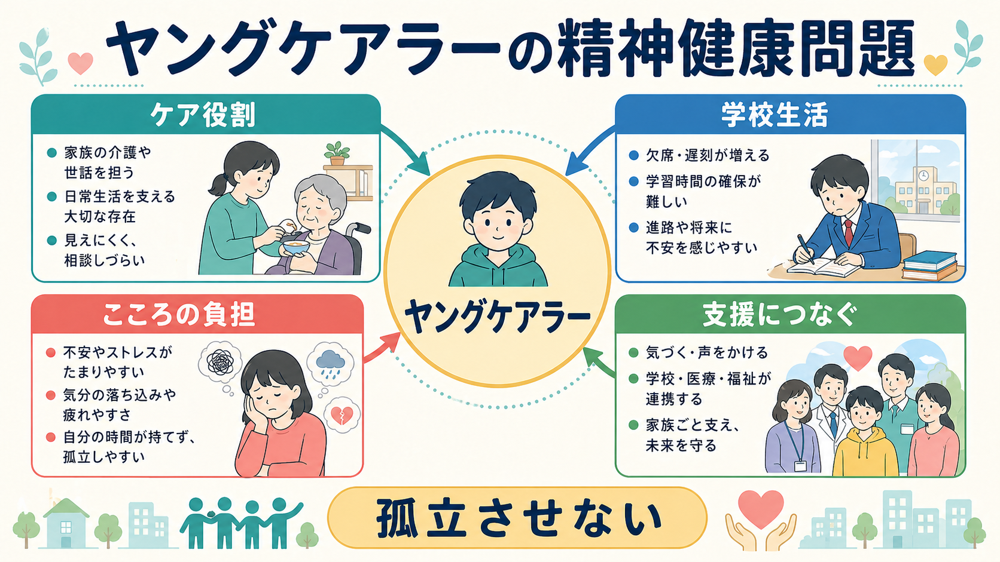
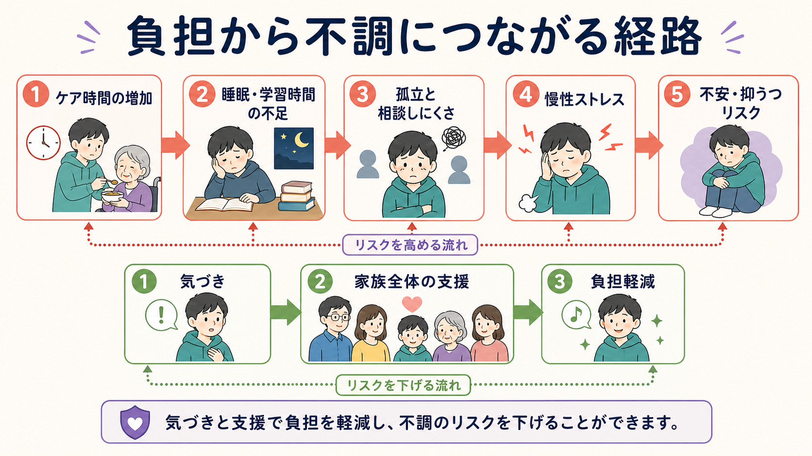
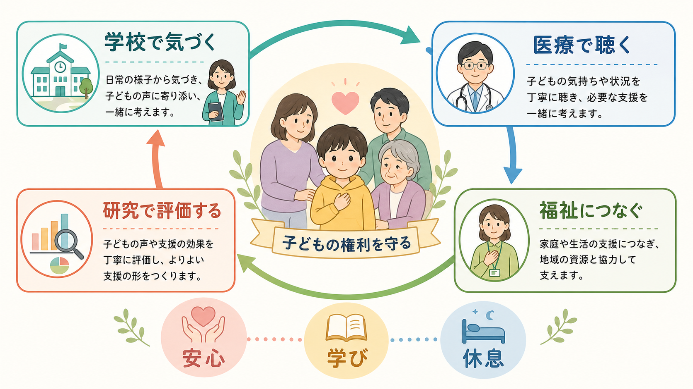

# ヤングケアラーの精神健康問題とは何か

## 要点

- ヤングケアラーとは、家族の介護・看病・家事・きょうだいの世話・通訳・感情面の支えなどを、年齢や発達段階に比べて過度に担う子ども・若者を指す。日本では2024年6月施行の法改正により、支援に努めるべき対象として明記された[1]。
- 精神健康問題は「介護をするから必ず病気になる」という意味ではない。問題の核心は、ケア役割が睡眠、学習、友人関係、休息、将来選択を圧迫し、孤立や慢性ストレスを強めることである[2][4]。
- 系統的レビューでは、ヤングケアラーは非ケアラーに比べて抑うつ、不安、情緒的問題などが多い傾向を示す。ただし、横断研究が多く、因果関係や保護因子はまだ十分に解明されていない[4][5]。
- 日本の高校生調査でも、障害・病気・特別なニーズをもつ家族をケアする群では、K6で評価した精神的苦痛が高いことが示された[6]。
- 支援は、本人だけを「強くする」ことではなく、家族全体のケア負担を下げ、学校・福祉・医療・地域が連携して子どもの時間と権利を回復することである[1][8]。

## この記事で答える問い

1. ヤングケアラーの精神健康問題とは、何が問題なのか。
2. どのような経路で不安、抑うつ、疲労、孤立につながるのか。
3. 臨床、学校、福祉、研究では何を見落としやすいのか。
4. 支援は、本人・家族・制度のどこに働きかけるべきか。

## まず結論

ヤングケアラーの精神健康問題は、子どもの「やさしさ」や「家族思い」を病理化する話ではない。家族を支える役割そのものには、責任感、共感性、生活技能、家族とのつながりといった肯定的側面もありうる。しかし、その役割が長時間化し、子どもが本来もてるはずの睡眠、遊び、学習、友人関係、進路選択、助けを求める機会を奪うと、[[発達精神病理学とは何か]]でいうリスクの累積が起こる。

したがって、評価の焦点は「この子はヤングケアラーか」というラベルだけではなく、「どの役割が、どの程度、どの生活領域を圧迫しているか」に置く必要がある。精神医学的には、不安、抑うつ、睡眠問題、身体症状、希死念慮、自傷、学校不適応を確認しつつ、家族システムと社会的支援の不足を同時に見ることが重要である[4][7]。

## 背景

こども家庭庁は、ヤングケアラーを「家族の介護その他の日常生活上の世話を過度に行っていると認められる子ども・若者」として、国・地方公共団体等が支援に努めるべき対象に位置づけている[1]。ここで重要なのは、「介護」だけでなく、家事、きょうだいの世話、医療・福祉手続きの補助、家計を支える労働、親の通訳、精神的な支えなど、広い日常生活上の世話が含まれる点である。

日本の2020年度全国調査では、世話をしている家族がいると回答した割合は中学2年生で5.7%、全日制高校2年生で4.1%だった[2]。これは「クラスに1人程度はいるかもしれない」水準である。一方で、本人も家族もそれを特別な負担と認識していないことがあり、家庭内の問題として外から見えにくい。2021年度調査では、小学生や大学生にも調査対象が広げられ、ヤングケアラーが中高生だけの問題ではなく、発達段階と進学・就労移行をまたぐ問題であることが強調された[3]。

## 基本概念

### ケア役割

ケア役割には、身体介助、服薬管理、通院同行、家事、食事準備、幼いきょうだいの世話、親の感情の受け止め、家族内の調整、通訳、金銭管理の補助などがある。問題になるのは、役割の種類そのものよりも、年齢相応の生活と両立できないほど頻度・時間・責任が大きい場合である。

### 精神健康問題

ヤングケアラーで見られやすい精神健康上の困難には、疲労、睡眠不足、不安、抑うつ、イライラ、孤立感、罪悪感、集中困難、身体症状、学校不適応、自傷や希死念慮が含まれる[4][7]。ただし、これらは「ヤングケアラー症候群」のような独立診断ではない。[[不安症とうつ病はどう併存するのか]]や[[うつ病とは何か]]と接続しながら、生活文脈の中で評価する必要がある。

### 子どもの権利

ヤングケアラー支援の中心には、子どもの権利を守る視点がある。学ぶ時間、休む時間、遊ぶ時間、友人と過ごす時間、将来を考える時間、助けを求める権利は、家族の病気や障害によって消えてよいものではない。支援は「家族を見捨てること」ではなく、子どもだけに集中していた負担を大人と制度に戻す作業である。

## 仕組み

ヤングケアラーの精神健康問題は、少なくとも次の経路で理解できる。

1. **時間の圧迫**  
   ケア時間が増えると、睡眠、宿題、授業準備、部活動、友人関係、自由時間が削られる。睡眠不足と慢性疲労は、注意、感情調整、学習効率を下げ、[[思春期の脳と心理はどう変化するのか]]で扱う発達課題を難しくする。

2. **相談しにくさと孤立**  
   家族の病気、障害、依存症、精神疾患、貧困、家庭内葛藤は、子どもにとって話しにくい。本人が「家族を悪く言ってはいけない」「自分が頑張るしかない」と感じるほど、支援につながる入口が狭くなる[8]。

3. **慢性ストレスと予測不能性**  
   ケアは、予定通りに終わる課題ではない。急な体調変化、親の気分変動、夜間対応、きょうだいの世話が重なると、身体は常に警戒状態に近づく。これは[[HPA軸は精神疾患にどう関わるのか]]で扱うストレス系の問題とも接続する。

4. **役割逆転と家族システム**  
   子どもが親の情緒的支えや家庭運営の中心を担うと、親子の役割が反転することがある。[[家族システムとは何か]]の視点では、子ども個人の症状だけでなく、家族全体の機能と外部支援の不足を見る。

5. **長期化の影響**  
   東京ティーンコホートを用いた研究では、長期的にケア役割を担う若者で、14歳時の抑うつ症状が高く、16歳時の自傷や希死念慮にも境界的な関連が示された[7]。長期化したケアは、単なる「一時的なお手伝い」と異なる発達上の負荷になりうる。

## 図解

| 図 | 役割 | 読み方 |
|---|---|---|
| 図1 | 概念地図 | ヤングケアラーを中心に、ケア役割、学校生活、こころの負担、支援の4領域を同時に見る。 |
| 図2 | メカニズム | ケア時間の増加から睡眠・学習時間の不足、孤立、慢性ストレス、不安・抑うつリスクへ進む経路と、気づき・家族支援・負担軽減による保護経路を見る。 |
| 図3 | 支援接続 | 学校、医療、福祉、研究が別々に動くのではなく、子どもの権利を中心に連携する構図を見る。 |

## 臨床・研究との接続

### 臨床

臨床では、抑うつや不安の症状だけを聞くと、背景のケア役割が見落とされることがある。問診では、「家で誰の世話をしているか」「週に何日、何時間か」「夜間対応があるか」「学校生活に影響しているか」「相談できる大人がいるか」「本人はその役割をどう受け止めているか」を、非難や詮索にならない形で確認する。

自傷や希死念慮がある場合は通常の安全評価を優先するが、その際も「本人の認知のゆがみ」だけに還元しない。家族内の負担、医療・福祉サービスの不足、学校での孤立、経済的困難を含めて安全計画を組む必要がある。これは[[心理測定と臨床判断はどう組み合わせるべきか]]の実践例でもある。

### 学校

学校では、遅刻、欠席、居眠り、宿題未提出、成績低下、保健室利用、友人関係の縮小が手がかりになりうる。ただし、それらを「怠け」「反抗」「家庭のしつけ」の問題として片づけると、支援の入口を閉ざす。本人が言い出すのを待つだけでなく、日常の変化に気づき、安心して話せる経路を複数用意することが重要である。

### 福祉・医療連携

支援の単位は本人だけではなく家族全体である。親の治療、障害福祉サービス、介護保険、生活困窮支援、子育て支援、学校相談、地域の居場所がつながると、子どものケア負担は下がりやすい。精神疾患の親をもつ子どもの研究でも、親の病状理解、心理教育、家庭外の支え、スティグマ低減が支援に必要とされている[8]。

### 研究

研究上は、横断研究だけでなく、ケア役割の開始・終了・長期化を追う縦断研究が必要である。系統的レビューは、ヤングケアラーの精神健康リスクを示す一方で、交絡、測定方法、比較群、長期データの不足を限界として挙げている[4][5]。今後は、ケア時間、ケア対象、家族の病状、貧困、親の精神健康、学校支援、本人の主観的負担を分けて測る必要がある。

## よくある誤解

### 「家族を手伝うのは良いことだから問題ではない」

家族を手伝うこと自体は問題ではない。問題は、子どもの生活、発達、教育、休息、対人関係を犠牲にしてまで、継続的で重い責任を担っている場合である。

### 「本人が平気と言っているなら支援はいらない」

本人が平気と言う背景には、家族への罪悪感、外部に話すことへの不安、支援制度を知らないこと、長年の慣れがある。本人の言葉を尊重しつつ、生活への影響を具体的に確認する必要がある。

### 「親を責めれば解決する」

多くの場合、家族も困っている。親の病気、障害、依存、貧困、孤立、サービス不足が重なり、結果として子どもに負担が集中している。支援は責めることではなく、負担の再配分である。

### 「診断名をつければ支援につながる」

診断は必要な支援の一部にすぎない。ヤングケアラー支援では、生活支援、学校調整、福祉サービス、家族支援、心理的安全、社会的孤立の軽減を同時に考える。[[社会的支援は健康にどう影響するのか]]の視点が欠かせない。

## 関連ノート

- [[ライフスパン精神医学とは何か]]
- [[発達精神病理学とは何か]]
- [[思春期の脳と心理はどう変化するのか]]
- [[家族システムとは何か]]
- [[社会的支援は健康にどう影響するのか]]
- [[トラウマは発達にどう影響するのか]]
- [[レジリエンスは発達過程でどう育つのか]]
- [[不安症とうつ病はどう併存するのか]]

## MOC更新候補

- `content/00_MOC/MOC｜精神医学.md`
- `content/00_MOC/MOC｜発達・愛着・社会心理.md`
- `content/00_MOC/MOC｜倫理・哲学・社会.md`

## 理解チェック

1. ヤングケアラーの精神健康問題を、本人の「弱さ」ではなく生活文脈の問題として説明するとどうなるか。
2. ケア役割が不安・抑うつリスクにつながる経路を、睡眠、学校、孤立、慢性ストレスの語を使って説明できるか。
3. 学校で「怠け」に見える行動の背後に、どのようなケア負担がありうるか。
4. 支援を本人だけでなく家族全体に向ける理由は何か。

## 未解決問題

- ケアの種類、時間、主観的負担、家族の病状のどれが精神健康に最も強く関係するのか。
- 短期的なケア役割と長期的なケア役割で、発達上の影響はどう異なるのか。
- 学校、医療、福祉のどの接点が、最も早く安全に支援へつながるのか。
- 「支援されること」への恥や罪悪感を下げる心理教育は、どの年齢でどのように行うのがよいか。

## 参考文献

[1] こども家庭庁. ヤングケアラーについて. https://www.cfa.go.jp/policies/young-carer

[2] 三菱UFJリサーチ&コンサルティング. (2021). ヤングケアラーの実態に関する調査研究について（令和2年度子ども・子育て支援推進調査研究事業）. 厚生労働省資料. https://www.mhlw.go.jp/content/11907000/000767891.pdf

[3] 日本総合研究所. (2022). ヤングケアラーの実態に関する調査研究. https://www.jri.co.jp/page.jsp?id=102439

[4] Fleitas Alfonzo, L., Singh, A., Disney, G., Ervin, J., & King, T. (2022). Mental health of young informal carers: A systematic review. *Social Psychiatry and Psychiatric Epidemiology, 57*(12), 2345-2358. https://doi.org/10.1007/s00127-022-02333-8

[5] Lacey, R. E., Xue, B., McMunn, A., & others. (2022). The mental and physical health of young carers: A systematic review. *The Lancet Public Health, 7*(9), e787-e796. https://doi.org/10.1016/S2468-2667(22)00161-X

[6] 宮川雅充・濱島淑恵・南多恵子. (2022). ヤングケアラーの精神的苦痛：埼玉県立高校の生徒を対象とした質問紙調査. *日本公衆衛生雑誌, 69*(2), 125-135. https://doi.org/10.11236/jph.21-080

[7] Stanyon, D., Nakanishi, M., Yamasaki, S., et al. (2024). Investigating the differential impact of short- and long-term informal caregiving on mental health across adolescence: Data from the Tokyo Teen Cohort. *Journal of Adolescent Health, 75*(4), 642-649. https://doi.org/10.1016/j.jadohealth.2024.06.005

[8] 藤田由起・遠矢浩一. (2024). 精神疾患の母親をもつ成人の学齢期における生活環境と精神的健康の関連：ヤングケアラー支援の観点から. *特殊教育学研究, 62*(3), 115-125. https://doi.org/10.6033/tokkyou.24A002
