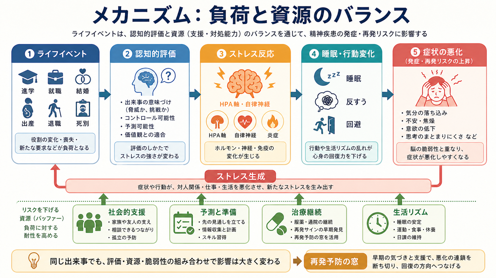
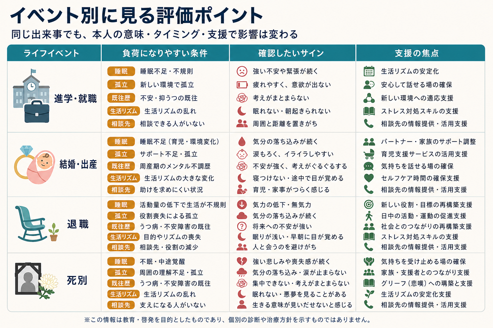

# ライフイベントと精神疾患はどう関係するのか

## 要点

- ライフイベントは、進学・就職・結婚・出産・退職・死別のような「人生の節目」であり、よい出来事でも悪い出来事でも、役割・生活リズム・対人関係・将来予測を大きく変える。
- 発症や再発のリスクは、出来事の種類だけで決まらない。重要なのは、喪失の大きさ、本人にとっての意味、予測可能性、コントロール可能性、既往歴、社会的支援、睡眠や生活リズムの変化である。
- うつ病では、ストレスフルなライフイベントが発症前に増えることが古くから示されてきた。ただし、出来事が「原因」である場合も、症状が対人・仕事上の出来事を生み出す場合もあり、双方向性に注意する必要がある [1], [2]。
- 精神病性障害や双極症でも、ストレスフルな出来事は発症・再発・入院リスクと関連する。とくに睡眠破綻、服薬中断、孤立、対人葛藤が重なると、再発予防上の重要な警告になる [4], [5]。
- 臨床では、「イベント名」を聞くだけでなく、その出来事が生活機能、症状、支援、治療継続にどう影響したかを時間軸で評価する。

## この記事で答える問い

この記事では、ライフイベントを「単なるきっかけ」としてではなく、[[ライフスパン精神医学とは何か]]の視点から、発達段階・社会的役割・脆弱性・保護因子が交差する場面として扱う。主な問いは次の四つである。

1. なぜ、同じライフイベントでも精神健康への影響が人によって違うのか。
2. 進学、就職、結婚、出産、退職、死別は、どのような経路で発症や再発リスクに関わるのか。
3. 「イベントが原因」と考えすぎることには、どのような限界があるのか。
4. 臨床・研究では、どのような情報を確認すればよいのか。

## まず結論

ライフイベントと精神疾患の関係は、「強い出来事が起きたから発症する」という単純な因果ではない。より正確には、出来事が本人の生活システムにどの程度の再編成を要求し、その要求が本人の資源をどの程度上回るかによってリスクが変わる。

ここでいう資源には、家族・友人・職場・学校・医療福祉の支援だけでなく、睡眠、経済的余裕、予測可能性、対処スキル、治療継続、過去の経験から得た見通しも含まれる。ライフイベントは、症状を悪化させるリスクであると同時に、支援を組み直し、回復を促す機会にもなりうる。

## 背景

精神医学では、ライフイベント研究はうつ病研究とともに発展してきた。大規模な双生児研究では、ストレスフルな出来事の後に大うつ病エピソードのリスクが高まることが示されているが、その効果は出来事の性質、個人の遺伝的・環境的脆弱性、過去のエピソード数によって変わる [1]。つまり、イベントは「単独の引き金」ではなく、脆弱性と環境の相互作用の一部である。

また、うつ病では、初回エピソードでは明確なストレスイベントが目立ちやすい一方、再発を重ねると比較的小さなストレスでもエピソードが起こりやすくなる、という「感作」または「kindling」に近い考え方が議論されてきた [2]。この議論は、再発予防では大きな出来事だけでなく、睡眠不足、対人葛藤、仕事量の増加、支援の減少のような日常的負荷を丁寧に見る必要があることを示している。

一方で、ライフイベント研究には限界もある。出来事の測定は回想に依存しやすく、発症後の記憶や意味づけに影響される。また、症状そのものが人間関係や仕事上の問題を増やし、それがさらにストレスを増やす「ストレス生成」の経路もある。したがって、「死別がうつ病を起こした」「就職が不安症を起こした」と短絡せず、時間順序と双方向性を確認する必要がある。

## 基本概念

### ライフイベント

ライフイベントとは、個人の生活構造を変える出来事である。進学や就職のような移行、結婚や出産のような家族役割の変化、退職のような社会的役割の変化、死別や離別のような喪失が含まれる。重要なのは、出来事が「望ましい」か「望ましくない」かだけではない。望んでいた結婚や昇進でも、生活リズム、責任、対人関係、自己評価を大きく変える場合には負荷になりうる。

### 脆弱性と保護因子

脆弱性とは、ストレスに対して症状が出やすくなる条件である。既往歴、家族歴、神経発達特性、睡眠の不安定さ、慢性的な身体疾患、経済的不安、孤立、過去のトラウマ体験などが含まれる。保護因子には、安定した睡眠、支援者、相談先、職場や学校の合理的配慮、医療へのアクセス、治療継続、問題を小分けにする対処スキルがある。

### 発症、再発、増悪

ライフイベントが関係する局面は三つに分けられる。第一に、これまで明確な精神疾患がなかった人に症状が初めて出る発症である。第二に、寛解していた症状が再び診断水準に達する再発である。第三に、診断水準までは変わらなくても、睡眠、意欲、不安、易刺激性、集中、社会機能が悪化する増悪である。臨床的には、この三つを区別しながら、どこで介入すれば悪化の連鎖を止められるかを考える。

## 仕組み

### 1. 意味づけと予測可能性

同じ出来事でも、本人にとっての意味が異なれば負荷も異なる。就職は、ある人にとっては達成感のある移行であり、別の人にとっては失敗できない場面、孤立、睡眠破綻の始まりになる。死別も、悲嘆という自然な反応と、うつ病エピソード、複雑性悲嘆、PTSD 症状が重なりうる。臨床では「何が起きたか」だけでなく、「本人がそれをどう理解し、どの部分を失ったと感じているか」を尋ねる必要がある。

予測可能性とコントロール可能性も重要である。準備できる移行は、負荷が大きくても計画を立てやすい。突然の解雇、事故、急な死別、予期しない介護負担のように、見通しが崩れる出来事では、ストレス反応が持続しやすい。

### 2. 生理的ストレス反応

強いストレスは、HPA 軸、自律神経、免疫・炎症反応を介して身体と脳に影響する。短期的には適応的な反応でも、慢性化するとアロスタティック負荷として蓄積し、睡眠、注意、感情調整、報酬処理、身体症状に影響しうる [3]。このため、ライフイベント後の精神症状は「気持ちの問題」だけではなく、睡眠・食欲・疲労・痛み・動悸など身体的指標と一緒に評価する必要がある。

### 3. 睡眠と生活リズム

睡眠不足や概日リズムの乱れは、多くの精神疾患で症状悪化の共通経路になる。進学・就職では起床時刻や通勤通学負荷が変わり、出産では育児による睡眠断片化が起こり、退職では日中活動の構造が失われることがある。双極症では、とくに睡眠短縮と活動量増加が躁状態・軽躁状態の早期サインになりうるため、ライフイベント時には生活リズムの変化を先に把握することが重要である。

### 4. 社会的支援と孤立

社会的支援は、ストレスが精神健康に及ぼす影響を弱める緩衝因子として古くから研究されてきた [8]。支援は「人数が多い」ことだけではない。安心して話せる人がいるか、実務的な助けを得られるか、専門機関につながれるか、本人の意思が尊重されるかが重要である。

たとえば、[[大学生のメンタルヘルス問題には何があるのか]]で扱われる大学移行では、学業負荷よりも孤立や相談先の不明瞭さが問題になることがある。[[産後うつ病は母子関係にどう影響するのか]]のような周産期では、ホルモン変化だけでなく、睡眠不足、育児負担、パートナー支援、経済的不安、過去の気分障害歴が重なってリスクが上がる [6]。

### 5. ストレス生成

精神症状は、ストレスへの反応であると同時に、新たなストレスを生むことがある。抑うつが強まると連絡を返せなくなり、対人関係が悪化する。不安が強いと回避が増え、学業や仕事の遅れがさらに不安を高める。精神病性症状や躁状態では、対人葛藤、金銭問題、治療中断が再発リスクを高める。これがストレス生成であり、ライフイベント後の悪循環を理解するうえで重要である。

## 図解

図のように、イベント別に見ると評価ポイントは変わる。ただし、表は「このイベントならこの疾患になる」という対応表ではない。臨床で確認したいのは、イベントによってどの生活領域が変わり、どの支援が減り、どの症状が先に出ているかである。

### 進学・就職

進学・就職では、環境変化、評価される場面の増加、対人関係の再構築、睡眠リズムの変化が重なる。既に不安症、うつ病、神経発達症、睡眠問題がある場合、適応の遅れが自己評価の低下や回避につながりやすい。[[児童青年期のうつ病はどう現れるのか]]や[[思春期の自殺リスクはどう評価するのか]]と接続して、欠席、成績低下、自傷念慮、孤立を早めに確認する。

### 結婚・出産

結婚や出産は、望ましい出来事であっても、役割期待、家事育児負担、親族関係、経済計画、睡眠不足を伴う。周産期のうつ病では、過去のうつ病・不安症、妊娠中のストレス、パートナー支援の不足、予期しない妊娠・出産体験、乳児の睡眠問題などがリスクに関わる [6]。出産後の気分変化を「母親なら当然」と扱わず、睡眠、希死念慮、強い不安、乳児への侵入思考、支援不足を丁寧に評価する。

### 退職

退職は、仕事のストレスからの解放である場合もあれば、役割喪失、収入変化、日中構造の消失、社会的接触の減少になる場合もある。退職とうつ症状の関係は一方向ではなく、健康状態、退職の自発性、経済状況、仕事以外の役割、配偶者や友人とのつながりで変わる [7]。[[老年精神医学とは何か]]の観点では、退職後の抑うつを加齢の自然な結果と決めつけず、身体疾患、認知機能、喪失体験、孤立、飲酒、睡眠を合わせて見る。

### 死別

死別では、悲嘆は自然で必要な反応であり、すぐに病的なものとみなすべきではない。一方で、強い希死念慮、長期にわたる生活機能低下、抑うつエピソード、外傷的な死に関連する侵入症状、孤立、複数の喪失がある場合には、臨床的支援が必要になることがある。評価では、悲しみの深さだけでなく、食事、睡眠、服薬、生活手続き、支援者、宗教・文化的意味づけも確認する。

## 臨床・研究との接続

### 臨床面接で確認すること

ライフイベントを評価するときは、次の順で確認すると整理しやすい。

1. 出来事の内容、時期、予測可能性、本人にとっての意味。
2. 出来事の前からあった症状、既往歴、治療歴、家族歴。
3. 出来事後に変化した睡眠、食欲、活動量、集中、対人関係、服薬、飲酒。
4. 支援者、相談先、経済・住居・仕事・学校の実務的問題。
5. 自傷他害リスク、虐待・DV、急性精神病症状、躁状態など、緊急度の高い要素。

この評価は、個別の診断や治療指示ではなく、教育・研究目的の整理である。実際の臨床判断は、本人の状況を直接評価できる専門家と相談して行う必要がある。

### 研究での注意点

研究では、ライフイベントの測定方法が結果を大きく左右する。単純なチェックリストは大規模調査に向くが、出来事の文脈や本人にとっての意味を拾いにくい。面接法は精密だが、実施コストが高い。さらに、症状が出来事の報告に影響する回想バイアス、発症前から存在した慢性ストレス、遺伝的リスクと環境選択の関連も考慮しなければならない [1], [2]。

精神病性障害では、ストレスフルなライフイベントが発症や再発と関連するという報告があるが、因果推論には慎重さが必要である [4], [5]。イベントの直後だけでなく、長期の社会的逆境、都市性、移住、差別、物質使用、睡眠、治療アクセスを同時に見る必要がある。

## よくある誤解

### 誤解1: よい出来事ならストレスではない

進学、結婚、昇進、出産のように社会的には「よい」とされる出来事でも、本人にとっては大きな生活再編成である。喜びと負荷は同時に存在しうる。

### 誤解2: ライフイベントがあれば、それが原因といえる

時間的に近い出来事があっても、それだけで原因とはいえない。既往歴、慢性ストレス、睡眠、物質使用、身体疾患、症状によるストレス生成を合わせて評価する必要がある。

### 誤解3: 悲嘆はすぐ治療対象にすべきである

死別後の悲嘆は自然な反応である。病的かどうかは、期間だけでなく、機能障害、安全性、抑うつ・PTSD 症状、孤立、本人の文化的背景を踏まえて判断する。

### 誤解4: 支援は本人を弱くする

支援は依存を増やすものではなく、負荷が高い時期に生活リズム、判断、相談先を保つための環境調整である。適切な支援は、発症予防や再発予防の資源になりうる。

## 関連ノート

- [[ライフスパン精神医学とは何か]]
- [[大学生のメンタルヘルス問題には何があるのか]]
- [[産後うつ病は母子関係にどう影響するのか]]
- [[老年精神医学とは何か]]
- [[児童青年期のうつ病はどう現れるのか]]
- [[思春期の自殺リスクはどう評価するのか]]

MOC 更新候補:

- `content/00_MOC/` 配下の精神医学・ライフスパン関連 MOC
- 発達・ライフスパン領域の索引ページ
- ストレス、うつ病、周産期、老年精神医学を横断する関連ノート群

## 理解チェック

1. ライフイベントの影響を評価するとき、出来事の種類以外にどのような情報を確認すべきか。
2. なぜ「望ましい出来事」でも精神症状の悪化につながることがあるのか。
3. ストレス生成とは何か。ライフイベント後の悪循環とどう関係するか。
4. 退職や死別を評価するとき、病的反応と自然な適応反応を区別するために何を見ればよいか。

## 参考文献

[1] Kendler KS, Karkowski LM, Prescott CA. (1998). Stressful life events and major depression: risk period, long-term contextual threat, and diagnostic specificity. *Journal of Nervous and Mental Disease*, 186(11), 661-669. https://pubmed.ncbi.nlm.nih.gov/9824167/

[2] Monroe SM, Harkness KL. (2005). Life stress, the "kindling" hypothesis, and the recurrence of depression: considerations from a life stress perspective. *Psychological Review*, 112(2), 417-445. https://doi.org/10.1037/0033-295X.112.2.417

[3] McEwen BS. (2004). Protection and damage from acute and chronic stress: allostasis and allostatic overload and relevance to the pathophysiology of psychiatric disorders. *Annals of the New York Academy of Sciences*, 1032, 1-7. https://doi.org/10.1196/annals.1314.001

[4] Martland N, Martland R, Cullen AE, Bhattacharyya S. (2020). Are adult stressful life events associated with psychotic relapse? A systematic review of 23 studies. *Psychological Medicine*, 50(14), 2302-2316. https://doi.org/10.1017/S0033291720003554

[5] Beards S, Gayer-Anderson C, Borges S, Dewey ME, Fisher HL, Morgan C. (2013). Life events and psychosis: a review and meta-analysis. *Schizophrenia Bulletin*, 39(4), 740-747. https://doi.org/10.1093/schbul/sbt065

[6] Hutchens BF, Kearney J. (2020). Risk factors for postpartum depression: an umbrella review. *Journal of Midwifery & Women's Health*, 65(1), 96-108. https://doi.org/10.1111/jmwh.13067

[7] van der Heide I, van Rijn RM, Robroek SJW, Burdorf A, Proper KI. (2013). Is retirement good for your health? A systematic review of longitudinal studies. *BMC Public Health*, 13, 1180. https://doi.org/10.1186/1471-2458-13-1180

[8] Cohen S, Wills TA. (1985). Stress, social support, and the buffering hypothesis. *Psychological Bulletin*, 98(2), 310-357. https://doi.org/10.1037/0033-2909.98.2.310

## 未解決問題

- ライフイベントの「客観的負荷」と「主観的意味づけ」を、臨床でどの程度まで標準化して評価できるか。
- SNS、リモートワーク、非正規雇用、晩婚化、介護負担の増加など、現代的なライフイベントを既存の尺度で十分に捉えられるか。
- ライフイベント後の支援介入が、どの疾患・どの時期・どのリスク群で最も効果的か。
