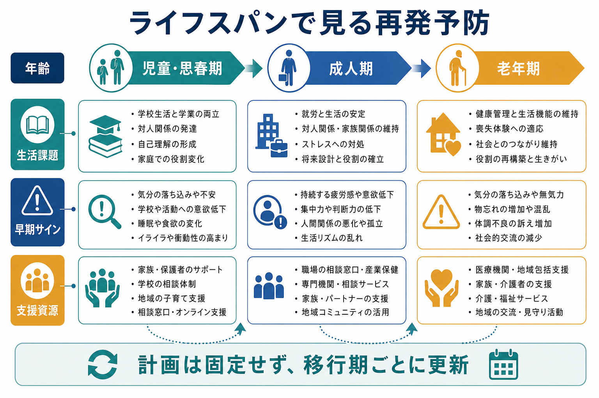
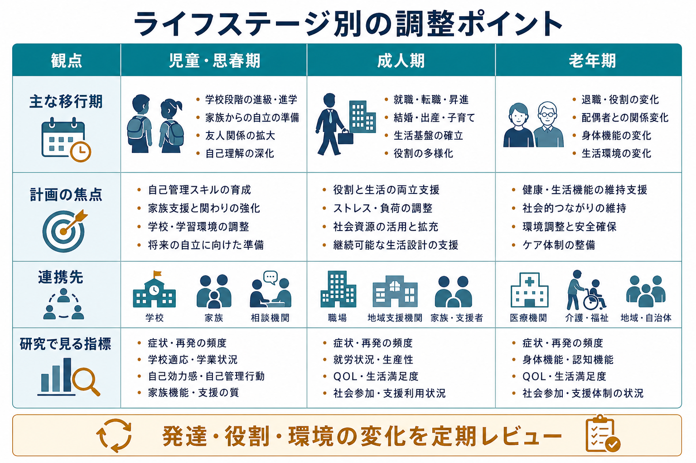

# ライフスパンで見る再発予防とは何か

## 要点

- 再発予防は「症状が戻らないようにするチェックリスト」ではなく、年齢、役割、生活環境、身体健康、支援資源の変化に合わせて更新する共同計画である。
- [[ライフスパン精神医学とは何か]]の観点では、児童・思春期、成人期、老年期で再発リスクの現れ方も、使える支援も変わる。
- 計画の中心は、早期サイン、本人が望む対応、家族・学校・職場・地域支援との連携、危機時対応、回復後の見直しである。
- 医療者が一方的に作る計画ではなく、本人のリカバリー、意思決定、生活上の目標と結びつけておく必要がある。

## この記事で答える問い

このノートでは、再発予防を「疾患別の標準対応」だけでなく、「その人の人生の時期に応じて調整される支援設計」として理解する。中心となる問いは次の三つである。

1. 再発予防計画は、なぜライフステージごとに見直す必要があるのか。
2. 年齢・生活課題・支援資源は、再発リスクと保護因子にどう影響するのか。
3. 臨床や研究では、どのような項目を観察し、どのような限界に注意すべきか。

## まず結論

ライフスパンで見る再発予防とは、症状、服薬、心理社会的支援、危機時対応を一度決めて終わりにするのではなく、発達段階、生活上の役割、環境の変化、支援ネットワークの変化に合わせて反復的に調整する考え方である。WHO はメンタルヘルスの促進・予防・ケアをライフコース全体で考える必要を強調しており、精神疾患の支援も子ども、若者、成人、高齢者という時間軸をまたいで設計されるべきである[1]。

この発想は、疾患横断的である。うつ病では再発・再燃リスクをふまえた継続的支援と再発予防的介入が重要になり[2]、双極症では気分エピソードの早期サイン、危機計画、家族や支援者との共有が問題になる[3]。統合失調症や精神病性障害では、心理教育、家族介入、危機計画、身体健康の確認が長期的な支援の一部になる[4]。ただし、これらは個別の診断や治療指示ではなく、教育・研究目的の整理である。実際の計画は本人の希望と臨床状況に応じて専門職と相談して作る。

## 背景

再発予防は、かつては「症状の再出現を防ぐ」「治療アドヒアランスを維持する」という医学的課題として語られやすかった。しかし、生活の中で再発リスクが高まる場面は、診断名だけでは説明しきれない。進学、就職、転職、結婚、妊娠・出産、離別、退職、介護、身体疾患、住まいの変更、支援者の交代などは、症状の有無とは別に生活負荷と支援資源を変える。

このため、再発予防は[[児童精神医学とは何か]]、[[思春期精神医学とは何か]]、[[老年精神医学とは何か]]の文脈をまたいで考える必要がある。児童・思春期では本人だけでなく家族、学校、児童福祉、地域相談機関が関わる。成人期では職場、パートナー、子育て、経済的自立、社会参加が重要になる。老年期では身体疾患、認知機能、介護、孤立、喪失体験、意思決定支援が前景化する。

NICE の移行期支援ガイドラインは、子どもから成人サービスへの移行を単なる紹介状の受け渡しではなく、早期から計画し、本人の発達・希望・支援関係に合わせて進める過程として扱う[5]。この考え方は、児童から成人への移行だけでなく、成人期から老年期、外来から入院、入院から地域生活、家族同居から独立生活といった多くの移行にも応用できる。

## 基本概念

### 再発、再燃、危機

再発予防を考えるとき、まず「何を防ごうとしているのか」を明確にする必要がある。再発は、いったん改善した症状や機能低下が再び臨床的に問題となる状態を指すことが多い。再燃は、十分に安定する前に症状が再び強まる状態として使われることがある。危機は、症状の強さだけでなく、自傷他害リスク、生活破綻、虐待・搾取、孤立、身体疾患の悪化などが重なり、通常の支援だけでは安全を保ちにくい局面を含む。

臨床で重要なのは、用語を厳密に分けること以上に、本人と支援者が「その人にとっての早期サイン」と「早めに使える対応」を共有していることである。たとえば睡眠の変化、生活リズムの乱れ、対人接触の減少、焦燥、活動量の急増、通学・通勤の困難、支援の拒否、身体不調の訴えなどは、年齢や疾患によって意味が変わる。

### リカバリーとセルフマネジメント

SAMHSA はリカバリーを、健康、家庭、目的、コミュニティを土台に、本人が意味ある生活を築いていく変化の過程として整理している[6]。この観点では、再発予防の目標は単に「症状をゼロにする」ことではない。本人が重要にしている生活、関係、役割を守り、危機が起きても回復の足場を失いにくくすることである。

セルフマネジメント支援の研究では、重症精神疾患においても、早期警告サインの把握、行動計画、自己効力感、支援者との共有が再発予防や生活機能の改善と関連しうることが示されている[7]。ただし、自己管理を本人だけの責任にしてしまうと、支援不足や社会的障壁を見落とす。ライフスパンで見る再発予防では、「本人ができること」と「環境側が調整すべきこと」を分けて考える。

## 仕組み

ライフスパン型の再発予防計画は、少なくとも五つの循環で動く。

第一に、現在の生活課題を確認する。症状だけでなく、睡眠、学校・仕事、家族関係、収入、住まい、身体健康、服薬や受診の負担、社会参加を見ていく。[[GAFやWHODASは何を評価するのか]]のような機能評価は、症状と生活機能を分けて考える手がかりになる。

第二に、早期サインを共有する。早期サインは普遍的なリストではなく、その人の過去の経過から作る。児童・思春期では、本人の言語化だけに頼らず、睡眠、登校、遊び、食欲、家庭内の変化、身体症状を含めて観察する。成人期では、勤務状況、対人葛藤、過労、物質使用、経済的ストレスが重要になる。老年期では、身体疾患、認知機能、服薬変更、転倒、喪失体験、孤立が症状悪化と絡みやすい。

第三に、支援資源を調整する。家族、学校、職場、医療、福祉、地域、ピアサポート、オンライン支援などは、年齢と生活場面で変化する。NICE は精神病性障害や統合失調症に対して、本人の希望をふまえた心理教育、家族介入、危機計画、身体健康モニタリングを含む包括的支援を推奨している[4]。双極症でも、気分エピソードの早期サインと支援者を含む計画が重視される[3]。

第四に、危機時対応を決める。ここで必要なのは、抽象的な「困ったら相談」ではなく、誰に、どの順番で、どの情報を共有し、本人が望まない対応や避けたい対応は何かを事前に話し合うことである。自殺リスクが関わる場合は、[[思春期の自殺リスクはどう評価するのか]]のようなリスク評価と安全確保の枠組みが必要になる。ただし、危機計画は本人を監視する仕組みではなく、本人の意思と安全を両立させる支援の合意である。

第五に、回復後に見直す。再発や危機が起きた後は、「何が悪かったか」だけでなく、「何が助けになったか」「次に早く使える支援は何か」「本人の目標は変わったか」を確認する。計画は失敗を責める文書ではなく、次の安定期を作る学習記録である。

## 図解

次の図は、ライフステージごとに再発予防計画で調整しやすい項目を比較したものである。実際には年齢だけで区切れるわけではないが、臨床面接や支援会議では、どの生活課題が前景化しているかを確認する出発点になる。

| ライフステージ | 再発予防で見落としやすい点 | 計画に入れたい視点 |
|---|---|---|
| 児童・思春期 | 本人の症状だけを見て、家庭・学校・発達課題を切り離す | 家族支援、学校調整、発達特性、虐待やいじめ、本人の参加 |
| 成人期 | 就労・家計・子育て・パートナー関係を「背景」として軽く扱う | 役割負荷、職場調整、産業保健、家族との情報共有、過労予防 |
| 老年期 | 精神症状と身体疾患・認知機能・介護環境を分けすぎる | 身体健康、認知機能、服薬整理、孤立予防、意思決定支援 |
| 移行期 | 支援者交代や制度変更がリスクになることを見落とす | 早期の移行計画、情報共有、本人の希望、支援関係の継続 |

## 臨床・研究との接続

臨床では、再発予防計画を疾患別ガイドラインと生活史のあいだに置くと使いやすい。うつ病では、再発リスク、過去のエピソード、残遺症状、心理社会的ストレス、本人が希望する再発予防策を確認する[2]。双極症では、睡眠・活動リズム、気分の上昇や低下の早期サイン、家族や支援者との共有、危機時の連絡手順が重要になる[3]。精神病性障害では、再発予防に加えて、社会参加、身体健康、家族支援、地域生活の継続を含める必要がある[4]。

研究では、再発率や再入院率だけでなく、QOL、社会参加、学校・就労、自己効力感、支援利用、身体健康、介護負担などを併せて見る必要がある。特にライフスパンの観点では、同じ「再発予防介入」でも、児童・思春期、成人期、老年期でアウトカムの意味が変わる。児童・思春期では学業や家族機能、成人期では就労や役割維持、老年期では生活機能や介護資源との接続が重要な指標になりうる。

この領域の限界は、疾患横断的な生活支援の効果を、単一の診断・単一のアウトカムで評価しにくいことである。再発予防は医学的介入であると同時に、社会的支援、家族支援、制度利用、本人の意思決定を含む複合介入である。そのため、臨床研究では「何が効いたか」だけでなく、「誰に、どの時期に、どの条件で役立ったか」を記述する必要がある。

## よくある誤解

### 誤解1: 再発予防計画は一度作ればよい

計画は、生活が変われば古くなる。進学、就職、転居、妊娠・出産、退職、介護、身体疾患、支援者交代などの前後では、安定している時期でも見直した方がよい。

### 誤解2: 本人の自己管理だけが重要である

自己管理は大切だが、再発予防を本人の努力だけに還元すると、支援資源の不足、貧困、孤立、学校・職場環境、家族負担、制度の使いにくさを見落とす。支援計画は、本人の行動計画と環境調整の両方を含む。

### 誤解3: 家族や支援者への共有は、本人の自律と対立する

共有の仕方によっては対立しうるが、本人の同意、情報範囲、緊急時の例外、望ましい関わり方を事前に決めれば、自律を支える共有にもなる。特に児童・思春期や老年期では、本人の意思を尊重しながら支援者をどう含めるかが重要である。

### 誤解4: 高齢期の再発予防は若年成人と同じでよい

老年期では、身体疾患、認知機能、聴覚・視覚、移動能力、服薬数、介護者の有無、喪失体験、住環境が再発リスクや支援可能性に影響する。[[老年期うつ病は若年成人のうつ病と何が違うのか]]や[[高齢者の不安症はどう現れるのか]]と接続して考える必要がある。

## 関連ノート

- [[ライフスパン精神医学とは何か]]
- [[児童精神医学とは何か]]
- [[思春期精神医学とは何か]]
- [[老年精神医学とは何か]]
- [[児童青年期のうつ病はどう現れるのか]]
- [[老年期うつ病は若年成人のうつ病と何が違うのか]]
- [[高齢者の不安症はどう現れるのか]]
- [[GAFやWHODASは何を評価するのか]]

## MOC更新候補

- `content/00_MOC/` 配下の精神医学・発達・ライフスパン関連 MOC に、この記事へのリンクを追加する候補。
- 並列記事生成との衝突を避けるため、このジョブでは MOC 本体は更新しない。

## 理解チェック

1. 再発予防計画をライフステージごとに見直すべき理由を、生活課題と支援資源の二つの面から説明できるか。
2. 児童・思春期、成人期、老年期で、早期サインの観察対象はどう変わるか。
3. リカバリーの観点から見ると、再発予防の目標は「症状をなくすこと」以外に何を含むか。
4. 危機時対応計画を作るとき、本人の意思決定を守るために確認すべきことは何か。
5. 研究で再発率だけをアウトカムにすると、どのような生活上の変化を見落とす可能性があるか。

## 未解決問題

- ライフステージ別の再発予防介入を、診断横断的に比較する研究はまだ十分ではない。
- 児童・思春期から成人サービスへの移行、成人期から老年期支援への移行では、制度の切れ目が再発リスクになる可能性があるが、標準化された評価指標は限られる。
- デジタルツールによる早期サイン検出は有望だが、プライバシー、同意、過剰監視、アクセス格差への配慮が必要である。

## 参考文献

[1] World Health Organization. (2022). *World mental health report: Transforming mental health for all*. https://www.who.int/publications/i/item/9789240049338

[2] National Institute for Health and Care Excellence. (2022). *Depression in adults: Treatment and management (NICE guideline NG222)*. https://www.nice.org.uk/guidance/ng222

[3] National Institute for Health and Care Excellence. (2014, updated). *Bipolar disorder: Assessment and management (NICE guideline CG185)*. https://www.nice.org.uk/guidance/cg185

[4] National Institute for Health and Care Excellence. (2014, updated). *Psychosis and schizophrenia in adults: Prevention and management (NICE guideline CG178)*. https://www.nice.org.uk/guidance/cg178

[5] National Institute for Health and Care Excellence. (2016). *Transition from children's to adults' services for young people using health or social care services (NICE guideline NG43)*. https://www.nice.org.uk/guidance/ng43

[6] Substance Abuse and Mental Health Services Administration. (2012). *SAMHSA's working definition of recovery*. https://store.samhsa.gov/product/samhsas-working-definition-recovery/pep12-recdef

[7] Lean, M., Fornells-Ambrojo, M., Milton, A., Lloyd-Evans, B., Harrison-Stewart, B., Yesufu-Udechuku, A., Kendall, T., & Johnson, S. (2019). Self-management interventions for people with severe mental illness: Systematic review and meta-analysis. *The British Journal of Psychiatry, 214*(5), 260-268. https://doi.org/10.1192/bjp.2019.54
