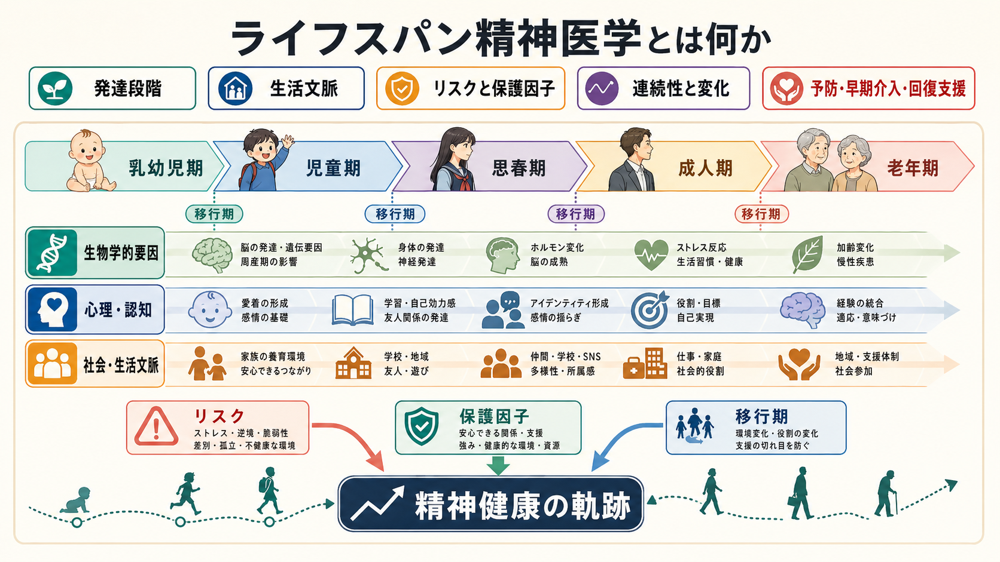
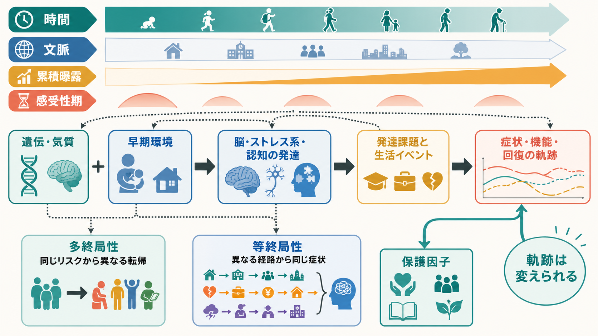
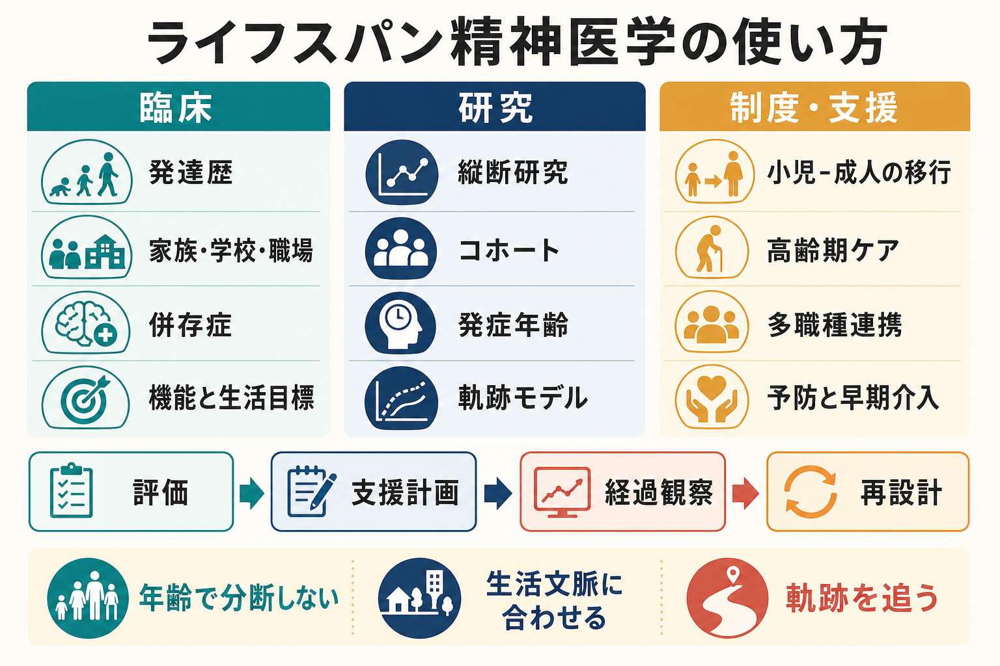

# ライフスパン精神医学とは何か

## 要点

- ライフスパン精神医学は、精神疾患を「ある時点の症状」だけでなく、乳幼児期、児童期、思春期、成人期、老年期へ続く発達軌跡と生活文脈の中で理解する枠組みである。
- 重要なのは、年齢そのものではなく、発達課題、脳・身体の成熟、家族・学校・職場・地域、社会的決定要因、リスク因子と保護因子の相互作用である[1][2]。
- 精神疾患の多くは若年期に始まるが、症状の意味、支援の焦点、回復の形はライフステージによって変わる[5]。
- 「同じリスクが同じ結果を生む」とは限らない。発達精神病理学でいう多終局性と等終局性は、ライフスパン精神医学の中心概念である[4]。
- 本記事は教育・研究目的の整理であり、個別の診断や治療指示ではない。

## この記事で答える問い

1. ライフスパン精神医学は、従来の精神医学と何が違うのか。
2. 精神疾患を発達段階と生活文脈の中で見るとは、具体的にどういうことか。
3. 臨床評価、予防、早期介入、研究デザインにどのように接続するのか。

## まず結論

ライフスパン精神医学とは、精神疾患を「診断名の一覧」としてではなく、「時間の中で変化する人間の適応過程」として読むための精神医学である。たとえば不安、抑うつ、注意困難、幻覚様体験、認知機能低下は、同じ症状名で記述できても、幼児、思春期の若者、産後の成人、高齢者では意味が異なる。背景にある発達課題、生活環境、身体疾患、認知機能、対人関係、社会的役割が違うからである。

したがって、ライフスパン精神医学は「小児精神医学と老年精神医学を足したもの」ではない。むしろ、[[発達とは何か]]、[[発達精神病理学とは何か]]、[[神経発達の異常は精神疾患にどう関わるのか]]、[[精神疾患の次元的理解とは何か]]をつなぎ、個人の現在の症状を過去の経験と将来の可能性の中に置き直す見方である。

## 背景

精神医学は長く、成人期に確立した診断分類を中心に組み立てられてきた。しかし、精神疾患の発症年齢を集約した大規模メタ解析では、精神疾患全体の発症ピークは14.5歳、中央値は18歳であり、発症の約3分の1は14歳以前、約半数は18歳以前、約6割は25歳以前に生じると推定された[5]。この知見は、思春期・若年成人期を重視する必要を示す一方で、成人期や老年期の精神健康を「若年期の結果」だけに還元してよいという意味ではない。

WHOの世界精神保健報告は、精神健康を個人の問題だけでなく、家庭、学校、職場、地域、貧困、差別、暴力、身体疾患、ケアシステムといった環境の中で捉える必要を強調している[1]。さらに life course approach では、健康とウェルビーイングは、感受性期、移行期、累積曝露、世代間要因、保護因子の相互作用によって形づくられると考える[2]。この発想を精神医学に適用したものが、ライフスパン精神医学の核である。

## 基本概念

### 発達軌跡

発達軌跡とは、症状、機能、対人関係、学習、職業、身体健康、認知機能が時間の中でどのように変化するかを表す見方である。ある時点の診断名だけでは、なぜその困難が生じ、どの支援が効きやすく、どの時期に悪化や回復が起こりやすいかを十分に説明できない。

### 生活文脈

生活文脈とは、家族、保育、学校、職場、パートナー関係、地域、文化、経済状況、医療アクセス、身体疾患、介護負担などを含む。ライフスパン精神医学では、症状を「本人の内側」だけに閉じ込めず、どの文脈で強まり、どの文脈で和らぐのかを問う[1][2]。

### 感受性期・移行期・累積曝露

感受性期とは、経験が脳・身体・心理社会的発達に大きな影響を与えやすい時期である。移行期とは、入園・入学、思春期、就職、出産、退職、喪失、介護開始など、役割と環境が大きく変わる時期である。累積曝露とは、ストレスや不利益が長く重なることで、後の健康軌跡に影響する過程である[2][3]。

### 多終局性と等終局性

多終局性とは、似たリスクから異なる転帰が生じることである。等終局性とは、異なる経路から似た症状に至ることである[4]。この2つは、ライフスパン精神医学が「単一原因モデル」を避ける理由をよく示している。たとえば早期逆境があっても、その後の安定した関係、教育、治療、地域資源によって軌跡は変わりうる。一方で、同じ抑うつ症状でも、睡眠障害、喪失体験、身体疾患、発達特性、孤立、職場ストレスなど、複数の入口がありうる。

## 仕組み

ライフスパン精神医学の仕組みは、個人要因と環境要因の反復的な相互作用として理解できる。遺伝的脆弱性や気質は、早期養育、学校経験、仲間関係、身体疾患、社会的支援と相互作用し、注意、感情調整、報酬感受性、ストレス反応、社会的認知などの発達に影響する。NIMHのRDoCも、精神疾患研究では神経発達軌跡と環境との相互作用を明示的に扱う必要があるとしている[6]。

この枠組みでは、リスクは固定された運命ではない。保護因子もまた発達する。安定した愛着関係、予測可能な生活、睡眠、学習機会、社会的所属、治療同盟、身体健康の管理、経済的・制度的支援は、軌跡を変える条件になりうる。Mastenが述べたレジリエンス研究の重要点は、回復力を特別な才能ではなく、日常的な適応システムが比較的よく働く過程として見る点にある[8]。

## 図解

| 図 | 役割 | 読み方 |
|---|---|---|
| 図1 | 概念地図 | 発達段階、生活文脈、リスク・保護因子を同じ時間軸に置く |
| 図2 | 中心メカニズム | 遺伝・気質、早期環境、脳・ストレス系・認知、生活イベントが軌跡を作る流れを見る |
| 図3 | 臨床・研究への接続 | 評価、支援計画、縦断研究、制度設計を年齢横断的に結ぶ |

## 臨床・研究との接続

### 臨床評価

臨床では、現在の症状だけでなく、発達歴、家族歴、学校・職場での適応、身体疾患、睡眠、物質使用、対人関係、生活上の役割、支援資源を統合して評価する。これは診断名を軽視するという意味ではない。診断を、発症時期、重症度、機能障害、併存症、回復可能性の中で使うという意味である。

臨床ステージングは、この考え方と相性がよい。精神疾患を「すでに完成した疾患単位」としてだけでなく、リスク状態、軽症・非特異的状態、明確な症候群、再発・慢性化、機能低下といった段階で捉え、早期であればより低侵襲で予防的な介入を検討する枠組みである[7]。ただし、ステージングは発展途上の研究枠組みであり、個人への過剰な予測やラベルづけに使うべきではない。

### 予防と早期介入

精神疾患の多くが若年期に始まるという知見は、学校、家庭、地域、一次医療、デジタル環境を含む早期支援の重要性を示す[5]。しかしライフスパン精神医学では、若年期だけを重視しない。産後、失業、離婚、移住、慢性疾患、退職、喪失、介護、認知機能低下など、成人期・老年期にも新しい脆弱性と介入機会がある。

### 研究

研究では、横断研究だけではなく、縦断研究、出生コホート、臨床コホート、反復測定、軌跡モデル、発症年齢、機能転帰、環境曝露、保護因子を組み合わせる必要がある。ライフスパン精神医学は、診断横断的な次元、発達段階、社会的文脈を同時に扱うため、[[RDoCは精神疾患研究をどう変えたのか]]や[[精神疾患における機能的結合異常とは何か]]とも接続する。

## よくある誤解

### 誤解1: ライフスパン精神医学は小児精神医学の別名である

小児・思春期は非常に重要だが、ライフスパン精神医学は乳幼児期から老年期までを扱う。成人期の発症、再発、回復、身体疾患との相互作用、認知機能低下、介護環境も中心的な対象である。

### 誤解2: 早期経験がすべてを決める

早期経験は重要だが、決定論ではない。発達軌跡は、その後の関係、教育、治療、生活環境、社会制度、本人の意味づけによって変わりうる[8]。

### 誤解3: 年齢別に診断を分ければ十分である

年齢は手がかりにすぎない。同じ年齢でも、発達水準、文化、身体健康、支援資源、社会的役割は大きく異なる。ライフスパン精神医学の焦点は、年齢カテゴリーではなく、時間、文脈、機能、移行期、軌跡である。

### 誤解4: 脳・遺伝・社会のどれか一つが本当の原因である

ライフスパン精神医学は、単一原因を探すよりも、複数の要因がどの時期にどのように結びつくかを問う。脳、身体、心理、対人関係、社会制度は、別々の層ではなく相互作用する層である[3][6]。

## 関連ノート

- [[発達とは何か]]
- [[発達段階理論とは何か]]
- [[発達精神病理学とは何か]]
- [[神経発達の異常は精神疾患にどう関わるのか]]
- [[精神疾患の次元的理解とは何か]]
- [[RDoCは精神疾患研究をどう変えたのか]]
- [[トラウマは発達にどう影響するのか]]
- [[養育環境は発達にどう影響するのか]]
- [[レジリエンスは発達過程でどう育つのか]]
- [[成人発達とは何か]]
- [[老年期の心理発達とは何か]]
- [[概日リズムの乱れは精神疾患にどう関わるのか]]

## MOC更新候補

- `content/00_MOC/MOC｜精神医学.md`
- `content/00_MOC/MOC｜発達・愛着・社会心理.md`
- `content/00_MOC/MOC｜神経科学と精神疾患.md`

## 理解チェック

1. ライフスパン精神医学が「年齢別精神医学」だけではない理由を説明できるか。
2. 多終局性と等終局性を、それぞれ臨床例に近い形で説明できるか。
3. 発達歴、生活文脈、現在の症状、将来の支援計画を一つの軌跡として整理できるか。
4. 若年期の早期介入と、成人期・老年期の支援機会を同時に考えられるか。

## 未解決問題

- ライフスパン全体を追跡する縦断データは高コストで、脱落や測定差の影響を受けやすい。
- 発症年齢、初発症状、初診、診断確定、機能低下のどれを「発症」とみなすかで結論が変わりうる。
- 発達軌跡モデルを個人の予測に使う場合、過剰なラベルづけや自己成就的予言を避ける必要がある。
- 文化、貧困、差別、医療アクセスを含む社会的決定要因を、神経生物学的モデルとどう統合するかはまだ発展途上である。

## 参考文献

[1] World Health Organization. (2022). *World mental health report: Transforming mental health for all*. World Health Organization. https://iris.who.int/handle/10665/356119

[2] World Health Organization. (2025). *Framework to implement a life course approach in practice*. World Health Organization. https://www.who.int/publications/i/item/9789240112575

[3] Halfon, N., & Hochstein, M. (2002). Life course health development: An integrated framework for developing health, policy, and research. *The Milbank Quarterly, 80*(3), 433-479. https://doi.org/10.1111/1468-0009.00019

[4] Cicchetti, D., & Rogosch, F. A. (1996). Equifinality and multifinality in developmental psychopathology. *Development and Psychopathology, 8*(4), 597-600. https://doi.org/10.1017/S0954579400007318

[5] Solmi, M., Radua, J., Olivola, M., et al. (2022). Age at onset of mental disorders worldwide: Large-scale meta-analysis of 192 epidemiological studies. *Molecular Psychiatry, 27*, 281-295. https://doi.org/10.1038/s41380-021-01161-7

[6] National Institute of Mental Health. (n.d.). *Developmental and Environmental Aspects*. Research Domain Criteria (RDoC). https://www.nimh.nih.gov/research/research-funded-by-nimh/rdoc/developmental-and-environmental-aspects

[7] McGorry, P. D., Hickie, I. B., Yung, A. R., Pantelis, C., & Jackson, H. J. (2006). Clinical staging of psychiatric disorders: A heuristic framework for choosing earlier, safer and more effective interventions. *Australian and New Zealand Journal of Psychiatry, 40*(8), 616-622. https://doi.org/10.1080/j.1440-1614.2006.01860.x

[8] Masten, A. S. (2001). Ordinary magic: Resilience processes in development. *American Psychologist, 56*(3), 227-238. https://doi.org/10.1037/0003-066X.56.3.227
