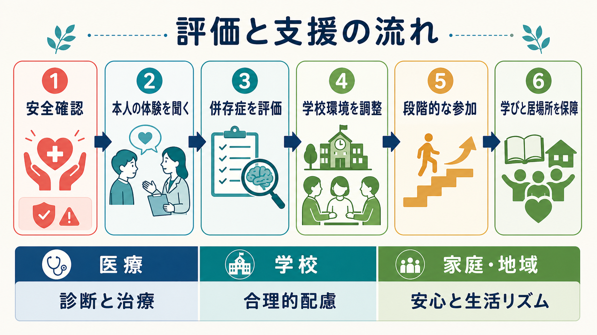
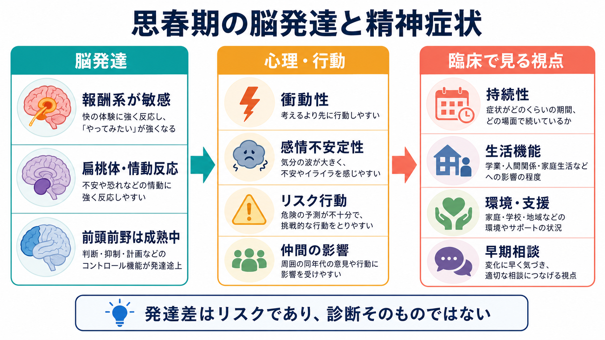

# 不登校は精神医学的にどう理解するのか

## 要点

- 不登校は単一の精神疾患名ではなく、学校に行く・学校に居続けることが難しくなった状態を指す教育・臨床上の現象である。
- 精神医学的には、[[不安症群とは何か]]、[[分離不安症とは何か]]、[[社交不安症とは何か]]、[[児童青年期うつ病とは何か]]、[[発達障害群とは何か]]、[[ADHDとは何か]]、[[自閉スペクトラム症とは何か]]などの併存・背景を評価する。
- ただし、診断名だけでは不登校は説明できない。家庭の安全感、親子関係、睡眠リズム、経済・養育ストレス、いじめ、学業のつまずき、感覚過敏、教師との関係、校内の居場所の有無が相互作用する。
- 支援の目標は「すぐ毎日登校させる」だけではない。文部科学省は、登校という結果のみを目標にせず、社会的自立、休養、学習機会、個別状況に応じた支援を重視している [2]。
- 本記事は教育・研究目的の整理であり、個別の診断や治療指示ではない。自傷、自殺念慮、虐待、いじめ、重いうつ症状、急な体重減少、精神病症状が疑われる場合は、早めに医療・福祉・学校の支援につなぐ。

## この記事で答える問い

1. 不登校は、精神医学的には病気なのか、環境反応なのか。
2. 不安症、発達特性、うつ病は不登校にどう関わるのか。
3. 家庭要因と学校要因を、本人の問題に還元せずにどう評価するのか。
4. 支援では、登校再開、休養、学習保障、環境調整をどう統合して考えるのか。

## まず結論

不登校は「怠け」「甘え」「親のせい」「学校のせい」のどれか一つで説明できる現象ではない。精神医学的には、本人の内在化症状、不安回避、抑うつ、神経発達特性、身体症状、睡眠、家庭内ストレス、学校での安全感、学業負荷、対人関係が絡み合った状態として評価するのが実用的である [3][6]。

日本の行政統計では、長期欠席は年度内に通算30日以上欠席した児童生徒を指す。文部科学省の令和6年度調査では、小・中学校の不登校児童生徒数は約35万4千人で過去最多となり、高等学校の不登校生徒数は約6万8千人と報告された [1]。この数字は「子どもが弱くなった」という単純な説明ではなく、学校環境、家庭環境、相談アクセス、発達特性への配慮、コロナ禍後の登校観の変化などを含めて読む必要がある。

## 背景

臨床でよく使われる school refusal は、強い不安や苦痛、身体症状、抑うつ、対人場面への恐怖などを背景に、学校へ行くこと、または一日学校にとどまることが難しくなる状態を指す。無断欠席や反社会的行動を主とする「怠学」とは区別されることが多いが、現実には両者が重なることもある [4]。

重要なのは、不登校を「学校に行かない行動」だけで見ないことである。子どもが朝に腹痛や頭痛を訴え、家にいると症状が軽くなる場合、身体化された不安が関わることがある。思春期では、社交不安、パニック様症状、抑うつ、いじめ、成績不振、発達特性による疲弊、家庭内葛藤が前景に出ることもある [4][5]。

## 基本概念

### 不登校は診断名ではない

不登校は DSM や ICD の独立した診断名ではない。したがって、[[DSMとICDは何が違うのか]]で扱うような診断分類だけで「不登校の原因」を決めることはできない。診断は、支援の仮説を立てるための一部であり、本人が何に苦痛を感じ、何を避けることで一時的に楽になり、何が長期的な困難を強めているかを合わせて見る必要がある。

### 不安症

不安症は不登校の代表的背景である。分離不安では、保護者や家から離れることへの強い恐怖が中心になる。社交不安では、教室、発表、給食、休み時間、視線、からかわれる可能性が強い脅威になる。全般不安では、成績、失敗、遅刻、先生に怒られること、友人関係などへの持続的な心配が広がる [4][5]。

不安が強い場合、欠席は短期的には苦痛を下げる。しかし、その経験が「学校に行かなければ楽になる」という学習を強めると、次の登校場面の不安はさらに高くなりやすい。この回避の悪循環は、認知行動療法や段階的曝露でよく扱われる [8]。

### うつ病

[[うつ病とは何か]]や[[児童青年期うつ病とは何か]]で扱うように、子ども・青年のうつ病は、悲しみだけでなく、いらだち、疲労、睡眠リズムの乱れ、興味の低下、集中困難、身体症状、自己否定として現れることがある。学校に行けないことが抑うつを強める場合もあれば、抑うつのために登校準備や対人接触が困難になる場合もある [5][6]。

うつ病が疑われる場合、「行けば慣れる」とだけ考えるのは危険である。自殺念慮、自傷、希死念慮、食欲・体重変化、睡眠の著しい変化、精神運動制止、強い罪責感があるときは、登校計画よりも安全確認と医療的評価を優先する。

### 発達特性

発達特性は、不登校の「原因」というより、学校環境との適合を左右する重要な条件である。ASD では、感覚過敏、予測困難な対人場面、暗黙のルール、集団活動、急な予定変更が大きな負荷になりうる。ADHD では、忘れ物、遅刻、叱責、課題未提出、集中困難が自己効力感を下げ、学校回避につながることがある。

自閉スペクトラム症児の学校欠席に関するスコーピングレビューでは、自閉スペクトラム症の子ども・青年は非自閉の同世代より欠席リスクが高く、併存する精神健康問題、いじめ、学校側の理解不足などが関わることが示されている [7]。発達特性を見落とすと、「努力不足」「わがまま」と誤解され、二次的な不安・抑うつを強めやすい。

## 仕組み

### 回避サイクル

不登校を維持する典型的な仕組みは、次のように整理できる。

1. 学校刺激、対人場面、学業課題、評価場面が脅威として感じられる。
2. 不安、腹痛、頭痛、吐き気、動悸、涙、怒り、フリーズが起きる。
3. 欠席すると一時的に安心する。
4. 学習の遅れ、友人との距離、罪悪感、生活リズムの乱れが増える。
5. 次に登校するハードルがさらに高くなる。

Kearney と Silverman の機能分析モデルでは、学校拒否行動は、嫌悪的な感情や評価場面を避ける、保護者からの注意や安心を得る、学校外の強化子を得る、といった複数の機能から評価される [3]。この視点は、子どもを責めるためではなく、「何を変えれば行動が楽になるのか」を具体化するために使う。

### 家庭要因

家庭要因とは、「家庭が悪い」という意味ではない。家庭は、安心基地、睡眠・食事・生活リズム、親子のコミュニケーション、経済的余裕、きょうだい関係、養育者のメンタルヘルス、相談資源へのアクセスを含む環境である。

不登校が長引くほど、保護者も疲弊しやすい。説得、叱責、見守り、学校との連絡、仕事との両立が重なり、家庭内の緊張が高まることがある。介入研究のレビューでは、学校拒否は家族や学校職員にも影響し、行動的介入では保護者や学校職員との随伴性調整も扱われることが整理されている [8]。

### 学校要因

学校要因には、いじめ、孤立、教師との関係、授業理解の困難、過剰な課題、評価不安、校則、クラス替え、進級・進学、部活動、感覚刺激、合理的配慮の不足、相談しやすさが含まれる。とくに発達特性のある子どもでは、騒音、におい、制服、休み時間の雑踏、曖昧な指示が強い負荷になりうる。

文部科学省の通知は、不登校児童生徒への支援を「登校という結果のみ」を目標にせず、本人の状況に応じた社会的自立、学習機会、教育支援センター、ICT、フリースクール、医療・福祉との連携を含めて考えるよう求めている [2]。これは精神医学的にも妥当で、環境調整なしに症状だけを治療しても、学校場面での負荷が変わらなければ再燃しやすい。

## 図解

臨床評価では、[[5Pモデルとは何か]]のように、素因、誘因、持続因、保護因子、現在の問題を分けると整理しやすい。

| 視点 | 確認すること | 支援につながる問い |
|---|---|---|
| 本人の症状 | 不安、抑うつ、身体症状、睡眠、発達特性、希死念慮 | 何が一番つらいのか |
| 家庭 | 安全感、生活リズム、保護者の疲弊、きょうだい、福祉課題 | 家で安心して回復できるか |
| 学校 | いじめ、学業負荷、教師との関係、感覚環境、居場所 | 学校側で変えられる条件は何か |
| 維持因 | 欠席で一時的に楽になる、学習遅れ、孤立、罪悪感 | 悪循環のどこを小さく切るか |
| 保護因子 | 好きな活動、信頼できる大人、友人、学習意欲、地域資源 | 何を足場に再参加できるか |

## 臨床・研究との接続

### 評価の順序

まず安全確認を行う。自殺念慮、自傷、虐待、家庭内暴力、いじめ、性被害、摂食障害、精神病症状、重い抑うつがあれば、登校目標より安全確保と専門支援を優先する。次に、本人の体験を聞く。本人が言語化できない場合は、身体症状、朝の行動、学校に近づいたときの反応、家での回復度を手がかりにする。

そのうえで、併存症を評価する。不安症、うつ病、ADHD、ASD、強迫症、PTSD、適応障害、身体症状症、睡眠障害、起立性調節障害などが鑑別に入る。ただし、精神疾患の有無だけでなく、学校側の調整可能性、家庭の支援可能性、本人の希望を同時に扱う。

### 支援の方向

不安が中心で、危機的なうつ症状や安全上の問題がない場合には、段階的な再接近が役立つことがある。たとえば、学校の近くまで行く、保健室に短時間滞在する、信頼できる教師に会う、オンラインで授業の一部に参加する、午後から登校する、特定の授業だけ参加するなどである。

学校拒否への心理社会的介入のレビューでは、CBT は登校率を高める中等度のエビデンスがある一方、不安そのものへの効果や全例への有効性は限定的で、個別化と親・学校の関与が重要である [8]。したがって、CBT を「気合いで慣らす技法」と誤解せず、安全感、予測可能性、環境調整、本人の同意、学習補填と組み合わせる必要がある。

## よくある誤解

### 誤解1: 不登校は精神疾患そのものである

不登校は診断名ではない。背景に不安症、うつ病、発達障害群などがあることは多いが、学校環境や家庭状況が主な負荷になっている場合もある。診断名を探すだけでは、支援の焦点を見誤る。

### 誤解2: 原因は本人・親・学校のどれか一つである

多くの場合、原因は一つではない。本人の不安、家庭の疲弊、学校での孤立、学業の遅れが循環している。誰かを原因として名指しするより、維持因と保護因子を分けて、変えられる条件から調整するほうが実践的である。

### 誤解3: 休ませると必ず悪化する

休養が必要な時期はある。文部科学省も、不登校の時期が休養や自分を見つめ直す意味を持つ場合があると述べている [2]。ただし、休養が孤立、昼夜逆転、学習機会の喪失、罪悪感につながっているなら、休むか登校するかの二択ではなく、安心できる学びと関係を再構成する必要がある。

### 誤解4: 登校できれば解決である

登校は重要な指標だが、唯一の指標ではない。教室に座っていても、強い恐怖、孤立、感覚過負荷、抑うつが続いていれば、本人の生活機能は回復していない。逆に、学校外の学習、相談、社会参加が回復の足場になる場合もある。

## 関連ノート

- [[児童精神医学とは何か]]
- [[子どもの精神症状は大人と何が違うのか]]
- [[子どものアセスメントでは何を確認するのか]]
- [[児童青年期うつ病とは何か]]
- [[うつ病とは何か]]
- [[不安症群とは何か]]
- [[分離不安症とは何か]]
- [[社交不安症とは何か]]
- [[不安症とうつ病はどう併存するのか]]
- [[発達障害群とは何か]]
- [[ADHDとは何か]]
- [[自閉スペクトラム症とは何か]]
- [[愛着とは何か]]
- [[5Pモデルとは何か]]
- [[DSMとICDは何が違うのか]]

## MOC更新候補

- `content/00_MOC/` 配下の精神医学、児童青年期精神医学、発達・ライフスパン関連MOCに `[[不登校は精神医学的にどう理解するのか]]` を追加する。
- 並列生成ジョブとの衝突を避けるため、この作業ではMOC本体は更新しない。

## 理解チェック

1. 不登校が DSM/ICD の診断名ではないことは、評価や支援にどのような意味を持つか。
2. 回避サイクルでは、欠席による一時的な安心がなぜ次の登校を難しくしうるのか。
3. 発達特性のある子どもの不登校を「本人の努力不足」と見ると、何を見落とすか。
4. 「登校を目標にしない」と「学習や社会参加を放置する」は、どのように違うか。

## 未解決問題

- 日本の不登校統計において、精神疾患、発達特性、学校環境、家庭要因をどの程度まで分けて把握できるか。
- CBT、親支援、学校環境調整、ICT学習、教育支援センター、フリースクールのどの組み合わせが、どのタイプの不登校に有効か。
- 「学校拒否」「不登校」「学校に行けない」「school distress」などの用語が、本人・保護者・学校・医療者の理解と支援アクセスにどう影響するか。

## 参考文献

[1] 文部科学省. (2026). 令和6年度児童生徒の問題行動・不登校等生徒指導上の諸課題に関する調査結果. https://www.mext.go.jp/a_menu/shotou/seitoshidou/1302902.htm

[2] 文部科学省. (2019). 「不登校児童生徒への支援の在り方について（通知）」令和元年10月25日. https://www.mext.go.jp/a_menu/shotou/seitoshidou/1422155.htm

[3] Kearney, C. A., & Silverman, W. K. (1990). A preliminary analysis of a functional model of assessment and treatment for school refusal behavior. *Behavior Modification*, 14(3), 340-366. https://doi.org/10.1177/01454455900143007

[4] American Academy of Child and Adolescent Psychiatry. (2018). School Refusal. *Facts for Families*, No. 7. https://www.aacap.org/AACAP/Families_and_Youth/Facts_for_Families/FFF-Guide/School-Refusal-007.aspx

[5] Centers for Disease Control and Prevention. (2025). Anxiety and Depression in Children. https://www.cdc.gov/children-mental-health/about/about-anxiety-and-depression-in-children.html

[6] Di Vincenzo, C., Pontillo, M., Bellantoni, D., Di Luzio, M., Lala, M. R., Villa, M., Demaria, F., & Vicari, S. (2024). School refusal behavior in children and adolescents: a five-year narrative review of clinical significance and psychopathological profiles. *Italian Journal of Pediatrics*, 50, 107. https://doi.org/10.1186/s13052-024-01667-0

[7] Nordin, V., Palmgren, M., Lindbladh, A., Bölte, S., & Jonsson, U. (2024). School absenteeism in autistic children and adolescents: A scoping review. *Autism*, 28(7), 1622-1637. https://doi.org/10.1177/13623613231217409

[8] Maynard, B. R., Brendel, K. E., Bulanda, J. J., Heyne, D., Thompson, A. M., & Pigott, T. D. (2015). Psychosocial interventions for school refusal with primary and secondary school students: A systematic review. *Campbell Systematic Reviews*, 11(1), 1-76. https://doi.org/10.4073/csr.2015.12
