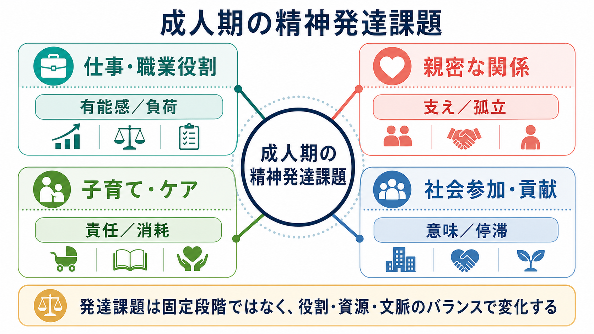
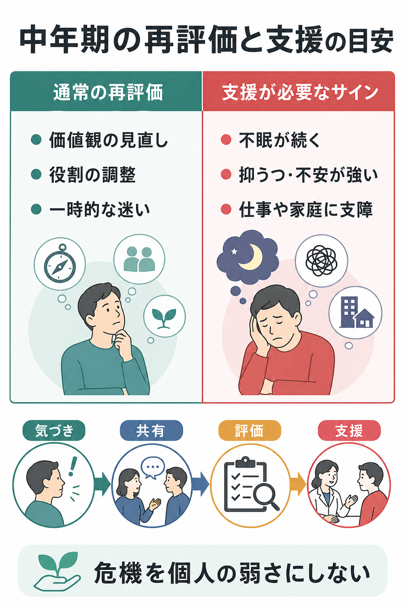

# 中年期の危機とは何か

## 要点

- 中年期の危機は、すべての人に起こる発達段階ではなく、仕事、家庭、身体変化、親の介護、死や老いへの意識が重なったときに、自己理解と生活構造を再調整する過程として現れやすい。
- 実証研究では、「40代から50代には必ず危機が来る」というより、主観的な危機経験、生活イベント、役割負荷、健康状態、支援資源の組み合わせで説明する方が妥当である[1][2][3]。
- 中年期は、若年期の拡大と老年期の制約の間にあり、職業上の責任、子育て、親の介護、身体機能の変化が同時に集まりやすい[1]。
- 強い不眠、抑うつ、不安、飲酒量の増加、自殺念慮、仕事や家庭機能の低下が続く場合は、「成長のための悩み」と片づけず、評価と支援につなげる。
- 本記事は教育・研究目的の整理であり、個別の診断や治療指示ではない。

## この記事で答える問い

1. 「中年期の危機」は心理学・精神医学的にどこまで実在する概念なのか。
2. 仕事、家庭、身体変化、親の介護は、自己理解と精神健康にどう影響するのか。
3. 通常の再評価と、臨床的支援が必要な不調はどう区別して考えればよいのか。

## まず結論

中年期の危機とは、年齢だけで自動的に生じる病名ではない。むしろ、人生の残り時間への意識、職業的な到達点、家族内役割、身体の変化、親世代の老いが同時に迫ることで、「これまでの自分の物語」と「これから可能な生活」のずれが目立つ状態である。

そのため、中年期の危機は [[アイデンティティとは何か]] や [[自己概念とは何か]] の問題であると同時に、[[ライフイベントと精神疾患はどう関係するのか]]、[[ストレス脆弱性モデルとは何か]]、[[職場メンタルヘルスで多い疾患には何があるのか]] にも接続する。危機という語は劇的だが、実際には「急に人生を壊す出来事」よりも、慢性的な負荷、期待とのずれ、支援不足、身体的変化が積み重なる形で現れやすい。



## 背景

中年期はしばしば「人生の折り返し」と呼ばれる。しかし、発達心理学では、中年期を単なる衰えの始まりとは見ない。Lachman らは、中年期を若年期と老年期の交差点にある重要な時期と位置づけ、認知、身体健康、社会的役割、感情調整、職業的熟達が同時に変化する時期として整理している[1]。

一方で、「中年期には誰もが危機を経験する」という見方は強すぎる。Wethington は、米国の成人を対象に、中年期の危機がどのように語られるかを検討し、多くの人が危機を年齢そのものよりも、離婚、病気、失業、家族問題などの出来事と結びつけて説明することを示した[2]。Freund と Ritter も、中年期の危機は広く知られた文化的物語である一方、普遍的・必然的な発達段階として扱うには根拠が弱いと論じている[3]。

幸福感が中年期に低くなるという U 字型仮説もある。Blanchflower と Oswald は、多国データから人生満足度が中年期に低下し、その後上昇する傾向を報告した[4]。ただし、この結果は平均的傾向であり、個人の危機を直接予測するものではない。文化、健康、経済状況、家族構成、仕事の安定性によって、中年期の経験は大きく異なる。

## 基本概念

### 中年期の危機

中年期の危機とは、一般に40代から50代前後に語られる自己再評価の強い時期を指す。典型的には、「この仕事を続けるのか」「家族の中で自分は何を担っているのか」「身体の変化をどう受け入れるのか」「親の老いにどう向き合うのか」「残された時間で何を大切にするのか」といった問いが前景化する。

ただし、これは DSM や ICD の診断名ではない。臨床的には、[[うつ病とは何か]]、[[適応障害とは何か]]、[[バーンアウトとは何か]]、不安症、物質使用、睡眠障害、身体疾患に伴う精神症状などを丁寧に鑑別する必要がある。

### 自己理解の再編

中年期の中心課題は、「過去の達成」と「今後の制約」を同時に見ながら、自己理解を作り直すことである。若年期には将来可能性が広く感じられやすいが、中年期には選ばなかった道、身体的限界、家族責任、職業上の天井が見えやすくなる。その結果、自己評価が揺らぎやすい。

しかし、この揺らぎは必ずしも病的ではない。むしろ、価値観の見直し、役割の配分、生活リズムの調整、関係性の再交渉につながれば、適応的な再編になりうる。

### 役割負荷

中年期には、複数の役割が同時に重なりやすい。仕事では管理職や専門職として責任が増え、家庭では子育て、パートナー関係、家計、親の介護が重なることがある。このような仕事家庭葛藤は、心理的ストレス、職務満足度の低下、家庭満足度の低下と関連することがメタ分析で示されている[5]。

## 仕組み

中年期の危機は、次のような連鎖として理解すると見通しがよい。

1. 仕事や家庭で責任が増える。
2. 睡眠、運動、趣味、友人関係に使える時間が減る。
3. 身体変化や疲労回復の遅さが目立つ。
4. 「本当はこうなっているはずだった」という期待とのずれが強くなる。
5. 自己評価が下がり、焦り、怒り、抑うつ、不安、孤立が生じる。
6. 相談や役割調整ができれば再編に進むが、支援不足なら不調が固定化する。

親の介護は、この連鎖を強める代表的な要因である。介護者は非介護者に比べてストレスや抑うつが高くなりやすいことが報告されており、介護そのものだけでなく、仕事との両立、睡眠不足、経済的負担、きょうだい間の不公平感も影響する[6]。

女性では、更年期移行期にホルモン変動、睡眠障害、血管運動症状、ライフイベントが重なることがあり、抑うつ症状のリスク評価では身体症状と心理社会的背景を分けずに確認する必要がある[7]。ただし、すべての更年期症状を精神医学化するのも、すべての不調をホルモンだけで説明するのも不十分である。

## 図解



| 観点 | 通常の再評価 | 支援が必要なサイン |
|---|---|---|
| 気分 | 迷いや寂しさはあるが、回復する時間もある | 抑うつ、不安、怒り、絶望感が続く |
| 生活機能 | 仕事や家庭の役割を調整できる | 欠勤、家事困難、対人回避が目立つ |
| 身体 | 疲労や体力低下を自覚し、生活を見直す | 不眠、食欲変化、痛み、飲酒増加が続く |
| 自己理解 | 価値観や優先順位を見直す | 自責、無価値感、希死念慮が出る |
| 支援 | 家族・友人・職場と相談できる | 孤立し、相談先がない |

### 追加図解案

メカニズム図としては、次の日本語インフォグラフィックが有用である。今回の生成では主題からずれたため、存在しない画像リンクは挿入しない。

```text
タイトル: 中年期の危機が生じる仕組み
構成: 「役割負荷」→「身体変化」→「時間展望の変化」→「期待とのずれ」→「自己理解の再編」
下段: 緩衝因子として「睡眠・運動・相談・役割調整」
注記: 長引く不眠・抑うつ・不安は支援につなぐ
画風: 白背景、読みやすい日本語、仕事・家庭・親の介護・健康診断のアイコンを使う教育用インフォグラフィック
```

## 臨床・研究との接続

臨床では、「中年期だから仕方ない」と一般化せず、症状、生活機能、身体疾患、薬剤、睡眠、飲酒、家族状況、職場環境、自殺リスクを確認する。特に、[[身体疾患に伴う抑うつ症状とは何か]]、[[身体疾患に伴う不安症状とは何か]]、[[老年期うつ病とは何か]] と連続する視点が重要である。

研究では、中年期の危機を単一の出来事として測るより、縦断研究で役割負荷、健康変化、介護、仕事家庭葛藤、主観的年齢、時間展望、社会的支援を追跡する必要がある。幸福感の U 字型仮説は有用な入口だが、平均値の曲線を個人の説明に直結させると、文化差や社会経済的条件を見落とす[4]。

支援では、本人の性格や弱さに還元しないことが重要である。役割調整、職場での負荷軽減、介護サービス、睡眠と身体疾患の評価、家族内コミュニケーション、心理的支援を組み合わせる。これは [[レジリエンスは学習されるのか]] や [[自己効力感とは何か]] とも接続する。

## よくある誤解

### 誤解1: 中年期の危機は誰にでも必ず起こる

必ず起こるわけではない。中年期に自己再評価が増えやすいとしても、危機として経験するかどうかは、健康、経済、家族、職場、介護、社会的支援によって変わる[1][3]。

### 誤解2: 危機は突然の衝動的行動として現れる

映画や俗説では、突然の転職、浪費、恋愛、離婚などで描かれやすい。しかし実際には、疲労、不眠、孤立、仕事家庭葛藤、身体不調、介護負担が少しずつ積み重なることが多い。

### 誤解3: 中年期の不調は自己実現の問題だけである

自己理解は重要だが、身体疾患、睡眠、薬剤、ホルモン変化、職場環境、介護負担、経済的不安も同時に見る必要がある。心理だけで説明すると、支援可能な環境要因を見落とす。

### 誤解4: つらさを感じること自体が失敗である

つらさは、生活構造が現在の能力や価値観に合わなくなっているサインかもしれない。問題は、迷うことではなく、孤立したまま評価と支援に届かないことである。

## 関連ノート

- [[ライフスパン精神医学とは何か]]
- [[ライフイベントと精神疾患はどう関係するのか]]
- [[アイデンティティとは何か]]
- [[自己概念とは何か]]
- [[ストレス脆弱性モデルとは何か]]
- [[バーンアウトとは何か]]
- [[職場メンタルヘルスで多い疾患には何があるのか]]
- [[適応障害とは何か]]
- [[うつ病とは何か]]
- [[身体疾患に伴う抑うつ症状とは何か]]
- [[レジリエンスは学習されるのか]]

MOC 更新候補: `content/00_MOC/` 配下の精神医学、発達・ライフスパン、職場メンタルヘルス、臨床心理関連 MOC。並列ジョブとの衝突を避けるため、本記事では MOC 本体は更新しない。

## 理解チェック

1. 中年期の危機を「年齢だけで必ず起こるもの」と見なすと、どのような要因を見落とすか。
2. 仕事家庭葛藤、親の介護、身体変化は、自己理解の再編にどう関わるか。
3. 通常の再評価と、臨床的支援が必要な不調を分ける観点は何か。
4. 中年期の不調を「本人の弱さ」に還元しないために、どのような環境要因を確認すべきか。

## 未解決問題

- 中年期の危機を測定する尺度は、文化的物語と実際の精神健康変化をどこまで分離できるか。
- 幸福感の U 字型は、国、性別、雇用形態、所得、家族構成によってどの程度変わるか。
- 親の介護、子育て、管理職責任が重なる「多重役割期」に、どの支援が最も効果的か。
- 更年期移行期の身体症状、睡眠、抑うつ、不安を、過不足なく統合評価する実践モデルはどう設計できるか。

## 参考文献

[1] Lachman, M. E., Teshale, S., & Agrigoroaei, S. (2015). Midlife as a pivotal period in the life course: Balancing growth and decline at the crossroads of youth and old age. *International Journal of Behavioral Development, 39*(1), 20-31. https://doi.org/10.1177/0165025414533223

[2] Wethington, E. (2000). Expecting stress: Americans and the “midlife crisis”. *Motivation and Emotion, 24*, 85-103. https://doi.org/10.1023/A:1005611230993

[3] Freund, A. M., & Ritter, J. O. (2009). Midlife crisis: A debate. *Gerontology, 55*(5), 582-591. https://doi.org/10.1159/000227322

[4] Blanchflower, D. G., & Oswald, A. J. (2008). Is well-being U-shaped over the life cycle? *Social Science & Medicine, 66*(8), 1733-1749. https://doi.org/10.1016/j.socscimed.2008.01.030

[5] Amstad, F. T., Meier, L. L., Fasel, U., Elfering, A., & Semmer, N. K. (2011). A meta-analysis of work-family conflict and various outcomes with a special emphasis on cross-domain versus matching-domain relations. *Journal of Occupational Health Psychology, 16*(2), 151-169. https://doi.org/10.1037/a0022170

[6] Pinquart, M., & Sorensen, S. (2003). Differences between caregivers and noncaregivers in psychological health and physical health: A meta-analysis. *Psychology and Aging, 18*(2), 250-267. https://doi.org/10.1037/0882-7974.18.2.250

[7] Maki, P. M., Kornstein, S. G., Joffe, H., Bromberger, J. T., Freeman, E. W., Athappilly, G., Bobo, W. V., Rubin, L. H., Koleva, H. K., Cohen, L. S., & Soares, C. N. (2018). Guidelines for the evaluation and treatment of perimenopausal depression: Summary and recommendations. *Menopause, 25*(10), 1069-1085. https://doi.org/10.1097/GME.0000000000001174
