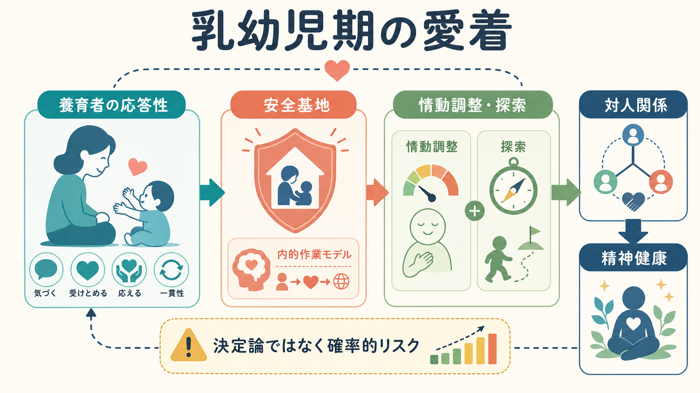
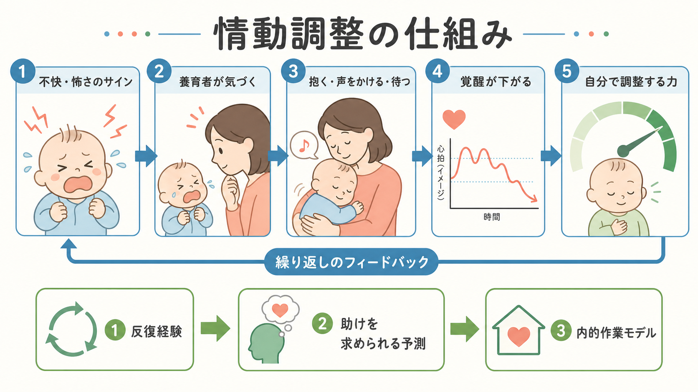
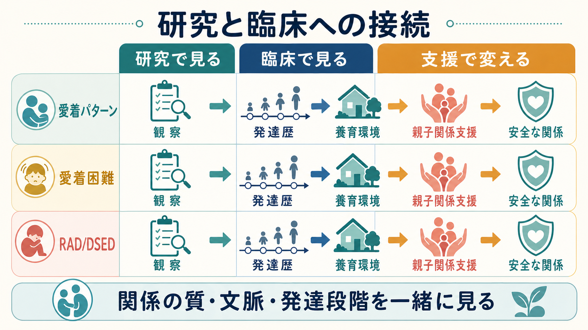

# 乳幼児期の愛着は精神健康にどう関わるのか

## 要点

- [[愛着とは何か|愛着]]は、乳幼児が不安・疲労・痛み・見知らぬ状況に直面したとき、特定の養育者へ近づき、安心を回復しようとする関係システムである[1]。
- 安定した愛着は、単に「甘える関係」ではなく、安心して離れ、探索し、困ったら戻れる[[安全基地とは何か|安全基地]]として働く[2]。
- 精神健康への関わりは、情動の共同調整、対人予測、自己理解、ストレスへの対処、助けを求める行動を通じて生じる。
- 不安定・無秩序な愛着は、外在化問題や内在化症状と統計的に関連するが、その効果は決定論ではない[3][4][5]。
- 介入では、養育者を責めるよりも、応答性・予測可能性・安全な関係を増やす支援が重要になる[6][8]。

## この記事で答える問い

1. 乳幼児期の愛着は、どのように情動調整の土台になるのか。
2. 愛着は、後の対人関係や精神健康にどのような経路で関わるのか。
3. 「愛着パターン」と「愛着障害」は何が違うのか。
4. 研究・臨床・支援では、愛着をどのように扱うべきか。

## まず結論

乳幼児期の愛着は、精神健康を直接に決める「原因ラベル」ではない。むしろ、乳幼児が強い不快や恐怖を経験したときに、養育者との反復的なやりとりを通じて「自分の状態は落ち着けられる」「誰かに助けを求められる」「他者は近づいてよい存在である」といった予測を作る過程である[1][2]。この予測は[[内的作業モデルとは何か|内的作業モデル]]として、情動調整、探索、対人関係、支援希求に影響する。

ただし、愛着は精神疾患を一対一で説明しない。子どもの気質、神経発達特性、家庭の負担、貧困、差別、保育・学校環境、トラウマ、支援資源が重なって、発達経路は変わる。したがって臨床では、愛着を「親のせい」や「子どもの固定的欠陥」としてではなく、[[発達精神病理学とは何か|発達精神病理学]]的な相互作用の一部として読む必要がある。

## 背景

Bowlby は、子どもが養育者に近づく行動を、空腹の副産物ではなく、生存と探索を支える行動システムとして理論化した[1]。Ainsworth らは[[ストレンジシチュエーション法とは何か|ストレンジシチュエーション法]]を用いて、分離と再会場面における乳児の行動から、安定型、回避型、抵抗・アンビバレント型などの愛着パターンを記述した[2]。

この枠組みで重要なのは、愛着が「母親が好きかどうか」の単純な測定ではない点である。見ているのは、乳幼児が不安を感じたときに、どのように近づき、避け、怒り、探索に戻り、相手の応答を予測するかである。したがって愛着研究は、[[愛着スタイルにはどのような種類があるのか|愛着スタイル]]、[[養育環境は発達にどう影響するのか|養育環境]]、ストレス調整、対人学習をつなぐ研究領域として発展してきた。

## 基本概念

### 愛着パターン

安定型では、子どもは不安なときに養育者へ近づき、慰められると探索へ戻りやすい。回避型では、再会時に近づきたい動機を抑えるように見えることがあり、抵抗・アンビバレント型では、近づきながら怒りや落ち着きにくさが目立つことがある[2]。無秩序・無方向型では、近づく行動と避ける行動がまとまりにくく、恐怖や混乱を示す行動が観察される[3]。

### 安全基地

安全基地とは、子どもが「必要なら戻れる」と感じられる関係の足場である。安全基地があると、子どもは養育者にしがみつくだけでなく、離れて探索し、失敗し、戻り、また試すことができる。これは[[実行機能は子どもでどのように発達するのか|実行機能]]や社会的学習の発達条件にもなる。

### 内的作業モデル

内的作業モデルは、自分と他者についての予測モデルである。「自分は助けられる価値がある」「他者は応答してくれる」「困ったら頼ってよい」といった予測は、対人関係の読み取りや支援希求を支える。一方で、予測が「近づくと拒絶される」「困っても誰も来ない」に偏ると、回避、過剰な警戒、怒り、過度な自己完結につながりうる。

## 仕組み

### 1. 情動の共同調整から自己調整へ

乳幼児は、自分だけで強い覚醒を下げる力がまだ十分ではない。泣く、固まる、しがみつく、視線をそらすといったサインに対して、養育者が気づき、抱く、声をかける、待つ、刺激を減らすなどの応答をする。この反復が、[[情動と認知は分けられるのか|情動]]を「誰かと一緒に調整できるもの」として経験させる。

この過程は、後の自己調整の前段階である。子どもは、最初から「自分で落ち着く」わけではない。外から調整してもらう経験を通じて、身体感覚、感情名、安心できる行動、助けを求めるタイミングを学ぶ。

### 2. 対人予測が関係の選び方を変える

愛着経験は、対人場面の予測に影響する。安定した経験が多い子どもは、困ったときに近づく、相談する、失敗後に修正する行動を取りやすい。一方で、応答が一貫せず、怖さや拒絶が強い環境では、他者への警戒、過剰適応、怒り、回避が合理的な対処として身につくことがある。これは「性格の弱さ」ではなく、過去の環境で学習された対人戦略として理解できる。

### 3. 発達カスケードとして影響する

乳幼児期の愛着は、その時点だけで完結しない。睡眠、食事、探索、保育参加、友人関係、学習、自己評価へ波及し、時間をかけて発達カスケードを作る。たとえば、情動調整が難しいと、保育場面での衝突が増え、叱責や孤立が増え、さらに不安や怒りが強まることがある。逆に、安全な大人や学校での居場所、[[社会的支援は健康にどう影響するのか|社会的支援]]が入ると、回復の経路も開く。

## 図解

| 図 | 役割 | 読み方 |
|---|---|---|
| 図1 | 概念地図 | 養育者の応答性、安全基地、情動調整、対人関係、精神健康を一つの流れとして見る |
| 図2 | メカニズム | 共同調整が反復され、助けを求められる予測と内的作業モデルへつながる流れを見る |
| 図3 | 研究・臨床接続 | 愛着パターン、愛着困難、RAD/DSED を混同せず、観察・発達歴・支援につなげる |

## 臨床・研究との接続

メタ分析では、不安定愛着や無秩序愛着は、後の外在化問題と関連することが示されている[4]。内在化症状との関連も確認されるが、効果は小さく、外在化問題ほど強くないとされる[5]。ここから言えるのは、愛着が精神健康に無関係ではないこと、同時に愛着だけで症状を説明するのは不十分だということである。

臨床では、愛着パターン、愛着困難、反応性愛着症（RAD）や脱抑制型対人交流症（DSED）を区別する必要がある。RAD/DSED は、著しいネグレクトや施設養育などの極端に不十分な養育条件と関連する臨床症候群であり、一般的な「愛着スタイル」と同じ意味ではない[7]。NICE ガイドラインも、子どもの発達歴、現在の養育環境、観察、子ども本人の視点、養育者支援を組み合わせた評価と支援を重視している[8]。

支援の焦点は、養育者の罪責化ではなく、関係の予測可能性を上げることである。介入研究のメタ分析では、養育者の感受性に焦点化した比較的短く行動的な介入が、感受性と愛着安全性の改善に有効であることが示されている[6]。これは、愛着が変化しうる関係過程であることを示す。

## よくある誤解

### 誤解1: 愛着は母親だけの問題である

愛着は特定の養育者との関係を扱うが、母親だけに限定されない。父親、祖父母、里親、保育者など、継続的に応答する大人が安全基地になりうる。重要なのは性別や血縁ではなく、予測可能で安全な応答である。

### 誤解2: 乳幼児期で精神健康は決まる

乳幼児期は重要だが、決定的ではない。後の安全な関係、学校、治療、地域資源、本人の学習によって経路は変わる。愛着はリスクと保護因子の一部であり、運命ではない。

### 誤解3: 不安定愛着は病気である

不安定愛着は診断名ではない。観察される関係パターンであり、文化、状況、測定法、発達段階に依存する。臨床的な愛着障害と混同してはならない[7]。

### 誤解4: 子どもの症状は親の愛情不足で説明できる

この説明は粗すぎる。症状には気質、神経発達、身体疾患、逆境、貧困、差別、学校環境、いじめ、睡眠、家族の負担など複数の経路がある。愛着の視点は、責任追及ではなく、関係と環境のどこを支えると回復しやすいかを考えるために使う。

## 関連ノート

- [[愛着とは何か]]
- [[愛着スタイルにはどのような種類があるのか]]
- [[ストレンジシチュエーション法とは何か]]
- [[安全基地とは何か]]
- [[内的作業モデルとは何か]]
- [[養育環境は発達にどう影響するのか]]
- [[発達精神病理学とは何か]]
- [[トラウマは発達にどう影響するのか]]
- [[逆境的小児期体験ACEとは何か]]
- [[社会的支援は健康にどう影響するのか]]

MOC 更新候補: `content/00_MOC/MOC｜発達・愛着・社会心理.md`、`content/00_MOC/MOC｜精神医学.md`

## 理解チェック

1. 愛着が「甘え」ではなく「安全基地」として働くとは、どういう意味か。
2. 情動の共同調整は、どのように自己調整へつながるか。
3. 不安定愛着と RAD/DSED を混同してはいけない理由は何か。
4. 愛着を決定論として扱うと、臨床・支援上どのような問題が起こるか。
5. 養育者支援で「応答性」と「予測可能性」を高めるとは、どのような支援を指すか。

## 参考文献

[1] Bowlby, J. (1969). *Attachment and Loss: Vol. 1. Attachment*. Basic Books. https://search.worldcat.org/oclc/24186

[2] Ainsworth, M. D. S., Blehar, M. C., Waters, E., & Wall, S. (1978). *Patterns of Attachment: A Psychological Study of the Strange Situation*. Lawrence Erlbaum. https://openlibrary.org/books/OL22127096M/Patterns_of_attachment

[3] van IJzendoorn, M. H., Schuengel, C., & Bakermans-Kranenburg, M. J. (1999). Disorganized attachment in early childhood: Meta-analysis of precursors, concomitants, and sequelae. *Development and Psychopathology, 11*(2), 225-249. https://doi.org/10.1017/S0954579499002035

[4] Fearon, R. P., Bakermans-Kranenburg, M. J., van IJzendoorn, M. H., Lapsley, A. M., & Roisman, G. I. (2010). The significance of insecure attachment and disorganization in the development of children's externalizing behavior: A meta-analytic study. *Child Development, 81*(2), 435-456. https://doi.org/10.1111/j.1467-8624.2009.01405.x

[5] Groh, A. M., Roisman, G. I., van IJzendoorn, M. H., Bakermans-Kranenburg, M. J., & Fearon, R. P. (2012). The significance of insecure and disorganized attachment for children's internalizing symptoms: A meta-analytic study. *Child Development, 83*(2), 591-610. https://doi.org/10.1111/j.1467-8624.2011.01711.x

[6] Bakermans-Kranenburg, M. J., van IJzendoorn, M. H., & Juffer, F. (2003). Less is more: Meta-analyses of sensitivity and attachment interventions in early childhood. *Psychological Bulletin, 129*(2), 195-215. https://doi.org/10.1037/0033-2909.129.2.195

[7] Zeanah, C. H., & Gleason, M. M. (2015). Annual research review: Attachment disorders in early childhood: Clinical presentation, causes, correlates, and treatment. *Journal of Child Psychology and Psychiatry, 56*(3), 207-222. https://pmc.ncbi.nlm.nih.gov/articles/PMC4342270/

[8] National Institute for Health and Care Excellence. (2015). *Children's attachment: Attachment in children and young people who are adopted from care, in care or at high risk of going into care* (NICE Guideline NG26). https://www.nice.org.uk/guidance/ng26

## 未解決問題

- 愛着経験、神経発達特性、貧困、差別、文化的養育規範を、同じ縦断モデルの中でどう扱うか。
- 乳幼児期の愛着評価を、個人のラベリングではなく支援設計に使う方法をどう標準化するか。
- 日本の保育・児童福祉・周産期支援の文脈で、どのような親子関係支援が実装しやすく、効果を測定しやすいか。
