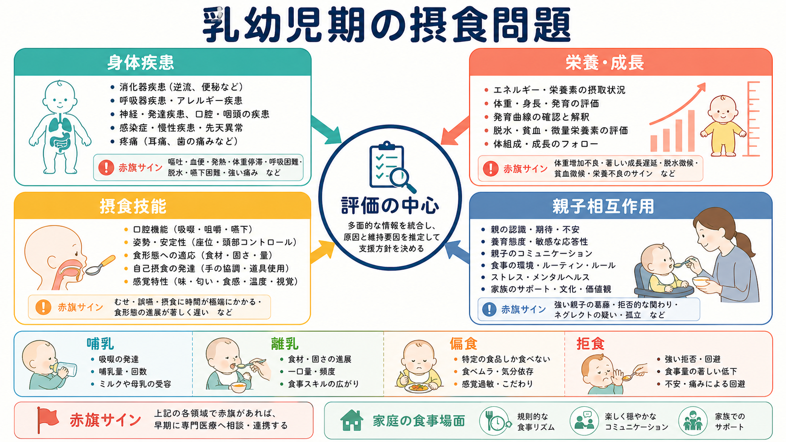
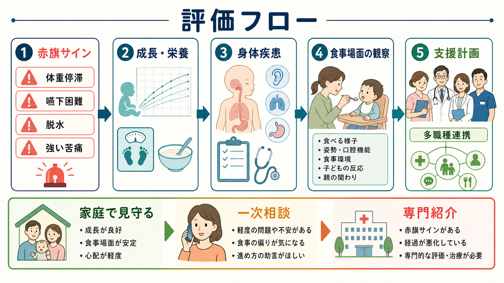

# 乳幼児期の摂食問題はどう評価するのか

## 要点

- 乳幼児期の摂食問題は、「食べない子ども」や「心配しすぎる親」という一方向の見方ではなく、身体疾患、栄養・成長、摂食技能、心理社会的文脈を同時に見る。
- 近年の pediatric feeding disorder（PFD）の枠組みでは、年齢相応の経口摂取が障害され、医学、栄養、摂食技能、心理社会の少なくとも一領域に機能障害を伴う状態として整理する[1]。
- 評価の最初の仕事は、体重増加不良、脱水、嚥下困難、呼吸困難、反復する肺炎、強い痛み、血便、発達退行、ネグレクトの疑いなどの赤旗サインを見落とさないことである[4][5]。
- 赤旗サインが明らかでない場合でも、食事場面の観察、養育者の不安、子どもの感覚・運動・発達特性、家庭の食事リズムを組み合わせて評価する。
- 臨床尺度は診断の代替ではなく、困りごとの見える化、経過観察、専門職連携の入口として使う[6]。

## この記事で答える問い

1. 乳幼児期の哺乳・離乳・偏食・拒食では、最初に何を確認するのか。
2. 身体疾患と親子相互作用を、どの順番で切り分けるのか。
3. 家庭で見える食事の困りごとを、臨床評価や研究尺度にどう接続するのか。

## まず結論

乳幼児期の摂食問題は、まず安全と成長を確認し、そのうえで「身体疾患」「栄養・成長」「摂食技能」「親子相互作用」の4領域に分けて評価する。これは、親子相互作用を軽視するためではなく、身体的な苦痛や嚥下の危険を見落とさずに、食事場面で何が維持要因になっているかを観察するためである[1][5]。

この視点は、[[乳幼児精神医学とは何か]]、[[子どものアセスメントでは何を確認するのか]]、[[乳幼児期の愛着は精神健康にどう関わるのか]]と接続する。乳幼児の食事は、栄養摂取であると同時に、発達、身体感覚、養育者とのコミュニケーションが交差する場面だからである。

## 背景

乳幼児の食事相談には、哺乳量が少ない、授乳に時間がかかる、離乳食が進まない、固形物を拒む、特定の食感しか受けつけない、食卓に近づくと泣く、体重増加が鈍い、といった訴えが多い。これらは単一の診断名に直ちに対応するわけではない。胃食道逆流、便秘、口腔・咽頭の問題、アレルギー、神経発達症、感覚過敏、不安、養育者の疲弊、家庭の食事リズムなどが重なりうる。

PFD の合意定義が有用なのは、摂食問題を「器質性か非器質性か」という二分法に閉じ込めない点である[1]。身体疾患があっても食事場面の不安や回避学習は生じるし、身体疾患が見つからなくても、摂食技能や感覚処理、親子の相互調整には評価すべき問題が残る。したがって、評価は原因探しだけでなく、維持要因の地図を作る作業でもある。

## 基本概念

### 哺乳・離乳・偏食・拒食を分けて聞く

「食べない」という訴えは、少なくとも次のように分けて聞く。

| 領域 | 評価で聞くこと | 観察の焦点 |
|---|---|---|
| 哺乳 | 吸啜、嚥下、むせ、哺乳時間、疲労、体重増加 | 呼吸との協調、授乳後の苦痛、哺乳中のチアノーゼや発汗 |
| 離乳 | 食形態、月齢相応の進み方、手づかみ、口腔運動 | 姿勢、口唇閉鎖、舌運動、食感への反応 |
| 偏食 | 食品群、色、温度、におい、食感、ブランド依存 | 感覚過敏、こだわり、家庭負担、栄養の偏り |
| 拒食 | 食卓接近の拒否、口を開けない、泣く、吐く | 痛み、外傷的経験、強制的な食事経験、不安 |

Kerzner らは、食欲の少なさ、選択性、恐怖に関連する摂食困難など、臨床で扱いやすい表現型に分けて整理している[2]。これは診断名を急いで付けるためではなく、どの入口から支援するかを明確にするための分類である。

Chatoor は乳幼児の摂食障害を、状態調整、相互性、感覚性食物嫌悪、身体疾患、外傷後の拒食など複数の型として捉え、親子関係だけでは説明できない多面的な評価を強調した[7]。現在の臨床では、この歴史的分類をそのまま機械的に当てはめるより、PFD の4領域や DSM-5-TR の ARFID 概念と照らし合わせながら、発達段階に即して整理するのが実用的である[1][8]。

### 赤旗サイン

次の所見がある場合は、親子相互作用の解釈より先に身体的安全を評価する。

- 体重増加不良、著しい成長遅延、脱水、貧血や微量栄養素不足の疑い
- 嚥下困難、むせ、湿性嗄声、食事中の呼吸困難、反復性肺炎
- 反復する嘔吐、血便、強い腹痛、便秘による苦痛、発熱
- 極端に長い食事時間、哺乳・食事後の著しい疲労
- 発達退行、神経症状、強い眠気、虐待・ネグレクトの疑い

NICE の成長不良ガイドラインも、食事摂取、成長曲線、身体診察、家族背景を組み合わせて評価することを求めている[4]。赤旗サインは「親の関わり方を評価しない」理由ではなく、評価の優先順位を決めるための安全確認である。

## 仕組み

摂食問題が続くときには、身体的不快、食事場面の不安、子どもの回避、養育者の心配、強い促しや緊張が循環することがある。たとえば逆流や便秘で食後に不快感があると、子どもは食事を避ける。避けると一時的に不快感や不安が下がるため、回避が強化される。養育者は体重や栄養を心配して促しを強めるが、子どもにとっては食事場面の予測不安が増える。

> 図解案: 「摂食問題が続くメカニズム」という日本語インフォグラフィック。16:9横長。中央に循環ループを置き、ノードを「身体的不快」「食事場面の不安」「回避・拒否」「養育者の心配」「強い促し・緊張」とする。側面に循環を弱める入口として「安全確認」「観察」「小さな調整」「専門職連携」を配置する。親を責めない、乳幼児の摂食問題に特化した、医療教育向けの落ち着いた配色。

この循環は、養育者の責任に還元できない。むしろ、養育者の心配は、子どもの成長や安全を守ろうとする反応として理解する必要がある。評価で重要なのは、誰が悪いかではなく、どの時点で小さな調整が可能かを見ることである。食形態、姿勢、食事時間、空腹と眠気のタイミング、声かけ、食卓環境、専門職連携は、いずれも循環を弱める候補になる。

## 図解

実際の評価は、次の順に整理すると見落としが少ない。

1. 赤旗サインを確認する。
2. 成長曲線、体重増加、食事摂取、水分、排泄、睡眠を確認する。
3. 消化器、呼吸器、アレルギー、口腔・咽頭、神経発達、薬剤などの身体要因を確認する。
4. 姿勢、嚥下、咀嚼、食形態への適応、感覚過敏を観察する。
5. 食事場面での親子相互作用、養育者の不安、家庭のリズムを評価する。
6. 小児科、栄養、言語聴覚、作業療法、心理、精神科などの連携の必要性を判断する。

## 臨床・研究との接続

### 身体疾患の評価

身体評価では、「食べる量」だけでなく「食べると何が起こるか」を聞く。むせる、咳き込む、湿った声になる、食後に反り返る、吐く、便秘で苦しむ、夜間に不快そうに起きる、食事後に疲れきる、といった時間的関係が重要である。ASHA の実践資料も、医学的状態、栄養・水分、口腔運動、感覚、行動、家族要因を含む包括的評価を示している[5]。

### 離乳と補完食

WHO は6-23か月児の補完食について、栄養密度、食品多様性、応答的な食事、安全な調理と衛生を重視している[3]。ただし、月齢表どおりに進めること自体が目的ではない。発達段階、口腔運動、姿勢保持、文化的な食事、家庭の負担を踏まえ、子どもにとって可能な範囲を評価する。

### 親子相互作用

親子相互作用の評価では、養育者の敏感性だけでなく、子どもの反応性、食事場面の緊張、成功体験の有無、強制や回避のパターンを見る。ここでの目的は親を責めることではない。[[乳幼児期の愛着は精神健康にどう関わるのか]]で扱うような関係性の視点を、食事場面という具体的な行動に落とし込む作業である。

### 尺度と研究評価

Montreal Children's Hospital Feeding Scale は、6か月から6歳の摂食問題を親報告で短時間に拾い上げる尺度として開発され、臨床群と非臨床群の識別に関する妥当性が報告されている[6]。尺度は、困りごとの強さや経過を共有する入口として有用である。一方で、嚥下安全性や身体疾患の除外を尺度だけで済ませることはできない。

## よくある誤解

### 「身体疾患がなければ心理的問題である」

これは誤解である。身体疾患が見つからなくても、口腔運動、感覚過敏、発達特性、食事場面の不安、家庭の疲弊は残りうる。逆に身体疾患があっても、食事場面の回避学習や親子の緊張は支援対象になる。

### 「偏食はしつけの問題である」

偏食には正常発達の幅もあるが、極端な食品制限、成長不良、栄養不足、家庭機能の低下、強い感覚過敏を伴う場合は評価が必要である。[[神経発達症とは何か]]や[[発達特性と二次障害とは何か]]と関連づけると、食感・におい・予測可能性への反応として理解しやすい。

### 「たくさん食べさせれば解決する」

強い促しや強制は、短期的には摂取量を増やすことがあっても、食事場面の不安と回避を強める場合がある。評価では、量だけでなく、食事の安全性、子どもの合図、養育者の負担、食卓の予測可能性を見る。

## 関連ノート

- [[乳幼児精神医学とは何か]]
- [[子どものアセスメントでは何を確認するのか]]
- [[乳幼児期の愛着は精神健康にどう関わるのか]]
- [[乳幼児期の睡眠問題はどう評価するのか]]
- [[神経発達症とは何か]]
- [[発達特性と二次障害とは何か]]

MOC更新候補: `content/00_MOC/` 配下の精神医学、発達・ライフスパン、小児・乳幼児精神医学関連 MOC に追加候補。

## 理解チェック

1. 乳幼児期の摂食問題で、親子相互作用の解釈より先に確認すべき赤旗サインを3つ挙げられるか。
2. PFD の4領域、すなわち医学、栄養、摂食技能、心理社会の違いを説明できるか。
3. 「身体疾患がない」と「支援対象がない」が同じではない理由を説明できるか。
4. 尺度を使う場合、何を見える化でき、何を尺度だけでは判断できないかを区別できるか。

## 参考文献

[1] Goday, P. S., Huh, S. Y., Silverman, A., Lukens, C. T., Dodrill, P., Cohen, S. S., Delaney, A. L., Feuling, M. B., Noel, R. J., Gisel, E., Kenzer, A., Kessler, D. B., Kraus de Camargo, O., Browne, J., & Phalen, J. A. (2019). Pediatric feeding disorder: Consensus definition and conceptual framework. *Journal of Pediatric Gastroenterology and Nutrition, 68*(1), 124-129. https://doi.org/10.1097/MPG.0000000000002188

[2] Kerzner, B., Milano, K., MacLean, W. C., Berall, G., Stuart, S., & Chatoor, I. (2015). A practical approach to classifying and managing feeding difficulties. *Pediatrics, 135*(2), 344-353. https://doi.org/10.1542/peds.2014-1630

[3] World Health Organization. (2023). *WHO guideline for complementary feeding of infants and young children 6-23 months of age*. https://www.who.int/publications/i/item/9789240081864

[4] National Institute for Health and Care Excellence. (2017, updated). *Faltering growth: Recognition and management of faltering growth in children*. NICE guideline NG75. https://www.nice.org.uk/guidance/ng75

[5] American Speech-Language-Hearing Association. (n.d.). *Pediatric feeding and swallowing*. Practice Portal. https://www.asha.org/practice-portal/clinical-topics/pediatric-feeding-and-swallowing/

[6] Ramsay, M., Martel, C., Porporino, M., & Zygmuntowicz, C. (2011). The Montreal Children's Hospital Feeding Scale: A brief bilingual screening tool for identifying feeding problems. *Paediatrics & Child Health, 16*(3), 147-e17. https://doi.org/10.1093/pch/16.3.147

[7] Chatoor, I. (2009). Diagnosis and treatment of feeding disorders in infants, toddlers, and young children. *Zero to Three*. https://www.zerotothree.org/resource/diagnosis-and-treatment-of-feeding-disorders-in-infants-toddlers-and-young-children/

[8] American Psychiatric Association. (2022). *Diagnostic and Statistical Manual of Mental Disorders, Fifth Edition, Text Revision (DSM-5-TR): Feeding and eating disorders*. https://www.psychiatry.org/psychiatrists/practice/dsm

## 未解決問題

- 乳幼児期の摂食問題が、後年の摂食障害、ARFID、不安症、神経発達症関連の食行動とどの程度連続するかは、発達段階と測定法をそろえた縦断研究が必要である。
- 家庭文化、経済的制約、保育環境、医療アクセスが、摂食問題の評価と支援に与える影響は過小評価されやすい。
- 日本語圏で使いやすい乳幼児摂食評価尺度と、多職種連携の実装研究がさらに必要である。
