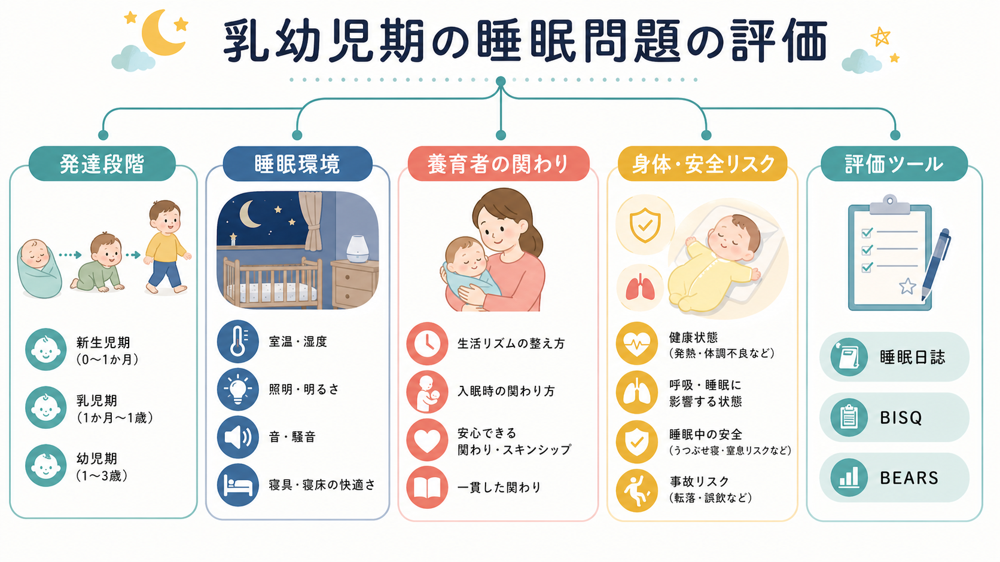
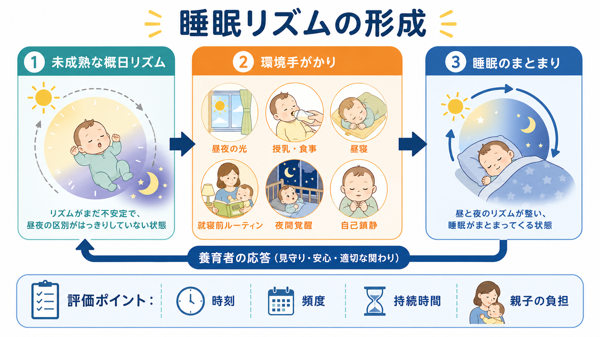

# 乳幼児期の睡眠問題はどう評価するのか

## 要点

- 乳幼児期の夜泣き、入眠困難、睡眠リズムの乱れは、まず「年齢相応の変動か」「家族の機能を損なう問題か」「身体疾患や安全リスクを示す赤旗か」に分けて評価する。
- 評価の中心は、保護者の主観だけでも、睡眠時間だけでもない。睡眠日誌、発達段階、睡眠環境、養育者の応答、日中機能、家族負担を組み合わせる。
- 乳幼児では睡眠が発達途上で、昼夜リズム、授乳、昼寝、分離不安、養育者の疲労が互いに影響する。したがって、問題を「子どもの性格」や「親のしつけ」の一語に還元しない。
- いびき、無呼吸様エピソード、チアノーゼ、発熱・痛み、発達退行、体重増加不良、虐待・ネグレクトの懸念、安全でない睡眠環境は、行動的睡眠問題とは別に評価する。

## この記事で答える問い

乳幼児期の睡眠問題を、[[不眠障害とは何か]]の幼児版として単純に見ると、評価を誤りやすい。この記事では、夜泣き、寝つきの悪さ、睡眠リズムの乱れを、[[ライフスパン精神医学とは何か]]の観点からどのように整理するかを扱う。

主な問いは次の3つである。

1. どこまでが発達上よくある睡眠のばらつきなのか。
2. どの情報を聞けば、家庭内で維持されている睡眠問題を見立てられるのか。
3. どの所見が、身体疾患、安全リスク、より専門的評価の必要性を示すのか。

## まず結論

乳幼児期の睡眠問題は、「症状名」よりも「睡眠がどのように成立しているか」を見る。具体的には、年齢、24時間の睡眠量、入眠までの流れ、夜間覚醒の頻度と持続時間、昼寝、光・音・室温、授乳や食事、保護者の応答、家族の疲労、睡眠中の安全環境を同時に確認する。

睡眠時間の目安は有用だが、単独では診断基準ではない。National Sleep Foundation の推奨では、新生児は14から17時間、乳児は12から15時間、幼児は11から14時間が目安とされるが、個人差と文化差がある[1]。また、縦断研究では、乳幼児の睡眠時間と昼寝は年齢とともに大きく変化し、とくに1歳前後までに夜間睡眠がまとまり、日中睡眠が減っていく傾向が示されている[2]。

## 背景

乳幼児の睡眠は、成人の睡眠と違って「まだ安定していないシステム」である。新生児期は睡眠と覚醒が24時間に散らばり、空腹、授乳、体温調節、外界刺激への反応に左右される。月齢が進むと、光、食事、昼寝、就寝前の活動、家族の生活時刻が昼夜リズムを支える手がかりになる。

ここで重要なのは、夜泣きや夜間覚醒そのものが常に病的ではないという点である。問題になるのは、頻度、持続時間、再入眠の困難、日中の機嫌や活動、養育者の睡眠不足、家庭内の緊張、安全リスクと結びついたときである。[[精神科診察で睡眠をどう評価するか]]と同様に、時刻、持続、規則性、機能への影響を分けて聞く必要がある。

## 基本概念

### 発達段階を見る

評価では、まず月齢・年齢に照らして睡眠の期待値を調整する。0から3か月頃は夜間にまとまって眠らないこと自体が珍しくない。4から12か月頃には夜間睡眠がまとまり始めるが、授乳、寝返り、歯の生え始め、分離不安、保護者の復職などで一時的に崩れることがある。1から3歳では、昼寝の移行、自己主張、就寝拒否、親の存在を求める行動が目立ちやすい。

この見立ては、[[発達歴は成人精神科でもなぜ重要なのか]]で扱う発達歴の考え方と同じである。ある行動が問題かどうかは、暦年齢だけでなく、発達水準、家庭のリズム、身体状態、保護者の余力によって変わる。

### 睡眠問題の3分類

臨床的には、乳幼児期の睡眠問題を次の3つに分けると整理しやすい。

| 評価領域 | 典型的な訴え | 見るべき情報 |
|---|---|---|
| 夜間覚醒・夜泣き | 何度も起きる、泣き続ける、抱っこや授乳でないと再入眠しない | 覚醒回数、1回の長さ、再入眠条件、授乳量、親子の疲労 |
| 入眠困難 | 寝つくまで長い、寝室に行くと泣く、親が離れると起きる | 就寝前ルーティン、入眠時の刺激、寝かしつけ方法、分離不安 |
| 睡眠リズムの問題 | 寝る時刻が遅い、昼寝が長い、朝起きられない | 起床時刻、昼寝、光曝露、保育園・家庭のスケジュール |

### 行動性不眠という見方

小児の行動性不眠では、睡眠開始時の条件づけと、就寝時の境界設定が問題になりやすい。たとえば「抱っこ、授乳、親の同室、動画」などが毎回の入眠条件になると、夜間に自然に覚醒したときにも同じ条件が必要になり、夜泣きとして現れることがある。また幼児期には、就寝拒否や要求の反復が、家族の疲労や一貫しない対応によって維持される場合がある[6]。

ただし、この枠組みは親を責めるためのものではない。家庭の状況、文化、住環境、きょうだい、保護者の睡眠不足、産後うつ、不安、ワンオペ育児などを含む[[生物心理社会モデルとは何か]]として理解する。

## 仕組み

乳幼児の睡眠リズムは、内因性の発達だけで自然に完成するのではなく、家庭内の手がかりと相互作用しながら整っていく。概日リズムは月齢とともに成熟し、昼夜の光、授乳・食事、昼寝、活動量、就寝前ルーティンがリズムの外的手がかりになる。

就寝前ルーティンは、その代表的な介入可能因子である。7から36か月の乳幼児を対象とした研究では、一貫した就寝前ルーティンの導入により、入眠潜時、夜間覚醒、睡眠のまとまり、母親の気分が改善したと報告されている[7]。評価時には「ルーティンがあるか」だけでなく、毎晩の順序、刺激の強さ、明るさ、スクリーン、親の関わり、入眠後の環境変化まで聞く。

## 図解

評価の流れは、次のように文章化できる。

| ステップ | 確認すること | 評価の焦点 |
|---|---|---|
| 1. 年齢と発達 | 月齢、発達、授乳、昼寝、保育状況 | 年齢相応のばらつきか |
| 2. 24時間パターン | 起床、昼寝、就寝、夜間覚醒、総睡眠時間 | リズムの問題か、入眠・覚醒の問題か |
| 3. 入眠条件 | 抱っこ、授乳、添い寝、親の同室、動画、照明 | 再入眠にも同じ条件が必要か |
| 4. 睡眠環境 | 寝床、室温、音、光、寝具、同室・同床 | 安全性と刺激量 |
| 5. 身体・発達の赤旗 | いびき、無呼吸、発熱、痛み、けいれん様運動、体重増加不良 | 身体疾患や専門評価の必要性 |
| 6. 家族機能 | 保護者の睡眠、気分、孤立、暴力・虐待リスク | 親子双方への負担 |

### 問診で聞く項目

- 「何時に起き、何時に昼寝し、何時に寝床に入るか」
- 「寝床に入ってから眠るまで何分くらいか」
- 「夜間に何回起き、1回どれくらい続くか」
- 「再入眠に何が必要か」
- 「授乳・食事・排泄・痛み・発熱との関係はあるか」
- 「いびき、息が止まる感じ、陥没呼吸、チアノーゼはあるか」
- 「寝床はどこで、柔らかい寝具、枕、ぬいぐるみ、傾斜、同床はあるか」
- 「保護者はどれくらい眠れているか。怒り、落ち込み、孤立感はあるか」

この部分は[[家族面接では何を評価するべきか]]とも接続する。睡眠問題は乳幼児だけの症状ではなく、家族の夜間対応、仕事、きょうだい、住居、支援者の有無を含む家族システムの問題として現れる。

### 尺度と客観指標

乳幼児の評価では、睡眠日誌を1から2週間つけるだけでも、訴えの構造が見えやすくなる。BISQ は乳幼児睡眠の短いスクリーニング尺度として開発され、睡眠日誌やアクチグラフィとの関連、再検査信頼性、臨床群と対照群の識別に関する支持が報告されている[3]。BEARS は就寝問題、日中眠気、夜間覚醒、規則性と睡眠時間、いびきを簡潔に拾う小児睡眠スクリーニングで、乳幼児では保護者面接に合わせて使うとよい[4]。

アクチグラフィは、腕や足首などの活動量から睡眠・覚醒パターンを推定する方法である。AASM の臨床実践ガイドラインでは、小児の概日リズム睡眠覚醒障害の評価にアクチグラフィを用いることが提案されている[5]。ただし、乳幼児では装着、昼寝、保護者による記録漏れ、抱っこや移動の影響があるため、睡眠日誌と併用して解釈する。

## 臨床・研究との接続

### 赤旗を先に除外する

乳幼児の睡眠問題では、行動的な見立てに入る前に身体・安全面を確認する。いびき、無呼吸様エピソード、努力呼吸、チアノーゼ、発作様運動、強い痛み、嘔吐、発熱、湿疹や掻痒、胃食道逆流が疑われる症状、体重増加不良は、小児科的評価を優先する。発達退行や極端な刺激過敏があれば、発達評価も必要になる。

また、睡眠中の安全環境は評価の一部である。AAP の2022年勧告は、1歳未満では仰向け、硬く平らで傾斜のない寝床、柔らかい寝具や枕を置かないこと、少なくとも最初の6か月は親の部屋で別の寝床に寝かせることを推奨している[8]。これは育児スタイルの好みではなく、睡眠関連乳児死亡を減らすための安全評価である。

### 保護者の睡眠とメンタルヘルスを見る

夜泣きや入眠困難は、保護者の睡眠不足、抑うつ、不安、怒り、孤立を増幅しやすい。保護者の疲労が強い場合、評価者は「子どもの睡眠を直す」だけでなく、「安全に夜を越える支援」を考える必要がある。産後うつや強い不安が疑われる場合は、[[周産期メンタルヘルスの疾患には何があるのか]]と接続して評価する。

家庭内で怒鳴り、揺さぶり、放置、危険な同床、飲酒後の添い寝などが懸念されるときは、[[虐待リスクを精神科でどう評価するか]]の視点が必要である。睡眠問題は、保護者の努力不足ではなく、支援不足のサインとして現れることがある。

### 研究での測定

研究では、保護者報告、睡眠日誌、BISQ、BEARS、アクチグラフィ、場合によってはポリソムノグラフィを目的に応じて使い分ける。保護者報告は臨床的負担を反映する一方で、覚醒回数や昼寝の過小・過大評価を含むことがある。アクチグラフィは複数日にわたるリズムの把握に強いが、睡眠の質や呼吸イベントを直接診断する道具ではない[5]。

## よくある誤解

### 「夜泣きがあるから病気である」

夜間覚醒は乳幼児ではよくある。問題は、覚醒そのものではなく、頻度、再入眠困難、日中機能、家族負担、安全性、身体症状との組み合わせである。

### 「寝つけないのは親の対応が悪いからである」

入眠条件や境界設定は評価対象だが、責任追及の材料ではない。住環境、きょうだい、授乳、保護者の仕事、文化、疲労、産後メンタルヘルスを含めて見立てる。

### 「睡眠時間が推奨範囲より短いから必ず異常である」

推奨睡眠時間は目安であり、個人差がある。日中の機嫌、成長、発達、家族の負担、睡眠の規則性を合わせて判断する[1][2]。

### 「アプリやウェアラブルで客観的に測れば十分である」

活動量データは便利だが、乳幼児では抱っこ、ベビーカー、昼寝、装着状況の影響を受ける。睡眠日誌と問診なしに、数値だけで評価しない。

## 関連ノート

- [[ライフスパン精神医学とは何か]]
- [[不眠障害とは何か]]
- [[精神科診察で睡眠をどう評価するか]]
- [[生物心理社会モデルとは何か]]
- [[家族面接では何を評価するべきか]]
- [[発達歴は成人精神科でもなぜ重要なのか]]
- [[周産期メンタルヘルスの疾患には何があるのか]]
- [[虐待リスクを精神科でどう評価するか]]
- [[分離不安症とは何か]]

### MOC更新候補

- `content/00_MOC/` 配下の精神医学または発達・ライフスパン系MOCに追加候補。
- 並列ジョブとの衝突を避けるため、本記事作成時点ではMOC本体は更新しない。

## 理解チェック

1. 乳幼児の睡眠問題を評価するとき、睡眠時間だけでなく、どの5領域を聞くべきか。
2. 夜泣きが「行動性不眠」として理解できる場合、入眠条件と夜間再入眠はどのように関係するか。
3. いびき、無呼吸様エピソード、体重増加不良がある場合、なぜ通常の睡眠衛生指導だけで終えてはいけないか。
4. 安全な睡眠環境の評価は、なぜ乳幼児睡眠問題の評価に含まれるのか。

## 参考文献

[1] Hirshkowitz, M., Whiton, K., Albert, S. M., et al. (2015). National Sleep Foundation's sleep time duration recommendations: methodology and results summary. *Sleep Health*, 1(1), 40-43. https://doi.org/10.1016/j.sleh.2014.12.010

[2] Iglowstein, I., Jenni, O. G., Molinari, L., & Largo, R. H. (2003). Sleep duration from infancy to adolescence: reference values and generational trends. *Pediatrics*, 111(2), 302-307. https://doi.org/10.1542/peds.111.2.302

[3] Sadeh, A. (2004). A brief screening questionnaire for infant sleep problems: validation and findings for an internet sample. *Pediatrics*, 113(6), e570-e577. https://doi.org/10.1542/peds.113.6.e570

[4] Owens, J. A., & Dalzell, V. (2005). Use of the "BEARS" sleep screening tool in a pediatric residents' continuity clinic: a pilot study. *Sleep Medicine*, 6(1), 63-69. https://doi.org/10.1016/j.sleep.2004.07.015

[5] Smith, M. T., McCrae, C. S., Cheung, J., et al. (2018). Use of actigraphy for the evaluation of sleep disorders and circadian rhythm sleep-wake disorders: an American Academy of Sleep Medicine clinical practice guideline. *Journal of Clinical Sleep Medicine*, 14(7), 1231-1237. https://doi.org/10.5664/jcsm.7230

[6] Vriend, J., & Corkum, P. (2011). Clinical management of behavioral insomnia of childhood. *Psychology Research and Behavior Management*, 4, 69-79. https://doi.org/10.2147/PRBM.S14057

[7] Mindell, J. A., Telofski, L. S., Wiegand, B., & Kurtz, E. S. (2009). A nightly bedtime routine: impact on sleep in young children and maternal mood. *Sleep*, 32(5), 599-606. https://doi.org/10.1093/sleep/32.5.599

[8] Moon, R. Y., Carlin, R. F., Hand, I., & Task Force on Sudden Infant Death Syndrome and the Committee on Fetus and Newborn. (2022). Sleep-related infant deaths: updated 2022 recommendations for reducing infant deaths in the sleep environment. *Pediatrics*, 150(1), e2022057990. https://doi.org/10.1542/peds.2022-057990

## 未解決問題

- 睡眠日誌、BISQ、アクチグラフィの結果が食い違うとき、どの指標を優先するかは、研究目的と臨床目的で異なる。
- 文化的に共有される添い寝や夜間授乳を、睡眠関連死亡リスク、安全な代替策、保護者の価値観とどうすり合わせるかは、個別性が大きい。
- 乳幼児の睡眠問題と、その後の情緒・発達・家族機能の長期的関連には、交絡因子が多く、単純な因果として読まない注意が必要である。
