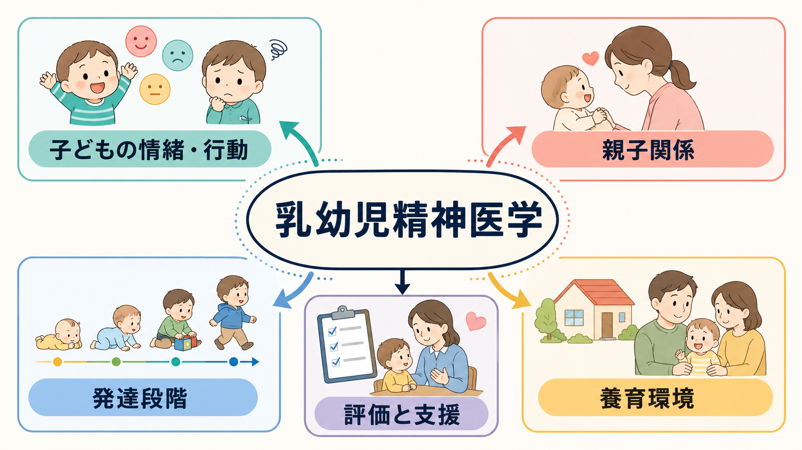
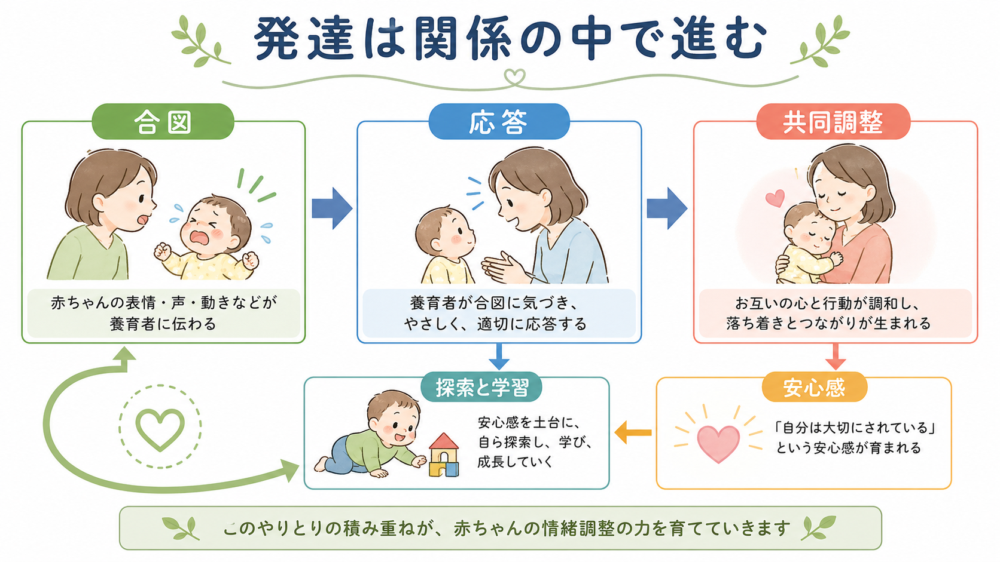
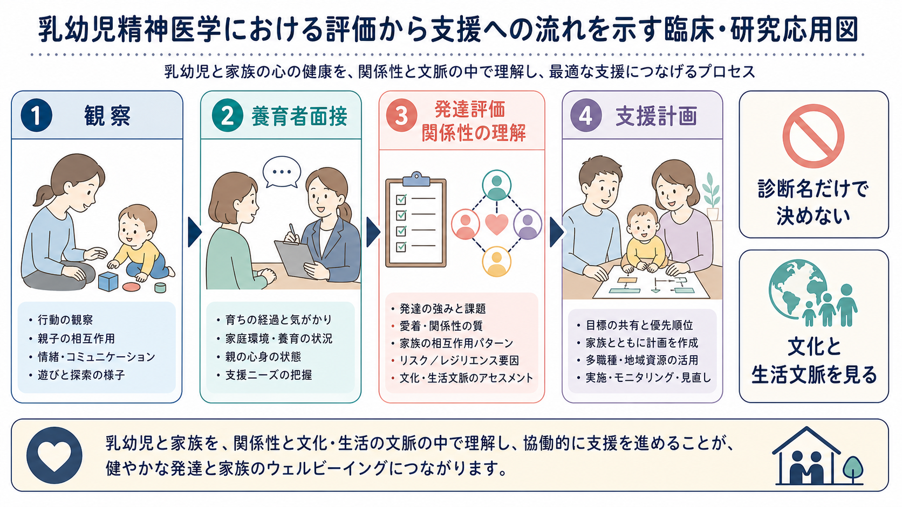

# 乳幼児精神医学とは何か

## 要点

- 乳幼児精神医学は、0歳から就学前ごろまでの情緒・行動・発達・親子関係を、家族、地域、文化、生活環境の中で理解する領域である[1][2]。
- 乳幼児は「症状を言葉で説明できない小さな成人」ではない。睡眠、食事、泣き、遊び、視線、共同注意、分離、探索、養育者とのやりとりが評価の入口になる。
- 乳幼児期の困難は、子ども本人の気質や神経発達だけでなく、養育者の心身の状態、家族のストレス、貧困、孤立、逆境、文化的期待と相互に影響しあう[3][4]。
- 診断名は役立つが、診断名だけで支援を決めない。乳幼児精神医学では、発達段階、関係性、身体疾患、心理社会的ストレス、機能的情緒発達を統合して考える[2][5]。
- 本記事は教育・研究目的の整理であり、個別の診断や治療指示ではない。

## この記事で答える問い

1. 乳幼児精神医学は何を対象にするのか。
2. 乳幼児の「こころ」を、どのように観察・評価するのか。
3. 親子関係や養育環境は、なぜ診断と支援の中心になるのか。
4. 研究・臨床・早期支援では、この領域をどう使うのか。

## まず結論

乳幼児精神医学とは、乳幼児の情緒・行動の問題を、子ども単独の症状としてではなく、発達過程と関係性の中で評価する精神医学である。中心にあるのは、子どもが「近しい大人と安全な関係をつくる」「感情を経験し、表現し、調整する」「周囲を探索して学ぶ」力を育てているか、そしてその力が家族・地域・文化の文脈でどのように支えられているかという問いである[1]。

この視点は、[[発達精神病理学とは何か|発達精神病理学]]、[[愛着とは何か|愛着]]、[[養育環境は発達にどう影響するのか|養育環境]]、[[共同注意とは何か|共同注意]]と深くつながる。泣きやかんしゃく、眠れなさ、食べにくさ、分離不安、過度な引っ込み、攻撃性、発達の遅れは、単一の原因で説明できるとは限らない。身体疾患、睡眠、感覚特性、神経発達、親子の相互作用、養育者の抑うつや不安、家庭内の安全、保育環境、社会的支援を一緒に見る必要がある。

## 背景

従来の精神医学は、本人が語る主観的苦痛、症状の持続、生活機能の障害を手がかりに診断してきた。しかし乳幼児は、自分の不安、恐怖、悲しさ、混乱を十分に言語化できない。したがって、乳幼児精神医学では、行動観察、養育者からの情報、発達評価、親子相互作用、保育園・幼稚園など複数場面の情報が重要になる。

ZERO TO THREE の定義では、乳幼児期のメンタルヘルスは、近しい関係を形成する力、感情を経験・管理・表現する力、環境を探索し学ぶ力が、家族・地域・文化の中で発達していくこととして説明される[1]。これは「乳幼児にも大人と同じ精神疾患がある」と単純に言うためではなく、早期の関係性と情緒発達が、後の社会性、学習、自己調整、身体健康に接続することを重視する考え方である[3][4]。

## 基本概念

### 発達段階に合わせて見る

同じ行動でも、年齢と文脈によって意味が変わる。生後数か月の泣き、1歳前後の人見知り、2歳前後の自己主張、3歳以降の空想や恐怖は、発達的には自然な範囲を含む。一方で、強い苦痛、持続、複数場面での機能低下、養育者との関係の崩れ、安全リスクが重なる場合は、支援が必要になることがある。就学前児でも、発達に適した基準を用いれば情緒・行動障害を信頼性をもって把握できることが示されている[6]。

### 関係性を評価単位に含める

乳幼児の情緒調整は、最初から一人で完結しない。空腹、眠気、不快、恐怖、興奮を、養育者が読み取り、抱く、声をかける、待つ、遊びを調整することで、子どもは少しずつ自己調整を学ぶ。このため、乳幼児精神医学では「子どもに何が起きているか」と同時に、「子どもと養育者の間で何が繰り返されているか」を見る。

親子関係の評価には、養育者の良し悪しを裁く発想ではなく、相互作用のパターンを理解する発想が必要である。たとえば、子どもの合図が読み取りにくい、養育者が疲弊して応答しにくい、過去の喪失やトラウマが子どもの泣きに反応しやすくしている、経済的不安が家庭内の余裕を奪っている、というように複数の要因が重なる。

### 分類診断は発達文脈と組み合わせる

DC:0-5 は、乳幼児期の精神健康と発達障害を扱う分類体系であり、臨床障害だけでなく、関係性文脈、身体・発達条件、心理社会的ストレス、機能的情緒発達を統合して考える枠組みを提供する[2][5]。これは、[[DSMとICDは何が違うのか|DSMやICD]]を置き換えるというより、乳幼児期に必要な発達・関係性の解像度を補う道具として理解するとよい。

## 仕組み

乳幼児精神医学の中心的な仕組みは、「合図-応答-共同調整」の反復である。子どもは表情、泣き、視線、身体のこわばり、声、遊びの変化で合図を出す。養育者がその合図に気づき、過不足なく応答すると、子どもの覚醒や情緒は落ち着きやすくなる。これが繰り返されると、子どもは「困ったときに助けが来る」「感情は調整できる」「落ち着いたら探索できる」という予測を学ぶ。

この仕組みは、[[安全基地とは何か|安全基地]]や[[内的作業モデルとは何か|内的作業モデル]]の考え方と接続する。ただし、関係性は固定された性格ではない。子どもの気質、発達特性、睡眠、身体疾患、養育者の抑うつ・不安、家族関係、保育環境、文化、社会的支援が変われば、相互作用も変化しうる。

逆境や慢性的ストレスも重要である。小児期早期の逆境や毒性ストレスは、ストレス反応系、情緒調整、学習、身体健康に長期的影響を及ぼしうるため、支援では子どもだけでなく、養育者と家庭を取り巻く安全・安定・支援資源を整える視点が必要になる[4]。これは[[逆境的小児期体験ACEとは何か|逆境的小児期体験ACE]]や[[トラウマは発達にどう影響するのか|発達とトラウマ]]の理解と重なる。

## 図解

臨床的には、乳幼児精神医学の評価は「観察」「養育者面接」「発達評価」「関係性の理解」「支援計画」を行き来する。短時間の診察だけで結論を急がず、日常場面、保育場面、睡眠・食事・遊び、家族の困りごと、強み、支援資源を集めて、[[ケースフォーミュレーションとは何か|ケースフォーミュレーション]]としてまとめる。

| 観点 | 具体的に見ること | 注意点 |
|---|---|---|
| 子どもの発達 | 運動、言語、認知、社会性、感覚、睡眠、食事 | 年齢相応の変動と臨床的困難を分ける |
| 情緒・行動 | 泣き、かんしゃく、不安、引っ込み、攻撃性、遊び | どの場面で、誰といるときに起こるかを見る |
| 親子相互作用 | 合図への気づき、応答、修復、共同注意、遊び | 養育者を責める評価にしない |
| 養育者の状態 | 睡眠不足、抑うつ、不安、トラウマ、孤立 | 支援ニーズとして扱う |
| 生活文脈 | 経済、住居、保育、文化、地域資源、安全 | 個人内要因だけに還元しない |

## 臨床・研究との接続

乳幼児精神医学は、早期発見、予防、親子支援、発達支援、児童福祉、保育、地域保健にまたがる。評価では、[[5Pモデルとは何か|5Pモデル]]のように、素因、誘因、維持因子、保護因子、現在の問題を整理すると、診断名だけでは見えない支援ポイントが見つかりやすい。

介入研究では、親子関係に働きかけるプログラムが検討されてきた。Attachment and Biobehavioral Catch-up は、養育者が子どもの苦痛に養育的に応答し、落ち着いているときには子どもの主導に沿うことを練習する短期ホームビジット型介入で、養育者の感受性、子どもの愛着や調整機能に効果が報告されている[7]。また、親子精神療法については、親子関係や親の状態を改善しうる一方、研究の質や対象の違いに注意が必要であるとレビューされている[8]。

臨床では、支援の単位を「子どもだけ」または「親だけ」に固定しない。身体疾患や発達障害が疑われる場合は医療・発達評価へつなぎ、虐待やネグレクトが疑われる場合は安全確保を優先し、養育者のうつ、不安、物質使用、DV、貧困、孤立が関わる場合は成人支援や地域資源と連携する。これは個別診断を避けるためではなく、乳幼児の困難が複数システムの交差点に現れるためである。

## よくある誤解

### 誤解1: 乳幼児には精神医学は早すぎる

乳幼児に成人と同じ面接をすることはできないが、情緒、行動、関係性、発達、睡眠、食事、遊びの困難は早期から現れうる。重要なのは、ラベルを急ぐことではなく、発達に合った観察と支援につなげることである[1][6]。

### 誤解2: 問題は親の育て方にある

乳幼児精神医学は、養育者を責める学問ではない。親子相互作用を重視するのは、関係性が変化可能な支援対象だからである。子どもの気質、神経発達、身体状態、養育者の疲労、社会的孤立、文化、経済状況を合わせて見る必要がある。

### 誤解3: 愛着だけを見ればよい

愛着は重要だが、乳幼児精神医学は愛着分類だけでは完結しない。言語発達、感覚処理、睡眠、身体疾患、ASDやADHDなどの神経発達、外傷体験、保育環境、家族システムを統合する。

### 誤解4: 早期介入は将来を完全に予測・修正できる

早期支援は重要だが、発達は確率的で可塑的な過程である。早期の困難はリスクを示すが、保護因子、関係の修復、地域支援、保育、医療へのアクセスによって経路は変わりうる。

## 関連ノート

- [[発達精神病理学とは何か]]
- [[愛着とは何か]]
- [[安全基地とは何か]]
- [[内的作業モデルとは何か]]
- [[養育環境は発達にどう影響するのか]]
- [[共同注意とは何か]]
- [[乳児は世界をどのように認識しているのか]]
- [[逆境的小児期体験ACEとは何か]]
- [[トラウマは発達にどう影響するのか]]
- [[ケースフォーミュレーションとは何か]]
- [[5Pモデルとは何か]]
- [[DSMとICDは何が違うのか]]

## MOC更新候補

- `content/00_MOC/MOC｜発達・愛着・社会心理.md` の「発達精神病理学」「愛着と家族」「逆境・トラウマ・レジリエンス」周辺に追加する候補。
- 精神医学側に発達・ライフスパン領域の MOC を統合ジョブで作る場合、本記事を小児・乳幼児精神医学の入口ノートとして追加する候補。

## 理解チェック

1. 乳幼児精神医学が、子ども本人だけでなく親子関係や生活文脈を評価に含めるのはなぜか。
2. 「発達的に自然な行動」と「臨床的支援が必要な困難」を分けるとき、どのような情報が必要か。
3. 合図-応答-共同調整の反復は、情緒調整や探索にどうつながるか。
4. 診断名だけで支援計画を決めることには、どのような限界があるか。

## 未解決問題

- 日本の母子保健、保育、児童精神科、児童福祉のあいだで、乳幼児精神医学の評価と言語をどのように共有するか。
- 文化的に多様な家庭で、親子相互作用を標準化尺度だけで過剰に評価しない方法は何か。
- 乳幼児期の睡眠、食事、感覚、情緒、親子関係を、縦断的にどの程度予測モデルへ組み込めるか。
- 早期支援の効果を、症状低下だけでなく、関係性、安全、家族の生活機能、地域資源との接続としてどう測定するか。

## 参考文献

[1] ZERO TO THREE. (2023). *ZERO TO THREE's Infant and Early Childhood Mental Health (IECMH) Guiding Principles*. https://www.zerotothree.org/resource/zero-to-threes-infant-and-early-childhood-mental-health-iecmh-guiding-principles/

[2] Zeanah, C. H., Carter, A. S., Cohen, J., Egger, H., Gleason, M. M., Keren, M., Lieberman, A., Mulrooney, K., & Oser, C. (2016). Diagnostic Classification of Mental Health and Developmental Disorders of Infancy and Early Childhood DC:0-5: Selective reviews from a new nosology for early childhood psychopathology. *Infant Mental Health Journal, 37*(5), 471-475. https://doi.org/10.1002/imhj.21591

[3] American Academy of Pediatrics. (2022). *Early Relational Health*. https://www.aap.org/en/patient-care/early-childhood/early-relational-health/

[4] Garner, A. S., Shonkoff, J. P., et al. (2012). Early childhood adversity, toxic stress, and the role of the pediatrician: Translating developmental science into lifelong health. *Pediatrics, 129*(1), e224-e231. https://doi.org/10.1542/peds.2011-2662

[5] Mothander, P. R. (2016). Diagnostic Classification of Mental Health and Developmental Disorders of Infancy and Early Childhood (DC:0-5): Implementation considerations and clinical remarks. *Infant Mental Health Journal, 37*(5), 523-524. https://doi.org/10.1002/imhj.21593

[6] Egger, H. L., & Angold, A. (2006). Common emotional and behavioral disorders in preschool children: Presentation, nosology, and epidemiology. *Journal of Child Psychology and Psychiatry, 47*(3-4), 313-337. https://doi.org/10.1111/j.1469-7610.2006.01618.x

[7] Dozier, M., & Bernard, K. (2017). Attachment and Biobehavioral Catch-up: Addressing the needs of infants and toddlers exposed to inadequate or problematic caregiving. *Current Opinion in Psychology, 15*, 111-117. https://doi.org/10.1016/j.copsyc.2017.03.003

[8] Barlow, J., Bennett, C., Midgley, N., Larkin, S. K., & Wei, Y. (2015). Parent-infant psychotherapy for improving parent and infant well-being. *Cochrane Database of Systematic Reviews*, CD010534. https://www.cochrane.org/evidence/CD010534_parent-infant-psychotherapy-improving-parent-and-infant-well-being
