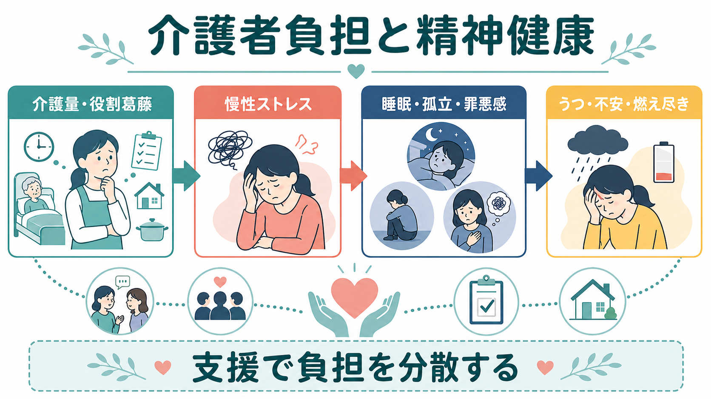
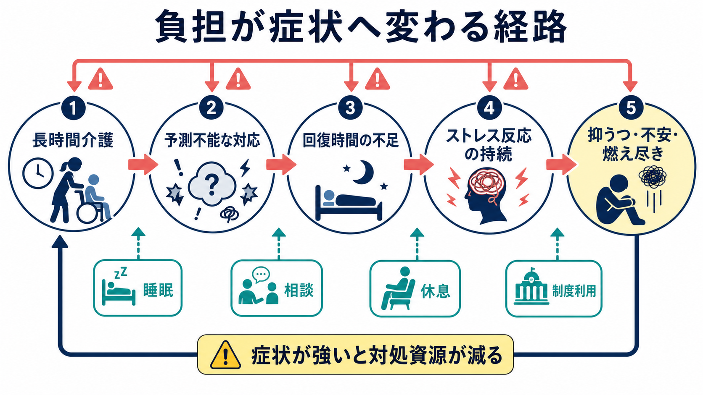
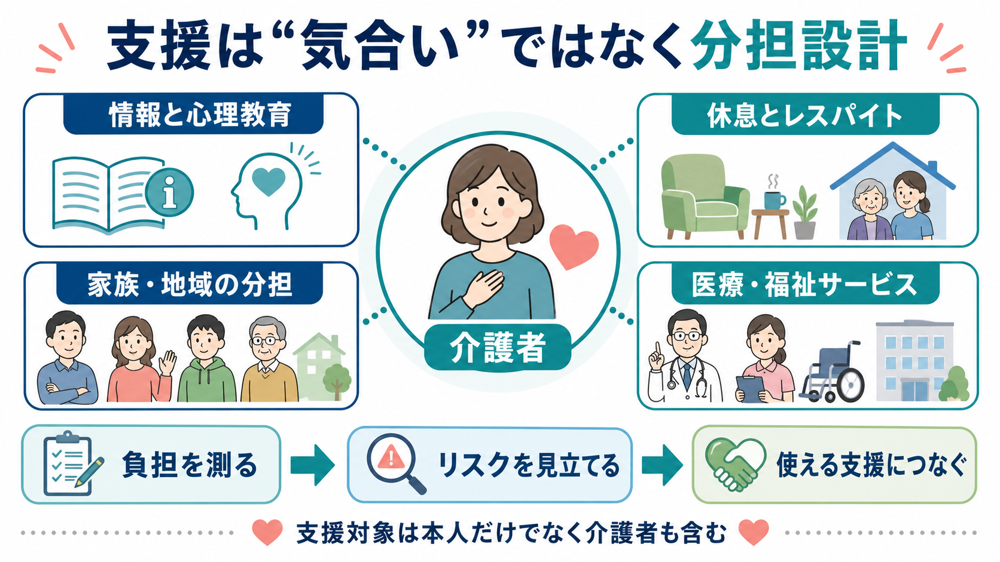

# 介護者負担は精神健康にどう影響するのか

## 要点

- 介護者負担は、介護時間の長さだけでなく、予測不能な対応、役割葛藤、睡眠不足、孤立、経済的負担、罪悪感などが重なった「慢性ストレス過程」として理解すると見通しがよい[1][2]。
- メタ分析では、介護者は非介護者に比べて抑うつ、ストレス、主観的ウェルビーイング、自己効力感、身体健康で不利になりやすく、とくに認知症介護では差が大きい[3]。
- 介護負担は[[うつ病とは何か]]、[[不安とは何か]]、[[バーンアウトとは何か]]を直接引き起こす単一原因ではない。症状は、介護課題、本人の脆弱性、社会的支援、制度アクセス、文化的期待が相互作用した結果として生じる。
- 支援の中心は「介護者にもっと頑張ってもらうこと」ではなく、負担を測り、回復時間を確保し、家族・地域・専門職・制度へ分担することである[4][6][8]。

## この記事で答える問い

1. 介護者負担とは何を指すのか。
2. 介護ストレスは、どのような経路で抑うつ・不安・燃え尽きに結びつくのか。
3. 臨床や地域支援では、介護者をどのように評価し、支えるべきか。

## まず結論

介護者負担は「介護する人の弱さ」ではなく、長時間の注意、予定の崩れやすさ、夜間対応、意思決定の責任、本人との関係変化、周囲から見えにくい労働が積み重なることで生じる。負担が長く続くと、休息と回復の時間が削られ、ストレス反応が慢性化し、睡眠障害、孤立、自己効力感の低下、罪悪感が増える。その結果として、抑うつ、不安、怒り、感情麻痺、燃え尽きが起こりやすくなる[2][3][4]。

重要なのは、介護者を「患者の付添人」とだけ見ないことである。介護者自身も評価と支援の対象であり、本人支援と介護者支援は対立しない。むしろ、介護者の健康を守ることは、本人の生活継続、虐待予防、入院・施設入所の予防、ケアの質の維持にもつながる[4][6][8]。

## 背景

高齢化、慢性疾患、認知症、精神疾患、障害、終末期ケアの増加により、家族や近しい人が日常的なケアを担う場面は増えている。介護者は、服薬、通院、食事、排泄、移動、金銭管理、意思決定、見守り、緊急時対応、対人調整まで担うことがある。これらは制度上の「介護時間」として数えにくくても、心理的には高い負荷をもつ。

認知症介護では、記憶障害や[[BPSDとは何か]]、夜間の不穏、徘徊、被害的訴え、介護拒否などにより、介護者が常に警戒を保つ状況が起こりやすい。近年のシステマティックレビューでも、認知症介護者では抑うつ、不安、生活の質低下、燃え尽きが目立ち、女性介護者、低い社会経済状況、本人の神経精神症状が高い場合に負担が強まりやすいことが整理されている[5]。

ただし、介護経験は常に否定的なものだけではない。親密さ、意味、役割感、関係の再構築が支えになる場合もある。臨床的に大切なのは「介護はつらいはず」と決めつけることでも、「家族ならできて当然」と見なすことでもない。介護者の現実の負担、価値、限界、支援資源を具体的に把握することである。

## 基本概念

### 介護者負担

介護者負担は、介護によって生じる身体的、心理的、社会的、経済的な負荷の総称である。古典的には Zarit らの研究が、認知症高齢者の家族介護者が感じる負担と、その背景にある支援不足を測定可能な問題として示した[1]。現在でも Zarit Burden Interview は、介護負担を評価する代表的尺度として広く参照される。

負担には少なくとも二つの側面がある。第一は客観的負担であり、介護時間、夜間対応、身体介助、仕事や学業への影響、金銭的支出などである。第二は主観的負担であり、終わりが見えない感じ、責任を一人で背負っている感じ、怒りや罪悪感、周囲に理解されない感じである。同じ介護時間でも、支援の有無、本人との関係、介護者の健康状態、文化的期待により主観的負担は大きく変わる。

### ストレス過程モデル

Pearlin らのストレス過程モデルでは、介護ストレスは単一の出来事ではなく、一次ストレッサー、二次ストレッサー、内的ストレイン、対処、社会的支援が連鎖する過程として理解される[2]。一次ストレッサーは、介護そのものに直接結びつく問題である。たとえば夜間対応、排泄介助、本人の不穏、見守りである。二次ストレッサーは、介護が他の生活領域に波及して起こる問題である。たとえば仕事の中断、家族内葛藤、友人関係の縮小、経済的困難である。

内的ストレインとは、「自分は十分にできていない」「怒ってしまう自分は悪い」「この生活は終わらない」といった自己概念や意味づけの揺らぎである。ここに[[社会的支援は健康にどう影響するのか]]、対処スキル、制度利用、休息が介入できる。

### うつ病・不安・燃え尽き

介護者に起こる抑うつは、気分の落ち込みだけでなく、興味の低下、疲労感、睡眠障害、食欲変化、自責感、集中困難として現れることがある。不安は、本人の転倒、急変、徘徊、金銭、将来、介護の継続可能性への心配として出やすい。燃え尽きは、慢性的な消耗、情緒的疲弊、距離を置きたい感覚、ケアへの効力感低下として理解できる。これは職業性の[[バーンアウトとは何か]]と重なるが、家族介護では愛情、義務、罪悪感、関係史が絡むため、単純な職場モデルだけでは説明しきれない。

## 仕組み

介護負担が精神健康に影響する主要経路は、以下のように整理できる。

| 経路 | 何が起こるか | 精神健康への影響 |
|---|---|---|
| 回復時間の不足 | 夜間対応、通院調整、見守りで休息が削られる | [[睡眠障害とは何か]]、疲労、抑うつ、不安 |
| 予測不能性 | 本人の症状や急変で予定が立たない | 過覚醒、心配、緊張、怒り |
| 役割拘束 | 家族、仕事、親、配偶者、自分自身の役割が圧迫される | 喪失感、罪悪感、孤立 |
| 自己効力感の低下 | 何をしても改善しない感覚が強まる | 無力感、抑うつ、燃え尽き |
| 社会的孤立 | 相談相手や代替介護者が少ない | 孤独、ストレス反応の長期化 |
| 経済・制度負担 | 費用、手続き、介護離職、サービス調整が重い | 将来不安、家族内葛藤 |

メタ分析では、介護者は非介護者よりも抑うつとストレスで中等度の不利を示し、主観的ウェルビーイングと自己効力感も低い傾向がある[3]。この差は、すべての介護者に同じように起こるという意味ではない。認知症介護、配偶者介護、長時間介護、支援不足、介護者自身の健康問題がある場合にリスクは高まりやすい[3][4]。

生物学的には、慢性ストレスは睡眠、自律神経、炎症、[[HPA軸は精神疾患にどう関わるのか]]に影響しうる。心理社会的には、予測不能性と制御不能感が強いほど、警戒と反すうが続きやすい。さらに、介護者が「自分が倒れたら本人も困る」と感じるほど、休むこと自体に罪悪感を覚え、回復行動を後回しにしやすい。

この循環は、本人の症状にも影響する。介護者が疲弊すると、本人の行動を柔軟に受け止める余力が減り、衝突、叱責、回避、サービス拒否が起こりやすくなる。すると本人の不安やBPSDが増え、さらに介護者負担が増す。したがって、介護者支援は本人支援の周辺業務ではなく、ケア全体の中核である。

## 図解

この記事では、介護者負担を三つの図で整理している。

| 図 | 役割 | 読み方 |
|---|---|---|
| 図1 | 全体像 | 介護量と役割葛藤が慢性ストレス、睡眠不足、孤立、罪悪感を介して、抑うつ・不安・燃え尽きへつながる流れを見る。 |
| 図2 | メカニズム | 長時間介護、予測不能性、回復時間の不足、持続するストレス反応の連鎖を見る。 |
| 図3 | 支援設計 | 情報、休息、分担、医療・福祉サービスを、介護者本人の支援として配置する。 |

## 臨床・研究との接続

### 評価

臨床では、本人の症状だけでなく介護者の状態を系統的に聞く必要がある。確認する項目は、介護時間、夜間対応、休息、睡眠、身体不調、仕事や学業への影響、家族内分担、相談相手、サービス利用、経済的困難、怒りや自責感、希死念慮、虐待リスクである。これは個別診断を急ぐためではなく、支援の入口を見つけるための評価である。

介護者が「大丈夫です」と答える場合でも、実際には限界に近いことがある。本人の前では言いにくい話も多いため、可能なら介護者だけで話す時間を確保する。若年の介護者では、[[ヤングケアラーの精神健康問題とは何か]]、学業、友人関係、将来選択への影響を別に評価する必要がある。

### 支援

支援の第一歩は、介護者の負担を正当化することである。「つらいと感じるのはおかしい」ではなく、「その状況なら負担が強くなるのは自然で、分担設計が必要」と位置づける。次に、情報と[[心理教育とは何か]]、レスパイト、家族内調整、医療・福祉サービス、ピアサポート、経済相談を組み合わせる。

WHO は、認知症介護者が情報、訓練、サービス、社会的・経済的支援へアクセスできることを、介護者の身体・精神健康と社会的ウェルビーイングを守るために重要としている[6]。日本でも厚生労働省は、認知症の本人と家族を支える手引き、家族等介護者支援ガイドブック、認知症カフェや家族支援の取組を示している[8]。

介入研究としては、REACH II が重要である。これは認知症介護者に対して、抑うつ、負担、セルフケア、社会的支援、本人の問題行動への対応を扱う多要素介入を行ったランダム化比較試験で、介護者の生活の質を改善し、臨床的うつ病の割合も低下させた[7]。この知見は、介護者支援が単なる助言ではなく、評価に基づく多要素の支援として設計されるべきことを示す。

### 研究上の注意

介護者負担研究には、横断研究が多く因果方向を決めにくい、介護内容が疾患や文化で大きく異なる、介護者の肯定的側面が過小評価されやすい、支援制度の違いが国際比較を難しくする、という限界がある。研究では、介護者の抑うつ・不安だけでなく、本人の症状、介護時間、サービス利用、社会的支援、経済状況、睡眠、身体健康を同時に測る必要がある。

## よくある誤解

### 誤解1: 介護者負担は介護時間だけで決まる

介護時間は重要だが、それだけでは不十分である。夜間に呼ばれるか、急変があるか、本人が介護を拒むか、代わってくれる人がいるか、仕事や学業と両立できるかで負担は大きく変わる。

### 誤解2: 家族なら支えられて当然である

家族であることは、無制限のケア資源を意味しない。家族関係には愛情だけでなく、葛藤、過去の傷つき、経済問題、役割期待が含まれる。支援者が「家族だから」と言うほど、介護者は助けを求めにくくなる。

### 誤解3: 介護者が休むのは本人を見捨てることだ

休息はケアの中断ではなく、ケアを続けるための条件である。レスパイト、ショートステイ、訪問介護、デイサービス、家族内分担は、本人と介護者の双方を守るための支援である。

### 誤解4: 支援は介護者の気持ちの持ち方を変えることが中心である

気持ちの整理は重要だが、それだけでは慢性負担は減らない。必要なのは、介護量、夜間対応、情報不足、孤立、経済負担、制度アクセスの問題を具体的に動かすことである。

## 関連ノート

- [[うつ病とは何か]]
- [[不安とは何か]]
- [[バーンアウトとは何か]]
- [[睡眠障害とは何か]]
- [[HPA軸は精神疾患にどう関わるのか]]
- [[社会的支援は健康にどう影響するのか]]
- [[心理教育とは何か]]
- [[認知症とは何か]]
- [[BPSDとは何か]]
- [[ヤングケアラーの精神健康問題とは何か]]

## MOC更新候補

- `content/00_MOC/` 配下の精神医学、老年精神医学、ライフスパン、地域支援、認知症関連 MOC に追加候補。
- 並列ジョブとの競合を避けるため、本記事では MOC 本体は更新しない。

## 理解チェック

1. 介護者負担を「介護時間」だけで評価すると、どのような負担を見落とすか。
2. ストレス過程モデルでいう一次ストレッサーと二次ストレッサーを、介護場面の例で説明できるか。
3. 介護者の抑うつ・不安・燃え尽きを評価するとき、本人の症状以外に何を確認すべきか。
4. レスパイトや家族内分担が、本人支援とも矛盾しない理由を説明できるか。

## 未解決問題

- どの介護者に、どの時点で、どの支援を優先すべきかを予測する実用的なモデルはまだ発展途上である。
- 介護者支援の効果は、国や地域の制度、家族規範、サービス利用可能性に強く左右される。
- 介護者の肯定的経験、意味、関係性の変化を、負担や症状と同時にどう測定するかは今後の課題である。

## 参考文献

[1] Zarit, S. H., Reever, K. E., & Bach-Peterson, J. (1980). Relatives of the impaired elderly: Correlates of feelings of burden. *The Gerontologist, 20*(6), 649-655. https://doi.org/10.1093/geront/20.6.649

[2] Pearlin, L. I., Mullan, J. T., Semple, S. J., & Skaff, M. M. (1990). Caregiving and the stress process: An overview of concepts and their measures. *The Gerontologist, 30*(5), 583-594. https://doi.org/10.1093/geront/30.5.583

[3] Pinquart, M., & Sörensen, S. (2003). Differences between caregivers and noncaregivers in psychological health and physical health: A meta-analysis. *Psychology and Aging, 18*(2), 250-267. https://doi.org/10.1037/0882-7974.18.2.250

[4] National Academies of Sciences, Engineering, and Medicine. (2016). *Families Caring for an Aging America*. Washington, DC: The National Academies Press. https://doi.org/10.17226/23606

[5] Deli, D., Tsouvelas, G., Roukas, D., & Mentis, M. (2025). A systematic review of depressive and anxiety symptoms in caregivers of dementia patients. *Psychiatriki, 36*(1), 72-80. https://doi.org/10.22365/jpsych.2024.023

[6] World Health Organization. (n.d.). *Dementia carer support services*. Global Dementia Observatory. https://www.who.int/data/gho/data/themes/global-dementia-observatory-gdo/dementia-carer-support-services

[7] Belle, S. H., Burgio, L., Burns, R., Coon, D., Czaja, S. J., Gallagher-Thompson, D., Gitlin, L. N., et al. (2006). Enhancing the quality of life of dementia caregivers from different ethnic or racial groups: A randomized, controlled trial. *Annals of Internal Medicine, 145*(10), 727-738. https://doi.org/10.7326/0003-4819-145-10-200611210-00005

[8] 厚生労働省. (n.d.). 認知症施策関連ガイドライン(手引き等)、取組事例（介護者への支援）. https://www.mhlw.go.jp/stf/seisakunitsuite/bunya/0000167700_00001.html
