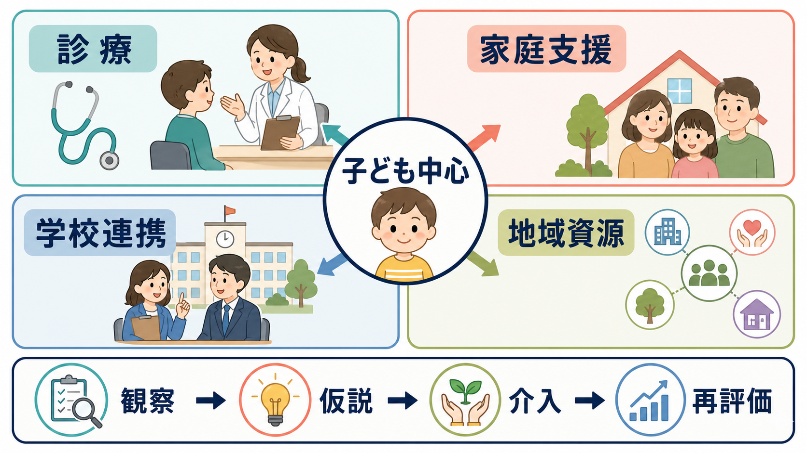
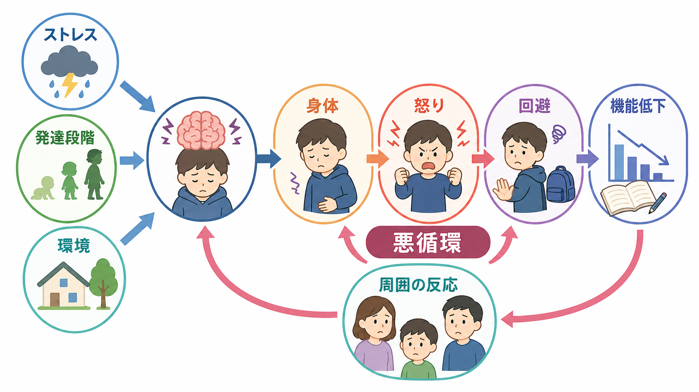

# 児童精神医学とは何か

## 要点

- 児童精神医学は、子どもの精神症状を「本人の中だけの問題」としてではなく、発達段階、身体状態、家庭、学校、友人関係、地域資源の中で評価する領域である。
- 同じ不安、怒り、落ち込み、不注意でも、年齢、言語発達、認知機能、睡眠、トラウマ、家庭内ストレス、学校環境によって意味が変わる。
- 診断名をつけることだけが目的ではない。安全確認、生活機能の把握、本人と家族の困りごとの整理、学校・医療・福祉の連携、支援計画の見直しまでを含む。
- この記事は教育・研究目的の整理であり、個別の診断や治療指示ではない。

## この記事で答える問い

1. 児童精神医学は成人精神医学と何が違うのか。
2. 子どもの症状を、発達・家庭・学校・地域の文脈で見るとはどういうことか。
3. 評価から支援へ進むとき、何を見落としやすいのか。

## まず結論

児童精神医学とは、子どもや思春期の人のこころの問題を、発達過程と生活環境の相互作用として理解し、本人・家族・学校・地域の支援を組み合わせる医学領域である。WHOは、子どもと思春期を脳と認知・社会情動スキルが急速に発達する時期と位置づけ、家庭、学校、デジタル空間、貧困、暴力、養育者の精神疾患などの環境が将来のメンタルヘルスに影響すると整理している[1]。

成人精神医学でも生活背景は重要だが、児童精神医学ではさらに「その年齢で期待される発達課題は何か」「本人の言語化能力で何が語れるか」「家庭や学校で同じ症状が出ているか」「周囲の対応が症状を強めていないか」を重視する。AACAPの子ども・思春期の精神医学的評価パラメータも、評価を診断と治療計画につなげる過程として位置づけ、発達的視点、親と子どもの面接、必要に応じた標準化尺度を含めている[2]。

## 背景

子どもの精神症状は、成人と同じ名称で呼ばれても、現れ方が異なることが多い。うつ病では「悲しい」と言うより、いらだち、登校困難、身体症状、睡眠変化、成績低下として現れることがある。NICEの小児・若者のうつ病ガイドラインは、5歳から18歳のうつ病について、認識・評価・段階的ケアを改善することを目的としており、本人と家族への年齢相応の情報提供と協働的関係を重視している[3]。

また、子どもの精神疾患は公衆衛生上も重要である。WHOは、世界的に子どもの約8%、思春期の約15%が精神障害を経験するとし、しかし多くは援助を求めない、またはケアを受けていないと述べている[1]。疫学研究でも、児童青年期の精神疾患は有病率、機能障害、成人期への連続性をもつため、早期の評価と支援が重要である[4][5]。

ただし、早期発見は「早くラベルを貼る」ことではない。子どもの困りごとは、[[発達精神病理学とは何か|発達精神病理学]]でいうように、発達上の脆弱性、保護因子、環境負荷、時間経過の中で形を変える。したがって児童精神医学では、ある時点の症状だけでなく、どの経路で現在の困難に至ったのかを読む。

## 基本概念

### 発達段階

児童精神医学で最初に確認するのは、症状がその子どもの発達段階に照らしてどう見えるかである。幼児では分離不安や睡眠問題が中心になりやすく、学童期では学習、注意、友人関係、規則理解が重要になり、思春期では自己意識、身体像、同年代集団、将来不安が大きくなる。

この視点は、[[発達とは何か]]、[[実行機能は子どもでどのように発達するのか]]、[[青年期のアイデンティティ形成とは何か]]ともつながる。たとえば不注意が目立つ場合でも、[[ADHDとは何か|ADHD]]、睡眠不足、不安、うつ、学習困難、家庭内ストレス、トラウマ反応、身体疾患を区別して考える必要がある。

### 生活機能

児童精神医学では、症状の名前だけでなく、家庭、学校、友人関係、余暇、セルフケアで何がどれだけ損なわれているかを見る。診断基準に近い症状があっても、本人がどの場面で困っているのか、周囲が何を問題としているのか、本人の主観と大人の評価がずれていないかを分ける。

たとえば[[不登校に関連する精神疾患には何があるのか|不登校]]は、単一の診断名ではない。分離不安、社交不安、うつ、いじめ、発達特性、睡眠相後退、学習困難、家庭内葛藤、学校側の環境調整不足が重なりうる。生活機能を見ることで、診断名より先に「何を安全にし、何を少し変えるか」が見える。

### 複数情報源

子ども自身の語りは不可欠だが、それだけでは十分でないことが多い。親、養育者、学校、心理検査、質問紙、診療録、身体診察、必要に応じた福祉情報を組み合わせる。AACAPの評価パラメータは、親と子どもの面接、特定の inquiry 領域、標準化尺度を評価に含めることを示している[2]。

ここで注意すべきなのは、複数情報源が常に一致するとは限らないことである。家庭では落ち着いているが学校では動けない、学校では過剰適応して家で崩れる、本人は困っているが大人からは「問題行動」と見える、といったズレ自体が重要な臨床情報になる。

## 仕組み

児童精神医学の中心的な見立ては、「発達段階」「環境要因」「症状の持続」「生活機能」を重ねて読むことである。単に症状があるかないかではなく、年齢相応の課題に対して、どの環境で、どの程度、どのくらい続き、どのような悪循環や保護因子があるかを整理する。

この図式では、症状は「本人の性格」や「家庭のせい」に単純化されない。たとえば怒りっぽさは、反抗挑発症、ADHD、睡眠不足、虐待・トラウマ、抑うつ、不安、感覚過敏、学習上の挫折、家庭内葛藤、学校での過負荷のいずれからも起こりうる。したがって評価では、以下を時間軸に並べる。

| 見る領域 | 具体的に確認すること |
|---|---|
| 発達 | 妊娠・出生歴、言語、運動、社会性、注意、学習、感覚特性 |
| 症状 | いつ始まり、何が悪化・軽減させ、どの場面で強いか |
| 安全 | 自傷、希死念慮、虐待、暴力、ネグレクト、急性精神病症状、身体疾患 |
| 家庭 | 養育者の負担、家族関係、強み、支援者、経済・住居・ケア資源 |
| 学校 | 出席、学習、友人関係、いじめ、合理的配慮、教師との関係 |
| 地域 | 医療、福祉、心理支援、児童相談、放課後資源、ピア支援 |

AACAPの家族評価パラメータは、子どもの精神医学的評価において家族評価が包括的評価の一部であり、家族の強みと資源を含めて把握することを強調している[6]。つまり家族は「原因探し」の対象ではなく、子どもの症状を理解し、支援計画を実行する重要な文脈である。

## 図解

児童精神医学の支援は、評価、仮説、介入、再評価の循環として進む。最初から完全な説明を目指すより、困りごとを整理し、安全を確認し、環境調整や心理教育を小さく試し、変化を観察する。

この循環は、[[家族面接では何を評価するべきか]]、[[家族への説明で何に注意するべきか]]、[[精神疾患と家族負担はどう関係するのか]]とも関係する。子どもの支援では、本人への働きかけだけでなく、養育者への説明、学校との情報共有、地域資源への接続、支援者間の役割分担が結果を左右する。

## 臨床・研究との接続

臨床では、児童精神医学は少なくとも4つの接続点をもつ。

1. 診断との接続  
   [[発達障害群とは何か]]、[[自閉スペクトラム症とは何か]]、[[ADHDとは何か]]、[[児童青年期うつ病とは何か]]、[[分離不安症とは何か]]、[[反抗挑発症とは何か]]などを、発達段階と生活機能に照らして評価する。

2. 安全と保護との接続  
   自傷、希死念慮、虐待、ネグレクト、暴力、性的被害、急性精神病症状、摂食や睡眠の著しい破綻は、診断名より先に安全確認が必要である。NICEの学校メンタルウェルビーイング指針も、学校全体の心理的安全性、関係性に基づく実践、トラウマインフォームドな視点、親との協働を重視している[7]。

3. 学校・地域との接続  
   学校は、困難が見える場所であると同時に、早期支援と環境調整の場所でもある。NICE NG223は、学校全体のアプローチ、外部機関とのリンク、紹介経路、地域との関係を含めて、子どもと若者の社会的・情緒的・精神的ウェルビーイングを支えることを推奨している[7]。

4. 研究との接続  
   発達精神病理学の研究は、同じ診断名の中にも異なる発達経路があり、異なる診断名が併存しうることを示してきた。DrabickとKendallは、発達精神病理学の視点が若年者の診断と併存理解に重要な基盤を与えると論じている[8]。研究上は、症状カテゴリだけでなく、発達軌道、保護因子、環境曝露、学校適応、家族機能を測ることが必要になる。

## よくある誤解

### 誤解1: 子どもはまだ小さいので、精神疾患は本格的に評価しなくてよい

子どもの訴えは発達途上で変動しやすいが、それは評価不要という意味ではない。むしろ、言語化されにくい苦痛が、身体症状、行動、睡眠、登校困難、学習低下として出ることがある。見立ては慎重に、しかし困りごとの把握と安全確認は早く行う。

### 誤解2: 親の育て方を見れば原因がわかる

家庭環境は重要だが、原因を親に単純化するのは誤りである。遺伝的脆弱性、気質、神経発達、学校環境、友人関係、身体疾患、地域資源、社会的ストレスが重なる。家族評価は「責めるため」ではなく、強み、負担、支援可能性を見つけるために行う[6]。

### 誤解3: 学校で問題がなければ、精神症状は軽い

学校では頑張って適応し、家庭で崩れる子どももいる。逆に、家庭では落ち着いていても、集団場面や学習場面で困難が出ることもある。家庭・学校・本人の情報が一致しないとき、そのズレが見立ての手がかりになる。

### 誤解4: 診断名が決まれば支援は自動的に決まる

診断名は重要な道具だが、支援計画はそれだけでは決まらない。同じ[[自閉スペクトラム症とは何か|自閉スペクトラム症]]でも、言語能力、知的機能、感覚特性、家族資源、学校環境、併存する不安やうつで支援は変わる。診断と生活機能評価を結びつけて初めて、実行可能な支援になる。

## 関連ノート

- [[発達精神病理学とは何か]]
- [[発達障害群とは何か]]
- [[自閉スペクトラム症とは何か]]
- [[ADHDとは何か]]
- [[児童青年期うつ病とは何か]]
- [[不登校に関連する精神疾患には何があるのか]]
- [[家族面接では何を評価するべきか]]
- [[トラウマは発達にどう影響するのか]]

## MOC更新候補

- [[MOC｜精神医学]]
- [[MOC｜発達・愛着・社会心理]]
- [[MOC｜総論・診断・面接]]

## 理解チェック

1. 児童精神医学で、成人精神医学よりも発達段階を強く意識する理由を説明できるか。
2. 「家庭では問題ないが学校で困る」「学校では問題ないが家庭で崩れる」というズレから何を考えるか。
3. 診断名と生活機能評価は、支援計画の中でどう違う役割をもつか。
4. 家族評価を「原因探し」ではなく「支援資源の把握」として行う理由を説明できるか。

## 未解決問題

- 子どもの主観的苦痛を、発達段階に応じてどの尺度・面接法で最も妥当に捉えるか。
- 学校、医療、福祉の情報共有を、本人の権利とプライバシーを守りながらどう設計するか。
- 発達特性、トラウマ、うつ・不安、家庭ストレスが重なる事例で、どの順序で支援を組むとよいか。
- 診断カテゴリを超えて、睡眠、実行機能、情動調整、家族負担、学校適応を統合する研究モデルをどう作るか。

## 参考文献

[1] World Health Organization. Improving the mental and brain health of children and adolescents. https://www.who.int/mental_health/maternal-child/child_adolescent/en/

[2] American Academy of Child and Adolescent Psychiatry. Practice Parameters for the Psychiatric Assessment of Children and Adolescents. *Journal of the American Academy of Child & Adolescent Psychiatry*, 34(10), 1386-1402, 1995. https://doi.org/10.1097/00004583-199510000-00028

[3] National Institute for Health and Care Excellence. Depression in children and young people: identification and management. NICE guideline NG134, 2019. https://www.nice.org.uk/guidance/ng134

[4] Costello, E. J., Egger, H., & Angold, A. (2005). 10-year research update review: The epidemiology of child and adolescent psychiatric disorders: I. Methods and public health burden. *Journal of the American Academy of Child & Adolescent Psychiatry*, 44(10), 972-986. https://doi.org/10.1097/01.chi.0000172552.41596.6f

[5] Copeland, W. E., Shanahan, L., Costello, E. J., & Angold, A. (2009). Childhood and adolescent psychiatric disorders as predictors of young adult disorders. *Archives of General Psychiatry*, 66(7), 764-772. https://doi.org/10.1001/archgenpsychiatry.2009.85

[6] American Academy of Child and Adolescent Psychiatry. Practice Parameter for the Assessment of the Family. *Journal of the American Academy of Child & Adolescent Psychiatry*, 2007. https://doi.org/10.1097/chi.0b013e318054e713

[7] National Institute for Health and Care Excellence. Social, emotional and mental wellbeing in primary and secondary education. NICE guideline NG223, 2022. https://www.nice.org.uk/guidance/ng223/chapter/recommendations

[8] Drabick, D. A. G., & Kendall, P. C. (2010). Developmental psychopathology and the diagnosis of mental health problems among youth. *Clinical Psychology: Science and Practice*, 17(4), 272-280. https://doi.org/10.1111/j.1468-2850.2010.01219.x
