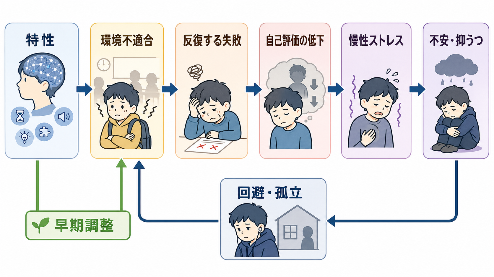
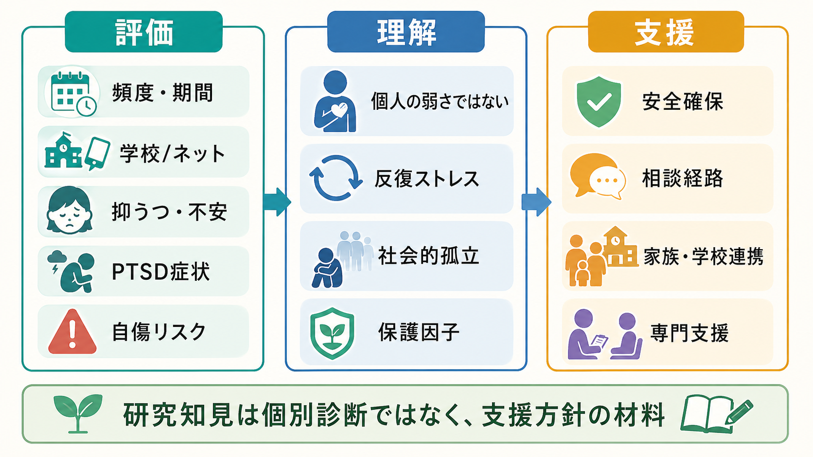

# 児童青年期のうつ病はどう現れるのか

## 要点

- 児童青年期のうつ病は、成人のような「悲しい」「気分が落ち込む」という訴えだけでなく、易怒性、攻撃的に見える反応、身体症状、成績低下、不登校、対人回避、自傷として現れることがある。
- 診断名だけを見るより、家庭・学校・友人関係での機能低下、症状の持続、発達段階、併存症、ストレス環境を合わせて読む必要がある。
- 自傷や希死念慮は「注目を引く行動」と単純化せず、[[自傷と自殺企図はどう違うのか]]や[[自殺リスク評価では何を聞くべきか]]の観点から安全確認を優先する。
- 本記事は教育・研究目的の整理であり、個別の診断や治療指示ではない。

## この記事で答える問い

児童青年期のうつ病は、なぜ「落ち込み」以外のかたちで見えやすいのか。特に、易怒性、頭痛・腹痛などの身体症状、不登校、自傷が、うつ病の理解にどう関係するのかを整理する。

## まず結論

児童青年期のうつ病は、「気分の病気」がそのまま言語化されるとは限らない。小児では自分の内的状態を十分に言葉にできないことがあり、思春期では恥、反抗、対人緊張、同調圧力が訴え方を変える。そのため、悲哀よりも易怒性、退屈、疲労、睡眠変化、腹痛・頭痛、学校回避、成績低下、孤立、自傷として周囲に見えることがある[1][2][3]。

重要なのは、「不登校だからうつ病」「自傷があるから必ずうつ病」と直結させないことである。これらは不安症、発達特性、いじめ、家族葛藤、トラウマ、身体疾患、睡眠問題などとも重なりうる。したがって、[[生物心理社会モデルとは何か]]や[[素因ストレスモデルとは何か]]の枠組みで、症状・機能・環境・安全を同時に見るのが実践的である[2][4]。

## 背景

NICE のガイドラインは、5歳から18歳の子ども・若者のうつ病について、認識、評価、段階的ケアを扱う。うつ病では抑うつ気分または興味・喜びの低下が中心だが、症状は人によって異なり、不安症状を伴うことも多い[1]。AAP の GLAD-PC は10歳から21歳を対象に、プライマリケアでの同定、評価、初期対応、継続的モニタリングを重視している[2][5]。

子ども・若者のうつ病を難しくするのは、本人の訴えと周囲が観察する行動の間にずれが生じやすい点である。本人は「つらい」と言わずに、怒りっぽさ、学校への拒否、寝すぎ、成績低下、ゲームやネットへの逃避、身体不調を訴えることがある。NIMH も、子どもでは不安、機嫌の悪さ、仮病のように見える訴え、登校拒否、親へのしがみつきが目立つ場合があり、年長児・思春期では学校での問題、いらだち、落ち着かなさ、低い自尊感情が現れうると説明している[3]。

## 基本概念

### 1. 易怒性は「悲しみの代わり」に見えることがある

児童青年期では、抑うつ気分が「悲しい」ではなく「腹が立つ」「すぐ爆発する」「何もかも面倒」として表面化することがある。DSM-5 に基づく整理でも、小児・青年の大うつ病エピソードでは抑うつ気分が易怒的気分として現れうるとされる[6]。これは「性格が悪い」「反抗している」と同義ではない。低いエネルギー、睡眠変化、集中困難、自己評価の低下、興味の喪失と一緒に続くなら、気分症状の表現として読む必要がある。

### 2. 身体症状は「身体か心理か」の二択ではない

頭痛、腹痛、疲労、吐き気、動悸、食欲変化、睡眠の乱れは、子どものうつ病でしばしば問題になる。身体症状があるから心理的問題だと決めつけるのも、検査で説明しきれないから「気のせい」とするのも避けたい。[[身体合併症は精神科診療でなぜ重要なのか]]の観点から、身体疾患、薬剤、睡眠、栄養、疼痛、月経、発達段階を確認しながら、感情調整の負荷が身体に出ている可能性も検討する[3][6]。

### 3. 不登校は診断名ではなく、機能低下のサインである

不登校や登校しぶりは、それ自体がうつ病の診断ではない。近年のレビューでは、学校拒否は不安症、抑うつ症状、身体症状、発達特性、いじめ、家族要因など複数の要因と結びつく臨床的に異質な状態として整理されている[4]。うつ病との関係では、朝起きられない、学校での集中が続かない、友人関係を避ける、失敗感が強い、欠席がさらに自己評価低下を深める、という悪循環が起こりやすい。

### 4. 自傷は「死にたいかどうか」だけで読まない

思春期の自傷は、感情の急激な高まりを下げる、解離感を止める、自己罰を行う、助けを求める、対人関係の混乱を調整するなど、複数の機能を持ちうる。うつ病と非自殺性自傷はしばしば重なり、抑うつ、孤立、絶望感、自殺リスクとの関係が問題になる[7]。ただし、自傷の有無だけから自殺意図を断定せず、希死念慮、計画性、手段へのアクセス、過去の企図、保護因子、相談可能な大人を評価する必要がある。

## 仕組み

児童青年期のうつ病を、単一の原因で説明するのは適切ではない。実践上は、次のような連鎖として考えると理解しやすい。

1. 発達的脆弱性や気質、家族歴、慢性的ストレス、いじめ、学業困難、睡眠不足などが重なる。
2. 情動調整の負荷が高まり、怒り、涙、退屈、疲労、身体不調として出やすくなる。
3. 集中困難、睡眠・食欲変化、自己評価低下が進み、学校や友人関係での失敗体験が増える。
4. 回避、不登校、孤立、ネットへの没入、自傷など、周囲からは「行動問題」に見える形で表面化する。
5. 回避により短期的には苦痛が下がるが、長期的には学業遅れ、孤立、家族葛藤が増え、抑うつを維持しうる。

GLAD-PC は、うつ症状だけでなく家庭・学校・友人関係での機能を継続的に追跡することを勧めている。症状数だけでなく、生活機能がどこで崩れているかを見ることが、児童青年期では特に重要である[5]。

## 図解

上の図は、児童青年期のうつ病を「内面の気分」だけでなく、観察可能な行動・身体・学校生活として捉えるための補助図である。図の用語は診断基準そのものではなく、評価の入口を整理するための概念図として読む。

### 図解案

画像を追加・差し替える場合は、次のような日本語インフォグラフィックが有用である。

- 「見えにくいうつが行動として現れるまで」：脆弱性・ストレス、情動調整の負荷、睡眠・身体反応、学校回避・孤立・自傷リスクを、非決定論的な矢印で示す。
- 「成人とうつ病名は同じでも見え方が違う」：成人で目立ちやすい抑うつ気分・罪責感と、児童青年期で目立ちやすい易怒性・身体症状・学校機能低下を比較する。

## 臨床・研究との接続

### 評価では複数の情報源を使う

本人、保護者、学校、かかりつけ医、心理職などで見えている情報は異なる。本人は「大丈夫」と言い、保護者は怒りや昼夜逆転を訴え、学校は欠席や成績低下を問題にすることがある。NICE や GLAD-PC のようなガイドラインは、症状、重症度、リスク、機能、家族・学校環境を統合して評価する発想を持つ[1][2]。[[家族面接では何を評価するべきか]]や[[併存症とは何か]]も併せて読むとよい。

### 併存症と鑑別を急いで単純化しない

不安症、ADHD、自閉スペクトラム症、摂食症、物質使用、双極症、トラウマ関連症状、身体疾患、睡眠障害は、うつ症状と重なりやすい。特に、易怒性が目立つ場合は、うつ病だけでなく、環境への過負荷、発達特性、持続的な気分調節困難、双極性の経過、虐待・いじめなどを慎重に見る必要がある。

### 支援は「本人だけを変える」ものではない

児童青年期のうつ病では、本人の心理療法や医学的評価だけでなく、睡眠・生活リズム、学校調整、家族への心理教育、安全計画、相談経路の確保が重要になる。GLAD-PC は、軽症例での能動的支援とモニタリング、症状・機能の追跡、必要時の専門家との連携を重視している[2][5]。この点は[[心理教育とは何か]]や[[精神科診察で睡眠をどう評価するか]]とも接続する。

## よくある誤解

### 「怒っているなら、うつ病ではない」

誤り。児童青年期では、悲しみより易怒性が前景に出ることがある[3][6]。ただし、怒りだけでうつ病と決めるのではなく、興味低下、睡眠・食欲変化、疲労、集中困難、自己評価低下、希死念慮、機能低下を合わせて見る。

### 「身体症状があるなら、精神科の問題ではない」

誤り。身体症状は身体疾患の評価を要する一方で、うつ病や不安、ストレス反応と重なりうる。身体と心理を切り分けるより、両方を検討する。

### 「不登校は甘えか、うつ病かのどちらかである」

誤り。不登校は多因子的な機能低下の表現であり、うつ病、不安症、発達特性、いじめ、学業困難、家庭要因が混ざることがある[4]。診断名を急ぐより、何が登校を困難にし、何が維持しているかを見る。

### 「自傷は本気ではないから心配しなくてよい」

誤り。自傷は自殺意図の有無にかかわらず、強い苦痛や調整困難のサインでありうる。自傷、希死念慮、手段へのアクセス、保護因子を分けて確認する必要がある[7]。

## 関連ノート

- [[生物心理社会モデルとは何か]]
- [[素因ストレスモデルとは何か]]
- [[自傷と自殺企図はどう違うのか]]
- [[自殺リスク評価では何を聞くべきか]]
- [[身体合併症は精神科診療でなぜ重要なのか]]
- [[精神科診察で睡眠をどう評価するか]]
- [[家族面接では何を評価するべきか]]
- [[併存症とは何か]]
- [[心理教育とは何か]]

MOC 更新候補: `content/00_MOC/` 配下の精神医学、児童青年、気分症、発達・ライフスパン関連 MOC。並列作業との衝突を避けるため、本ジョブでは MOC 本体は更新しない。

## 理解チェック

1. 児童青年期のうつ病で、悲しみより易怒性が目立つとき、どのような追加情報を確認するとよいか。
2. 頭痛・腹痛・疲労がある子どもに対して、「身体か心理か」の二択で考えることの問題は何か。
3. 不登校を、うつ病の診断そのものではなく機能低下のサインとして読む利点は何か。
4. 自傷と自殺リスクを評価するとき、同じものとして扱わずに分けて確認すべき項目は何か。

## 未解決問題

- 児童青年期のうつ病では、症状の言語化能力、家族文化、学校制度、オンライン環境が表現型に影響するが、どの要因がどの程度リスクや回復を左右するかは文脈依存である。
- 不登校、自傷、身体症状は複数の診断・環境要因と重なるため、うつ病に特異的なサインとして扱うには限界がある。
- 研究で得られた集団レベルの知見を、個別の子ども・家族・学校の支援計画へどう翻訳するかは、臨床判断と地域資源に左右される。

## 参考文献

[1] National Institute for Health and Care Excellence. (2019). *Depression in children and young people: identification and management* (NICE Guideline NG134). https://www.nice.org.uk/guidance/ng134

[2] Zuckerbrot, R. A., Cheung, A., Jensen, P. S., Stein, R. E. K., Laraque, D., & GLAD-PC Steering Group. (2018). Guidelines for Adolescent Depression in Primary Care (GLAD-PC): Part I. Practice preparation, identification, assessment, and initial management. *Pediatrics, 141*(3), e20174081. https://doi.org/10.1542/peds.2017-4081

[3] National Institute of Mental Health. (n.d.). *Depression*. https://www.nimh.nih.gov/health/publications/depression

[4] Di Vincenzo, C., Pontillo, M., Bellantoni, D., Di Luzio, M., Lala, M. R., Villa, M., Demaria, F., & Vicari, S. (2024). School refusal behavior in children and adolescents: A five-year narrative review of clinical significance and psychopathological profiles. *Italian Journal of Pediatrics, 50*, 107. https://doi.org/10.1186/s13052-024-01667-0

[5] Cheung, A. H., Zuckerbrot, R. A., Jensen, P. S., Laraque, D., Stein, R. E. K., & GLAD-PC Steering Group. (2018). Guidelines for Adolescent Depression in Primary Care (GLAD-PC): Part II. Treatment and ongoing management. *Pediatrics, 141*(3), e20174082. https://doi.org/10.1542/peds.2017-4082

[6] Mullen, S. (2018). Major depressive disorder in children and adolescents. *Mental Health Clinician, 8*(6), 275-283. https://doi.org/10.9740/mhc.2018.11.275

[7] Fang, S., Chen, F., Bian, J., Zhang, L., & Wang, Y. (2025). Interventions for adolescent depression comorbid with non-suicidal self-injury: A scoping review. *Frontiers in Psychiatry, 16*, 1601073. https://doi.org/10.3389/fpsyt.2025.1601073
