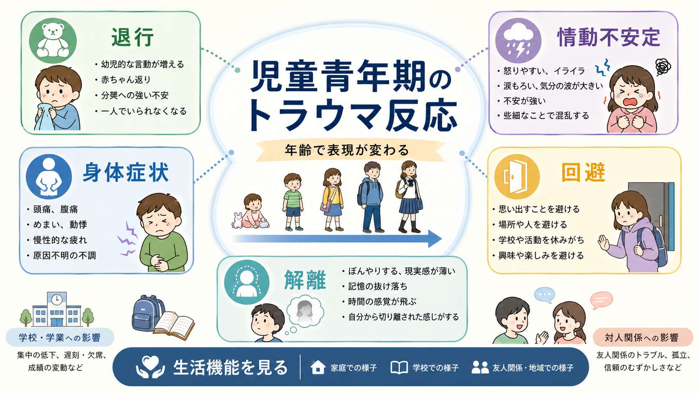
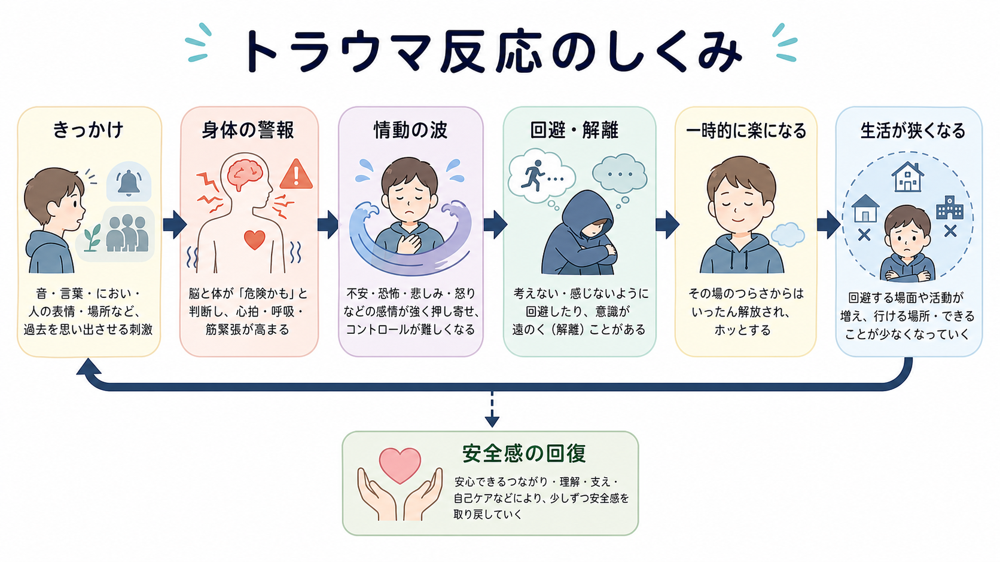
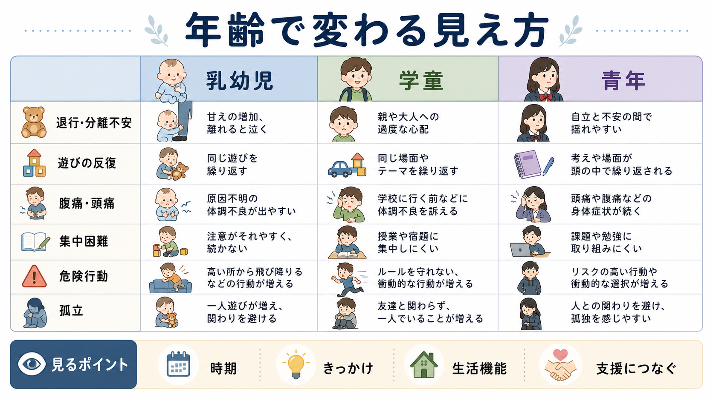

# 児童青年期のトラウマ反応はどう現れるのか

## 要点

- 子どものトラウマ反応は、大人の[[PTSDとは何か|PTSD]]症状を小さくしたものではなく、年齢、言語化能力、養育環境、学校生活、発達課題によって見え方が変わる。
- 乳幼児では退行、分離不安、睡眠・摂食の変化、反復遊びとして現れやすい。学童期では身体症状、集中困難、怒り、回避、学業・友人関係の変化が目立つ。青年期では回避、孤立、危険行動、自己評価の揺らぎ、解離、抑うつ・不安との重なりが見えやすい[1][2]。
- 反応は「弱さ」や「わがまま」ではなく、脅威を検出しすぎる身体、感情調整の難しさ、記憶・注意・対人安全感の変化として理解すると見立てやすい[3][4]。
- 評価では、出来事の詳細だけでなく、発症時期、きっかけ、回避している場面、家庭・学校・友人関係への影響、発達歴、身体疾患、虐待・継続的危険の有無を確認する[2][5]。

## この記事で答える問い

この記事では、「児童青年期のトラウマ反応は、年齢によってどう違って見えるのか」を整理する。特に、退行、情動不安定、身体症状、回避、解離が、乳幼児、学童、青年でどのように表現されるかを扱う。診断名を急いで当てはめるよりも、[[子どもの精神症状は大人と何が違うのか|子どもの症状表現の特徴]]と生活機能の変化を合わせて読むためのノートである。

## まず結論

児童青年期のトラウマ反応は、典型的な「怖い記憶を語る」形だけで現れるとは限らない。年少児では、出来事を言葉で説明できず、赤ちゃん返り、夜泣き、分離不安、身体の訴え、同じ遊びの反復として出ることがある。学童期では、学校に行く前の腹痛、集中困難、怒りっぽさ、友人関係の変化、特定の場所や話題の回避として気づかれる。青年期では、回避や孤立、過覚醒、睡眠問題、自己非難、危険行動、解離、抑うつや不安との併存として見えやすい[1][2]。

重要なのは、反応の形ではなく「その子の普段からの変化」を見ることである。年齢相応に説明できない、生活機能が落ちている、きっかけに反応が結びつく、周囲から見て性格変化のように見える、という場合には、[[子どものアセスメントでは何を確認するのか|子どものアセスメント]]の中でトラウマ反応を仮説として置く。

## 背景

トラウマ体験には、事故、災害、暴力、虐待、性被害、突然の喪失、医療処置、家庭内暴力の目撃などが含まれる。ただし、同じ出来事でも反応の強さは一様ではない。発達段階、過去の逆境、家族や学校の支え、出来事が単回か反復性か、現在も安全が脅かされているかによって、反応の形は大きく変わる[2][6]。

疫学的には、トラウマ曝露を経験した子どもの一部がPTSDを呈するが、多くは診断閾値未満の苦痛や生活機能低下を示す。メタ分析では、外傷体験後の児童青年のPTSD有病率は体験の種類や対象集団によって大きく異なることが示されている[6]。そのため、臨床や教育現場では「PTSDかどうか」だけでなく、睡眠、食事、身体症状、登校、遊び、対人関係、自己評価の変化を幅広く見る必要がある。

## 基本概念

### 退行

退行とは、発達上すでに獲得していた行動が、一時的に幼い段階へ戻るように見えることである。乳幼児や低学年では、指しゃぶり、夜尿、抱っこ要求、ひとりで眠れない、分離不安、幼い言葉づかいとして見えることがある[1]。これは「甘え」だけでなく、安全基地を再確認しようとする反応として理解できる。

### 情動不安定

情動不安定は、怒り、泣き、恐怖、苛立ち、突然の沈黙が波のように変化する状態である。子どもは内的な恐怖や恥を言語化しにくいため、癇癪、反抗、攻撃性、過度の警戒、些細な刺激への強い反応として現れることがある[3][4]。青年期では、自己非難、恥、怒り、対人不信が混ざり、[[児童青年期のうつ病はどう現れるのか|抑うつ]]や[[児童青年期の不安症はどう現れるのか|不安]]として前景化することもある。

### 身体症状

腹痛、頭痛、吐き気、めまい、倦怠感、睡眠障害は、児童青年期のトラウマ反応でよく見られる。特に学童期では、登校前、特定の授業や場所の前、面談や接触場面の前に身体症状が強まることがある。身体疾患の評価を省略してよいという意味ではなく、医学的評価と心理社会的文脈を並行して見る必要がある[2][5]。

### 回避

回避は、出来事を思い出させる場所、人、話題、におい、音、時間帯、身体感覚を避ける反応である。子どもでは「話したくない」と明確に言うよりも、学校へ行けない、特定の道を通れない、遊びや活動から離れる、関連する話題でふざける、急に怒る、眠らないようにする、といった形になる[1][2]。

### 解離

解離は、圧倒される経験から距離を取るために、意識、記憶、身体感覚、現実感、自己感が一時的に切り離されるような状態である。ぼんやりする、聞こえていないように見える、記憶が抜ける、現実感が薄い、身体が自分のものではない感じがする、などとして表現される。解離は[[解離とは何か|解離]]や[[解離症群とは何か|解離症群]]の観点から整理できるが、児童青年では注意散漫、反抗、空想、眠気と見間違われることがある[7]。

## 仕組み

トラウマ反応の中心には、「現在の危険」と「過去の危険の手がかり」が区別されにくくなる過程がある。出来事を思い出させる刺激が入ると、身体は危険が再来したかのように反応し、心拍、呼吸、筋緊張、胃腸症状、睡眠の乱れが生じる。そこに恐怖、怒り、恥、無力感が重なると、子どもは回避や解離によってその場の苦痛を下げようとする[3][4]。

この回避や解離は短期的には役に立つ。怖い場所を避ければ、その瞬間は楽になる。感じないようにすれば、圧倒されずに済む。しかし、回避が続くと、行ける場所、関われる人、挑戦できる活動が狭くなる。結果として、学校、友人関係、家庭内のやりとり、睡眠、自己評価に影響が広がる。子どもの場合、この生活の縮小が「怠け」「反抗」「性格の問題」と誤解されやすい。

## 図解

年齢別に見ると、同じトラウマ反応でも表現の入口が異なる。乳幼児では養育者との距離、睡眠、摂食、遊びに現れやすい。学童では身体症状、登校、集中、同年代関係が手がかりになる。青年期では、自立への課題と重なるため、孤立、危険行動、自己非難、対人不信、解離が見えやすい。

## 臨床・研究との接続

### 評価では「出来事」だけでなく「現在の安全」を見る

トラウマ反応を評価するとき、出来事の詳細を聞き出すことだけが中心ではない。現在も危険が続いていないか、子どもが安全な場所にいるか、保護者や学校が支援できる状態かを確認することが先である。NICEやAACAPのガイドラインでも、年齢に応じた評価、併存症、発達段階、家族・養育環境、機能障害を含めた見立てが重視される[2][5]。

### 診断閾値未満の反応も支援対象になる

DSMやICDの診断基準は重要だが、子どもの苦痛は診断閾値にきれいに収まらないことがある。特に就学前児では、言語化能力の制約から、再体験、回避、認知・気分の変化が遊び、行動、身体症状として現れるため、発達に合わせた読み替えが必要になる[4][8]。

### 鑑別は「排除」ではなく重なりを見る

トラウマ反応は、うつ、不安、ADHD様の集中困難、反抗、睡眠障害、身体症状、解離、発達特性と重なって見える。したがって、[[発達特性と二次障害とは何か|発達特性と二次障害]]、[[虐待は発達と精神疾患にどう影響するのか|虐待の影響]]、[[精神疾患とトラウマ反応はどう関係するのか|精神疾患とトラウマ反応]]を切り分けるというより、時間順序と文脈を丁寧に並べることが重要である。

## よくある誤解

### 「思い出して話せないならトラウマ反応ではない」

子どもは出来事を言葉で一貫して語れないことがある。年少児では遊びや身体、青年では沈黙や回避として現れることもある。語れないことは、体験がなかったことの証拠にも、反応が軽いことの証拠にもならない[1][4]。

### 「反応が遅れて出るのは不自然である」

反応は直後に出ることも、しばらくしてから出ることもある。安全な環境に移った後、発達課題が変わった時、学校や対人関係の場面で手がかりに触れた時に目立つことがある[2]。

### 「身体症状なら心理的問題ではない」

身体症状は身体疾患の可能性を評価する必要がある。一方で、医学的評価で説明しきれない腹痛や頭痛が、危険の手がかり、登校、面談、対人場面と結びつくこともある。身体と心理を二分せず、[[身体化とは何か|身体化]]や生活機能の文脈で見る。

### 「回避をやめさせれば回復する」

回避は短期的には子どもを守っていることがある。急に取り上げると安全感を損ねる場合がある。教育・臨床の場では、個別の治療指示としてではなく、安全確認、信頼できる関係、予測可能な日課、年齢に合った説明、必要時の専門支援につなぐ視点が重要である[2][5]。

## 関連ノート

- [[トラウマ関連障害群とは何か]]
- [[PTSDとは何か]]
- [[複雑性PTSDとは何か]]
- [[精神疾患とトラウマ反応はどう関係するのか]]
- [[解離とは何か]]
- [[身体化とは何か]]
- [[児童精神医学とは何か]]
- [[子どものアセスメントでは何を確認するのか]]
- [[子どもの精神症状は大人と何が違うのか]]
- [[虐待は発達と精神疾患にどう影響するのか]]

MOC更新候補: `content/00_MOC/` 配下の精神医学、児童青年期、トラウマ関連のMOCに追加する候補。並列ジョブとの衝突を避けるため、このノートではMOC本体を更新しない。

## 理解チェック

1. 乳幼児のトラウマ反応が、言語報告ではなく退行や遊びの反復として見えるのはなぜか。
2. 学童期の腹痛や頭痛を評価するとき、身体疾患の確認と並行してどのような文脈を見るべきか。
3. 青年期の回避、孤立、危険行動、解離は、どのように安全感や生活機能の変化と結びつくか。
4. 「診断閾値未満だが生活機能が落ちている」子どもを、支援上どのように扱うべきか。

## 未解決問題

- 年齢、性別、文化、発達特性によって、どの症状表現が見逃されやすいか。
- 学校現場での観察情報を、過度なラベリングなしに臨床評価へ接続する方法。
- 反復性トラウマ、複雑性PTSD、解離、神経発達症の重なりを、児童青年期にどう評価するか。
- 早期支援が長期的な対人関係、学業、自己評価、身体症状に与える影響。

## 参考文献

[1] National Child Traumatic Stress Network. *Age-Related Reactions to a Traumatic Event*. https://www.nctsn.org/resources/age-related-reactions-traumatic-event

[2] National Institute for Health and Care Excellence. *Post-traumatic stress disorder: NICE guideline NG116*. https://www.nice.org.uk/guidance/ng116

[3] Dvir, Y., Ford, J. D., Hill, M., & Frazier, J. A. (2014). Childhood maltreatment, emotional dysregulation, and psychiatric comorbidities. *Harvard Review of Psychiatry, 22*(3), 149-161. https://doi.org/10.1097/HRP.0000000000000014

[4] De Young, A. C., Kenardy, J. A., & Cobham, V. E. (2011). Trauma in early childhood: A neglected population. *Clinical Child and Family Psychology Review, 14*, 231-250. https://doi.org/10.1007/s10567-011-0094-3

[5] Cohen, J. A., Bukstein, O., Walter, H., Benson, S. R., Chrisman, A., Farchione, T. R., Hamilton, J., Keable, H., Kinlan, J., Schoettle, U., Siegel, M., Stock, S., & Medicus, J. (2010). Practice parameter for the assessment and treatment of children and adolescents with posttraumatic stress disorder. *Journal of the American Academy of Child & Adolescent Psychiatry, 49*(4), 414-430. https://doi.org/10.1016/j.jaac.2009.12.020

[6] Alisic, E., Zalta, A. K., van Wesel, F., Larsen, S. E., Hafstad, G. S., Hassanpour, K., & Smid, G. E. (2014). Rates of post-traumatic stress disorder in trauma-exposed children and adolescents: Meta-analysis. *The British Journal of Psychiatry, 204*(5), 335-340. https://doi.org/10.1192/bjp.bp.113.131227

[7] International Society for the Study of Trauma and Dissociation. (2003). Guidelines for the evaluation and treatment of dissociative symptoms in children and adolescents. *Journal of Trauma & Dissociation, 5*(3), 119-150. https://doi.org/10.1300/J229v05n03_09

[8] American Psychiatric Association. (2022). *Diagnostic and Statistical Manual of Mental Disorders, Fifth Edition, Text Revision*. https://doi.org/10.1176/appi.books.9780890425787
