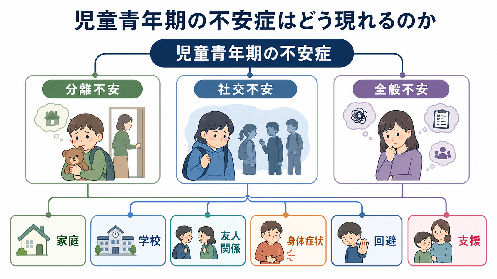
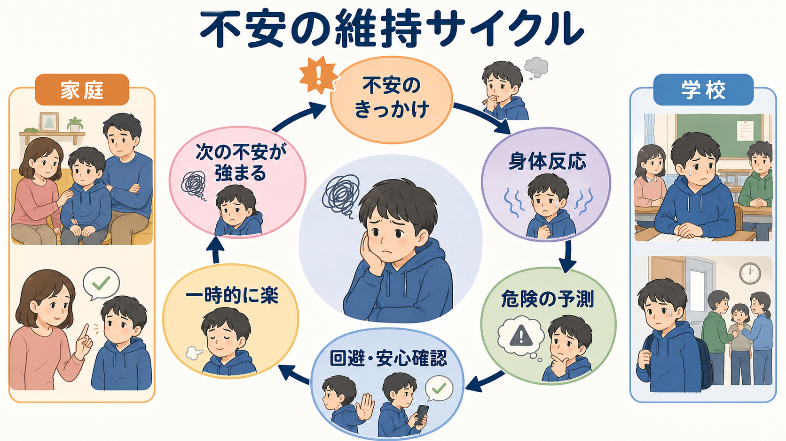
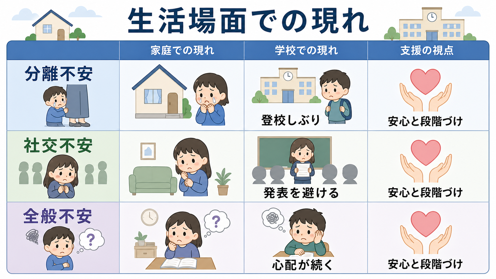

# 児童青年期の不安症はどう現れるのか

## 要点

- 児童青年期の不安症は、「怖がり」「心配性」という性格だけでなく、家庭、学校、友人関係、睡眠、身体症状、登校しぶり、回避行動として現れる。
- 代表的には、養育者から離れることへの強い苦痛を中心とする[[分離不安症とは何か]]、評価される場面への恐怖を中心とする[[社交不安症とは何か]]、複数の生活領域にまたがる心配を中心とする[[全般不安症とは何か]]がある。
- 不安は短期的には危険回避を助けるが、回避と安心確認が続くと、学校参加や友人関係の機会が減り、不安が維持されやすい。
- 医療・教育・家庭での評価では、症状名だけでなく、年齢、発達段階、家庭と学校の文脈、併存する発達特性や抑うつ、自傷リスクを確認する必要がある。
- 本記事は教育・研究目的の整理であり、個別の診断や治療指示ではない。本人や家族の困りごとが続く場合は、地域の医療・心理・教育相談資源につなぐことが重要である。

## この記事で答える問い

1. 児童青年期の不安症は、大人の不安症と何が違って見えるのか。
2. 分離不安、社交不安、全般不安は、家庭や学校でどのように表れるのか。
3. なぜ「回避」や「安心確認」は、短期的には役立っても長期的には不安を維持しうるのか。
4. 臨床や研究では、どのような視点で評価・支援を組み立てるのか。

## まず結論

児童青年期の不安症は、本人が「不安です」と明確に言語化するとは限らない。むしろ、朝の腹痛、頭痛、保健室利用、登校しぶり、親から離れられない、授業で発表できない、友人関係を避ける、宿題や成績を過度に心配する、寝つけない、怒りっぽくなる、といった生活上の変化として見えることが多い。

重要なのは、不安の有無だけではない。発達段階から見て過度か、本人や家族に苦痛があるか、学校・家庭・友人関係の機能を妨げているか、そして回避が生活範囲を狭めているかを見る必要がある。世界的なメタ分析では、児童青年期の精神疾患全体の有病割合は約13.4%、不安症群は約6.5%と推定されており、不安症は子ども・若者で頻度の高い精神医学的問題である[1]。

## 背景

子どもの恐怖や心配そのものは正常な発達の一部である。幼児は養育者から離れることを怖がり、小学生は失敗や叱責を心配し、思春期には友人からどう見られるかが重要になる。したがって、児童青年期の不安を理解するには、単に症状を列挙するだけでなく、発達段階、生活環境、学校制度、家族関係、友人関係の中で読む必要がある。

NIMH は、子どもの心の問題を考えるとき、数週間以上続く、本人や家族に苦痛を与える、学校・家庭・友人関係の機能を妨げる、といった点に注意するよう整理している[2]。これは、不安を「普通か異常か」で機械的に切るのではなく、持続性、苦痛、機能障害、安全性を合わせて見るという考え方である。

[[ライフスパン精神医学とは何か]]の観点からは、不安症はある年齢で突然切り離された疾患ではなく、幼児期の分離、学童期の学校参加、思春期の評価不安と仲間関係、青年期の自律と進路選択にまたがる発達課題の中で現れる。背景には、気質、家族の不安、ストレス体験、いじめ、発達特性、身体疾患、学校環境などが重なりうる。

## 基本概念

### 分離不安

分離不安は、養育者や家から離れることに対する強い不安である。幼い子どもに一定の分離不安が見られること自体は自然だが、発達段階に比べて強く、持続し、生活機能を妨げる場合には臨床的な問題になる。Merck Manual は、分離不安症では、登園・登校時の強い苦痛、養育者に何か悪いことが起きるのではないかという心配、ひとりで眠れない、頭痛や腹痛などの身体症状がみられうると説明している[3]。

家庭では、親が出かける準備を始めるだけで泣く、寝室を分けられない、何度も安否確認を求める、といった形で現れる。学校では、朝に腹痛を訴える、校門で固まる、早退を繰り返す、保護者への連絡を強く求める、といった形になりやすい。

### 社交不安

社交不安は、人前で評価される、失敗を見られる、恥をかく、否定的に判断されることへの強い恐怖である。子どもでは、発表、音読、体育、給食、班活動、電話、初対面の会話などがきっかけになる。Merck Manual は、社交不安症の子どもでは、泣く、固まる、しがみつく、話さない、学校や社会的場面を避ける、腹痛や頭痛を訴えることがあると整理している[4]。

思春期以降は、内面では強い不安があっても、外からは「無口」「やる気がない」「反抗的」「付き合いが悪い」と見えることがある。NICE の社会不安症ガイドラインは、学校を避ける、集団活動や社会的場面を避ける、会話場面で過度に親へ依存する、といった子ども・若者のサインに注意し、家庭・学校・社会環境の維持要因を評価することを推奨している[5]。

### 全般不安

全般不安は、特定の対象に限られない過度な心配が続く状態である。心配の対象は、成績、宿題、忘れ物、健康、家族、友人関係、将来、災害、ニュース、習い事などに広がる。NIMH は、子ども・青年の全般不安では、学校、課外活動、友人関係、将来に心配が向きやすいと説明している[6]。

学校では、完璧にできないと提出できない、テスト前に眠れない、何度も確認する、失敗を恐れて新しい活動を避ける、といった形で現れる。家庭では、保護者に同じ質問を繰り返す、予定変更に弱い、寝る前に心配が噴き出す、疲れやすい、怒りっぽくなる、といった形で見える。

## 仕組み

不安症の中核には、「危険の予測」と「回避による一時的な relief」がある。たとえば、発表を避けるとその日は楽になる。しかし、避けたことで「発表しても大丈夫だった」という経験が得られず、次の発表はさらに怖くなる。登校を避ける、親に確認し続ける、友人との会話を避ける、身体症状が出るたびに活動を中断する、といった行動も同じ構造を持つ。

この維持サイクルは、脳の警戒系だけでなく、注意、予測、身体感覚、学習、家族の反応、学校側の対応によって支えられる。たとえば[[扁桃体過活動は不安症やPTSDにどう関わるのか]]や[[ノルアドレナリン系は不安と覚醒にどう関わるのか]]で扱うような警戒・覚醒の仕組みは、不安の身体反応や危険予測と関係する。ただし、児童青年期では神経メカニズムだけで説明せず、親子関係、発達課題、学校環境、いじめ、併存症を同時に見る必要がある。

## 図解

| 図 | 役割 | 読み方 |
|---|---|---|
| 図1 | 児童青年期の不安症の概念地図 | 分離不安・社交不安・全般不安が、家庭、学校、友人関係、身体症状、回避、支援にまたがることを見る |
| 図2 | 不安の維持サイクル | 不安のきっかけから身体反応、危険予測、回避・安心確認、一時的な安心、次の不安増強へ循環する流れを見る |
| 図3 | 生活場面での現れ | 同じ「不安」でも、家庭と学校で見え方が異なり、支援では安心と段階づけの両方が必要になることを見る |

## 臨床・研究との接続

### 評価の視点

臨床評価では、本人の訴えだけでなく、保護者、学校、かかりつけ医、必要に応じて心理職やスクールカウンセラーからの情報を統合する。AACAP の臨床実践ガイドラインは、児童青年期の不安症が頻度の高い精神疾患であり、評価と治療では認知行動療法や SSRI などのエビデンスを踏まえる必要があるとまとめている[7]。ただし、薬物療法や心理療法の選択は、年齢、重症度、併存症、本人と家族の希望、地域資源、安全性を含む個別評価に基づく。

評価で特に重要なのは、次のような問いである。

- 不安はいつ、どこで、誰といるときに強くなるか。
- 本人は何を恐れているのか。分離、評価、失敗、身体感覚、将来、災害など、焦点はどこにあるか。
- 回避によって、学校参加、友人関係、睡眠、食事、家族の予定がどの程度変わっているか。
- 腹痛、頭痛、吐き気、動悸、息苦しさ、疲労などの身体症状に、医学的評価が必要な要因はないか。
- いじめ、虐待、トラウマ、抑うつ、自傷、自殺念慮、発達特性、学習困難が関係していないか。

### 支援の視点

支援では、「安心させること」と「避けている生活機会を少しずつ回復すること」のバランスが重要である。安心だけを増やすと、不安のたびに確認や回避が強化されることがある。一方で、急に恐怖場面へ押し出すと、本人の信頼や安全感を損ないうる。したがって、本人が理解できる言葉で不安の仕組みを共有し、家庭と学校が同じ方針で、達成可能な小さな段階を作ることが実用的である。

CAMS 研究では、7-17歳の分離不安症、全般不安症、社交恐怖を主診断とする488名を対象に、認知行動療法、セルトラリン、併用、プラセボを比較し、12週時点で併用、認知行動療法単独、セルトラリン単独がプラセボより有効であったと報告された[8]。この知見は、児童青年期の不安症に対して有効な介入が存在することを示すが、個別の治療選択は専門家による評価の中で行われる。

### 研究の視点

研究上は、症状の有無だけでなく、機能障害、発達段階、家庭・学校環境、併存症、治療アクセス、長期経過を測る必要がある。社交不安ひとつを見ても、授業発表、友人関係、オンライン交流、いじめ経験、発達特性、文化的規範によって見え方は変わる。児童青年期の不安症研究は、診断横断的な不安メカニズムと、具体的な生活場面の両方をつなぐ必要がある。

## よくある誤解

### 誤解1: 子どもの不安は成長すれば自然に消える

一時的な怖がりや心配は発達の一部だが、苦痛と機能障害が続く不安は自然経過だけに任せるべきとは限らない。学校、友人関係、睡眠、身体症状、家族の活動が狭まっている場合は、早めに相談資源へつなぐ意義がある。

### 誤解2: 登校しぶりは怠けや反抗である

登校しぶりの背景には、分離不安、社交不安、全般不安、抑うつ、いじめ、発達特性、学習困難、身体疾患などがありうる。行動だけを叱ると、不安や孤立が強まることがある。何を避けているのか、どの場面なら参加できるのかを具体的に見る必要がある。

### 誤解3: 親が付き添えば安心するので、それで十分である

付き添いは短期的な安全確保として役立つことがある。しかし、付き添いがないと何もできない状態が固定されると、本人の自律機会が減る。安心を土台にしながら、本人が耐えられる範囲で段階的に行動範囲を広げる発想が必要である。

### 誤解4: 社交不安は内気な性格の問題である

内気さと社交不安症は同じではない。本人が強い苦痛を感じ、発表、会話、友人関係、進路選択などが制限されている場合には、性格づけで済ませず、評価と支援の対象として考える。

## 関連ノート

- [[分離不安症とは何か]]
- [[社交不安症とは何か]]
- [[全般不安症とは何か]]
- [[ライフスパン精神医学とは何か]]
- [[扁桃体過活動は不安症やPTSDにどう関わるのか]]
- [[ノルアドレナリン系は不安と覚醒にどう関わるのか]]

### 関連ノート候補

- 児童青年期のうつ病はどう現れるのか
- 不登校に関連する精神疾患には何があるのか
- 認知行動療法は子どもの不安症にどう働くのか
- 学校環境と精神症状はどう関係するのか

### MOC更新候補

- `content/00_MOC/MOC｜精神医学.md`
- `content/00_MOC/MOC｜発達・愛着・社会心理.md`

## 理解チェック

1. 児童青年期の不安症が、言語化された「不安」ではなく、身体症状や登校しぶりとして見える理由を説明できるか。
2. 分離不安、社交不安、全般不安の違いを、家庭と学校の具体例で説明できるか。
3. 回避と安心確認が、不安を一時的に下げながら長期的に維持しうる仕組みを説明できるか。
4. 評価で、本人、保護者、学校、身体症状、併存症、安全性を同時に見る理由を説明できるか。

## 未解決問題

- 児童青年期の不安症を、学校制度、家庭負担、地域資源の差を含めてどのように早期発見するか。
- オンライン授業、SNS、チャット文化が、社交不安や全般不安の見え方をどう変えているか。
- 発達特性、学習困難、いじめ、身体疾患を伴う不安症に対して、どのような多職種連携が最も有効か。
- 日本の学校・家庭文脈で、エビデンスに基づく段階的支援をどのように実装するか。

## 参考文献

[1] Polanczyk, G. V., Salum, G. A., Sugaya, L. S., Caye, A., & Rohde, L. A. (2015). Annual Research Review: A meta-analysis of the worldwide prevalence of mental disorders in children and adolescents. *Journal of Child Psychology and Psychiatry, 56*(3), 345-365. https://doi.org/10.1111/jcpp.12381

[2] National Institute of Mental Health. (n.d.). *Children and Mental Health: Is This Just a Stage?* https://www.nimh.nih.gov/health/publications/children-and-mental-health

[3] Merck Manual Professional Edition. (2025). *Separation Anxiety Disorder*. https://www.merckmanuals.com/professional/pediatrics/psychiatric-disorders-in-children-and-adolescents/separation-anxiety-disorder

[4] Merck Manual Professional Edition. (2025). *Social Anxiety Disorder in Children and Adolescents*. https://www.merckmanuals.com/en-ca/professional/pediatrics/psychiatric-disorders-in-children-and-adolescents/social-anxiety-disorder-in-children-and-adolescents

[5] National Institute for Health and Care Excellence. (2013, last reviewed 2024). *Social anxiety disorder: recognition, assessment and treatment (CG159)*. https://www.nice.org.uk/guidance/cg159

[6] National Institute of Mental Health. (2025). *Generalized Anxiety Disorder: What You Need to Know*. https://www.nimh.nih.gov/health/publications/generalized-anxiety-disorder-gad

[7] Walter, H. J., Bukstein, O. G., Abright, A. R., Keable, H., Ramtekkar, U., Ripperger-Suhler, J., & Rockhill, C. (2020). Clinical Practice Guideline for the Assessment and Treatment of Children and Adolescents With Anxiety Disorders. *Journal of the American Academy of Child & Adolescent Psychiatry, 59*(10), 1107-1124. https://doi.org/10.1016/j.jaac.2020.05.005

[8] Walkup, J. T., Albano, A. M., Piacentini, J., Birmaher, B., Compton, S. N., Sherrill, J. T., Ginsburg, G. S., Rynn, M. A., McCracken, J., Waslick, B., Iyengar, S., March, J. S., & Kendall, P. C. (2008). Cognitive behavioral therapy, sertraline, or a combination in childhood anxiety. *The New England Journal of Medicine, 359*(26), 2753-2766. https://doi.org/10.1056/NEJMoa0804633
