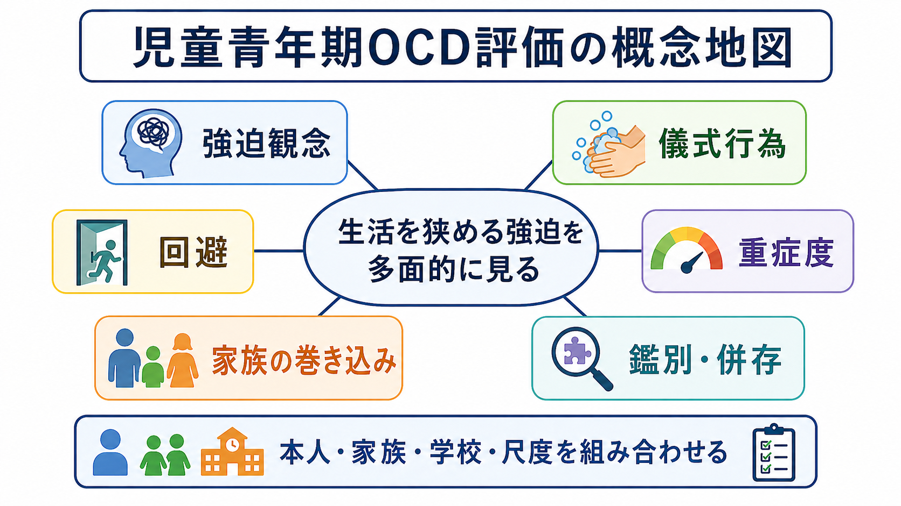
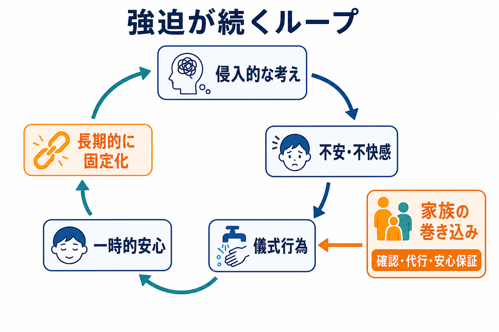
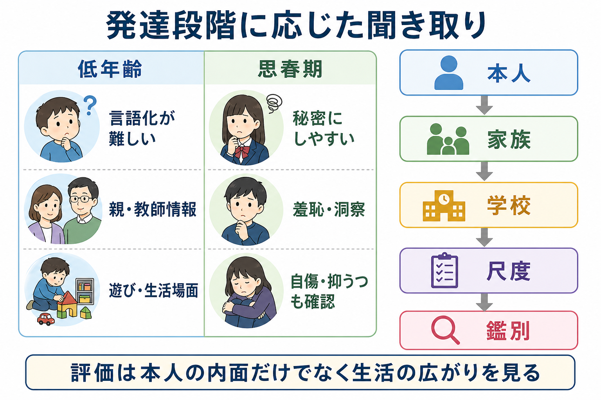

# 児童青年期の強迫症はどう評価するのか

## 要点

- 児童青年期の[[強迫症とは何か|強迫症]]評価では、[[強迫観念とは何か|強迫観念]]と[[強迫行為とは何か|強迫行為]]を聞くだけでなく、回避、時間消費、苦痛、学校・家庭機能、家族の巻き込みを分けて見る。
- 低年齢では「変な考えがある」と言語化できないことがあり、親・教師の観察、遊びや生活場面、身体化した不安から手がかりを得る。
- 思春期では羞恥、秘密化、洞察の揺れ、抑うつ、自傷リスクを確認する。評価は本人の内面を尊重しつつ、安全と生活機能を同時に見る。
- CY-BOCS などの尺度は、症状リストと重症度を構造化する補助になるが、尺度得点だけで診断や支援方針を決めるものではない[3]。

## この記事で答える問い

1. 児童青年期の強迫症では、何を「症状」として聞くのか。
2. 強迫観念、儀式行為、回避、家族の巻き込みをどう分けるのか。
3. 年齢や発達段階によって、聞き取りの焦点はどう変わるのか。
4. 尺度、鑑別、併存症、家族・学校情報をどう組み合わせるのか。

## まず結論

児童青年期の強迫症評価は、「強迫観念があるか」「手洗いをするか」という症状名の確認では足りない。中心は、本人がどのような侵入的な考え・イメージ・衝動に困り、それに対してどのような儀式行為、確認、回避、安心保証の要求を行い、その結果として生活がどれだけ狭まっているかを整理することである[1][2]。

ここで重要なのは、強迫症を「本人のこだわりが強い」だけに還元しないことである。小児では症状が家族の生活リズム、登校、宿題、入浴、食事、睡眠、スマートフォン利用、きょうだい関係に広がりやすい。したがって、評価単位は本人の頭の中だけではなく、家庭・学校・発達段階を含む生活全体になる。

## 背景

強迫症は、侵入的で反復する思考・イメージ・衝動と、それに反応して行われる反復行為や心の中の儀式を中核とする。ICD-11 でも、強迫観念や強迫行為が時間を消費し、苦痛や機能障害につながる状態として整理されている[5]。児童青年期では、この基本構造に発達段階の問題が重なる。

たとえば、低年齢の子どもは「ばい菌が怖い」「悪いことが起きる」とは言えても、なぜそれが頭から離れないのかを説明できないことがある。逆に思春期では、性的・攻撃的・宗教的な侵入思考や確認儀式を恥ずかしく感じ、家族にも臨床家にも隠すことがある。したがって、評価では発達に応じた言葉、非難しない面接態度、本人と保護者を分けた聞き取りが必要になる[1][2]。

## 基本概念

### 強迫観念

強迫観念は、本人の意図に反して浮かび、不安・嫌悪・罪悪感・不完全感を引き起こす思考、イメージ、衝動である。小児では汚染、加害、確認、対称性、宗教的・道徳的懸念、身体への違和感などが現れる。評価では、内容そのものよりも「どれくらい本人にとって不本意か」「どれくらい避けようとしているか」「どの場面で強まるか」を聞く。

### 儀式行為と回避

儀式行為は、手洗い、確認、数え直し、並べ直し、やり直し、質問の反復、心の中の打ち消しなどである。回避は、汚いと感じる場所に行かない、宿題を出せない、特定の服を着ない、家族に触らない、登校前の支度が進まない、といった形を取る。儀式行為が目立たない場合でも、回避によって生活が狭まっていれば重症度は高くなりうる[1][3]。

### 家族の巻き込み

家族の巻き込みは、保護者やきょうだいが、本人の不安を下げるために確認へ答える、代わりに触る、洗濯や掃除をやり直す、登校や食事の手順を強迫に合わせる、といった形で起こる。これは家族の「甘やかし」ではなく、短期的に苦痛を下げる自然な反応である。しかし長期的には、強迫ループを維持し、家族全体の疲弊につながることがある[4][6]。

## 仕組み

強迫症状は、侵入的な考えが不安や不快感を生み、儀式行為や回避が一時的な安心をもたらすことで維持されやすい。この一時的安心は負の強化として働き、次に同じ不安が出たときにも儀式行為を選びやすくする。家族が確認や代行を行うと、その瞬間の混乱は下がるが、本人が不確実性に耐える経験は減りやすい[1][4]。

このため評価では、「何を怖がっているか」だけでなく、「何をすると楽になるか」「その結果、翌日以降の生活がどう変わるか」を聞く。強迫の内容が同じでも、5分の確認で終わる子どもと、登校前に2時間止まる子どもでは、必要な支援の優先順位が違う。

## 図解

| 評価領域 | 具体的に聞くこと | 注意点 |
|---|---|---|
| 症状内容 | 汚染、確認、加害、対称性、不完全感、心の中の儀式 | 内容を責めず、本人の不本意さを確認する |
| 重症度 | 時間、苦痛、抵抗、制御困難、生活機能 | CY-BOCS などで構造化できる[3] |
| 発達段階 | 言語化、洞察、羞恥、秘密化 | 年齢だけでなく認知・言語発達を見る |
| 家族 | 確認への返答、代行、回避への協力、家族疲弊 | 家族を責めるのではなく維持構造として扱う[4][6] |
| 学校 | 遅刻、欠席、宿題、トイレ、給食、友人関係 | 家庭だけでは見えない機能障害を確認する |
| 鑑別・併存 | [[チック症とは何か|チック症]]、ASD、ADHD、不安症、うつ、身体醜形症 | [[鑑別診断とは何か|鑑別診断]]と併存評価を分ける |

## 臨床・研究との接続

臨床評価では、本人面接、保護者面接、必要に応じた学校情報、尺度を組み合わせる。CY-BOCS は症状チェックリストと重症度評価を含み、小児 OCD 研究と臨床評価で広く用いられてきた[3]。ただし、点数は面接の代替ではない。症状の意味、家族の反応、発達特性、併存症、安全リスクを合わせて解釈する必要がある。

鑑別では、[[強迫症と強迫性パーソナリティ障害はどう違うのか|強迫性パーソナリティ障害]]、[[身体醜形症とは何か|身体醜形症]]、[[不安症群とは何か|不安症群]]、[[ASDは脳ネットワークの違いとして理解できるのか|ASD]]の反復行動、[[ADHDとは何か|ADHD]]による確認漏れ、[[チック症とは何か|チック症]]、摂食症、うつ病、精神病性症状を考える。突然発症で重度の OCD 症状やチック、神経学的・身体症状が目立つ場合には、PANS/PANDAS などの議論もあるが、これは慎重な医学的評価を要する領域であり、単純に感染だけで説明してはならない[7]。

研究との接続では、強迫症を[[強迫症では皮質線条体視床回路に何が起きているのか|皮質線条体視床回路]]、[[習慣学習とは何か|習慣学習]]、[[認知的柔軟性とは何か|認知的柔軟性]]、家族システム、発達精神病理の交点として理解できる。ただし、神経回路や学習理論は個別診断の代替ではなく、症状を生活の中で整理するための補助線である。

## よくある誤解

### 「子どものこだわり」と同じではない

発達過程では、ルーティン、収集、好きな順番へのこだわりは珍しくない。強迫症として問題になるのは、本人が不本意に苦しみ、時間を奪われ、家庭・学校・対人機能が障害される場合である[1][5]。

### 家族の巻き込みは家族の失敗ではない

家族は、目の前の苦痛や混乱を下げようとして確認や代行に応じることが多い。評価で必要なのは責任追及ではなく、どの行動が短期的安心を生み、どの行動が長期的制限を強めているかを一緒に地図化することである[4][6]。

### 洞察が弱いと強迫症ではない、とはいえない

子どもは発達段階によって、自分の考えを「ばかげている」と距離化できないことがある。洞察の程度は重要な評価項目だが、洞察が十分でないことだけで強迫症を除外するのは危険である[1][2]。

## 関連ノート

- [[強迫症とは何か]]
- [[強迫観念とは何か]]
- [[強迫行為とは何か]]
- [[強迫的疑念とは何か]]
- [[強迫症では皮質線条体視床回路に何が起きているのか]]
- [[チック症とは何か]]
- [[不安症群とは何か]]
- [[鑑別診断とは何か]]
- [[DSMとICDは何が違うのか]]

MOC更新候補: `content/00_MOC/MOC｜精神医学.md` または `content/00_MOC/MOC｜症候学.md` に、児童青年期 OCD 評価、強迫症、発達・ライフスパンの交差項目として追加する候補。

## 理解チェック

1. 児童青年期の強迫症評価で、症状内容だけでなく生活機能を聞く理由は何か。
2. 儀式行為と回避はどのように違い、どちらも重症度に関係するのはなぜか。
3. 家族の巻き込みを「家族の問題」と決めつけずに評価するには、どのような聞き方が必要か。
4. 低年齢の子どもと思春期の子どもでは、面接上どのような配慮が変わるか。
5. CY-BOCS のような尺度を使う利点と限界は何か。

## 未解決問題

- 家族の巻き込みを減らす支援を、家族の罪責感を高めずにどう設計するか。
- ASD、チック症、ADHD、不安症との併存がある場合、どの症状を治療標的として優先するか。
- 学校、家庭、オンライン環境で異なる強迫症状を、どのように継続的に評価するか。
- PANS/PANDAS を含む急性発症例を、過剰診断と見逃しの両方を避けながら評価する方法。

## 参考文献

[1] Geller, D. A., March, J., & AACAP Committee on Quality Issues. (2012). Practice parameter for the assessment and treatment of children and adolescents with obsessive-compulsive disorder. *Journal of the American Academy of Child & Adolescent Psychiatry, 51*(1), 98-113. https://doi.org/10.1016/j.jaac.2011.09.019

[2] National Institute for Health and Care Excellence. (2005, updated). *Obsessive-compulsive disorder and body dysmorphic disorder: treatment* (CG31). https://www.nice.org.uk/guidance/cg31

[3] Scahill, L., Riddle, M. A., McSwiggin-Hardin, M., et al. (1997). Children's Yale-Brown Obsessive Compulsive Scale: reliability and validity. *Journal of the American Academy of Child & Adolescent Psychiatry, 36*(6), 844-852. https://doi.org/10.1097/00004583-199706000-00023

[4] Peris, T. S., Bergman, R. L., Langley, A., Chang, S., McCracken, J. T., & Piacentini, J. (2008). Correlates of accommodation of pediatric obsessive-compulsive disorder: parent, child, and family characteristics. *Journal of the American Academy of Child & Adolescent Psychiatry, 47*(10), 1173-1181. https://doi.org/10.1097/CHI.0b013e3181825a91

[5] World Health Organization. (2024). ICD-11 for Mortality and Morbidity Statistics: 6B20 Obsessive-compulsive disorder. https://icd.who.int/browse/2024-01/mms/en#1582744528

[6] Lebowitz, E. R., Panza, K. E., & Bloch, M. H. (2016). Family accommodation in obsessive-compulsive and anxiety disorders: a five-year update. *Expert Review of Neurotherapeutics, 16*(1), 45-53. https://doi.org/10.1586/14737175.2016.1126181

[7] National Institute of Mental Health. (2024). PANDAS: Questions and answers. https://www.nimh.nih.gov/health/publications/pandas

[8] Mataix-Cols, D., do Rosario-Campos, M. C., & Leckman, J. F. (2005). A multidimensional model of obsessive-compulsive disorder. *American Journal of Psychiatry, 162*(2), 228-238. https://doi.org/10.1176/appi.ajp.162.2.228
