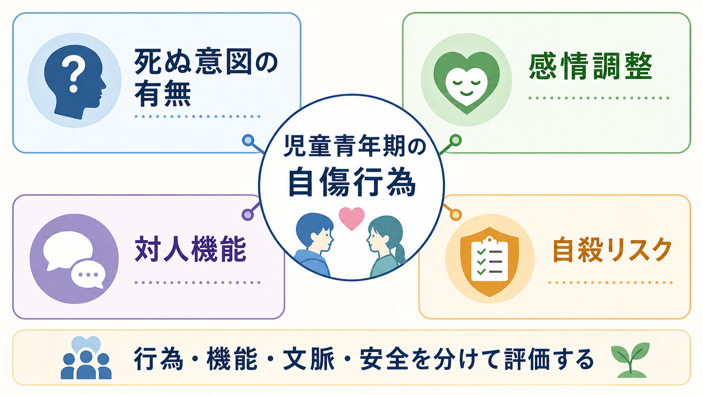
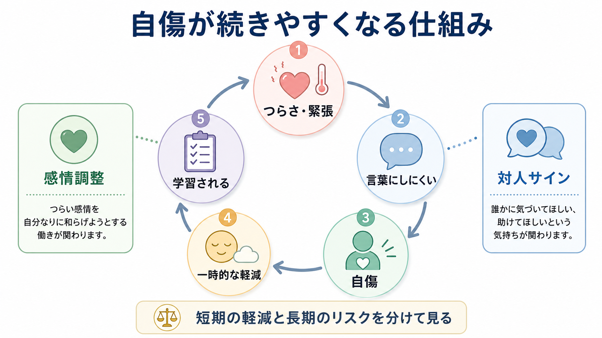

# 児童青年期の自傷行為はどう理解するのか

## 要点

- 児童青年期の自傷行為は、「死にたいから」とだけ理解すると狭すぎる。まず、死ぬ意図の有無、行為の機能、生活文脈、現在の安全を分けて評価する。
- 非自殺性自傷（NSSI）は、死ぬ意図を伴わない自己損傷を指すが、将来の自殺関連行動リスクと無関係ではない[1][6][8]。
- 多くの研究は、感情調整、緊張の低下、自己処罰、助けを求めるサイン、対人状況の変化など、複数の機能を示している[2][3]。
- リスク評価では、「自傷したか」だけでなく、頻度、方法、致死性、意図、準備行動、孤立、抑うつ、虐待・いじめ、支援者、手段へのアクセスを確認する[1][5][7]。
- 本稿は教育・研究目的の整理であり、個別の診断や治療指示ではない。切迫した自殺意図、重い損傷、意識障害、虐待や安全確保の問題がある場合は、救急・専門機関・保護者や信頼できる大人との連携が優先される。

## この記事で答える問い

1. 児童青年期の自傷行為を、自殺企図とどう区別して理解するのか。
2. 自傷はなぜ一時的に本人を助けてしまうことがあるのか。
3. 対人機能や自殺リスクを、どのように別々に評価するのか。

## まず結論

児童青年期の自傷行為は、「危険な行為である」と「本人なりの調整行動である」を同時に見る必要がある。前者だけを見ると叱責や監視に偏り、後者だけを見ると安全評価が遅れる。臨床的には、[[自傷と自殺企図はどう違うのか]]、[[非自殺性自傷とは何か]]、[[自殺リスク評価では何を聞くべきか]]を接続し、行為の分類と安全確認を同時に行う。

NICE は self-harm を、見かけの目的にかかわらず意図的な自己中毒または自己損傷として広く定義する[1]。一方、NSSI は死ぬ意図を伴わない自己損傷を指す。したがって、最初から「これは自殺ではない」と決めるのではなく、「その時、死にたい気持ちはどの程度あったか」「死ぬ可能性をどう考えていたか」「誰かに気づいてほしかったか」「どの感情がどのくらい下がったか」を分けて聞く。

## 背景

思春期は、身体、睡眠、対人関係、学校環境、自己評価が大きく変化する時期である。[[思春期の脳と心理はどう変化するのか]]で扱うように、報酬感受性、仲間関係、情動反応、自己意識は発達の途中にある。自傷行為は、この発達的変化の中で、強い苦痛を言葉にできないときの行動として現れることがある。

有病率推定には、調査対象、定義、期間、質問方法によるばらつきが大きい。非臨床サンプルを対象としたメタ解析では、青年期の NSSI のプール推定は約 17%と報告され、方法論の違いが異質性の大きな部分を説明するとされた[4]。この数字は「よくあるから軽い」という意味ではない。むしろ、学校や家庭で見逃されやすいが、苦痛と将来リスクの入口になりうる行動として理解する必要がある。

## 基本概念

### 自傷、自殺企図、NSSI

自傷行為は、身体を意図的に傷つける行動を広く指す。自殺企図は、自分の死をもたらす意図を伴う行動である。NSSI は、死ぬ意図を伴わない自己損傷であり、研究上は区別されることが多い[2][3]。

ただし、実際の面接では境界が曖昧なことがある。本人が「死ぬつもりはなかった」と述べても、致死性の高い方法を使っている、酩酊していた、死んでもよいと思っていた、途中で怖くなって止めた、という場合がある。逆に、死にたいと言いながら、主な機能は圧倒的な緊張を下げることだったという場合もある。分類は重要だが、分類だけで安全度は決まらない。

### 評価で分ける4つの軸

| 軸 | 聞くこと | 見落としやすい点 |
|---|---|---|
| 死ぬ意図 | 死にたい気持ち、死ぬ可能性の理解、計画、準備行動 | 「死ぬつもりはない」という言葉だけで終えない |
| 感情調整 | 直前の感情、緊張、解離、怒り、自己嫌悪、行為後の変化 | 一時的軽減があるほど反復しやすいことがある |
| 対人機能 | 気づいてほしい、助けてほしい、関係を止めたい、言葉にできない | 「注目を集めたい」と矮小化しない |
| 自殺リスク | 過去の企図、頻度増加、方法の変化、孤立、抑うつ、手段アクセス | NSSI と自殺リスクを完全に別物にしない |

## 仕組み

自傷の機能研究では、感情調整機能が一貫して強く支持されている。Klonsky のレビューは、急性の否定的感情が自傷の前に高まり、自傷後に一時的な軽減が生じるという証拠を整理している[3]。Nock も、NSSI を単に診断名の症状としてではなく、感情調整や対人コミュニケーションの機能を持ちうる行動として理解するモデルを示している[2]。

この「一時的に効いてしまう」性質が、反復の理解に重要である。本人は痛みを求めているというより、言葉にしにくい緊張、怒り、空虚感、自己嫌悪、解離感を何とか下げようとしていることがある。行為後に感情が少し下がると、その行動は負の強化を受ける。さらに周囲が初めて苦痛に気づくと、本人にとっては対人サインとしても学習されうる。

## 図解

上の図は、自傷を「行為そのもの」だけでなく、意図、機能、文脈、安全に分けて読むための地図である。1枚目は評価軸を整理し、2枚目は感情調整と対人サインが、短期の軽減を通じて反復に関わる可能性を示している。

## 臨床・研究との接続

### 安全評価は尺度だけに任せない

NICE は、自傷後の評価でリスク尺度や「低・中・高」の層別化だけを用いて、退院、治療、支援の有無を決めないよう推奨している[1]。これは児童青年期では特に重要である。本人の言語化能力、保護者との関係、学校でのいじめ、家庭内暴力、発達特性、衝動性、睡眠不足、物質使用は、尺度の点数だけでは十分に見えない。

C-SSRS は、自殺念慮の重症度、強度、自殺行動、致死性を分けて評価する枠組みを提供する[7]。[[自殺念慮と自殺企図は何が違うのか]]で扱うように、「死にたい」「方法を考えた」「意図がある」「計画がある」「準備した」は段階が異なる。児童青年期の自傷評価でも、この分解は有用である。

### リスク因子は「原因」ではなく評価の入口

青年期 NSSI のリスク因子メタ解析では、精神疾患、いじめ、低いヘルスリテラシー、問題行動、逆境的小児期体験、身体症状、女性であることなどが関連因子として報告された[5]。ただし、これは「その属性だから自傷する」という因果断定ではない。臨床では、抑うつ、不安、PTSD、摂食問題、発達特性、家庭環境、学校環境、オンライン環境、睡眠、身体症状を具体的に評価する入口として使う。

縦断研究のメタ解析では、過去の自傷関連思考・行動はその後の自殺念慮、企図、死亡のリスクと関連する一方、予測精度は限定的であり、単一因子で将来を正確に当てることはできない[6]。青年・若年成人を対象にした別のメタ解析でも、過去の自傷関連思考・行動は後の自殺行動リスクと関連した[8]。したがって、「NSSI だから安全」でも「自傷したから必ず自殺する」でもない。リスクを上げるサインとして扱い、保護因子と支援計画を同時に確認する。

### 家族・学校との接続

児童青年期では、本人だけでなく環境も評価対象になる。家族に伝えることが安全につながる場合もあれば、虐待、支配、強い叱責、学校での二次被害がリスクを高める場合もある。守秘とその限界を説明し、本人の主体性をできるだけ保ちながら、信頼できる大人、学校、医療、地域資源を組み合わせる。

## よくある誤解

### 「死ぬ気がないなら大丈夫」

誤りである。死ぬ意図が明確でなくても、方法の致死性、頻度の増加、衝動性、酩酊、孤立、抑うつ、過去の企図があれば安全評価が必要である。NSSI は自殺企図と区別されるが、将来の自殺関連行動リスクと完全に無関係ではない[6][8]。

### 「注目を集めたいだけ」

この表現は、本人の苦痛を矮小化しやすい。対人機能があるとしても、それは「助けを求める言葉がない」「苦痛を伝える経路がない」という問題として理解する方が臨床的に有用である[2]。

### 「理由を聞くと自傷を促してしまう」

非判断的に意図、感情、方法、安全を聞くことは、誘導ではなく評価である。むしろ聞かないことで、切迫した自殺意図、虐待、手段へのアクセス、孤立を見落とす危険がある。

### 「約束させれば再発を防げる」

「もうしません」という約束だけでは、感情調整の代替手段、危機時の連絡先、環境調整、支援者の役割が作られない。評価は、叱責や契約ではなく、何が危険を高め、何が安全を増やすかを共同で整理する作業である。

## 関連ノート

- [[非自殺性自傷とは何か]]
- [[自傷と自殺企図はどう違うのか]]
- [[自傷行為を伴う疾患には何があるのか]]
- [[自殺リスク評価では何を聞くべきか]]
- [[自殺念慮と自殺企図は何が違うのか]]
- [[自殺関連行動障害とは何か]]
- [[思春期の脳と心理はどう変化するのか]]
- [[ライフスパン精神医学とは何か]]

## MOC更新候補

- `content/00_MOC/MOC｜精神医学.md`
- `content/00_MOC/MOC｜総論・診断・面接.md`
- `content/00_MOC/MOC｜発達・愛着・社会心理.md`

## 理解チェック

1. NSSI と自殺企図を分けるとき、死ぬ意図以外に何を確認する必要があるか。
2. 自傷が感情調整として反復しやすくなる仕組みを説明できるか。
3. 「注目を集めたいだけ」という理解が、なぜ臨床的に危ういか。
4. 自傷歴があるとき、自殺リスクをどの情報に分けて評価するか。

## 未解決問題

- 児童青年期の自傷行為について、デジタル環境、SNS、オンライン模倣、学校文化がどの程度リスクと保護因子に関わるか。
- 自傷の機能を短時間で評価し、本人が使える代替的な感情調整へつなげる方法を、学校・地域・医療でどう共有するか。
- NSSI から自殺企図へ移行する少数例を、過剰な監視やスティグマなしにどのように早期発見するか。

## 参考文献

[1] National Institute for Health and Care Excellence. (2022). *Self-harm: assessment, management and preventing recurrence* (NICE guideline NG225). https://www.nice.org.uk/guidance/ng225

[2] Nock, M. K. (2009). Why do people hurt themselves? New insights into the nature and functions of self-injury. *Current Directions in Psychological Science, 18*(2), 78-83. https://doi.org/10.1111/j.1467-8721.2009.01613.x

[3] Klonsky, E. D. (2007). The functions of deliberate self-injury: A review of the evidence. *Clinical Psychology Review, 27*(2), 226-239. https://doi.org/10.1016/j.cpr.2006.08.002

[4] Swannell, S. V., Martin, G. E., Page, A., Hasking, P., & St John, N. J. (2014). Prevalence of nonsuicidal self-injury in nonclinical samples: Systematic review, meta-analysis and meta-regression. *Suicide and Life-Threatening Behavior, 44*(3), 273-303. https://doi.org/10.1111/sltb.12070

[5] Wang, Y. J., Li, X., Ng, C. H., Xu, D. W., Hu, S., & Yuan, T. F. (2022). Risk factors for non-suicidal self-injury (NSSI) in adolescents: A meta-analysis. *EClinicalMedicine, 46*, 101350. https://doi.org/10.1016/j.eclinm.2022.101350

[6] Ribeiro, J. D., Franklin, J. C., Fox, K. R., Bentley, K. H., Kleiman, E. M., Chang, B. P., & Nock, M. K. (2016). Self-injurious thoughts and behaviors as risk factors for future suicide ideation, attempts, and death: A meta-analysis of longitudinal studies. *Psychological Medicine, 46*(2), 225-236. https://doi.org/10.1017/S0033291715001804

[7] Posner, K., Brown, G. K., Stanley, B., et al. (2011). The Columbia-Suicide Severity Rating Scale: Initial validity and internal consistency findings from three multisite studies with adolescents and adults. *The American Journal of Psychiatry, 168*(12), 1266-1277. https://doi.org/10.1176/appi.ajp.2011.10111704

[8] Castellvi, P., Lucas-Romero, E., Miranda-Mendizabal, A., et al. (2017). Longitudinal association between self-injurious thoughts and behaviors and suicidal behavior in adolescents and young adults: A systematic review with meta-analysis. *Journal of Affective Disorders, 215*, 37-48. https://doi.org/10.1016/j.jad.2017.03.035
