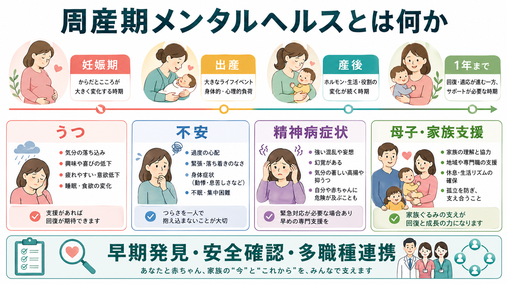
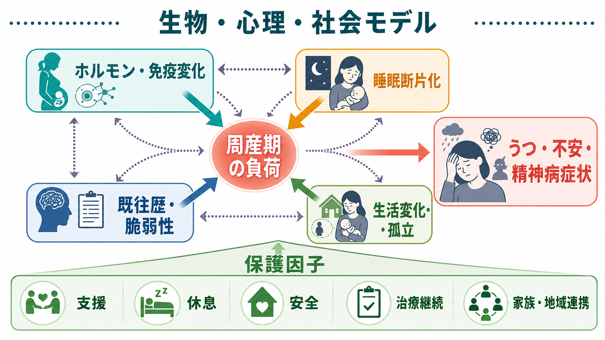
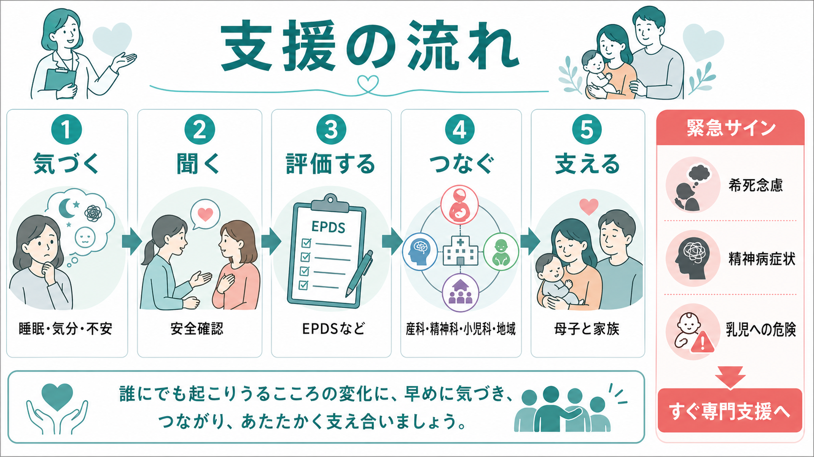

# 周産期メンタルヘルスとは何か

## 要点

- 周産期メンタルヘルスは、妊娠中から産後1年ほどまでのこころの健康を扱う領域であり、[[うつ病とは何か|うつ病]]、[[不安症群とは何か|不安症]]、強迫症状、PTSD、[[双極性障害とは何か|双極性障害]]の再発、精神病症状、物質使用、摂食の問題などを含む。
- 「産後うつ」だけでは足りない。妊娠期から症状が始まることも多く、産後早期には睡眠断片化、身体回復、授乳、家族関係、社会的孤立が重なりやすい。
- 評価の中心は、症状の有無だけでなく、本人の安全、乳児の安全、既往歴、服薬中断、支援者、DV・虐待リスク、生活資源を同時に見ることである。
- 支援は、産科、精神科、小児科、助産師、保健師、心理職、地域母子保健、家族をつなぐチーム支援として設計する。

## この記事で答える問い

1. 周産期メンタルヘルスは、どの時期と問題を含むのか。
2. 妊娠・出産・産後で、なぜうつ・不安・精神病症状が問題になりやすいのか。
3. どのような症状を見逃してはいけないのか。
4. 母子支援では、何を評価し、どこにつなぐべきか。

## まず結論

周産期メンタルヘルスとは、妊娠・出産・産後という生物学的変化と、養育役割・家族関係・社会的支援の変化が重なる時期に、本人と乳児・家族の安全と発達を守るための精神医学・母子保健の接点である。NICE は、妊娠を計画している人、妊娠中の人、出産または妊娠終了後1年以内の人を対象に、うつ病、不安症、摂食障害、物質使用、精神病、双極性障害、統合失調症などを含めて評価・治療する枠組みを示している[1]。WHO も、母子保健サービスにメンタルヘルスを統合し、スティグマなく相談できる環境を作ることを強調している[2]。

## 背景

周産期は、精神疾患が「新しく発症する」時期であると同時に、既存の精神疾患が「再燃しやすい」時期でもある。非精神病性の周産期精神障害は、母親本人、乳児、家族に影響しうる頻度の高い健康問題であり、症状の現れ方は通常の気分障害・不安症と連続しているが、妊娠・授乳・胎児や乳児の安全を考慮する点で評価と支援が異なる[3]。

うつ病については、周産期うつ病が妊娠・産後のよくある合併症の一つで、USPSTF は周産期うつ病が最大で約7人に1人にみられると整理している[4]。不安症状も単独またはうつ症状と併存して現れ、妊娠期・産後の不安の有病率は研究間でばらつくが、系統的レビューでは重要な臨床課題として扱われている[5]。したがって、質問紙で抑うつだけを確認するのではなく、不安、強迫的な確認、侵入思考、パニック、トラウマ反応、睡眠、希死念慮を含めて聞く必要がある。

## 基本概念

### 周産期という時間枠

臨床ガイドラインでは、妊娠中から出産後1年程度までを実務上の周産期メンタルヘルスの範囲として扱うことが多い[1]。この時間枠には、妊娠初期のつわりや身体不調、妊娠後期の不眠、出産前後の急激な睡眠不足、産後の身体回復、乳児の泣きや授乳、復職や家族関係の再編が含まれる。

### うつ病

周産期うつ病では、気分の落ち込み、興味や喜びの低下、疲労感、睡眠・食欲変化、罪責感、集中困難、希死念慮が問題になる。産後の一過性の気分変動、いわゆるマタニティブルーズは多くの場合短期間で軽快するが、2週間以上続く抑うつ、強い機能低下、希死念慮、乳児への危険がある場合は別に評価する[4]。[[うつ病とは何か]]で扱う症状と連続するが、周産期では乳児のケア能力や安全確認が評価に加わる。

### 不安症・強迫症状・トラウマ反応

周産期の不安は、胎児や乳児の健康への過度の心配、パニック発作、確認行動、汚染恐怖、侵入思考、出産体験に関連する過覚醒や回避として現れることがある。[[不安症群とは何か]]、[[パニック症とは何か]]、[[強迫症とは何か]]、[[PTSDとは何か]]の知識は役立つが、周産期では「心配するのは当然」と見なされて症状が過小評価されやすい。

### 精神病症状と双極性障害

産後精神病はまれだが、精神科救急として扱うべき状態である。妄想、幻覚、著しい混乱、躁状態、睡眠を必要としない高揚、現実検討の低下、乳児に関する危険な確信があれば、本人と乳児の安全を優先して緊急評価につなぐ。産後精神病は双極性障害や既往の産後精神病と関連しやすく、系統的レビューでは双極性障害・産後精神病既往のある人の産後再発リスクが高いことが示されている[6]。[[双極性障害とは何か]]や[[統合失調症とは何か]]の鑑別視点も必要になる。

## 仕組み

周産期の症状は、単一の原因で説明しない方がよい。生物・心理・社会モデルで見ると、以下の要因が重なって負荷を作る。

- 生物学的要因: 妊娠・出産に伴う内分泌変化、免疫・炎症系の変化、貧血や甲状腺疾患、疼痛、授乳、睡眠断片化。
- 心理的要因: 過去のうつ病・不安症・双極性障害、トラウマ歴、完璧主義、母親役割への罪責感、予測不能な乳児反応への無力感。
- 社会的要因: パートナーや家族の支援不足、経済困難、孤立、DV、若年妊娠、望まない妊娠、職場復帰や育休制度の問題。
- 医療的要因: 妊娠判明後の自己判断による服薬中断、精神科と産科の情報断絶、相談先が分からないこと。

日本の周産期メンタルヘルス・コンセンサスガイドも、精神疾患の既往、支援者の有無、経済状況、予定外の妊娠、DV、パートナー関係などのリスク因子を妊娠初期から把握し、地域と連携する重要性を示している[7]。ここで重要なのは、リスク因子を「本人の弱さ」として扱わず、支援設計に使うことである。

## 図解

周産期メンタルヘルスを図にすると、第一に「時期」、第二に「症状」、第三に「支援の流れ」を分けて考えると整理しやすい。

| 視点 | 見るもの | 具体例 |
|---|---|---|
| 時期 | 妊娠期、出産直後、産後数週、産後1年 | 産後早期の睡眠断片化、復職前後の負荷 |
| 症状 | 気分、不安、睡眠、精神病症状、希死念慮 | 抑うつ、不安、強迫的確認、妄想、混乱 |
| 安全 | 本人と乳児の危険 | 自傷・自殺、乳児への危険、ネグレクト、DV |
| 支援 | 相談先と役割分担 | 産科、精神科、小児科、保健師、心理職、家族 |

## 臨床・研究との接続

### スクリーニングは入口であって診断ではない

EPDS などの質問紙は、抑うつや不安を見つける入口として有用だが、得点だけで診断や治療方針を決めるものではない。ACOG は、妊娠中と産後のメンタルヘルス状態について、標準化された妥当な尺度を用いてスクリーニングし、陽性の場合には評価・治療・フォローアップにつながる体制を組むことを推奨している[8]。質問紙を渡すだけでなく、結果を誰が見て、危険サインをどう扱い、どこへつなぐかまで設計する必要がある。

### 治療はリスク・ベネフィットの比較で考える

妊娠・授乳中の薬物療法では、薬のリスクだけでなく、未治療のうつ病、不安症、双極性障害、精神病症状が本人・胎児・乳児・家族に与えるリスクも比較する。NICE や ACOG は、心理社会的支援、心理療法、薬物療法、重症例の専門治療を、症状の重症度と既往歴に応じて組み合わせる枠組みを示している[1][8]。個別の服薬判断は、産科・精神科・小児科と本人の共同意思決定で行う。

### 予防的支援

USPSTF は、周産期うつ病リスクが高い妊娠中・産後の人に対して、認知行動療法や対人関係療法を中心とするカウンセリング介入を提供または紹介することを推奨している[4]。既往歴、現在の軽い抑うつ症状、不安、DV、低い社会的支援、若年・単身での養育などがある場合、発症してから対応するだけでなく、早めに支援の線を引くことが臨床的に重要である。

### 母子関係と発達

周産期の症状は、本人の苦痛に加えて、乳児との相互作用、授乳や睡眠、健診受診、家族関係に影響しうる[3][4]。ただし、「母親が不調だと子どもが必ず悪くなる」といった決定論は避ける。支援が入れば回復可能性は高く、[[乳幼児期の愛着は精神健康にどう関わるのか|乳幼児期の愛着]]も、母親個人だけでなく、養育環境、家族、地域資源の中で形成される。

## よくある誤解

### 「産後うつだけを見ればよい」

周産期メンタルヘルスは、産後うつだけではない。妊娠中からのうつ・不安、強迫症状、トラウマ反応、双極性障害の再発、精神病症状、物質使用、摂食の問題まで含めて見る必要がある[1][3]。

### 「赤ちゃんが生まれたのだから幸せなはず」

出産は喜びだけでなく、身体回復、睡眠不足、責任の増大、孤立、過去の喪失やトラウマの再活性化を伴うことがある。本人がつらさを言えない背景には、スティグマや「よい母親でなければならない」という圧力がある。

### 「薬は必ず中止した方がよい」

自己判断での中止は再発リスクを高めることがある。双極性障害や産後精神病既往では、産後再発リスクが高く、妊娠中から産後の計画が必要である[6]。服薬の継続・変更・中止は、疾患の重症度、再発歴、妊娠週数、授乳希望、代替支援を含めて専門家と検討する。

### 「母親だけを支援すればよい」

支援対象は本人だけでなく、乳児、パートナー、きょうだい、祖父母、地域資源を含む。ケア会議やケースマネジメントの発想で、役割分担を明確にすることが、孤立と責任集中を減らす。

## 関連ノート

- [[ライフスパン精神医学とは何か]]
- [[うつ病とは何か]]
- [[不安症群とは何か]]
- [[双極性障害とは何か]]
- [[統合失調症とは何か]]
- [[PTSDとは何か]]
- [[自殺リスク評価では何を聞くべきか]]
- [[虐待リスクを精神科でどう評価するか]]
- [[乳幼児期の愛着は精神健康にどう関わるのか]]

## 理解チェック

1. 周産期メンタルヘルスを「産後うつ」だけで説明すると、何が抜け落ちるか。
2. 産後精神病が疑われる場合、なぜ通常の外来フォローだけでは不十分なのか。
3. EPDS などの質問紙を使うとき、得点以外に必ず確認すべきことは何か。
4. 本人の症状、乳児の安全、家族支援、地域連携を同時に扱う理由は何か。

## 関連ノート候補

- 周産期うつ病とは何か
- 産後精神病とは何か
- 妊娠・授乳中の向精神薬をどう考えるか
- EPDSとは何か
- 母子保健と精神科連携とは何か

## MOC更新候補

- `content/00_MOC/` 配下の精神医学、発達・ライフスパン、臨床実践関連 MOC に追加候補。
- 並列生成ジョブとの競合回避のため、本ジョブでは MOC ファイルを更新しない。

## 未解決問題

- 日本の地域母子保健で、質問紙スクリーニング後の紹介・フォロー体制をどの程度標準化できるか。
- 妊娠・授乳期の薬物療法について、本人の価値観、再発リスク、乳児への影響を共有意思決定にどう落とし込むか。
- 父親・パートナー、同性カップル、トランスジェンダー当事者、外国ルーツの家族に対する周産期メンタルヘルス支援をどう拡張するか。

## 参考文献

[1] National Institute for Health and Care Excellence. (2014, updated 2020). *Antenatal and postnatal mental health: clinical management and service guidance* (CG192). https://www.nice.org.uk/guidance/cg192

[2] World Health Organization. (2022). *WHO guide for integration of perinatal mental health in maternal and child health services*. https://www.who.int/publications/i/item/9789240057142

[3] Howard, L. M., Molyneaux, E., Dennis, C.-L., Rochat, T., Stein, A., & Milgrom, J. (2014). Non-psychotic mental disorders in the perinatal period. *The Lancet, 384*(9956), 1775-1788. https://doi.org/10.1016/S0140-6736(14)61276-9

[4] U.S. Preventive Services Task Force. (2019). Perinatal Depression: Preventive Interventions. *JAMA, 321*(6), 580-587. https://www.uspreventiveservicestaskforce.org/uspstf/recommendation/perinatal-depression-preventive-interventions

[5] Dennis, C.-L., Falah-Hassani, K., & Shiri, R. (2017). Prevalence of antenatal and postnatal anxiety: systematic review and meta-analysis. *The British Journal of Psychiatry, 210*(5), 315-323. https://doi.org/10.1192/bjp.bp.116.187179

[6] Wesseloo, R., Kamperman, A. M., Munk-Olsen, T., Pop, V. J. M., Kushner, S. A., & Bergink, V. (2016). Risk of postpartum relapse in bipolar disorder and postpartum psychosis: A systematic review and meta-analysis. *American Journal of Psychiatry, 173*(2), 117-127. https://doi.org/10.1176/appi.ajp.2015.15010124

[7] 日本周産期メンタルヘルス学会. (2023). *周産期メンタルヘルス コンセンサスガイド 2023*. https://pmhguideline.com/consensus_guide2023/consensus_guide2023.html

[8] American College of Obstetricians and Gynecologists. (2023). Screening and diagnosis of mental health conditions during pregnancy and postpartum; Treatment and management of mental health conditions during pregnancy and postpartum. *ACOG Clinical Practice Guidelines No. 4 and No. 5*. https://www.acog.org/clinical
