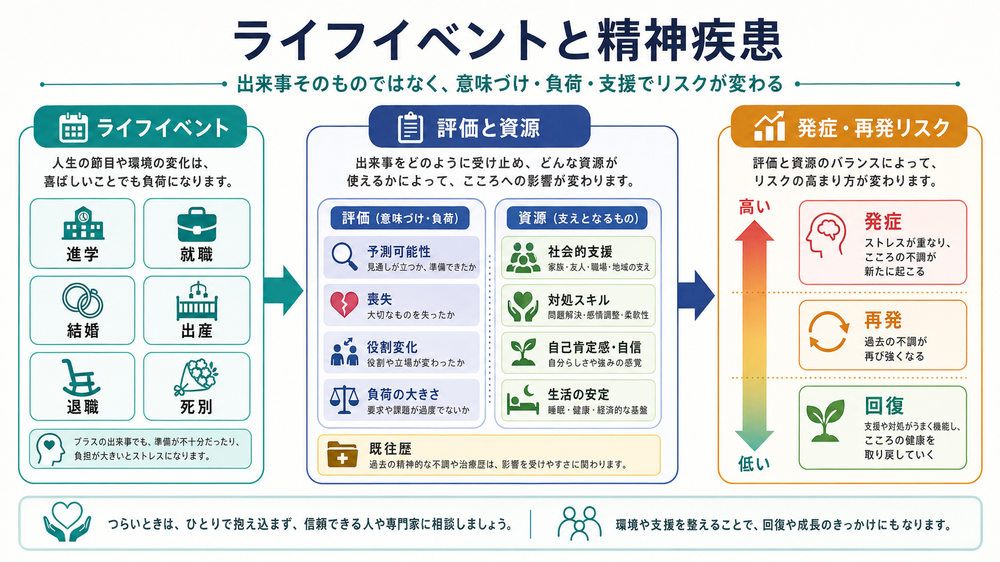
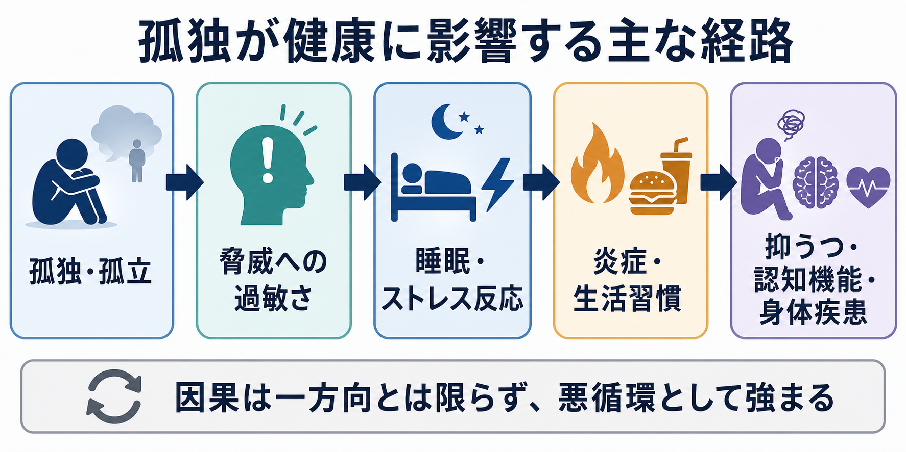
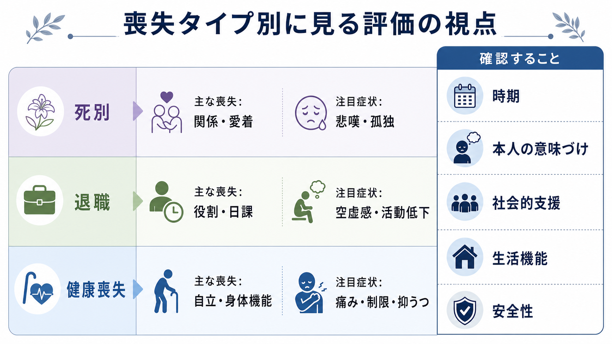

# 喪失体験はライフスパンでどう影響するのか

## 要点

- 喪失体験は、単に「悲しい出来事」ではなく、関係、役割、日課、身体機能、将来予測の組み替えを迫るライフイベントである。
- 死別では悲嘆と情緒的孤独、退職では役割・日課・社会的接点の変化、健康喪失では自立性・身体機能・痛みや不安が、抑うつへの経路になりやすい。
- ただし、喪失は必ず病的反応に至るわけではない。多くの人は揺れ動きながら再適応し、一部で遷延性悲嘆、[[うつ病とは何か]]、[[抑うつを伴う適応障害とは何か]]、自殺リスクが問題になる。
- ライフスパンの視点では、「何を失ったか」だけでなく、「その時期に何の発達課題・生活役割・支援資源があったか」を見る。

## この記事で答える問い

1. 死別、退職、健康喪失は、どのような心理社会的経路で悲嘆や抑うつに結びつくのか。
2. 喪失体験の影響は、青年期、中年期、老年期でどう違って見えるのか。
3. 臨床や研究では、どこを評価すれば「通常の悲嘆」と支援を要する状態を見分けやすいのか。

## まず結論

喪失体験の中核は、「対象を失うこと」だけではなく、「その対象によって支えられていた生活の構造を失うこと」である。配偶者の死は愛着対象と共同生活を、退職は役割・所属・日課を、健康喪失は自立性・身体機能・将来の見通しを揺さぶる。これらは悲嘆、孤独、活動低下、睡眠の乱れ、社会的撤退、自己効力感の低下を通じて抑うつへつながりうる。

一方で、喪失後の反応には大きな個人差がある。喪失を思い出し悲しむ「喪失志向」と、生活を組み直す「回復志向」のあいだを行き来することは、適応的な過程として理解できる[1]。したがって臨床では、涙や悲しみの有無だけでなく、時間経過、機能障害、孤立、希死念慮、睡眠・食事・活動、本人にとっての意味を評価する。

## 背景

古典的な生活ストレス研究では、配偶者の死、退職、個人のけがや病気などが大きな生活再調整を要する出来事として位置づけられてきた[2]。この発想は単純な点数化に限界があるが、「良い・悪い」ではなく「生活を組み替える必要がある」出来事が心身に負荷をかけるという見方は、現在のライフスパン精神医学にもつながる。

[[ライフスパン精神医学とは何か]]の観点では、同じ喪失でも意味は年齢と文脈で変わる。青年期の親の死は安全基地や進路形成に影響しうる。中年期の退職や疾病は、仕事、家族内役割、介護責任、経済的責任と絡みやすい。老年期の配偶者喪失や身体機能低下は、孤独、生活機能、認知機能、医療・介護アクセスと結びつきやすい。

## 基本概念

### 喪失体験

喪失体験とは、重要な人、役割、能力、場所、将来像、社会的地位などを失う出来事である。本記事では、死別、退職、健康喪失を中心に扱う。これらは異なる出来事に見えるが、共通して「以前の自分を支えていた関係や構造の変化」を伴う。

### 悲嘆と遷延性悲嘆

悲嘆は、死別や重大な喪失に対する自然な反応であり、悲しみ、思慕、怒り、罪責感、安堵、空虚感などが混在する。悲嘆そのものは疾患ではない。問題になるのは、強い思慕や没頭、回避、機能障害が長く続き、生活再建が著しく妨げられる場合である。ICD-11 と DSM-5-TR では、遷延性悲嘆症に関する基準が導入されているが、基準や有病率推定には差がある[3]。[[喪失反応と大うつ病はどう違うのか]]では、この鑑別をより詳しく扱う。

### 抑うつ

抑うつは、気分の落ち込み、興味・喜びの低下、睡眠・食欲・活動性の変化、罪責感、集中困難、希死念慮などを含む状態である。喪失後の悲しみと抑うつは重なるが、同一ではない。重要なのは、「失った対象を思う悲しみ」なのか、「自分全体・将来全体への絶望」へ広がっているのか、生活機能や安全性にどの程度影響しているのかである。

## 仕組み

### 1. 喪失志向と回復志向の揺れ動き

死別後の適応を説明する代表的モデルに、Stroebe と Schut の二重過程モデルがある。ここでは、喪失を思い出し悲しむ「喪失志向」と、新しい生活課題へ向かう「回復志向」のあいだを揺れ動くことが重視される[1]。ずっと悲しみに向き合うことだけが適応ではなく、ときに悲しみから距離を置き、手続き、家事、仕事、対人関係を組み直すことも必要になる。

### 2. 二次的ストレスが抑うつを増幅する

喪失は、それ自体の痛みだけでなく、二次的ストレスを生む。死別なら家計、家事、相続、住居、対人ネットワークの変化が起こる。退職なら生活リズム、所属、評価、収入、社会的交流が変わる。健康喪失なら通院、痛み、移動制限、介護依存、将来不安が増える。こうした二次的ストレスが重なると、[[ストレス脆弱性モデルとは何か]]でいう脆弱性と環境負荷の相互作用が強まる。

### 3. 孤独と活動低下が媒介する

配偶者死別後の縦断研究では、抑うつ症状だけでなく情緒的孤独が重要な変化として観察される。ある研究では、死別後に臨床的に意味のある抑うつ症状を示す群は一部に限られる一方、情緒的孤独はより広く、長く残りやすいことが示された[4]。孤独は睡眠、活動量、食事、身体疾患管理にも波及し、[[精神疾患と睡眠障害はどう関係するのか]]や身体機能低下と絡みながら抑うつを維持しうる。

### 4. 喪失の影響は一方向ではない

喪失後の反応には、回復、持続的苦痛、遅発性悪化、比較的安定したレジリエンスなど複数の軌跡がある。Bonanno は、喪失や外傷後にも多くの人が比較的安定した機能を保つことを示し、レジリエンスを「まれな例外」ではなく、ありうる軌跡として位置づけた[5]。これは苦痛を軽視するという意味ではない。むしろ、全員を同じ病的経過とみなさず、支援を必要とする人を丁寧に見分けるという意味で重要である。

## 図解

| 喪失タイプ | 失われやすいもの | 抑うつへの主な経路 | 評価の焦点 |
|---|---|---|---|
| 死別 | 愛着対象、共同生活、将来像 | 悲嘆、情緒的孤独、生活再編の負荷 | 思慕・回避・機能障害・安全性 |
| 退職 | 職業役割、日課、所属、評価 | 空虚感、活動低下、社会的接点の減少 | 自発性、準備性、経済・役割変化 |
| 健康喪失 | 身体機能、自立性、移動、予測可能性 | 痛み、制限、依存、自己効力感低下 | ADL/IADL、疼痛、睡眠、介護負担 |

## 臨床・研究との接続

### 死別

配偶者死別は高齢期に多いが、影響は年齢だけでは決まらない。死別前の関係性、介護期間、突然死か予期された死か、経済状況、家族・地域とのつながり、過去のうつ病歴が重要である。縦断研究では、死別後の抑うつや孤独の軌跡には大きな異質性がある[4]。臨床では、通常の悲嘆を急いで病理化しない一方で、強い機能障害、持続する絶望、希死念慮、極端な回避、睡眠・食事の破綻を見逃さない。

### 退職

退職は喪失であると同時に、仕事ストレスからの解放にもなりうる。退職と抑うつに関するシステマティックレビュー・メタ解析では、全体としては退職が抑うつリスクを下げる可能性が示されたが、研究間の異質性は大きい[6]。つまり、退職そのものが一律に悪いのではなく、本人が望んだ退職か、準備があったか、仕事中心性が高かったか、退職後の役割や社会的接点があるかが重要になる。

### 健康喪失

健康喪失は、身体疾患に伴う気分変化だけでなく、「できていたことができなくなる」体験として理解する必要がある。多疾患併存をもつ高齢者では抑うつの有病率が高いことが報告されており、身体疾患、痛み、機能障害、ケア負担、孤立が重なりやすい[7]。[[身体疾患に伴う抑うつ症状とは何か]]や[[老年期うつ病は若年成人のうつ病と何が違うのか]]と接続して、症状だけでなく生活機能を評価する。

### 安全性

喪失体験が、希死念慮、自殺企図、治療中断、セルフネグレクトにつながる場合がある。高齢者では身体疾患や機能障害が自殺関連行動と関連することが系統的レビューで示されている[8]。したがって、喪失後の診察では「悲しいのは当然」と片づけず、[[自殺リスク評価では何を聞くべきか]]に沿って、希死念慮、具体的計画、手段へのアクセス、孤立、飲酒、睡眠、身体苦痛を確認する。

## よくある誤解

### 誤解1: 喪失後に悲しむのは異常である

悲しみ、涙、怒り、罪責感、思慕は、多くの場合、喪失への自然な反応である。異常かどうかは感情の有無ではなく、時間経過、強度、生活機能、安全性、本人の苦痛、文化的文脈を含めて判断する。

### 誤解2: 早く忘れることが回復である

回復は、失った人や役割を忘れることではない。故人とのつながり、仕事で得ていた価値、失われた身体機能への思いを抱えながら、新しい日課、関係、意味づけを作る過程である。

### 誤解3: 退職は必ず抑うつを悪化させる

退職は、仕事負荷からの解放、自由時間、健康行動の改善につながることもある[6]。リスクが高いのは、望まない退職、病気による退職、孤立、経済的不安、退職後の役割喪失が重なる場合である。

### 誤解4: 健康喪失の抑うつは身体疾患の当然の結果である

身体疾患があっても、抑うつ症状や睡眠障害、活動低下、希死念慮を「仕方ない」とみなしてよいわけではない。身体治療、疼痛管理、リハビリテーション、社会的支援、心理的支援を組み合わせる余地がある。

## 関連ノート

- [[ライフスパン精神医学とは何か]]
- [[喪失反応と大うつ病はどう違うのか]]
- [[うつ病とは何か]]
- [[老年期うつ病は若年成人のうつ病と何が違うのか]]
- [[老年精神医学とは何か]]
- [[身体疾患に伴う抑うつ症状とは何か]]
- [[ストレス脆弱性モデルとは何か]]
- [[精神疾患と睡眠障害はどう関係するのか]]
- [[自殺リスク評価では何を聞くべきか]]

## MOC更新候補

- `content/00_MOC/MOC｜精神医学.md`
- `content/00_MOC/MOC｜発達・愛着・社会心理.md`
- `content/00_MOC/MOC｜臨床実践・治療.md`

## 理解チェック

1. 死別後の悲嘆と[[大うつ病性障害とは何か]]を区別するとき、どのような点を確認するか。
2. 退職が抑うつリスクを下げる場合と上げる場合を、それぞれ説明できるか。
3. 健康喪失が抑うつにつながるとき、身体症状以外にどの生活機能を評価すべきか。
4. 喪失志向と回復志向の「揺れ動き」が、なぜ適応的と考えられるのか。

## 未解決問題

- 喪失体験の影響は文化、家族制度、労働制度、医療・介護制度によって大きく変わるため、国や地域をまたいだ比較研究が必要である。
- 退職、健康喪失、死別は同時期に重なりやすく、単一イベント研究だけでは累積的影響を捉えにくい。
- 悲嘆、孤独、抑うつ、身体機能低下の因果方向は双方向的であり、縦断研究と介入研究を組み合わせた検討が必要である。

## 参考文献

[1] Stroebe, M., & Schut, H. (1999). The dual process model of coping with bereavement: Rationale and description. *Death Studies, 23*(3), 197-224. https://doi.org/10.1080/074811899201046

[2] Holmes, T. H., & Rahe, R. H. (1967). The Social Readjustment Rating Scale. *Journal of Psychosomatic Research, 11*(2), 213-218. https://doi.org/10.1016/0022-3999(67)90010-4

[3] Treml, J., Linde, K., Brähler, E., & Kersting, A. (2024). Prolonged grief disorder in ICD-11 and DSM-5-TR: differences in prevalence and diagnostic criteria. *Frontiers in Psychiatry, 15*, 1266132. https://doi.org/10.3389/fpsyt.2024.1266132

[4] Szabó, Á., Kok, A. A. L., Beekman, A. T. F., & Huisman, M. (2020). Longitudinal examination of emotional functioning in older adults after spousal bereavement. *The Journals of Gerontology: Series B, 75*(8), 1668-1678. https://doi.org/10.1093/geronb/gbz039

[5] Bonanno, G. A. (2004). Loss, trauma, and human resilience: Have we underestimated the human capacity to thrive after extremely aversive events? *American Psychologist, 59*(1), 20-28. https://doi.org/10.1037/0003-066X.59.1.20

[6] Li, W., Ye, X., Zhu, D., & He, P. (2021). Does retirement trigger depressive symptoms? A systematic review and meta-analysis. *Epidemiology and Psychiatric Sciences, 30*, e77. https://doi.org/10.1017/S2045796021000627

[7] Kumar, S. A., Hemamalini, N., Harini, V., & et al. (2025). A systematic review and meta-analysis of the global prevalence of depression in older adults with multi-morbidity. *Indian Journal of Psychological Medicine*. https://doi.org/10.1177/02537176251403605

[8] Fässberg, M. M., Cheung, G., Canetto, S. S., Erlangsen, A., Lapierre, S., Lindner, R., Draper, B., Gallo, J. J., Wong, C., Wu, J., Duberstein, P., & Wærn, M. (2016). A systematic review of physical illness, functional disability, and suicidal behaviour among older adults. *Aging & Mental Health, 20*(2), 166-194. https://doi.org/10.1080/13607863.2015.1083945
