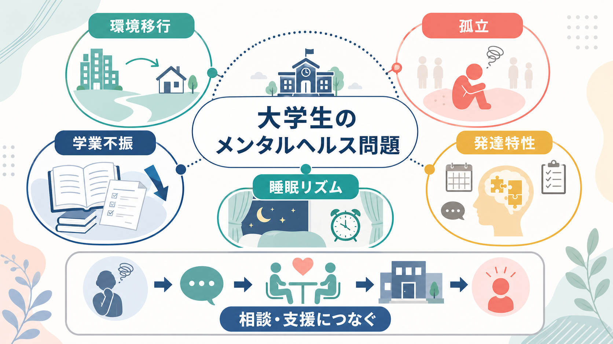
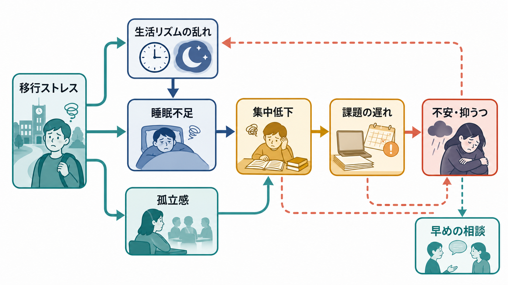
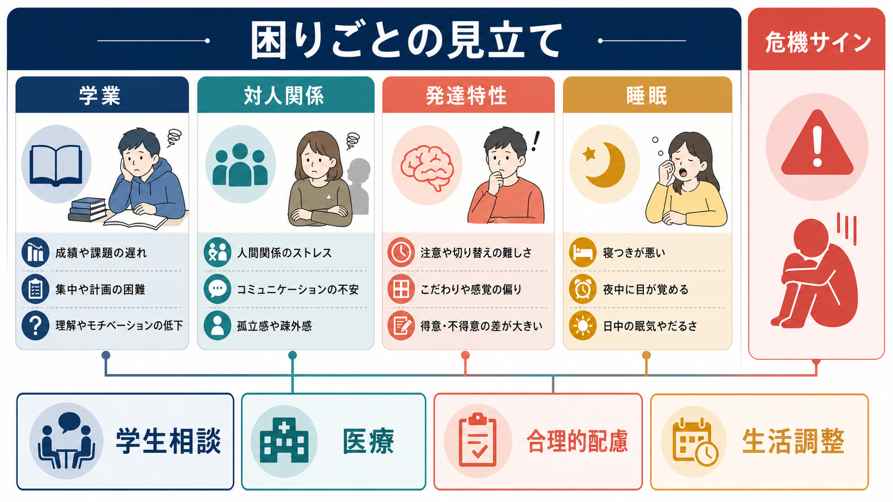

# 大学生のメンタルヘルス問題には何があるのか

## 要点

- 大学生のメンタルヘルス問題は、「大学生だから特別な病気が多い」というより、青年期から若年成人期にかけての発症しやすさと、大学生活の環境変化が重なることで見えやすくなる。
- 重要な入口は、環境移行、孤立、学業不振、発達特性、睡眠リズムの5つである。
- 不安、抑うつ、物質使用、自傷・自殺リスク、摂食問題、ゲーム・インターネット使用、対人関係の困難などは、単独ではなく相互に絡み合う。
- 支援では、診断名だけでなく「何に困っているか」「生活機能がどこで落ちているか」「相談先につながれているか」を見る。

## この記事で答える問い

この記事では、大学生に多いメンタルヘルス問題を、個人の弱さや努力不足としてではなく、発達段階、生活環境、学業制度、対人関係、睡眠覚醒リズムの相互作用として整理する。特に、[[ライフスパン精神医学とは何か]]、[[青年期のアイデンティティ形成とは何か]]、学校精神保健、[[精神疾患と社会機能障害はどう関係するのか]]と接続して理解する。

## まず結論

大学生のメンタルヘルス問題は、主に次の5領域から把握すると見落としにくい。

| 領域 | 典型的な困りごと | 見立てのポイント |
|---|---|---|
| 環境移行 | 一人暮らし、履修、アルバイト、家族からの距離 | 自律性の獲得と支援の喪失が同時に起きていないか |
| 孤立 | 友人ができない、相談できない、疎外感 | 客観的な孤立と主観的な孤独感を分けて見る |
| 学業不振 | 欠席、課題遅延、単位不取得、留年不安 | 気分、不安、注意、睡眠、経済問題の結果として起きていないか |
| 発達特性 | 予定管理、感覚過敏、対人理解、こだわり | ADHD、ASD、限局性学習症などの特性と環境要求の不一致を見る |
| 睡眠リズム | 夜型化、過眠、不眠、昼夜逆転 | 睡眠不足が気分・集中・出席に波及していないか |

国際的な大学生調査では、1年生の相当割合が不安、気分、物質使用などのメンタルヘルス問題を経験しており、症状の始まりが大学入学前の青年期にさかのぼることも多い [1]。そのため、大学入学は「発症の唯一の原因」というより、既存の脆弱性や困りごとが、生活構造の変化によって顕在化する時期として理解するとよい。

## 背景

大学入学は、心理社会的には大きな移行期である。授業形式、評価方法、生活時間、友人関係、家族との距離、経済的責任が一度に変わる。高校までのように、毎朝決まった時間に登校し、担任や保護者が生活を細かく見守る構造が弱まるため、自己管理の負荷が急に上がる。

この時期は、[[青年期のアイデンティティ形成とは何か]]で扱うような自己理解、進路選択、親密な関係形成の課題とも重なる。大学生の困難は「勉強についていけない」だけでなく、「自分は何をしたいのか」「周囲と同じようにできないのはなぜか」「相談してよい問題なのか」という問いとして現れる。

疫学的にも、大学生はメンタルヘルス支援の重要な対象である。WHO World Mental Health International College Student Initiative の初期調査では、8か国19大学のフルタイム1年生13,984人のうち、少なくとも1つの評価対象精神障害に該当するスクリーニング陽性が、生涯で約35%、過去12か月で約31%と報告された [1]。また、大学生のメンタルヘルス研究は国や測定法によって推定値が大きく異なるため、単一の割合だけで語るより、どの機能がどの程度損なわれているかを見る必要がある [2]。

## 基本概念

### 環境移行

環境移行とは、生活の枠組みが変わることで、これまで意識せずに支えられていた機能が本人の自己管理に移ることである。履修登録、課題提出、通学、食事、睡眠、金銭管理、医療機関の受診、アルバイト、サークル活動などが同時に増える。

この移行は成長の機会でもあるが、支援の途切れにもなりうる。高校時代には家族や学校が補っていた注意、計画、感情調整、対人調整の負荷が、大学では本人に集中しやすい。したがって、困難の評価では、症状だけでなく「支援構造が急に薄くなった部分」を確認する。

### 孤立と孤独感

孤立には、実際に人との接点が少ない客観的孤立と、接点はあっても理解されていないと感じる主観的孤独感がある。大学ではクラス単位の結びつきが弱く、授業ごとに人間関係が変わるため、所属感を得るまでに時間がかかる。

孤立は、[[孤独と精神疾患はどう関係するのか]]、[[社会的支援は健康にどう影響するのか]]と接続して理解できる。友人が少ないこと自体が直ちに病的なのではない。問題になるのは、孤立によって相談、休息、自己確認、危機時の助けが得られず、不安や抑うつ、回避、欠席が強まる場合である。

### 学業不振

学業不振は、単に能力不足を意味しない。うつ状態では意欲、集中、処理速度が低下し、[[不安症群とは何か]]で扱う不安では授業参加や発表、試験場面を避けやすくなる。ADHD傾向がある場合は、課題の着手、締切管理、長期計画、持ち物管理に困難が出やすい。睡眠不足が続くと、記憶、注意、実行機能、感情調整が落ちる。

実際に、大学1年生を対象にした研究では、内在化問題や外在化問題が公式成績に基づく学業機能低下と関連していた [3]。したがって、欠席や単位不取得は「結果」であると同時に、メンタルヘルス問題を見つける入口でもある。

### 発達特性

発達特性とは、注意、感覚、対人理解、こだわり、計画、読み書き、時間管理などの個人差が、環境要求との組み合わせで困難になる状態を指す。[[ADHDとは何か]]、[[自閉スペクトラム症とは何か]]、[[限局性学習症とは何か]]に関連する。

大学では、授業時間割の自由度、課題形式の多様性、暗黙の対人ルール、長期レポート、グループワークが増える。そのため、児童期には成績や家族の支援で目立たなかった困難が、大学で初めて問題化することがある。ADHDの大学生に関するシステマティックレビューでは、不注意症状、実行機能、学習方略、服薬状況などが学業成績に影響する要因として整理されている [4]。ASDの大学生についても、大学生活を通じて高いメンタルヘルス上の困難が維持されうることが報告されている [5]。

### 睡眠リズム

大学生では、授業開始時刻、アルバイト、スマートフォン使用、課題締切、サークル活動、通学時間の変化により、睡眠時間と睡眠規則性が乱れやすい。睡眠は単なる休息ではなく、記憶、学習、情動制御、身体健康を支える基盤である。

大学生の睡眠と学業成績に関するシステマティックレビューでは、睡眠の量、質、規則性、眠気、クロノタイプなどが学業成績と関連することが整理されている [6]。また、概日リズムの乱れは、抑うつ、不安、集中困難、生活機能低下と関連しうるため、[[睡眠覚醒障害群とは何か]]や[[精神疾患と睡眠障害はどう関係するのか]]の観点からも重要である [7]。

## 仕組み

大学生のメンタルヘルス問題は、単一原因ではなく、次のような循環で悪化しやすい。

1. 環境移行で自己管理の負荷が増える。
2. 睡眠リズムが乱れ、注意・記憶・感情調整が落ちる。
3. 課題遅延や欠席が増え、学業不振への不安が強まる。
4. 恥ずかしさや失敗予期から相談を避ける。
5. 孤立が深まり、気分や不安がさらに悪化する。

この循環では、症状と生活機能が互いに原因にも結果にもなる。たとえば、不眠が抑うつを悪化させ、抑うつが日中活動を減らし、日中活動の低下がさらに夜型化を強める。学業不振も同様に、成績低下が自責感を生み、自責感が課題回避を強める。

重要なのは、循環のどこから介入してもよいという点である。診断が確定しなくても、睡眠を整える、履修を整理する、学生相談につなぐ、合理的配慮を検討する、孤立を減らす、といった支援は機能改善につながりうる。

## 図解

上の図は、大学生の困りごとを「学業」「対人関係」「発達特性」「睡眠」に分けて確認し、必要に応じて学生相談、医療、合理的配慮、生活調整へつなぐ見取り図である。実際の支援では、本人の同意、守秘、緊急性、大学の制度、家族との関係を踏まえる。

## 臨床・研究との接続

臨床的には、大学生の相談では次の確認が重要である。

- いつから困っているか。高校以前からか、入学後か。
- 何が最も生活を妨げているか。出席、睡眠、課題、対人関係、食事、金銭、希死念慮など。
- 相談先につながっているか。学生相談室、保健センター、医療機関、障害学生支援、教務、家族、友人。
- 危機サインがあるか。自傷、希死念慮、急激な孤立、食事や睡眠の著しい破綻、被害体験、物質使用の増加など。

大学は医療機関ではないが、早期発見、相談導線、合理的配慮、休学・復学支援、危機時対応の場として重要である。大学生のメンタルヘルスサービス利用に関するシステマティックレビューでは、心理的苦痛を抱える学生でもサービス利用は一様ではなく、スティグマ、自己解決志向、情報不足、費用、秘密保持への不安などが利用障壁になりうると整理されている [8]。

研究的には、大学生のメンタルヘルスは、疫学、発達精神病理学、睡眠研究、教育心理学、障害学生支援、予防介入研究が交差する領域である。単なる有病率の推定だけでなく、どの学生が、どの時点で、どの支援につながると、学業継続や生活機能が改善するのかを検討する必要がある。

## よくある誤解

### 「大学生は自由だから楽なはず」

自由度が高いことは、自己管理の負荷が高いことでもある。時間割、生活、金銭、人間関係を自分で調整する必要があり、支援構造が弱くなる学生ほど負担が大きい。

### 「成績が悪いのは努力不足」

成績低下の背景には、抑うつ、不安、睡眠不足、発達特性、経済困難、家庭問題、対人ストレスが隠れていることがある。まずは学業不振を生活機能低下のサインとして扱う。

### 「発達特性があるなら大学は難しい」

発達特性は、環境との組み合わせで困難にも強みにもなる。合理的配慮、明確な予定、課題分割、感覚環境の調整、相談窓口の利用により、学びやすさは大きく変わる。

### 「睡眠は本人の生活習慣の問題にすぎない」

睡眠リズムは、授業制度、アルバイト、スマートフォン、通学、気分、不安、発達特性と結びつく。本人の意思だけで片づけず、生活構造として評価する。

## 関連ノート

- [[ライフスパン精神医学とは何か]]
- [[青年期のアイデンティティ形成とは何か]]
- 学校精神保健とは何か（今後の作成候補）
- [[ADHDとは何か]]
- [[自閉スペクトラム症とは何か]]
- [[睡眠覚醒障害群とは何か]]
- [[孤独と精神疾患はどう関係するのか]]
- [[精神科診察で睡眠をどう評価するか]]
- [[自殺リスク評価では何を聞くべきか]]
- 合理的配慮（今後の作成候補）
- 学生相談（今後の作成候補）
- 大学生の休学・復学支援（今後の作成候補）

## MOC更新候補

- `content/00_MOC/` 配下の精神医学、発達・ライフスパン、学校精神保健、睡眠、発達障害関連のMOCに追加候補。
- 並列ジョブとの競合を避けるため、本記事ではMOC本体は更新しない。

## 理解チェック

1. 大学生のメンタルヘルス問題を、環境移行、孤立、学業不振、発達特性、睡眠リズムの5領域で見る利点は何か。
2. 学業不振を「努力不足」と見なす前に確認すべき要因は何か。
3. 睡眠リズムの乱れは、不安・抑うつ・課題遅延とどのような循環を作るか。
4. 発達特性が大学生活で初めて問題化しやすい理由は何か。
5. 学生相談、医療、合理的配慮、生活調整は、それぞれどのような困りごとに対応しうるか。

## 参考文献

[1] Auerbach, R. P., Mortier, P., Bruffaerts, R., et al. (2018). WHO World Mental Health Surveys International College Student Project: Prevalence and distribution of mental disorders. *Journal of Abnormal Psychology, 127*(7), 623-638. https://doi.org/10.1037/abn0000362

[2] Sheldon, E., Simmonds-Buckley, M., Bone, C., et al. (2021). Prevalence and risk factors for mental health problems in university undergraduate students: A systematic review with meta-analysis. *Journal of Affective Disorders, 287*, 282-292. https://doi.org/10.1016/j.jad.2021.03.054

[3] Bruffaerts, R., Mortier, P., Kiekens, G., et al. (2018). Mental health problems in college freshmen: Prevalence and academic functioning. *Journal of Affective Disorders, 225*, 97-103. https://doi.org/10.1016/j.jad.2017.07.044

[4] Pagespetit, E., Pagerols, M., Barrés, N., et al. (2025). ADHD and academic performance in college students: A systematic review. *Journal of Attention Disorders, 29*(4), 281-297. https://doi.org/10.1177/10870547241306554

[5] Scott, M., Leppanen, J., Allen, M., Jarrold, C., & Sedgewick, F. (2023). Longitudinal analysis of mental health in autistic university students across an academic year. *Journal of Autism and Developmental Disorders, 53*, 1107-1116. https://doi.org/10.1007/s10803-022-05560-9

[6] Suardiaz-Muro, M., Morante-Ruiz, M., Ortega-Moreno, M., Ruiz, M. A., Martín-Plasencia, P., & Vela-Bueno, A. (2020). Sleep and academic performance in university students: A systematic review. *Revista de Neurología, 71*(2), 43-53. https://doi.org/10.33588/rn.7102.2020015

[7] Yeom, J. W., Park, S., & Lee, H. J. (2024). Managing circadian rhythms: A key to enhancing mental health in college students. *Psychiatry Investigation, 21*(12), 1309-1317. https://doi.org/10.30773/pi.2024.0250

[8] Osborn, T. G., Li, S., Saunders, R., et al. (2022). University students' use of mental health services: A systematic review and meta-analysis. *International Journal of Mental Health Systems, 16*, 57. https://doi.org/10.1186/s13033-022-00569-0

## 未解決問題

- 日本の大学生を対象に、相談利用、睡眠、発達特性、学業継続を同時に追跡した大規模縦断研究はまだ限られる。
- オンライン授業、SNS、アルバイト、経済困難が、孤立や睡眠リズムに与える影響は大学や地域によって異なる。
- 大学内支援と医療機関、家族、地域支援をどのように接続すると、本人の自律性と安全性を両立できるかは継続的な検討課題である。
