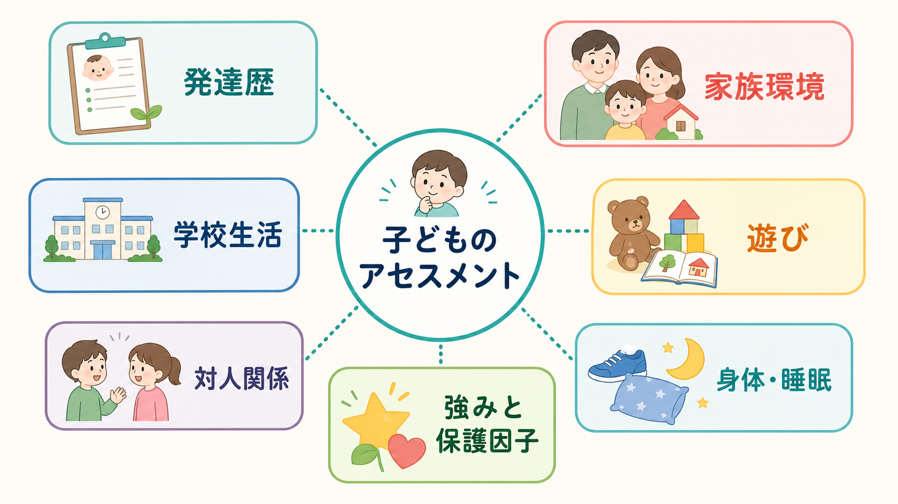
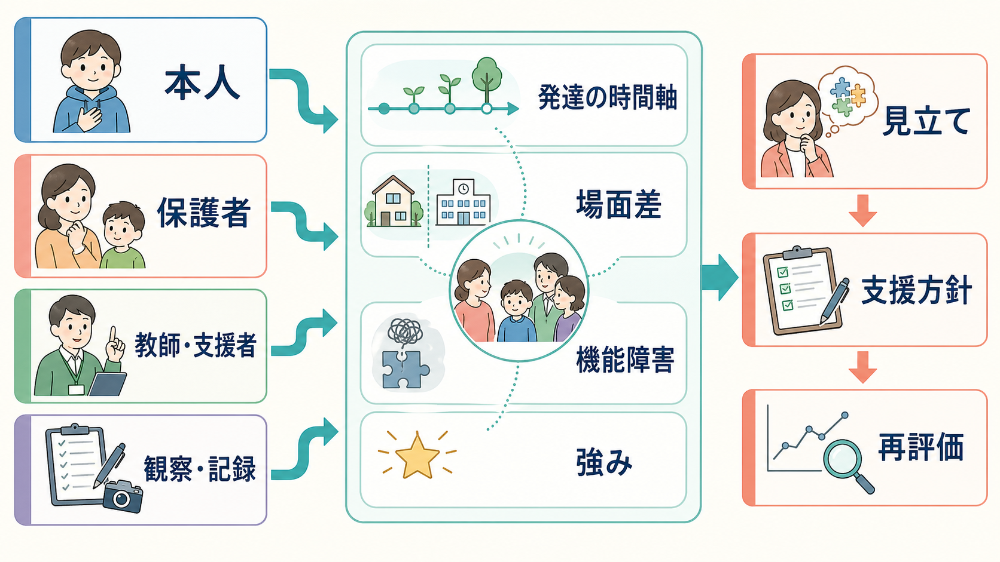
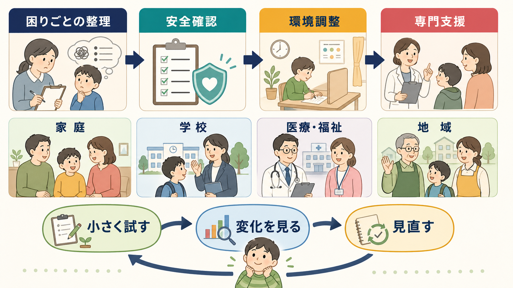

# 子どものアセスメントでは何を確認するのか

## 要点

- 子どものアセスメントは、本人だけでなく、保護者、教師、支援者、観察記録など複数の情報源を統合して行う。子どもの機能と心理的健康は、家庭・学校・地域の文脈と切り離して評価できない[1]。
- 発達歴は「何歳で何ができたか」の表ではなく、妊娠・出生、運動、言語、社会性、感覚、睡眠、食事、遊び、学習、対人関係がどのように変化してきたかを見る時間軸である[2]。
- 家族環境や学校生活は、原因探しではなく、リスク、保護因子、要求水準、支援資源、場面差を確認するために評価する[3][4]。
- 遊びと対人関係は、子どもが言葉にしにくい感情、調整力、象徴化、共同注意、柔軟性、関係性を観察する入口になる[5]。
- 最終目標は診断名の確定だけではない。困りごと、安全、生活機能、強みをもとに、家庭・学校・医療・福祉で共有できる支援仮説を作り、再評価することである[6][7]。

## この記事で答える問い

1. 子どものアセスメントでは、どの領域を確認するのか。
2. 発達歴、家族環境、学校生活、遊び、対人関係をどう聞き取るのか。
3. 複数の情報源で話が食い違うとき、どう整理するのか。
4. アセスメントを診断ではなく支援につなげるには、何を残すべきか。

## まず結論

子どものアセスメントで最初に確認するのは、「この子は何の診断名に当てはまるか」ではなく、「どの場面で、何が、どのくらい、いつから、誰にとって困りごとになっているか」である。次に、発達の時間軸、家庭・学校・友人関係の文脈、身体状態、睡眠、安全、本人の強みを重ねる。診断分類は重要だが、[[DSMとICDは何が違うのか]]で扱うように、分類名は生活上の困難と支援ニーズを自動的には説明しない。

実務上は、次の5つの問いに分けると整理しやすい。

| 観点 | 確認すること | 目的 |
|---|---|---|
| 時間軸 | 発達歴、発症・悪化の時期、移行期、生活変化 | 一過性の反応か、持続する特性か、環境変化への反応かを分ける |
| 場面差 | 家庭、学校、習い事、友人関係、オンライン | 困難がどこで強く、どこで軽いかを見る |
| 機能 | 学習、生活自立、睡眠、食事、情動調整、対人関係 | 症状名ではなく生活への影響を把握する |
| 安全 | 自傷他害、虐待・ネグレクト、いじめ、家庭内暴力、希死念慮 | 介入の優先順位を決める |
| 強み | 興味、得意、安心できる人、成功場面、回復資源 | 支援計画を現実的にする |

## 背景

成人の評価では、本人の語りを中心に進められる場面が多い。子どもの場合は、年齢、言語発達、認知発達、家族への依存、学校という生活場面の大きさによって、本人の自己報告だけでは全体像をつかみにくい。AACAP の小児青年精神科評価パラメータは、発達的視点、親子面接、本人面接、標準化尺度、診断、治療計画を一連の評価過程として位置づけている[1]。

また、同じ行動でも発達段階によって意味が変わる。幼児の分離不安、小学生の落ち着きのなさ、思春期の反抗、友人関係の揺れは、単独では病理とは限らない。重要なのは、年齢相応性、持続性、強度、複数場面での一貫性、生活機能への影響、本人の苦痛を合わせて見ることである。

## 基本概念

### 1. 主訴と困りごと

主訴は「学校に行けない」「友達とトラブルになる」「癇癪が強い」「集中できない」など、最初に語られる困りごとである。ここでは、誰が困っているのかを分ける。本人が困っているのか、保護者が困っているのか、学校が困っているのかで、評価すべき領域は変わる。

たとえば「授業中に立ち歩く」という相談でも、本人は退屈や不安を感じているのか、感覚刺激を求めているのか、課題が難しすぎるのか、睡眠不足なのか、教師との関係が悪化しているのかで見立ては異なる。[[ADHDとは何か]]や [[ASDは脳ネットワークの違いとして理解できるのか]] につながる神経発達症の評価でも、診断名に飛びつく前に場面差と機能障害を確認する。

### 2. 発達歴

発達歴では、次の領域を確認する。

| 領域 | 例 |
|---|---|
| 妊娠・出生 | 早産、低出生体重、周産期合併症、NICU歴 |
| 身体・運動 | 首すわり、歩行、協調運動、不器用さ、慢性疾患 |
| 言語・認知 | 初語、二語文、理解、会話、読み書き、学習 |
| 社会性 | 視線、共同注意、模倣、集団参加、友人関係 |
| 感覚・調整 | 音・光・触覚への過敏、偏食、切り替え、癇癪 |
| 睡眠・生活 | 入眠、夜間覚醒、起床、食事、排泄、身辺自立 |
| 遊び | ごっこ遊び、ルール遊び、反復的遊び、ひとり遊び、共同遊び |

AAP の発達サーベイランスとスクリーニングの臨床報告は、発達上の懸念を早期に同定するため、継続的な発達監視、標準化スクリーニング、保護者の懸念の把握を重視している[2]。発達歴は一度聞けば終わりではなく、乳幼児期、就学、思春期などの節目で更新される。

### 3. 家族環境

家族環境の評価は、家族を責めるためではない。確認するのは、子どもの安全、養育の安定、関係性、生活リズム、家族内のストレス、支援資源である。AACAP の家族介入に関する声明は、子どもを孤立した個体としてではなく、家庭・学校・関係機関を含む文脈の中で理解する必要を強調している[3]。

見るべき項目は、保護者の心身の状態、きょうだい関係、家庭内葛藤、経済的困難、文化的背景、移住・転居、喪失体験、虐待・ネグレクトの可能性、子どもが安心できる大人の存在である。ただし、家族情報は機微性が高い。本人と保護者の同意、守秘、共有範囲を確認し、必要に応じて安全確保を優先する。

### 4. 学校生活

学校は、子どもが長時間過ごす評価場面である。NICE の学校における社会・情緒・メンタルウェルビーイングのガイドラインは、リスクと保護因子、発達段階、教育的ニーズ、学校全体の関係的・包摂的アプローチを重視している[6]。

学校生活では、出席、遅刻、学習到達、宿題、授業中の行動、休み時間、給食、集団活動、教師との関係、友人関係、いじめ、合理的配慮、支援級・通級・スクールカウンセラー利用を確認する。教師からの情報は有用だが、「学校で問題がない」ことは「困難がない」ことを意味しない。学校では過剰適応し、家庭で崩れる子どももいる。

### 5. 遊び

遊びは、子どもの発達水準と関係性を観察する重要な窓である。幼児や低学年では、自由遊び、親子遊び、ルール遊び、勝ち負けへの反応、切り替え、想像遊び、共同注意、身体を使った遊びを観察する。乳幼児精神医学の評価パラメータは、幼い子どもを発達的・関係的・多面的に理解し、家族文脈の中で評価することを重視している[5]。

遊びの評価では、「遊べるか」だけでなく、「誰と、どのように、どのくらい柔軟に、どのように感情を調整して遊ぶか」を見る。反復的な遊びがある場合も、それだけで病的と決めるのではなく、安心のための反復、感覚的楽しさ、想像遊びの広がり、他者との共有可能性を分けて観察する。

### 6. 対人関係

対人関係では、家族、同年代、年上・年下、教師、支援者との関係を分ける。子どもは相手や場面によって大きく変わるため、「友達がいるか」だけでは不十分である。

確認する項目は、会話の相互性、距離感、共感、衝突後の修復、孤立、いじめ、集団参加、オンライン上の関係、恋愛・性的境界、信頼できる大人の有無である。思春期では、本人だけで話せる時間を確保し、プライバシーと安全の限界を最初に説明する。

## 仕組み

### 多情報源を統合する

子どもの評価で重要なのは、情報源の不一致を「どちらかが間違っている」と扱わないことである。家庭で強く、学校で目立たない。学校で荒れ、家庭では静か。本人は困っていないが周囲が困っている。こうした食い違い自体が、場面差、適応努力、関係性、要求水準を示すデータになる。

特に [[5Pモデルとは何か]] のようなケースフォーミュレーションでは、主訴、素因、誘因、維持因子、保護因子を分けて整理する。子どものアセスメントでも、発達特性、家庭のストレス、学校の要求、睡眠不足、友人関係、本人の強みを同じ地図の上に置くと、支援の優先順位が見えやすい。

### 診断、機能、安全を分ける

診断評価、生活機能評価、安全評価は関連するが同じではない。たとえば ADHD の診断評価では、症状と機能障害が複数の主要場面で確認され、保護者、教師、学校関係者、関与する専門職から情報を得ることが推奨される[7]。しかし、診断名がついても、家庭で必要な支援、学校で必要な配慮、安全上の優先課題は別に評価する必要がある。

生活機能の評価では、[[GAFやWHODASは何を評価するのか]]で扱うように、症状の有無だけでなく、活動と参加の制限を見る。WHO の ICF は、健康状態、活動、参加、環境因子を統合して機能を記述する枠組みであり、子どもの評価でも「できないこと」を個人内の欠損だけに還元しない助けになる[4]。

### 安全確認を後回しにしない

子どものアセスメントでは、希死念慮、自傷、他害、虐待、ネグレクト、性被害、いじめ、家庭内暴力、物質使用、摂食の危険、急性の精神病症状を確認する。うつ症状が疑われる子どもや若者では、NICE のうつ病ガイドラインもリスク評価と必要に応じた専門的対応を重視している[8]。

安全確認は、尋ねると悪化するものではなく、支援を開始するための基礎である。ただし、本人の秘密をすべて守るとは約束しない。「命や安全に関わることは、必要な大人と共有する」と最初に説明する。

## 図解

### 支援につなぐ流れ

アセスメント後は、次のように小さく試して見直す。

1. 困りごとを、本人・家庭・学校それぞれの言葉で整理する。
2. 安全に関わる問題を先に扱う。
3. 家庭と学校で、すぐ変えられる環境調整を選ぶ。
4. 診断評価、心理検査、医療、福祉、教育支援が必要かを判断する。
5. 介入後の変化を、期間を決めて再評価する。

## 臨床・研究との接続

臨床では、アセスメントは支援の開始点である。診断名、尺度得点、面接記録を集めるだけでは不十分で、本人が何を望み、どの場面で何が変われば生活が楽になるのかを共有する必要がある。保護者と学校の意見が対立している場合も、どちらかを説得する前に、観察可能な行動、場面、時間、頻度、負荷を共通言語にする。

研究では、子どもの評価は多情報源データの不一致、発達変化、環境要因、文化差を含む複雑な測定問題である。保護者評定、教師評定、本人評定、行動観察、生理指標、学校記録はそれぞれ異なる側面を測っている。したがって、単一の尺度で「子どもの全体像」を測ったと考えないほうがよい。

## よくある誤解

**誤解1: 診断名が決まれば、支援方針も決まる。**  
診断名は共通言語になるが、支援方針は生活機能、場面差、安全、本人の希望、家族と学校の資源によって変わる。

**誤解2: 親の話と学校の話が違うなら、どちらかが不正確である。**  
不一致は重要な情報である。家庭と学校で要求水準、安心感、感覚刺激、対人関係、疲労が違えば、行動も変わる。

**誤解3: 遊びは評価として主観的すぎる。**  
遊びは、言語化が難しい子どもの感情調整、柔軟性、象徴化、関係性を観察する実践的な方法である。標準化検査と対立するものではなく、補完する情報である。

**誤解4: 強みを見ると、困難を軽く扱うことになる。**  
強みは慰めではなく、介入可能性を見つけるための臨床情報である。安心できる人、得意な場面、興味、成功経験は、支援計画の足場になる。

## 関連ノート

- [[ADHDとは何か]]
- [[ASDは脳ネットワークの違いとして理解できるのか]]
- [[DSMとICDは何が違うのか]]
- [[5Pモデルとは何か]]
- [[GAFやWHODASは何を評価するのか]]

### 関連ノート候補

- 子どもの発達歴はどう聞くのか
- 学校情報を精神科評価にどう組み込むか
- 親子相互作用の観察とは何か
- 児童青年期の安全評価では何を確認するのか

### MOC更新候補

- `content/00_MOC/` 配下に児童青年精神医学または発達・ライフスパン領域の MOC がある場合、本記事を追加する。
- 並列生成ジョブとの競合を避けるため、本タスクでは MOC 本体は更新しない。

## 理解チェック

1. 子どものアセスメントで、本人・保護者・教師の情報が食い違ったとき、なぜその食い違い自体が重要な情報になるのか。
2. 発達歴を聞くとき、「発達の遅れがあるか」だけでなく、どのような時間軸を確認すべきか。
3. 家族環境の評価を、家族の責任追及にしないためには、どのような聞き方と記録が必要か。
4. 遊びの観察から、どのような臨床情報が得られるか。
5. 診断評価、生活機能評価、安全評価は、どの点で異なるか。

## 参考文献

[1] American Academy of Child and Adolescent Psychiatry. (1997). *Practice Parameters for the Psychiatric Assessment of Children and Adolescents*. Journal of the American Academy of Child & Adolescent Psychiatry, 36(10 Suppl), 4S-20S. https://doi.org/10.1097/00004583-199710001-00002

[2] Lipkin, P. H., Macias, M. M., & Council on Children With Disabilities, Section on Developmental and Behavioral Pediatrics. (2020). Promoting Optimal Development: Identifying Infants and Young Children With Developmental Disorders Through Developmental Surveillance and Screening. *Pediatrics, 145*(1), e20193449. https://doi.org/10.1542/peds.2019-3449

[3] American Academy of Child and Adolescent Psychiatry. (1997). Family Intervention in the Assessment and Treatment of Infants, Children and Adolescents. https://www.aacap.org/aacap/Policy_Statements/1997/Family_Intervention_in_the_Assessment_and_Treatment_of_Infants_Children_and_Adolescents.aspx

[4] World Health Organization. (2007). *International Classification of Functioning, Disability and Health: Children and Youth Version: ICF-CY*. https://iris.who.int/handle/10665/43737

[5] Thomas, J. M., Benham, A. L., Gean, M., Luby, J., Minde, K., Turner, S., & Wright, H. H. (1997). Practice Parameters for the Psychiatric Assessment of Infants and Toddlers (0-36 Months). *Journal of the American Academy of Child & Adolescent Psychiatry, 36*(10 Suppl), 21S-36S. https://doi.org/10.1097/00004583-199710001-00003

[6] National Institute for Health and Care Excellence. (2022). *Social, emotional and mental wellbeing in primary and secondary education* (NICE Guideline NG223). https://www.nice.org.uk/guidance/ng223

[7] Wolraich, M. L., Hagan, J. F., Allan, C., Chan, E., Davison, D., Earls, M., et al. (2019). Clinical Practice Guideline for the Diagnosis, Evaluation, and Treatment of Attention-Deficit/Hyperactivity Disorder in Children and Adolescents. *Pediatrics, 144*(4), e20192528. https://doi.org/10.1542/peds.2019-2528

[8] National Institute for Health and Care Excellence. (2019). *Depression in children and young people: identification and management* (NICE Guideline NG134). https://www.nice.org.uk/guidance/ng134

## 未解決問題

- 多情報源評価で、本人・保護者・教師の報告の不一致をどのように定量化し、支援計画に反映するか。
- 文化的背景、家庭の価値観、学校制度の違いを、過剰診断にも見落としにもつなげず評価する方法。
- 遊びや親子相互作用の観察を、日常臨床で短時間かつ再現性をもって記録する方法。
- 診断名よりも生活機能と参加を重視した評価を、教育・医療・福祉の間で共有する実装方法。
