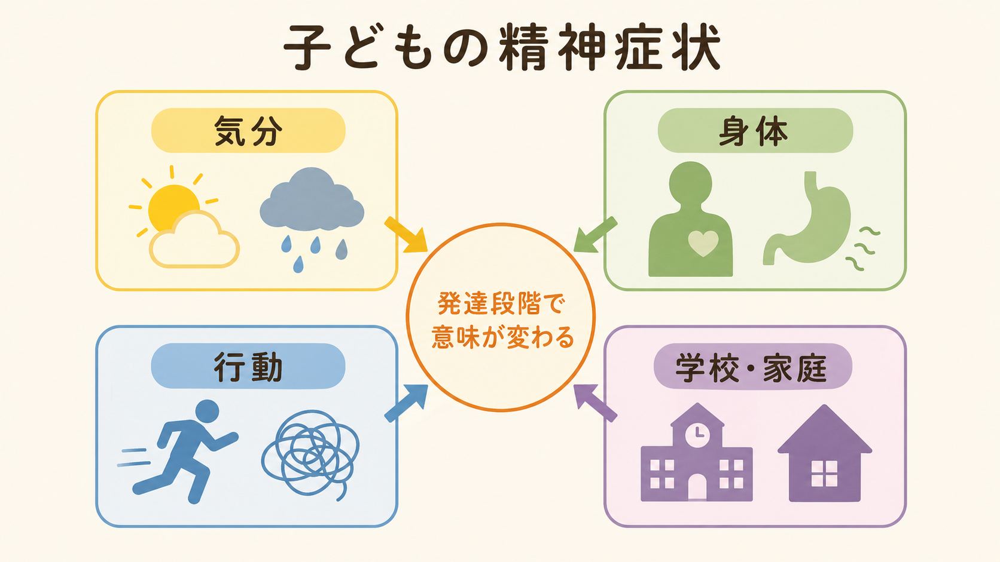
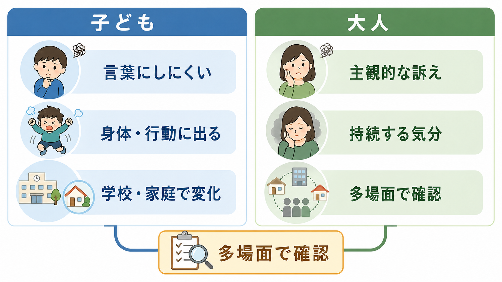

# 子どもの精神症状は大人と何が違うのか

## 要点

- 子どもの精神症状は、大人の診断名を小さくしたものではない。発達段階、言語化能力、家庭・学校環境、身体発達、対人関係の変化によって、同じ苦痛が別の形で見える。
- 抑うつは「悲しい」と語られるより、怒りっぽさ、遊びや学業への興味低下、疲れやすさ、睡眠・食欲の変化、登校や対人場面の回避として現れやすい[3][4][5]。
- 不安は「心配」と言葉にされず、腹痛・頭痛・吐き気、親から離れられない、確認行動、学校や発表場面の回避として見えることがある[3][4][7]。
- 怒りや反抗は、単なる性格やしつけの問題ではなく、不安、抑うつ、神経発達特性、トラウマ、睡眠不足、家庭・学校ストレスの表現である場合がある[1][8]。
- 評価では、本人の訴えだけでなく、保護者、学校、生活リズム、身体症状、安全性、発達歴をあわせて見る必要がある[5][6]。

## この記事で答える問い

1. 子どもの精神症状は、大人の精神症状とどこが違うのか。
2. 抑うつ、不安、怒り、身体症状は、年齢によってどのように見え方が変わるのか。
3. 臨床や研究では、症状名だけでなく何を確認すべきなのか。

## まず結論

子どもの精神症状を見るときの中心は、「何の診断名に当てはまるか」だけではなく、「その年齢の子どもが、苦痛をどの経路で表現しているか」である。幼い子どもほど、気分を抽象的に説明する力が限られるため、苦痛は身体、行動、遊び、登校、睡眠、食欲、親子関係に出やすい。青年期になると、自責感、希死念慮、対人比較、将来不安、孤立が前景化しやすくなるが、それでも大人のように整理された主観的訴えになるとは限らない[2][3][4]。

## 背景

[[発達精神病理学とは何か|発達精神病理学]]では、精神症状を「ある時点の異常」だけでなく、発達過程、環境、神経発達、対人関係、保護因子が相互作用した結果として見る。Rutter と Sroufe は、発達メカニズム、正常発達と精神病理の連続性、発達上の連続・非連続を重視する視点を整理している[1]。

この視点が重要なのは、同じ「不安」や「抑うつ」でも、年齢によって意味が変わるからである。幼児の分離不安、児童期の登校しぶり、思春期の社交不安、青年期の自己評価低下は、似た苦痛を含みながら、発達課題と環境が異なる。疫学研究でも、児童期から青年期、青年期から成人期への移行で、分離不安やADHDの比率は下がり、抑うつ、パニック、物質使用などは増えやすいと整理されている[2]。

## 基本概念

### 子どもは「内面」をそのまま言葉にできるとは限らない

大人の評価では、「気分が落ち込む」「興味がない」「不安が強い」「眠れない」といった主観的訴えが診断の入口になりやすい。一方、子どもでは、自分の内面を時間軸に沿って説明する力、身体感覚と感情を区別する力、他者に助けを求める力が発達途上にある。そのため、本人の言葉だけを待っていると、苦痛を見逃しやすい[3][4]。

NIMH は、子どもの評価を考える目安として、数週間以上続く行動・感情の変化、本人や家族の苦痛、学校・家庭・友人関係での機能低下を挙げている[3]。つまり、子どもの症状は「気分の内容」だけでなく、「生活のどこが変わったか」で読む必要がある。

### 同じ症状でも、年齢で意味が変わる

小学校低学年の腹痛は、感染症や消化器疾患の可能性もあるが、不安やストレスの身体化であることもある。思春期の腹痛や頭痛は、身体疾患、月経関連症状、睡眠不足、学校ストレス、抑うつ、不安が重なっていることもある。成人では本人が「ストレスで胃が痛い」と結びつけられる場面でも、子どもでは身体症状だけが前面に出ることがある[7]。

同様に、怒りっぽさも一つの意味に固定できない。疲労、睡眠不足、感覚過敏、[[ADHDとは何か|ADHD]]、[[自閉スペクトラム症とは何か|自閉スペクトラム症]]、不安、抑うつ、[[反抗挑発症とは何か|反抗挑発症]]、家庭・学校での慢性ストレスなど、複数の経路がありうる。若年者の易怒性は、機能低下や将来の不安・抑うつ・自殺関連リスクとも関連するため、軽く扱わない[8]。

## 仕組み

### 1. 発達段階が「表現経路」を決める

幼児期から児童期では、苦痛は泣く、怒る、固まる、親から離れない、腹痛を訴える、遊びが減る、睡眠が乱れるといった形で現れやすい。児童期後半から思春期では、学業低下、友人関係の回避、SNSや対人比較への過敏さ、自己評価低下、身体へのこだわりが加わる。青年期には、自責感、将来悲観、孤立、非自殺性自傷や希死念慮がより明確になることがある[2][4]。

### 2. 身体症状は「心理ではない」と切り捨てない

子どもの腹痛、頭痛、筋肉痛、吐き気、動悸、疲労は、身体疾患の評価を要する。同時に、身体症状は不安や抑うつと関連しうる。小児不安症の研究では、落ち着かなさ、腹痛、赤面、動悸、筋緊張、発汗、震えなどの身体症状が多く報告されている[7]。別の地域サンプル研究でも、反復する身体愁訴は後年の抑うつや全般不安と関連していた[7]。

したがって、身体症状を「気のせい」とするのではなく、身体医学的評価と心理社会的評価を並行して行う。これは[[身体症状症とは何か|身体症状症]]の診断にすぐ結びつけるという意味ではなく、身体、感情、生活機能を同時に見るという意味である。

### 3. 周囲の反応が症状を維持することがある

不安や抑うつが続くと、子どもは登校、発表、友人関係、宿題、睡眠、食事、遊びを避けることがある。短期的には楽になるが、活動量や成功体験が減り、さらに不安や抑うつが強まることがある。周囲が叱責だけで反応すると、失敗感や対立が増え、逆にすべてを免除すると回避が固定化する場合がある。

この悪循環は、本人の努力不足という説明では足りない。子どもの症状は、本人の発達特性、家庭の反応、学校環境、睡眠、身体状態、友人関係、社会的ストレスの相互作用として理解する必要がある。ここでの見立ては、[[精神症状の横断的評価とは何か|精神症状の横断的評価]]や[[ライフスパン精神医学とは何か|ライフスパン精神医学]]とも接続する。

## 図解

この記事では、子どもの症状の見え方を次の3枚で整理している。

| 図 | 役割 | 読み方 |
|---|---|---|
| 図1 | 全体像 | 気分、身体、行動、学校・家庭を分けて、発達段階で意味が変わることを見る |
| 図2 | メカニズム | ストレス、発達段階、身体・怒り・回避、周囲の反応が悪循環になる流れを見る |
| 図3 | 比較 | 子どもでは身体・行動・多場面情報、大人では主観的訴えが入口になりやすい差を見る |

## 臨床・研究との接続

### 評価では「多場面」を見る

GLAD-PC は青年期うつ病の初期評価で、症状だけでなく、機能、併存症、家族・学校・地域資源、危険因子を含めて評価することを重視している[6]。NICE も、子ども・若者のうつ病について、年齢、発達水準、家族背景、学校状況、リスクを踏まえた評価を扱っている[5]。

実践的には、少なくとも次を分けて確認する。

| 領域 | 確認すること |
|---|---|
| 本人の主観 | 悲しさ、不安、怒り、疲労、身体感覚、自責感、希死念慮 |
| 身体 | 睡眠、食欲、頭痛、腹痛、疼痛、内科・小児科的評価 |
| 行動 | 回避、癇癪、反抗、集中困難、遊びや活動の減少 |
| 家庭 | 親子関係、叱責・過保護・葛藤、生活リズム、養育負担 |
| 学校 | 登校、成績、友人関係、いじめ、先生との関係、合理的配慮 |
| 発達 | 言語、感覚、注意、社会性、発達歴、これまでの適応 |
| 安全性 | 自傷、希死念慮、虐待、暴力、物質使用、急性危機 |

### 研究では「同じ診断名」より「発達経路」を見る

子どもの精神症状を研究する際には、成人期と同じ診断名を機械的に当てはめるだけでは不十分である。発達精神病理学では、同じリスクから異なる結果に至る多岐性、異なるリスクから似た結果に至る等終局性、同じ症状が別の症状へ移る異型連続性を扱う[1][2]。たとえば、児童期の強い不安が青年期の抑うつへつながることもあれば、早期の易怒性が後年の不安、抑うつ、行動問題と関連することもある[8]。

## よくある誤解

### 誤解1: 子どもは大人より症状が軽い

軽いとは限らない。子どもは言葉で説明しにくいため、周囲から「わがまま」「怠け」「反抗」と見られ、苦痛が遅れて発見されることがある。症状の重さは、本人の訴えの上手さではなく、持続、苦痛、機能低下、安全性で見る[3][4]。

### 誤解2: 身体症状があるなら精神症状ではない

身体疾患の評価は重要である。しかし、身体症状と心理社会的ストレスは両立する。特に腹痛、頭痛、疲労、睡眠問題は、不安や抑うつの入口になりうる[7]。

### 誤解3: 怒っているなら抑うつや不安ではない

子どもでは、不安や抑うつが怒り、癇癪、反抗、落ち着かなさとして見えることがある。CDC も、子どもの不安は怒りや易怒性、身体症状として現れることがあり、抑うつでも怒りっぽさや問題行動として見えることがあると説明している[4]。

### 誤解4: 本人が「大丈夫」と言えば問題ない

子どもは、心配をかけたくない、叱られたくない、言葉にできない、何がつらいのか分からない、という理由で否定することがある。本人の言葉を尊重しつつ、生活上の変化と複数情報源を合わせて考える。

## 関連ノート

- [[発達精神病理学とは何か]]
- [[ライフスパン精神医学とは何か]]
- [[発達とは何か]]
- [[児童青年期うつ病とは何か]]
- [[不安症群とは何か]]
- [[身体症状症とは何か]]
- [[精神症状の横断的評価とは何か]]
- [[ADHDとは何か]]
- [[自閉スペクトラム症とは何か]]
- [[反抗挑発症とは何か]]

### MOC更新候補

- `content/00_MOC/` 配下の精神医学系MOC
- 発達・ライフスパン、児童青年期精神医学、症候学に関するMOC

並列ジョブとの競合を避けるため、このタスクではMOC本体は更新していない。

## 理解チェック

1. 子どもの抑うつが「悲しみ」ではなく「怒り」や「学業低下」として見えるのはなぜか。
2. 腹痛や頭痛を訴える子どもを評価するとき、身体疾患の確認と並行して何を見るべきか。
3. 本人、保護者、学校で情報が食い違う場合、どのように理解すべきか。
4. 「発達段階で意味が変わる」とは、臨床評価で具体的に何を変えるということか。

## 未解決問題

- 子どもの身体症状、易怒性、回避行動が、どの経路で成人期の不安・抑うつ・行動問題へつながるのかは、個人差が大きい。
- 診断横断的な易怒性や身体症状を、日常診療でどの尺度・面接・学校情報と組み合わせて評価するのが最も実用的かは、さらに検討が必要である。
- 文化、家庭環境、学校制度、ジェンダー規範が、症状の見え方と相談行動に与える影響は、地域ごとに丁寧に扱う必要がある。

## 参考文献

[1] Rutter, M., & Sroufe, L. A. (2000). Developmental psychopathology: Concepts and challenges. *Development and Psychopathology, 12*(3), 265-296. https://doi.org/10.1017/S0954579400003023

[2] Costello, E. J., Copeland, W., & Angold, A. (2011). Trends in psychopathology across the adolescent years: What changes when children become adolescents, and when adolescents become adults? *Journal of Child Psychology and Psychiatry, 52*(10), 1015-1025. https://doi.org/10.1111/j.1469-7610.2011.02446.x

[3] National Institute of Mental Health. (n.d.). Children and Mental Health: Is This Just a Stage? Retrieved April 28, 2026, from https://www.nimh.nih.gov/health/publications/children-and-mental-health

[4] Centers for Disease Control and Prevention. (2025). Anxiety and Depression in Children. https://www.cdc.gov/children-mental-health/about/about-anxiety-and-depression-in-children.html

[5] National Institute for Health and Care Excellence. (2019). *Depression in children and young people: identification and management* (NICE Guideline NG134). https://www.ncbi.nlm.nih.gov/books/NBK547251/

[6] Zuckerbrot, R. A., Cheung, A., Jensen, P. S., Stein, R. E. K., Laraque, D., & GLAD-PC Steering Group. (2018). Guidelines for Adolescent Depression in Primary Care (GLAD-PC): Part I. Practice preparation, identification, assessment, and initial management. *Pediatrics, 141*(3), e20174081. https://doi.org/10.1542/peds.2017-4081

[7] Ginsburg, G. S., Riddle, M. A., & Davies, M. (2006). Somatic symptoms in children and adolescents with anxiety disorders. *Journal of the American Academy of Child & Adolescent Psychiatry, 45*(10), 1179-1187. https://doi.org/10.1097/01.chi.0000231974.43966.6e

[8] Leibenluft, E., Allen, L. E., Althoff, R. R., Brotman, M. A., Burke, J. D., Carlson, G. A., et al. (2024). Irritability in youths: A critical integrative review. *American Journal of Psychiatry, 181*(4), 275-290. https://doi.org/10.1176/appi.ajp.20230256
