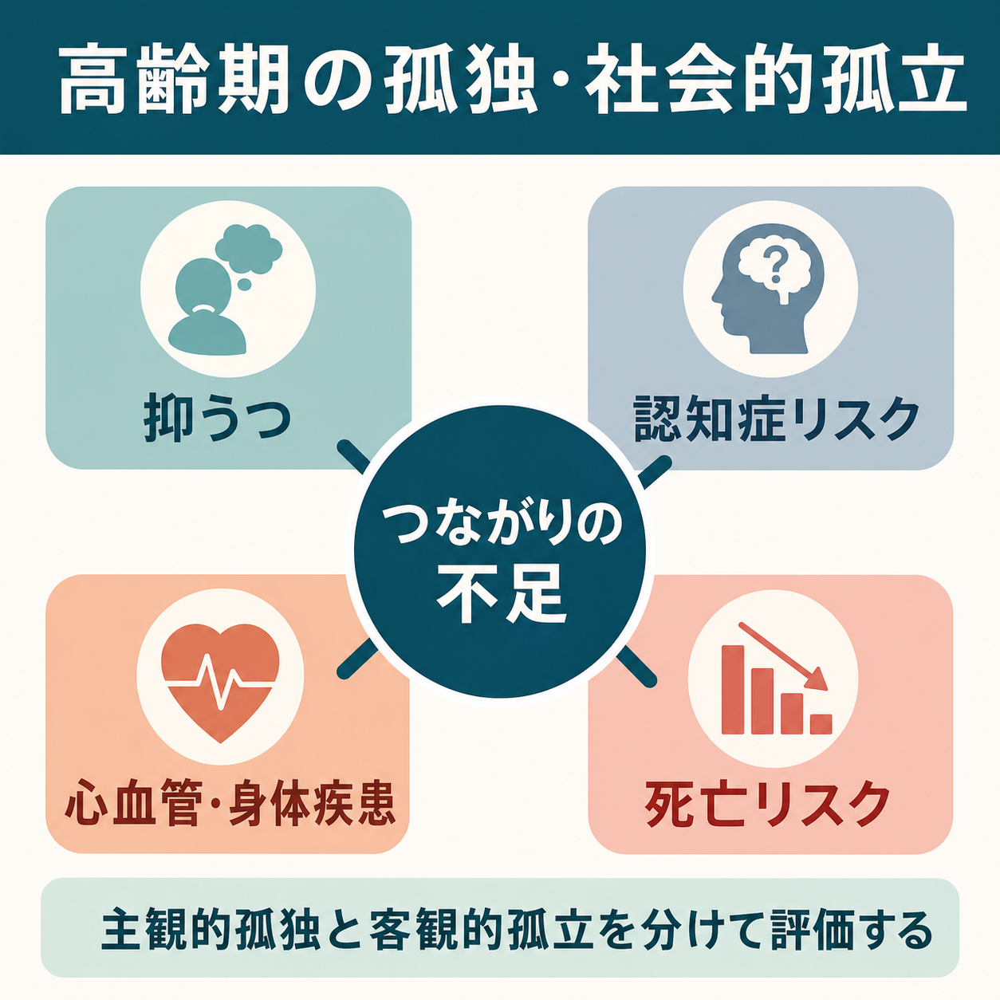

# 孤独と社会的孤立は高齢期にどう問題となるのか

## 要点

- 孤独は「望む社会的関係が得られていない」という主観的経験であり、社会的孤立は「社会的接触やネットワークが少ない」という客観的状態である。両者は重なるが、同じものではない[1][2]。
- 高齢期では、退職、配偶者や友人との死別、慢性疾患、感覚障害、移動能力低下、介護環境の変化が、孤独と社会的孤立を起こしやすくする[2][7]。
- 孤独・社会的孤立は、抑うつや不安、認知症リスク、心血管疾患、死亡リスクと関連する。ただし、研究の多くは観察研究であり、因果は単純な一方向ではなく悪循環として理解する必要がある[3][4][5][6]。
- 臨床では「一人暮らしか」だけで判断せず、本人の主観的孤独、社会的接触、支援資源、身体疾患、認知機能、聴覚・視覚、移動能力、喪失体験を合わせて評価する[2][7]。
- 介入は「交流を増やす」だけでは不十分で、本人が意味を感じられる役割、心理的安全性、移動・感覚・デジタル環境、抑うつや認知症への評価を組み合わせる必要がある[2][8]。

## この記事で答える問い

1. 孤独と社会的孤立は何が違うのか。
2. なぜ高齢期に、抑うつ・認知症・身体疾患リスクと結びつきやすいのか。
3. 臨床や研究では、どのように評価し、どこに介入の入口を置くべきか。

## まず結論

高齢期の孤独と社会的孤立は、「寂しい気持ち」や「友人が少ない状態」だけではない。社会的つながりが失われると、脅威への過敏さ、睡眠の質低下、ストレス反応、炎症、活動性低下、医療アクセスの遅れ、認知刺激の減少が重なり、[[うつ病とは何か|うつ病]]、[[老年期うつ病とは何か|老年期うつ病]]、[[アルツハイマー型認知症とは何か|認知症]]、心血管疾患、死亡リスクに関わる[3][4][5][6]。

ただし、孤独な人が必ず病気になるわけではない。逆に、病気、聴覚障害、痛み、認知機能低下、移動困難、貧困、喪失体験が先にあり、その結果として孤独や孤立が強まることも多い[2][7]。したがって、臨床的には「孤独をリスク因子として見つける」だけでなく、「孤独を生み、維持している身体・心理・社会的条件」を一緒に評価することが重要である。

## 背景

WHO は、社会的つながりを身体的健康・精神的健康と並ぶ公衆衛生上の柱として扱う必要があるとし、孤独と社会的孤立が世界的に広がり、健康、死亡、教育、雇用、地域社会に影響すると整理している[1]。特に高齢者では、孤独は約10人に1人、社会的孤立は約4人に1人にみられるとされる[1]。

米国 National Academies の報告書は、高齢者の孤独と社会的孤立を医療システムが見落としやすい重要リスクとして位置づけた。65歳以上の地域在住高齢者の約4分の1が社会的孤立状態にあるとされ、50歳以上では一人暮らし、死別、慢性疾患、感覚障害などのリスク因子が増える[2]。この知見は、[[老年精神医学とは何か|老年精神医学]]や[[ライフスパン精神医学とは何か|ライフスパン精神医学]]において、症状を個人内だけでなく生活史と社会環境の中で読む必要があることを示している。

## 基本概念

### 孤独

孤独は、実際の人数ではなく「自分が望むつながりと、実際に得られているつながりのずれ」として経験される。家族と同居していても孤独を感じることがあり、一人暮らしでも充足した関係があれば孤独は強くないことがある[2][3]。この点で、孤独は[[孤独は心身にどのような影響を与えるのか|心身への孤独の影響]]や[[孤独と精神疾患はどう関係するのか|精神疾患との関係]]を考える入口になる。

### 社会的孤立

社会的孤立は、社会的接触の頻度、家族・友人・地域とのつながり、社会参加、支援ネットワークの少なさとして測定される。孤独より客観的な指標だが、測定方法は研究ごとに異なる[2]。社会的孤立の背景には、配偶者の不在、社会参加の少なさ、聴覚障害、ADL 障害、低い社会的支援、抑うつ、認知機能低下などが関連する[7]。

### 社会的支援

社会的支援は、情緒的支援、情報的支援、道具的支援、評価的支援を含む。孤独と社会的孤立の影響は、単に人と会う回数だけでなく、「困ったときに頼れる」「理解される」「役割がある」という感覚によって変わる。これは[[社会的支援は健康にどう影響するのか|社会的支援と健康]]の問題でもある。

## 仕組み

### 1. 脅威への過敏さと悪循環

孤独は、社会的世界を安全な場所として感じにくくし、拒絶や批判への過敏さを高める。Hawkley と Cacioppo は、孤独が脅威への警戒、睡眠の質低下、心理・生理機能の変化を通じて健康に影響する「孤独の調整ループ」を整理している[3]。つまり孤独は、単なる感情ではなく、注意、記憶、解釈、対人行動を変える状態として働く。

この悪循環では、孤独な人ほど相手の反応を否定的に読みやすくなり、交流を避け、さらに孤独が強まる。高齢期では、聴覚障害、歩行困難、認知機能低下、慢性痛がこのループを強めることがある。

### 2. 抑うつとの結びつき

孤独と抑うつは相互に強化しやすい。孤独は悲哀、無価値感、興味の低下、活動量低下を通じて抑うつを強める。一方で、抑うつは対人接触の回避、疲労、睡眠障害、自己評価の低下を通じて孤独を強める。高齢期では、死別、退職、身体疾患、疼痛、感覚障害が同時に存在しやすいため、孤独だけを原因として切り出すよりも、[[老年期うつ病とは何か|老年期うつ病]]の評価の中に孤独を組み込むほうが実践的である[2][7]。

重要なのは、「孤独だから励まして交流させる」と単純化しないことである。抑うつが強い場合、交流の場はむしろ疲労や失敗体験を増やすことがある。本人の睡眠、食欲、興味、罪責感、希死念慮、認知機能、痛み、服薬、喪失体験を確認しながら、負荷の小さいつながりを設計する必要がある。

### 3. 認知症・認知機能との結びつき

孤独は認知症リスクとも関連する。2024年の大規模メタ分析では、60万人以上の縦断データを統合し、孤独が全認知症、アルツハイマー病、血管性認知症、認知機能障害のリスク上昇と関連すると報告した[6]。考えられる経路には、認知刺激の減少、身体活動低下、抑うつ、睡眠障害、炎症、血管リスク、医療アクセスの遅れがある。

ただし、認知症の初期変化が先にあり、会話の困難、失敗への不安、社会的引きこもりを通じて孤独が強まる可能性もある。したがって、孤独を訴える高齢者では、記憶だけでなく、実行機能、金銭管理、服薬管理、予定管理、家族からみた変化を確認することが重要である。これは[[うつ病と認知症はどう鑑別するのか|うつ病と認知症の鑑別]]とも接続する。

### 4. 身体疾患・死亡リスクとの結びつき

孤独と社会的孤立は、身体疾患や死亡リスクとも関連する。高齢者を対象とした死亡リスクの系統的レビュー・メタ分析では、孤独、社会的孤立、一人暮らしが全死亡リスク上昇と関連した[4]。また、縦断観察研究のメタ分析では、孤独または社会的孤立が冠動脈疾患と脳卒中の発症リスク上昇と関連した[5]。

この関連は、複数の経路で説明される。孤独や孤立は身体活動の低下、喫煙や飲酒、食生活の乱れ、受診の遅れ、服薬アドヒアランス低下と結びつくことがある。さらに睡眠の質低下、交感神経系や HPA 軸の変化、炎症反応の変化も関わりうる[3][5]。この点は、[[睡眠障害は脳機能にどのような影響を与えるのか|睡眠障害]]や[[炎症仮説はうつ病をどう説明するのか|炎症とうつ病]]の議論ともつながる。

## 図解

| 図 | 役割 | 読み方 |
|---|---|---|
| 図1 | 高齢期の孤独・社会的孤立の概念地図 | 主観的孤独と客観的孤立を区別しながら、抑うつ、認知症、身体疾患、死亡リスクへの広がりを見る。 |
| 図2 | 健康影響のメカニズム図 | 孤独・孤立から脅威過敏、睡眠・ストレス反応、炎症・生活習慣、精神・認知・身体アウトカムへ進むが、悪循環として戻る点に注意する。 |

## 臨床・研究との接続

### 評価の入口

臨床では、次のように分けて確認すると見落としが少ない。

| 評価軸 | 例 |
|---|---|
| 主観的孤独 | 寂しさ、誰にも理解されない感覚、頼れる人がいない感覚 |
| 客観的孤立 | 会う人の数、連絡頻度、外出頻度、社会参加、地域資源 |
| 生活上の制約 | 聴覚・視覚、移動能力、疼痛、ADL、交通、経済状況 |
| 精神症状 | 抑うつ、不安、不眠、希死念慮、アルコール使用 |
| 認知機能 | 記憶、予定管理、金銭管理、服薬、道順、家族からみた変化 |
| 喪失と役割 | 死別、退職、転居、介護役割の終了、家族関係の変化 |

この評価は、個別診断や治療指示ではなく、教育・研究目的の整理である。実際の臨床では、本人の希望、安全性、身体疾患、認知機能、地域資源を踏まえ、医療・介護・福祉の多職種で扱う必要がある。

### 介入の考え方

介入研究のメタ分析では、高齢者の孤独・社会的孤立を減らす介入として、心理療法、運動、社会的介入、技術支援、多要素介入などが検討されている。ただし効果の大きさや質にはばらつきがあり、研究間の異質性も大きい[8]。したがって、「この活動に参加すれば解決する」と考えるより、本人の孤独の型に合わせて複数の入口を作るほうが妥当である。

実践上は、次のような組み合わせが考えられる。

- 抑うつや不安が強い場合: 精神症状の評価と治療、心理的安全性の高い少人数の接点。
- 認知機能低下が疑われる場合: 認知機能評価、家族・支援者との情報共有、予定や移動の支援。
- 聴覚・視覚・移動の制約がある場合: 補聴、眼科・耳鼻科評価、交通手段、訪問型支援。
- 役割喪失が中心の場合: ボランティア、趣味、地域活動、世代間交流など、本人が意味を感じる役割。
- デジタル格差がある場合: 機器そのものより、使い方を支える人と場を設計する。

## よくある誤解

### 「一人暮らしなら孤独である」

一人暮らしは孤立のリスクを高めることがあるが、孤独そのものではない。大切なのは、本人が望む関係があるか、困ったときに頼れるか、日常に意味ある役割があるかである[2]。

### 「家族と同居していれば大丈夫」

同居していても、会話が少ない、役割がない、理解されない、ケアの負担が一方的である場合、孤独は強くなりうる。家族構造だけでなく、関係の質をみる必要がある。

### 「交流を増やせば解決する」

孤独が脅威への過敏さや抑うつと結びついている場合、交流の量だけを増やすと負担になることがある[3]。安心できる関係、本人の選択、段階的な参加、身体・認知面の支援が必要である。

### 「孤独は心理問題で、身体疾患とは別である」

孤独と社会的孤立は、睡眠、ストレス反応、炎症、生活習慣、医療アクセスを通じて身体疾患と関わる[3][5]。精神・身体・社会を分けすぎると、高齢期の問題の全体像を見落としやすい。

## 関連ノート

- [[孤独は心身にどのような影響を与えるのか]]
- [[孤独と精神疾患はどう関係するのか]]
- [[社会的支援は健康にどう影響するのか]]
- [[老年精神医学とは何か]]
- [[ライフスパン精神医学とは何か]]
- [[老年期うつ病とは何か]]
- [[うつ病と認知症はどう鑑別するのか]]
- [[アルツハイマー型認知症とは何か]]
- [[睡眠障害は脳機能にどのような影響を与えるのか]]
- [[炎症仮説はうつ病をどう説明するのか]]

MOC 更新候補: `content/00_MOC/MOC｜発達・愛着・社会心理.md`, `content/00_MOC/MOC｜精神医学.md` が候補。ただし並列ジョブとの競合を避けるため、本記事では更新しない。

## 理解チェック

1. 孤独と社会的孤立の違いを、自分の言葉で説明できるか。
2. 高齢期に孤独が抑うつと認知機能低下を強める経路を、少なくとも3つ挙げられるか。
3. 「交流を増やす」だけでは不十分な理由を説明できるか。
4. 孤独を訴える高齢者を評価するとき、身体疾患、感覚障害、移動能力、認知機能、喪失体験を同時に確認する理由を説明できるか。

## 参考文献

[1] World Health Organization. (2025). *From loneliness to social connection: charting a path to healthier societies: Report of the WHO Commission on Social Connection*. https://www.who.int/publications/i/item/978240112360

[2] National Academies of Sciences, Engineering, and Medicine. (2020). *Social Isolation and Loneliness in Older Adults: Opportunities for the Health Care System*. National Academies Press. https://doi.org/10.17226/25663

[3] Hawkley, L. C., & Cacioppo, J. T. (2010). Loneliness matters: A theoretical and empirical review of consequences and mechanisms. *Annals of Behavioral Medicine, 40*(2), 218-227. https://doi.org/10.1007/s12160-010-9210-8

[4] Nakou, A., et al. (2025). Loneliness, social isolation, and living alone: A comprehensive systematic review, meta-analysis, and meta-regression of mortality risks in older adults. *Aging Clinical and Experimental Research*. https://pubmed.ncbi.nlm.nih.gov/39836319/

[5] Valtorta, N. K., Kanaan, M., Gilbody, S., Ronzi, S., & Hanratty, B. (2016). Loneliness and social isolation as risk factors for coronary heart disease and stroke: Systematic review and meta-analysis of longitudinal observational studies. *Heart, 102*(13), 1009-1016. https://doi.org/10.1136/heartjnl-2015-308790

[6] Luchetti, M., Aschwanden, D., Sesker, A. A., et al. (2024). A meta-analysis of loneliness and risk of dementia using longitudinal data from >600,000 individuals. *Nature Mental Health, 2*, 1350-1361. https://doi.org/10.1038/s44220-024-00328-9

[7] Wen, Z., Peng, S., Yang, L., Wang, H., Liao, X., Liang, Q., & Zhang, X. (2023). Factors associated with social isolation in older adults: A systematic review and meta-analysis. *Journal of the American Medical Directors Association, 24*(3), 322-330.e6. https://doi.org/10.1016/j.jamda.2022.11.008

[8] Hoang, P., King, J. A., Moore, S., et al. (2022). Interventions associated with reduced loneliness and social isolation in older adults: A systematic review and meta-analysis. *JAMA Network Open, 5*(10), e2236676. https://doi.org/10.1001/jamanetworkopen.2022.36676

