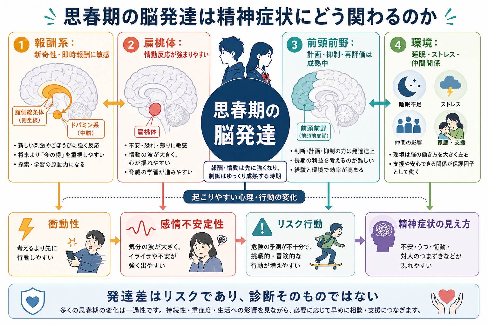
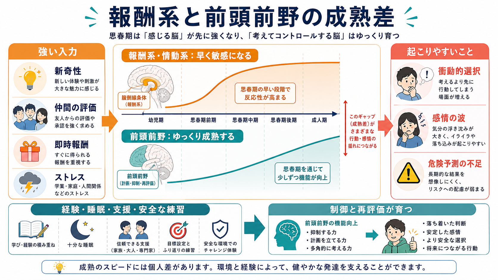
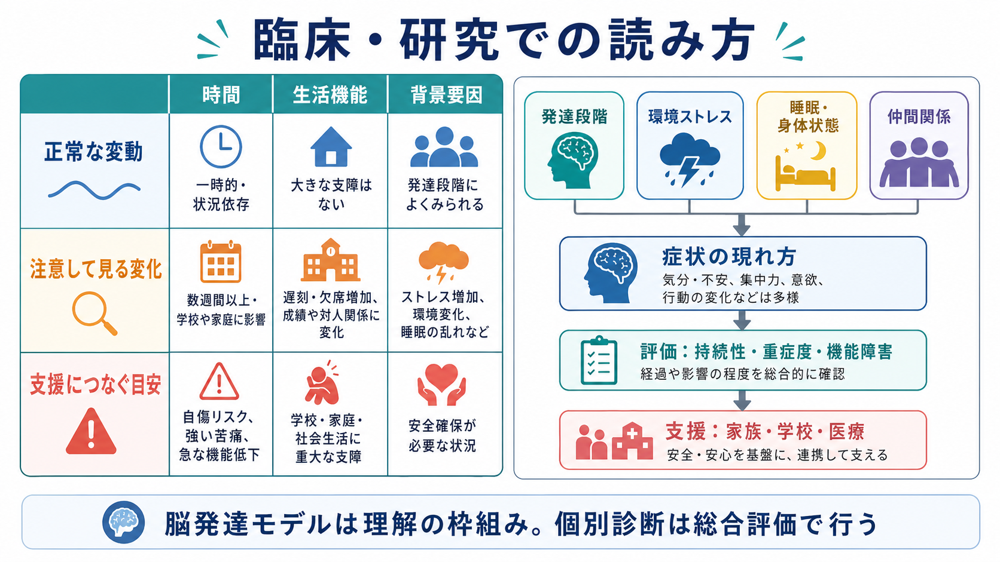

# 思春期の脳発達は精神症状にどう関わるのか

## 要点

- 思春期には、[[報酬系とは何か|報酬系]]や情動系が新奇性・即時報酬・社会的評価に敏感になりやすい一方、[[抑制制御とは何か|抑制制御]]や長期的な見通しを支える前頭前野はゆっくり成熟する[1][2]。
- この成熟差は、衝動性、感情の波、危険予測の弱さ、仲間の前でのリスク行動を説明する有力な枠組みになる[2][3][4]。
- ただし、脳発達モデルは「思春期だから問題ない」または「脳が未熟だから危険」と断定するためのものではない。持続性、重症度、生活機能、睡眠、ストレス、家庭・学校・仲間関係を合わせて見る必要がある[7][8]。
- 精神疾患の多くは思春期から若年成人期に初発しやすいが、発達差は診断そのものではない。研究知見は、早期理解と支援設計のために使う[6][8]。

## この記事で答える問い

1. 思春期の脳では、報酬系・情動系・前頭前野がどのように発達するのか。
2. その発達差は、衝動性、感情不安定性、リスク行動にどうつながるのか。
3. 精神症状として見るとき、正常な揺らぎと支援が必要な変化をどう分けて考えるのか。

## まず結論

思春期は、「感じる脳」が先に強くなり、「考えて調整する脳」が後から追いつく時期として理解できる。腹側線条体を含む報酬系は、新しい経験、仲間からの承認、すぐ得られる報酬に反応しやすくなる。扁桃体などの情動系も、不安、怒り、恥、拒絶感、期待に強く反応しやすい。一方、前頭前野による計画、抑制、再評価、長期的結果の比較は、思春期を通じてゆっくり成熟する[1][3]。

このため、本人が「分かっているのに止められない」「その場では大丈夫だと思った」「友人の前だと判断が変わる」と感じる場面が増える。これは単純な性格の弱さではなく、発達中の神経回路、社会的文脈、睡眠、ストレス、学習経験が重なった現象である[2][4][5]。

## 背景

思春期は、身体の成熟だけでなく、脳、認知、感情、対人関係、社会的役割が同時に変化する時期である。学校段階の変化、進路選択、仲間関係、性的成熟、家族からの自立、デジタル環境での評価などが重なり、同じ刺激でも小児期や成人期とは違った意味を持ちやすい。

精神医学で重要なのは、この時期が精神症状の初発や顕在化と重なりやすい点である。大規模疫学研究では、多くの精神障害が小児期から若年成人期にかけて発症し、年齢分布は診断カテゴリーごとに異なることが示されている[6]。Pausらは、思春期に精神障害が現れやすい理由を、脳成熟、性ホルモン、遺伝的脆弱性、社会的ストレス、認知機能の変化が交差する時期として整理している[8]。

ただし、「多くが思春期に始まる」と「思春期の変化はすべて病気である」はまったく違う。気分の揺れ、反抗、挑戦、仲間重視は発達の一部にもなりうる。臨床的には、持続期間、苦痛、生活機能の低下、自傷・他害リスク、睡眠や食事の破綻、急な性格変化、幻覚・妄想様体験、物質使用などを総合して評価する[7]。

## 基本概念

### 報酬系

報酬系とは、快感だけでなく、予測、動機づけ、学習、接近行動に関わる回路である。腹側線条体、側坐核、中脳ドパミン系、前頭前野などが関与する。思春期には、即時報酬、新奇性、社会的承認への反応が強まりやすく、短期的な魅力が行動選択に入り込みやすい[1][2]。この点は[[ドパミンは報酬だけの物質なのか]]とも関係する。

### 前頭前野

前頭前野は、目標を保つ、衝動を抑える、複数の選択肢を比べる、感情を再評価する、将来の結果を考える、といった制御機能に関わる。[[前頭前野は情動制御にどう関わるのか|前頭前野の情動制御]]は成人でも完全に自動化されているわけではないが、思春期にはまだ発達途上であり、強い感情や社会的圧力の下で働きにくくなることがある[1][3]。

### 二重システムモデル

二重システムモデルは、報酬・情動に関わるシステムと、認知制御に関わるシステムの成熟速度の違いから、思春期の行動を説明する枠組みである[2]。このモデルは直感的で有用だが、単純な「アクセルとブレーキ」だけで終わらせると粗くなる。実際には、学習、文脈、睡眠、ストレス、仲間関係、文化、個人差が回路の働きを大きく変える[3][5]。

## 仕組み

### 1. 即時報酬が目立つ

思春期には、将来の利益よりも「今得られるもの」が強く見えやすい。たとえば、友人に認められる、退屈を避ける、強い刺激を得る、不安を一時的に下げるといった短期報酬が、長期的な損失よりも行動を動かすことがある[2][3]。

この仕組みは、[[衝動性とは何か|衝動性]]や[[リスク下の意思決定はどのように行われるのか|リスク下の意思決定]]を理解する基礎になる。重要なのは、本人が何も考えていないのではなく、その場の価値づけが短期側へ傾きやすいことである。

### 2. 感情の波が行動を押す

扁桃体を含む情動系は、脅威、拒絶、恥、怒り、期待、社会的評価に反応する。思春期には、対人関係の意味が大きくなるため、同じ言葉や表情でも強い感情反応を起こしやすい[3][5]。このため、気分の波、イライラ、不安、自己評価の揺れが、行動選択に直接影響することがある。[[情動と認知は分けられるのか]]という問いは、この時期には特に重要になる。

### 3. 仲間の存在がリスク評価を変える

実験研究では、仲間が見ている状況で青年のリスク選択が増え、報酬関連回路の活動が高まることが示されている[4]。これは「友人が悪い」という単純な話ではない。思春期には、仲間からの承認、所属、評価が大きな発達課題になるため、社会的報酬が行動価値を変えるのである[5]。

### 4. 睡眠不足とストレスが制御を弱める

睡眠不足、慢性ストレス、家庭内葛藤、いじめ、学業負担、身体疾患、物質使用は、感情調整や認知制御をさらに難しくする。発達中の脳は経験に開かれているため、リスクだけでなく支援にも反応しやすい。安全な関係、十分な睡眠、予測可能な生活、段階的な挑戦、相談できる大人は、制御と再評価の発達を支える環境になる[7][8]。

## 図解

| 図 | 役割 | 読み方 |
|---|---|---|
| 図1 | 全体の概念地図 | 報酬系、情動系、前頭前野、環境が同時に行動と症状の見え方を形づくる。 |
| 図2 | 中心メカニズム | 報酬・情動の感受性が先に高まり、前頭前野の制御がゆっくり成熟するため、ギャップが生じる。 |
| 図3 | 臨床・研究との接続 | 正常な揺らぎ、注意して見る変化、支援につなぐ目安を、時間・機能・背景要因から整理する。 |

## 臨床・研究との接続

### 臨床では「年齢」ではなく「変化の軌跡」を見る

思春期の評価では、単発の行動だけでなく、以前と比べて何が変わったかを見る。たとえば、以前は保てていた睡眠、登校、友人関係、趣味、食事、自己管理が急に崩れた場合は、発達的な揺れだけでなく精神症状や環境ストレスを考える必要がある。

特に、自傷リスク、希死念慮、急な機能低下、強い不安や抑うつ、摂食の著しい変化、物質使用、現実検討の低下がある場合は、早めに専門的評価へつなぐ。この記事は教育・研究目的の整理であり、個別診断や治療指示の代わりにはならない。

### 研究では縦断データが重要になる

思春期の脳発達研究では、ある年齢時点の横断比較だけでは不十分である。発達速度、性差、個人差、社会経済的環境、睡眠、ストレス、学校経験、家族関係、文化差が絡むため、縦断研究や多層的な測定が必要になる[5][8]。[[発達精神病理学とは何か]]は、このような時間軸と文脈を扱う枠組みである。

### 予防では「禁止」だけでなく「安全な練習」を設計する

リスク行動を減らすには、ただ禁止するだけでは足りない。思春期には探索と自立が必要であり、完全なリスク回避は発達課題と衝突する。むしろ、失敗しても戻れる関係、相談できる大人、睡眠と生活リズム、段階的な責任、感情を言語化する機会、危険な状況を事前に避ける設計が重要になる。

## よくある誤解

### 誤解1: 思春期の問題はすべて脳の未熟さで説明できる

説明できない。脳発達は重要な要因だが、家族、学校、貧困、差別、トラウマ、慢性疾患、睡眠、文化、デジタル環境、本人の意味づけが同時に関わる。脳だけで説明すると、支援できる環境要因を見落とす。

### 誤解2: リスク行動は本人の性格や意志の弱さである

一部には性格傾向や学習歴も関わるが、それだけではない。即時報酬、仲間の評価、情動の高まり、危険予測の弱さが重なると、普段なら選ばない行動を選びやすくなる[2][4]。

### 誤解3: 思春期の気分の波は全部「普通」なので放っておけばよい

普通の揺らぎも多いが、長く続く苦痛、生活機能の低下、自傷リスク、急な変化がある場合は別である。発達的な揺れと精神症状は連続的に見えることがあるため、持続性と機能障害を丁寧に見る。

### 誤解4: 脳発達が遅いなら本人に責任はない

責任を単純に消す話ではない。発達中だからこそ、本人が学べる範囲の責任と、周囲が整えるべき安全・支援・環境調整を分けて考える必要がある。

## 関連ノート

- [[思春期の脳と心理はどう変化するのか]]
- [[発達精神病理学とは何か]]
- [[神経発達の異常は精神疾患にどう関わるのか]]
- [[報酬系とは何か]]
- [[ドパミンは報酬だけの物質なのか]]
- [[前頭前野は情動制御にどう関わるのか]]
- [[衝動性とは何か]]
- [[抑制制御とは何か]]
- [[リスク下の意思決定はどのように行われるのか]]
- [[情動と認知は分けられるのか]]

## MOC更新候補

- `content/00_MOC/MOC｜精神医学.md`
- `content/00_MOC/MOC｜発達・愛着・社会心理.md`
- `content/00_MOC/MOC｜神経科学と精神疾患.md`
- `content/00_MOC/MOC｜学習・行動・動機づけ.md`

## 理解チェック

1. 報酬系と前頭前野の成熟速度の違いは、思春期のどのような行動を説明しやすいか。
2. 仲間の存在は、リスク行動にどのような影響を与えうるか。
3. 正常な気分の揺らぎと支援が必要な変化を分けるとき、時間、生活機能、リスク以外に何を見るべきか。
4. 脳発達モデルを、個別診断や本人責任の判断に直接使ってはいけない理由は何か。

## 参考文献

[1] Casey, B. J., Jones, R. M., & Hare, T. A. (2008). The adolescent brain. *Annals of the New York Academy of Sciences*, 1124, 111-126. https://doi.org/10.1196/annals.1440.010

[2] Steinberg, L. (2008). A social neuroscience perspective on adolescent risk-taking. *Developmental Review*, 28(1), 78-106. https://doi.org/10.1016/j.dr.2007.08.002

[3] Somerville, L. H., Jones, R. M., & Casey, B. J. (2010). A time of change: Behavioral and neural correlates of adolescent sensitivity to appetitive and aversive environmental cues. *Brain and Cognition*, 72(1), 124-133. https://doi.org/10.1016/j.bandc.2009.07.003

[4] Chein, J., Albert, D., O'Brien, L., Uckert, K., & Steinberg, L. (2011). Peers increase adolescent risk taking by enhancing activity in the brain's reward circuitry. *Developmental Science*, 14(2), F1-F10. https://doi.org/10.1111/j.1467-7687.2010.01035.x

[5] Blakemore, S.-J., & Mills, K. L. (2014). Is adolescence a sensitive period for sociocultural processing? *Annual Review of Psychology*, 65, 187-207. https://doi.org/10.1146/annurev-psych-010213-115202

[6] Kessler, R. C., Berglund, P., Demler, O., Jin, R., Merikangas, K. R., & Walters, E. E. (2005). Lifetime prevalence and age-of-onset distributions of DSM-IV disorders in the National Comorbidity Survey Replication. *Archives of General Psychiatry*, 62(6), 593-602. https://doi.org/10.1001/archpsyc.62.6.593

[7] World Health Organization. (2024). *Adolescent mental health*. https://www.who.int/news-room/fact-sheets/detail/adolescent-mental-health

[8] Paus, T., Keshavan, M., & Giedd, J. N. (2008). Why do many psychiatric disorders emerge during adolescence? *Nature Reviews Neuroscience*, 9, 947-957. https://doi.org/10.1038/nrn2513

## 未解決問題

- 報酬系と前頭前野の発達差を、個人のリスク予測ではなく支援設計にどう安全に使うか。
- SNSやオンラインゲームなど現代的な社会的報酬環境が、思春期の脳発達と症状の見え方にどの程度影響するか。
- 睡眠、運動、家族支援、学校環境の改善が、どの神経・行動指標を通じて回復に寄与するか。
- 文化差、ジェンダー、社会経済的要因を含めた発達モデルを、臨床で使える粒度までどう整理するか。
