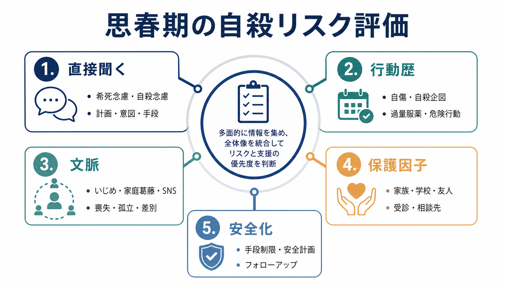
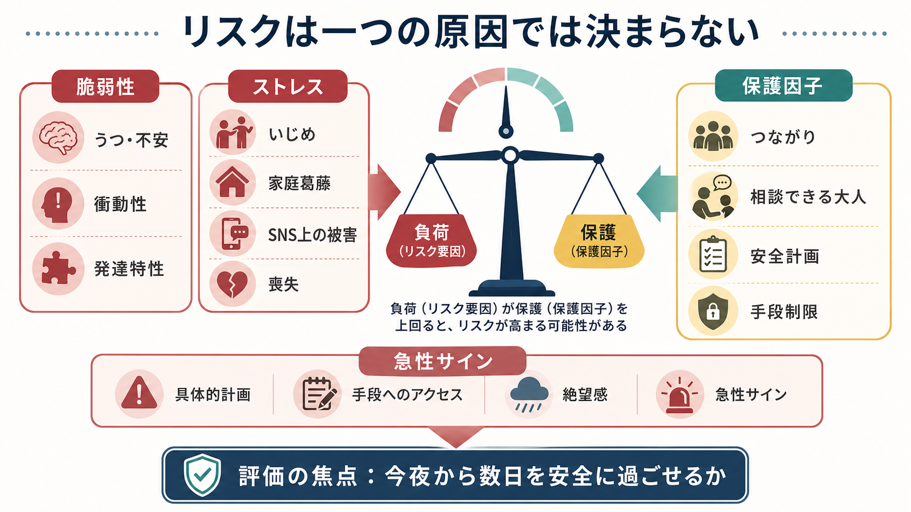
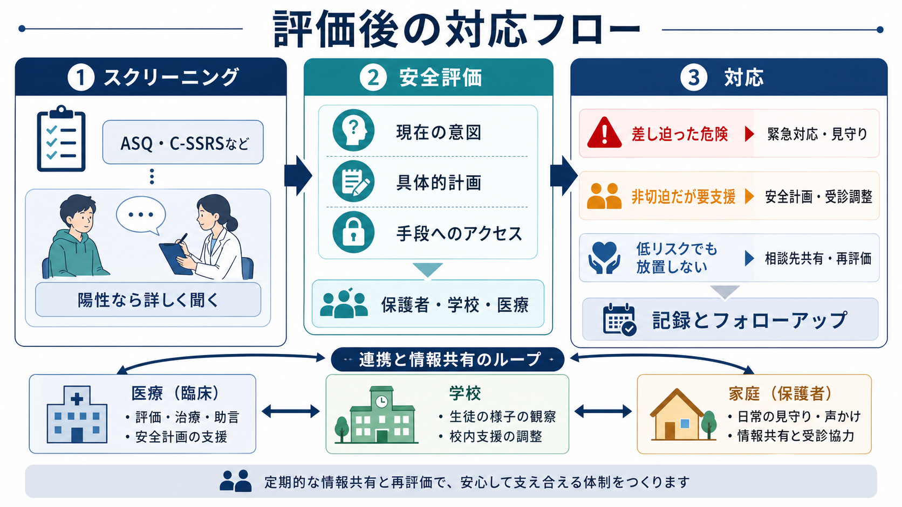

# 思春期の自殺リスクはどう評価するのか

## 要点

- 思春期の自殺リスク評価は、危険度を「当てる」作業ではなく、本人が今夜から数日を安全に過ごすために、危険因子・保護因子・支援行動を具体化する作業である。
- 中心は、[[希死念慮とは何か|希死念慮]]、[[自殺念慮と自殺企図は何が違うのか|自殺念慮]]、計画、意図、手段へのアクセス、過去の[[自傷と自殺企図はどう違うのか|自傷・自殺企図]]、急性の悪化、いじめ、家庭葛藤、SNS上の被害や自傷関連コンテンツへの接触を、直接かつ落ち着いて聞くことである[1][2][3]。
- いじめ被害やネット上の被害は、自殺念慮・自殺企図と一貫して関連する。したがって「本人の症状」だけでなく、学校、家庭、同年代関係、オンライン環境を同時に評価する[4][5]。
- NICEは、自傷後の対応でリスク尺度や「低・中・高」の分類だけを使って将来の自殺や治療可否を決めないよう勧めている。尺度は面接を置き換えるものではなく、聞き漏れを減らす補助として使う[2]。
- 評価の出口は、記録、安全計画、手段制限、保護者・学校・医療・地域資源との連携、短い間隔での再評価である[6][7]。

## この記事で答える問い

1. 思春期の自殺リスク評価では、どの領域を聞くべきか。
2. 希死念慮、自傷、いじめ、家庭葛藤、SNS利用をどう一つの評価に統合するか。
3. 評価結果を、安全計画・支援・フォローアップにどうつなげるか。

## まず結論

思春期の自殺リスクは、本人の言葉だけでも、診断名だけでも、尺度の点数だけでも決まらない。評価では、本人に直接「死にたい気持ち」「自分で命を絶つことを考えたか」「具体的な方法・時期・場所を考えたか」「その手段に近づけるか」を聞き、同時に、過去の自傷・自殺企図、抑うつや不安、睡眠、物質使用、衝動性、家庭内の葛藤、いじめ、SNS上の被害、差別や孤立、相談できる大人、受診可能性を整理する[1][3][5]。

そのうえで、差し迫った危険がある場合は、本人を一人にしない、手段へのアクセスを減らす、保護者・医療・救急資源につなぐ。差し迫った危険が明確でない場合も、「低リスク」として放置せず、安全計画、相談先、次回評価の時期を明確にする[2][6][7]。本記事は教育・研究目的の整理であり、個別の診断や治療指示ではない。急迫した危険が疑われる場合は、地域の救急・精神科救急・相談窓口につなぐ必要がある。

## 背景

日本では、若者の自殺は公衆衛生上の重要課題として扱われており、令和7年版自殺対策白書でも「若者の自殺をめぐる状況」と電話・SNS等を活用した相談事業が独立して整理されている[8]。思春期は、身体発達、学校生活、同年代関係、家族からの自立、性的指向・性自認、将来不安、オンライン環境が同時に変化する時期である。そのため、自殺リスク評価も成人の面接項目を小さくしたものでは足りない。

米国CDCの2023年YRBSは、高校生のメンタルヘルス、自殺関連行動、いじめ、暴力被害、SNS利用を同じ調査枠組みで扱い、頻回なSNS利用がいじめ被害、悲しみ・絶望感、自殺リスクと関連することを報告している[5]。ただし、これは「SNSを使うから自殺する」という単純な因果ではない。重要なのは、利用時間だけでなく、ネット上のいじめ、排除、晒し、性的被害、自傷関連コンテンツ、睡眠の崩れ、現実の支援からの切断を聞くことである。

## 基本概念

### 希死念慮と自殺念慮

[[希死念慮とは何か|希死念慮]]は、「消えたい」「眠ったまま目覚めたくない」「生きていたくない」といった死への願望を含む広い概念である。自殺念慮は、自分で命を絶つことを考える状態を指し、C-SSRSでは、死にたい願望、非特異的な自殺念慮、方法を伴う念慮、意図、具体的計画へと段階的に聞く[3]。

面接では、まず広く聞き、次に具体化する。

| 確認すること | 質問例 |
|---|---|
| 死への願望 | 「消えてしまいたい、眠ったまま起きたくない、と思うことはありますか」 |
| 自殺念慮 | 「自分で命を絶つことを考えたことはありますか」 |
| 方法 | 「どんな方法が頭に浮かびましたか」 |
| 意図 | 「実行するつもりはどれくらいありましたか」 |
| 計画 | 「いつ、どこで、どのように、という具体的な計画はありますか」 |
| 手段へのアクセス | 「その方法に使うものが、今すぐ手に入る状態ですか」 |

### 自傷と自殺企図

[[自傷と自殺企図はどう違うのか|自傷]]は、死ぬ意図が明確でない場合もある。[[非自殺性自傷とは何か|非自殺性自傷]]では、強い感情を下げる、解離感から戻る、自己処罰をする、苦痛を他者に伝えるといった機能があることも多い。しかし「死ぬつもりはなかった」という説明だけで安全と判断してはいけない。自傷の反復、方法の危険性、実行前後の感情、隠蔽、過量服薬、エスカレーション、同時にある自殺念慮を確認する[2][3]。

### 急性リスクと背景リスク

背景リスクは、過去の自殺企図、精神疾患、[[児童青年期うつ病とは何か|児童青年期うつ病]]、不安、トラウマ、発達特性、物質使用、慢性疼痛、家族内の葛藤、虐待、孤立、差別、貧困などである。急性リスクは、直近の悪化、具体的計画、手段へのアクセス、強い絶望感、衝動性、酩酊、睡眠不足、別れや喪失、いじめの発覚、SNS上の炎上や晒し、家庭での激しい対立などである[1][4][5]。

## 仕組み

思春期のリスクは、単一の原因ではなく、負荷と保護因子のバランスとして考えると整理しやすい。抑うつ、不安、衝動性、発達特性などの脆弱性があり、そこにいじめ、家庭葛藤、SNS上の被害、喪失、学業不振、差別体験が重なると、本人の対処資源を上回りやすい。一方で、相談できる大人、友人、学校内の安全な居場所、治療関係、[[精神科診療における保護因子とは何か|保護因子]]、安全計画、手段制限は、危機が行動に移る可能性を下げる[4][6][7]。

この枠組みで見ると、「リスク因子があるか」だけでなく、「それが今どれくらい急性化しているか」「本人が使える支援が本当に機能しているか」が重要になる。たとえば、家庭が保護因子になることもあれば、家庭葛藤や虐待が危険因子になることもある。したがって、[[家族面接では何を評価するべきか|家族面接]]では、保護者の理解、監督可能性、本人との関係、秘密保持と安全共有の境界を確認する。

## 図解

評価後の対応は、スクリーニング、詳細評価、対応の三段階で考えると実装しやすい。ASQやC-SSRSのような標準化された質問は、聞き漏れを減らす補助として有用だが、陽性なら必ず詳細な安全評価につなげる[1][3]。

重要なのは、評価が「陽性か陰性か」で終わらないことである。陽性であれば、現在の意図、具体的計画、手段へのアクセス、保護者や学校に共有すべき範囲、次の受診・相談までの安全性を確認する。陰性でも、いじめ、家庭葛藤、SNS上の被害、自傷、抑うつ、孤立が続く場合は、相談先と再評価の時期を決める。

## 臨床・研究との接続

臨床では、AAPのBlueprintが強調するように、短時間でも安全計画、手段制限、継続支援への接続は実施できる[6]。安全計画は、警告サイン、本人ができる対処、連絡できる人、専門機関、危険な手段から距離を置く方法を、本人と家族に合わせて書き出す。[[クライシスプランとは何か|クライシスプラン]]は、危機時に「誰が、いつ、何をするか」を具体化する点で、自殺リスク評価の自然な出口になる。

研究では、C-SSRSのような尺度は、自殺念慮と行動を共通言語で記述する利点がある[3]。ASQは小児救急などで短時間に自殺リスクを拾うために開発されたスクリーニングで、陽性後のBrief Suicide Safety Assessmentと組み合わせて使われる[1]。ただし、NICEが警告するように、尺度や総合リスク分類だけで入院、退院、治療可否を決めることは避ける[2]。

いじめと自殺関連行動の関連については、メタ分析で、いじめ被害、加害、被害加害のいずれも自殺念慮・自殺行動と関連することが示されている[4]。SNSについては、単なる利用頻度よりも、ネットいじめ、自傷・自殺関連コンテンツへの接触、問題的利用など、具体的な経験を評価するほうが臨床的に有用である[5]。[[インターネット依存とは何か|インターネット依存]]やゲーム行動の評価も、睡眠、学校参加、対人関係、危機時の行動パターンと結びつけて扱う。

## よくある誤解

### 「聞くと自殺を誘発する」

落ち着いて直接聞くこと自体が自殺念慮を誘発する、という強い根拠はない。むしろ、本人が一人で抱えていた内容を共有し、安全化につなげる入口になる。大切なのは、詰問せず、具体的に、評価の目的を「責めるためではなく安全のため」と明確にすることである。

### 「計画がなければ安全」

計画がないことは重要な情報だが、それだけで安全とは言えない。衝動性、酩酊、睡眠不足、手段へのアクセス、直近の喪失、ネット上の被害、過去の企図、自傷の反復がある場合、短時間で危険度が変化しうる[2][6]。

### 「SNS利用時間を聞けば十分」

利用時間だけでは不十分である。評価すべきなのは、ネットいじめ、晒し、性的被害、過剰な比較、睡眠の崩れ、自傷関連投稿の閲覧や投稿、相談資源として機能しているコミュニティの有無である[5]。

### 「保護者に言えば解決する」

保護者は重要な支援者になりうるが、家庭葛藤、虐待、過干渉、性的指向・性自認をめぐる対立がある場合は、単純な共有が本人の危険を高めることもある。安全に必要な情報共有と、本人の信頼を守る説明を両立させる。

## 関連ノート

既存ノート:

- [[自殺リスク評価では何を聞くべきか]]
- [[自傷と自殺企図はどう違うのか]]
- [[希死念慮とは何か]]
- [[自殺念慮と自殺企図は何が違うのか]]
- [[非自殺性自傷とは何か]]
- [[児童青年期うつ病とは何か]]
- [[インターネット依存とは何か]]
- [[家族面接では何を評価するべきか]]
- [[精神科診療における保護因子とは何か]]
- [[クライシスプランとは何か]]

今後の作成候補:

- 思春期の安全計画とは何か
- 学校で自殺リスクをどう共有するか
- SNS上の自傷関連コンテンツをどう評価するか
- いじめ被害とメンタルヘルスはどう関係するのか

MOC更新候補:

- `content/00_MOC/MOC｜精神医学.md`
- `content/00_MOC/MOC｜臨床実践・治療.md`
- `content/00_MOC/MOC｜発達・愛着・社会心理.md`

## 理解チェック

1. 希死念慮、自殺念慮、具体的計画、手段へのアクセスは、どの順番で具体化すると聞きやすいか。
2. 「死ぬつもりはなかった」と説明された自傷でも、追加で確認すべきことは何か。
3. いじめやSNS利用を評価するとき、利用時間以外に何を聞くべきか。
4. 保護因子が「名前だけ」でなく実際に機能しているかを確認するには、どのような質問が必要か。
5. リスク尺度や「低・中・高」の分類だけで処遇を決めることの問題は何か。

## 未解決問題

- 思春期の自殺リスクを、短時間の臨床場面で過不足なく評価する最小項目はどこまで絞れるか。
- SNS上の被害、アルゴリズム、匿名相談、オンライン支援を、危険因子と保護因子の両面からどう測定するか。
- 学校、家庭、医療の情報共有において、本人のプライバシーと安全確保をどう両立するか。
- AI・デジタルフェノタイピングによるリスク検出を、説明可能性、偽陽性、スティグマ、本人同意の問題とどう調整するか。

## 参考文献

[1] National Institute of Mental Health. (n.d.). *Ask Suicide-Screening Questions (ASQ) Toolkit*. https://www.nimh.nih.gov/research/research-conducted-at-nimh/asq-toolkit-materials

[2] National Institute for Health and Care Excellence. (2022). *Self-harm: assessment, management and preventing recurrence* (NICE Guideline NG225). https://www.nice.org.uk/guidance/ng225/chapter/Recommendations

[3] Posner, K., Brown, G. K., Stanley, B., Brent, D. A., Yershova, K. V., Oquendo, M. A., Currier, G. W., Melvin, G. A., Greenhill, L., Shen, S., & Mann, J. J. (2011). The Columbia-Suicide Severity Rating Scale: Initial validity and internal consistency findings from three multisite studies with adolescents and adults. *American Journal of Psychiatry, 168*(12), 1266-1277. https://doi.org/10.1176/appi.ajp.2011.10111704

[4] Holt, M. K., Vivolo-Kantor, A. M., Polanin, J. R., Holland, K. M., DeGue, S., Matjasko, J. L., Wolfe, M., & Reid, G. (2015). Bullying and suicidal ideation and behaviors: A meta-analysis. *Pediatrics, 135*(2), e496-e509. https://doi.org/10.1542/peds.2014-1864

[5] Centers for Disease Control and Prevention. (2024). *Youth Risk Behavior Survey Data Summary & Trends Report: 2013-2023*. https://www.cdc.gov/yrbs/dstr/index.html

[6] American Academy of Pediatrics. (n.d.). *Brief Interventions that Can Make a Difference in Suicide Prevention*. https://www.aap.org/en/patient-care/blueprint-for-youth-suicide-prevention/strategies-for-clinical-settings-for-youth-suicide-prevention/brief-interventions-that-can-make-a-difference-in-suicide-prevention/

[7] Nesi, J., Burke, T. A., Bettis, A. H., Kudinova, A. Y., Thompson, E. C., MacPherson, H. A., Fox, K. A., Lawrence, H. R., Thomas, S. A., Wolff, J. C., Altemus, M. K., Soriano, S., & Liu, R. T. (2021). Social media use and self-injurious thoughts and behaviors: A systematic review and meta-analysis. *Clinical Psychology Review, 87*, 102038. https://doi.org/10.1016/j.cpr.2021.102038

[8] 厚生労働省. (2025). *令和7年版自殺対策白書*. https://www.mhlw.go.jp/stf/seisakunitsuite/bunya/hukushi_kaigo/seikatsuhogo/jisatsu/jisatsuhakusyo2025.html
