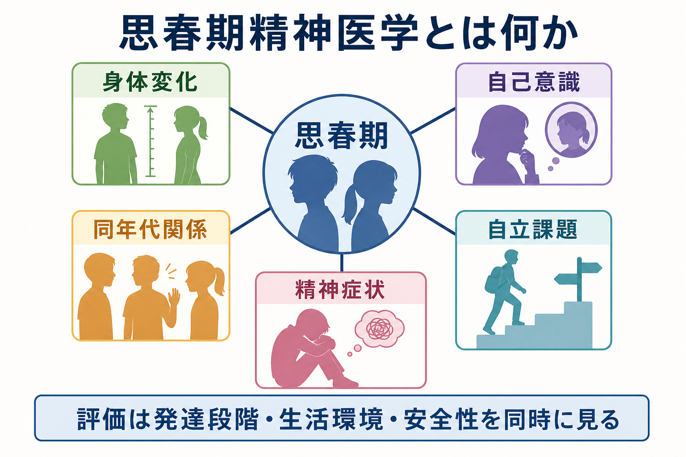
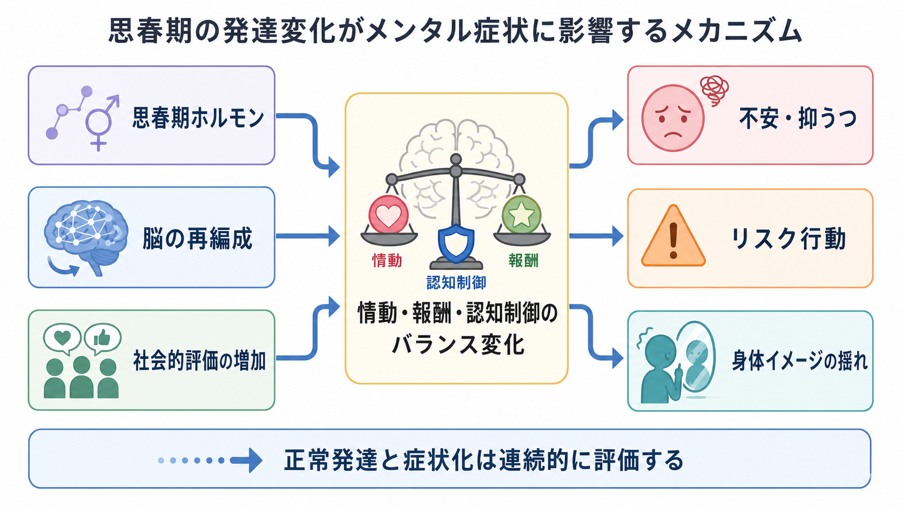
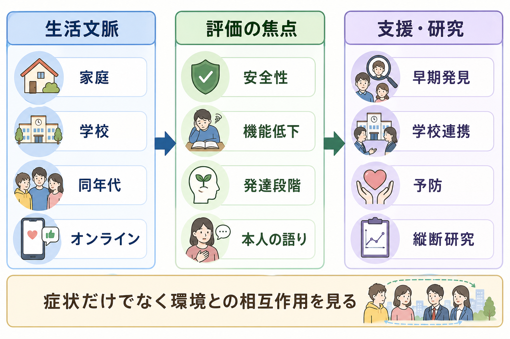

# 思春期精神医学とは何か

## 要点

- 思春期精神医学は、精神症状を「診断名」だけでなく、身体成熟、脳発達、自己意識、同年代関係、家族・学校・オンライン環境、自立課題の相互作用として読む領域である。
- 思春期は、情動・報酬感受性・認知制御・社会的評価への感受性が再編成される時期であり、正常な揺れと症状化を連続的に評価する必要がある[5][6]。
- 精神疾患の初発は小児期から若年成人期に集中しやすく、早期発見・予防・学校や家族との連携が重要になる[1][3][4]。
- 医療者は、本人の語り、機能低下、安全性、発達段階、生活文脈を同時に見て、個別診断や治療指示として短絡しない。

## この記事で答える問い

1. 思春期精神医学は、児童精神医学や成人精神医学と何が違うのか。
2. 身体変化、自己意識、同年代関係、自立課題は、精神症状の出方にどう影響するのか。
3. 臨床・研究では、思春期の問題をどのように評価し、支援や予防へ接続するのか。

## まず結論

思春期精神医学とは、思春期の精神症状を、身体・脳・心理・社会環境が同時に変化する発達移行期の現象として理解する精神医学である。たとえば[[うつ病とは何か|うつ病]]、[[不安症群とは何か|不安症]]、[[非自殺性自傷とは何か|非自殺性自傷]]、[[身体醜形症とは何か|身体醜形症]]、[[初回エピソード精神病とは何か|初回エピソード精神病]]は、それぞれ成人にも見られるが、思春期では学校生活、同年代からの評価、身体イメージ、家族からの分離、自立への圧力と結びついて表れやすい。

重要なのは、「思春期だから不安定で当然」と片づけないことと、「症状があるからすぐ病理」と決めつけないことの両方である。WHO は、思春期を身体的・情緒的・社会的変化が精神健康の脆弱性にも保護因子にもなる形成的時期として位置づけている[1]。NIMH も、数週間から数か月続き、家庭・学校・友人関係での生活機能を妨げる変化は専門家に相談する目安になると整理している[2]。

## 背景

思春期は、10代を中心に、身体成熟、性的発達、親からの心理的分離、同年代集団への所属、学業・進路選択、オンライン空間での自己呈示が重なり合う時期である。Lancet の adolescent health commission は、思春期を将来の健康とウェルビーイングに大きく影響する発達段階として扱い、健康問題を個人内の問題ではなく、教育、社会、経済、家族、地域の文脈で見る必要を強調している[3]。

疫学的にも、思春期から若年成人期は精神疾患の初発が集中する。Kessler らの National Comorbidity Survey Replication では、生涯の精神疾患ケースの約半数が14歳までに、約4分の3が24歳までに始まると推定された[4]。これは「すべての症状が病気」という意味ではないが、若年期の困難を早期に見つけ、重症化や二次的な学業・対人・身体健康の損失を減らす意義を示す。

## 基本概念

### 発達課題として見る

思春期精神医学では、症状を単独で見るのではなく、発達課題との関係で見る。身体が急に変わる、性的成熟が進む、他者から見られる自己が強く意識される、友人関係が生活の中心になる、親から離れたいが支えも必要である。このような課題は正常発達の一部だが、脆弱性、逆境、孤立、睡眠不足、いじめ、学業負荷、家庭内葛藤が重なると症状化しやすい[1][6]。

### 正常な揺れと症状化の連続性

気分の波、恥ずかしさ、反抗、所属への敏感さ、リスク探索は、思春期に増えやすい。しかし、持続性、強度、機能低下、安全性の問題が加わると、臨床的評価が必要になる。[[児童青年期うつ病とは何か]]、[[不安とは何か]]、[[希死念慮とは何か]]、[[睡眠障害とは何か]]などは、思春期の生活文脈を添えて読むと理解しやすい。

### 本人の語りを中心に置く

思春期の本人は、親や教師から見える問題と、自分が体験している苦痛を同じ言葉で説明できるとは限らない。臨床評価では、保護者・学校からの情報も重要だが、本人が何を恥じ、何を恐れ、どの関係で傷つき、どの場面で少し楽になるのかを聞く必要がある。これは、本人の自律性を尊重しつつ、安全性と保護を確保する実践でもある[2]。

## 仕組み

思春期の症状化を考えるとき、単一の原因を探すよりも、複数の変化が同期しないことに注目すると整理しやすい。

### 身体変化と身体イメージ

思春期ホルモンと身体成熟は、身長、体型、皮膚、声、月経、性的特徴の変化をもたらす。これらは「自分の身体が他者からどう見られるか」という自己意識と結びつく。早すぎる、遅すぎる、周囲と違うと感じる身体成熟は、抑うつ、不安、外在化問題など複数領域のリスクと関連しうる[8]。ただし、これは決定論ではなく、家庭・同年代関係・文化的規範・支援の有無によって意味づけが変わる。

### 脳発達と情動・報酬・認知制御

思春期の脳では、皮質灰白質、白質、機能的結合、報酬処理、認知制御に関わる発達が続く。Paus らは、思春期に多くの精神疾患が出現しやすい背景として、脳成熟、身体成熟、行動変化、環境要求の重なりを論じている[5]。報酬への感受性や同年代の影響が強まる一方で、長期的結果を見通す制御は発達途上であるため、リスク行動や衝動性を「意志の弱さ」だけで説明するのは不十分である。

### 自己意識と社会的脳

思春期には、他者の視線、評価、所属、排除に対する感受性が高まりやすい。Blakemore と Mills は、思春期を社会文化的処理の感受性が高まる時期として整理し、社会的環境と社会的報酬を青年期行動の理解に含める必要を述べている[6]。また、社会的認知に関わる脳領域は思春期にも構造的・機能的に変化し、他者理解、自己評価、同年代関係の複雑化と関わる[7]。

### 同年代関係とオンライン環境

同年代関係は、支えにもリスクにもなる。友人から認められることは保護因子になりうるが、いじめ、排除、比較、評判不安、SNS 上の可視化された評価は、抑うつ、不安、自傷、摂食・身体イメージ問題を悪化させることがある[1][6]。不登校や学校適応の問題は、この視点から[[不登校に関連する精神疾患には何があるのか]]と関連づけられる。

## 図解

思春期精神医学の評価は、症状名を確定する前に、生活文脈、評価の焦点、支援・研究への接続を分けて整理すると見通しがよい。

| 観点 | 見ること | 代表的な問い |
|---|---|---|
| 身体 | 成長、睡眠、月経、食事、慢性疾患、薬物・物質使用 | 身体の変化をどう感じているか |
| 心理 | 気分、不安、衝動、自己評価、恥、怒り | 何が一番つらいと本人は説明するか |
| 対人 | 家族、友人、恋愛、所属、いじめ、孤立 | 誰といると悪化し、誰といると少し楽か |
| 学校・社会 | 欠席、成績、進路、部活動、オンライン活動 | 生活機能はどこで落ちているか |
| 安全性 | 自傷、希死念慮、暴力、搾取、虐待、急性精神病症状 | 今日から数日以内に守るべき安全は何か |

## 臨床・研究との接続

臨床では、思春期の症状を「本人の問題」として閉じず、家庭、学校、地域、医療の連携で扱う。たとえば[[ADHDとは何か]]、[[自閉スペクトラム症とは何か]]、[[ひきこもりとは何か]]、[[ゲーム行動症とは何か]]は、診断名だけでなく、発達特性、環境調整、二次的な不安・抑うつ、学業・対人機能を同時に評価する必要がある。

研究では、横断的な症状尺度だけではなく、発達軌道、思春期発達段階、学校・家庭・オンライン環境、同年代影響、保護因子、長期転帰を追う縦断研究が重要になる。WHO と NIMH の公的資料が強調するように、早期発見と治療だけでなく、社会情動的スキル、睡眠、運動、支援的な家庭・学校環境、スティグマ低減、アクセス改善が予防の焦点になる[1][2]。

## よくある誤解

### 「思春期だから放っておけばよい」

思春期には揺れがあるが、数週間から数か月続く苦痛、学校や友人関係の機能低下、自傷や希死念慮、著しい睡眠・食事変化、精神病症状がある場合は、発達の一部として放置しない[2]。

### 「大人と同じ診断基準を当てはめれば十分」

診断基準は重要だが、思春期では症状の意味が生活文脈で変わる。たとえば孤立は抑うつだけでなく、いじめ、感覚過敏、身体イメージ不安、家族葛藤、オンライン被害、学校適応の問題と結びつくことがある。

### 「脳が未熟だから問題行動が起きる」

脳発達は重要だが、それだけで説明すると、本人の主体性や環境の影響を過小評価する。報酬感受性、社会的評価、認知制御、環境ストレス、支援資源が相互作用するという見方が必要である[5][6]。

### 「自立は親や支援から離れること」

思春期の自立は、支援を拒むことではない。むしろ、本人が意思決定に参加し、必要なときに助けを求め、家族・学校・医療と適切な距離を調整できることが自立の中核になる。

## 関連ノート

- [[ライフスパン精神医学とは何か]]
- [[乳幼児精神医学とは何か]]
- [[児童青年期うつ病とは何か]]
- [[不登校に関連する精神疾患には何があるのか]]
- [[非自殺性自傷とは何か]]
- [[身体醜形症とは何か]]
- [[初回エピソード精神病とは何か]]
- [[ひきこもりとは何か]]
- [[ADHDとは何か]]
- [[自閉スペクトラム症とは何か]]
- [[睡眠障害とは何か]]
- [[希死念慮とは何か]]

## MOC更新候補

- `content/00_MOC/` 配下に精神医学または発達・ライフスパン関連 MOC がある場合、バッチ統合時に `[[思春期精神医学とは何か]]` を追加する。
- 近接配置候補: `content/03_精神医学/発達・ライフスパン`

## 理解チェック

1. 思春期精神医学が、症状名だけでなく発達段階と生活文脈を見る理由は何か。
2. 身体変化と同年代関係は、抑うつ・不安・身体イメージ問題にどのようにつながりうるか。
3. 正常な思春期の揺れと、臨床的評価が必要な症状化を分ける観点は何か。
4. 学校・家庭・医療連携を考えるとき、本人の自律性をどう尊重できるか。

## 未解決問題

- 思春期のどの時期が、どの症状領域にとって特に感受性の高い時期なのかは、個人差が大きい。
- オンライン環境が精神症状に与える影響は、リスクと支援の両面があり、単純な有害性だけでは説明できない。
- 早期介入は重要だが、正常な発達上の揺れを過剰に医療化しない評価枠組みが必要である。

## 参考文献

[1] World Health Organization. (2025). *Mental health of adolescents*. https://www.who.int/news-room/fact-sheets/detail/adolescent-mental-health

[2] National Institute of Mental Health. (2024). *Child and Adolescent Mental Health*. https://www.nimh.nih.gov/health/topics/child-and-adolescent-mental-health

[3] Patton, G. C., Sawyer, S. M., Santelli, J. S., et al. (2016). Our future: a Lancet commission on adolescent health and wellbeing. *The Lancet, 387*(10036), 2423-2478. https://doi.org/10.1016/S0140-6736(16)00579-1

[4] Kessler, R. C., Berglund, P., Demler, O., Jin, R., Merikangas, K. R., & Walters, E. E. (2005). Lifetime prevalence and age-of-onset distributions of DSM-IV disorders in the National Comorbidity Survey Replication. *Archives of General Psychiatry, 62*(6), 593-602. https://doi.org/10.1001/archpsyc.62.6.593

[5] Paus, T., Keshavan, M., & Giedd, J. N. (2008). Why do many psychiatric disorders emerge during adolescence? *Nature Reviews Neuroscience, 9*, 947-957. https://doi.org/10.1038/nrn2513

[6] Blakemore, S.-J., & Mills, K. L. (2014). Is adolescence a sensitive period for sociocultural processing? *Annual Review of Psychology, 65*, 187-207. https://doi.org/10.1146/annurev-psych-010213-115202

[7] Blakemore, S.-J. (2008). The social brain in adolescence. *Nature Reviews Neuroscience, 9*, 267-277. https://doi.org/10.1038/nrn2353

[8] Hamlat, E. J., Snyder, H. R., Young, J. F., & Hankin, B. L. (2019). Pubertal timing as a transdiagnostic risk for psychopathology in youth. *Clinical Psychological Science, 7*(3), 411-429. https://doi.org/10.1177/2167702618810518
