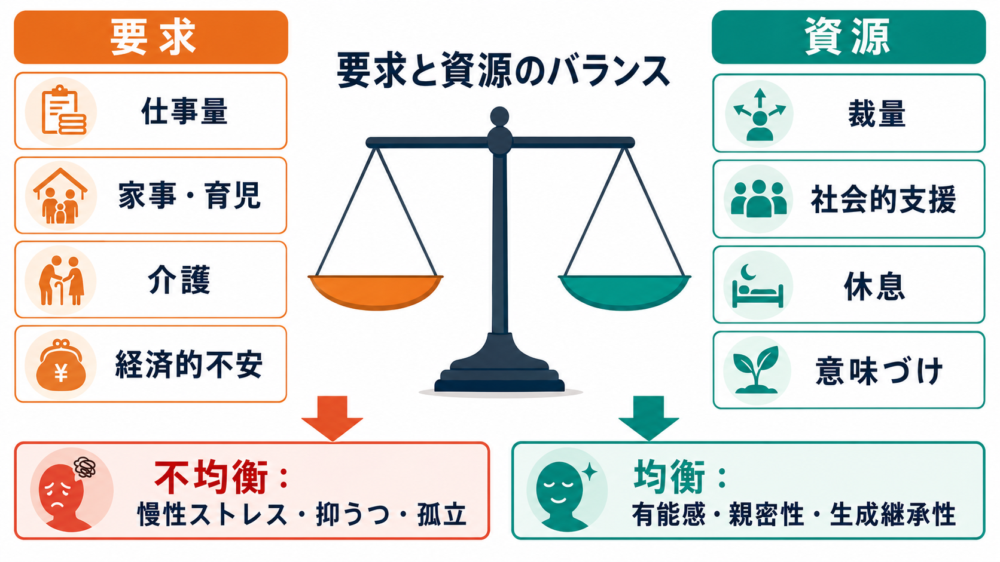
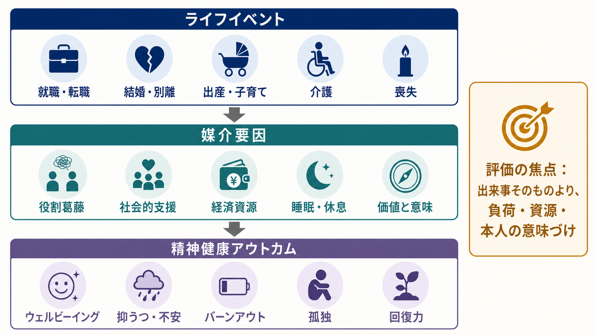

# 成人期の精神発達課題とは何か

## 要点

- 成人期の精神発達課題は「何歳なら何を達成すべきか」という固定表ではなく、仕事、親密な関係、子育て・ケア、社会参加をめぐる要求と資源の調整である。
- 発達課題は、[[成人発達とは何か]]、[[発達段階理論とは何か]]、[[発達精神病理学とは何か]]をつなぐ概念であり、臨床では生活史・役割・支援環境を理解する入口になる。
- 仕事は有能感・収入・社会的つながりを与える一方、過大な要求、低い裁量、雇用不安が続くと[[うつ病とは何か]]や[[不安症群とは何か]]のリスクを高める。
- 親密な関係と社会的支援は保護因子になりうるが、関係葛藤、孤立、役割の偏りは慢性ストレスになる。
- 子育て、介護、社会的貢献は生成継承性を支えるが、資源が乏しいと消耗、罪悪感、[[バーンアウトとは何か]]に近い状態につながる。

## この記事で答える問い

1. 成人期の精神発達課題とは何を指すのか。
2. 仕事、親密な関係、子育て、社会的役割は精神健康にどう影響するのか。
3. 臨床や研究では、成人期の困難をどのように評価すればよいのか。

## まず結論

成人期の発達課題は、単に「就職する」「結婚する」「子どもを持つ」といった社会的イベントの達成ではない。より重要なのは、本人が複数の役割を引き受けながら、親密性、有能感、世代性、意味、休息、支援をどのように保てるかである。エリクソンの心理社会的発達理論では、成人期に親密性対孤立、生成継承性対停滞などの課題が置かれるが、現代的にはこれを硬い年齢段階ではなく、人生の出来事によって繰り返し再編されるプロセスとして読む方が実用的である[1]。

精神健康は、個人の脆弱性だけで決まらない。WHOは、精神健康を「ストレスに対処し、能力を発揮し、学び働き、共同体に貢献できるウェルビーイング」と位置づけ、個人・家族・地域・構造的要因が保護因子にもリスク因子にもなると整理している[2]。成人期の発達課題は、まさにこの「個人と環境の接点」で生じる。

## 背景

成人期は、青年期の後にただ安定する時期ではない。就職、転職、パートナー関係、離別、出産、子育て、介護、慢性疾患、喪失、地域参加など、生活構造を変える出来事が連続する。これらは「正常なライフイベント」であっても、本人の資源を超えると精神症状の背景になる。

ここでいう精神発達課題は、次の三つを同時に含む。

1. **役割の獲得**: 職業人、パートナー、親、ケアラー、市民、専門家などの役割を引き受ける。
2. **自己の再編**: 「自分は何者か」「何に責任を持つか」「何を手放すか」を更新する。
3. **関係と資源の調整**: 支援を求める、境界を作る、休息を確保する、役割を分担する。

この視点を取ると、成人期の精神健康は「発達が成功したか失敗したか」ではなく、「現在の生活構造が本人の回復力を支えているか、削っているか」として見やすくなる。

## 基本概念

### 親密性と孤立

親密性とは、単に恋愛や結婚の有無ではない。相手と心理的に近づき、弱さや依存を含む関係を維持しながら、自己を完全に失わない能力である。[[愛着とは何か]]や[[愛着スタイルにはどのような種類があるのか]]は、この課題の土台を理解するうえで有用である。

親密な関係は支援、感情調整、生活の安定をもたらす一方、葛藤が慢性化すると抑うつ、不安、睡眠障害、身体症状と結びつく。結婚そのものよりも、関係の質、支援の利用可能性、葛藤の扱い方が重要である。夫婦関係の質と健康に関するメタ分析では、関係の質は主観的健康、身体的健康指標、心理的ウェルビーイングと関連し、特に葛藤や低い満足度は心理的苦痛と結びつきやすいとされる[4]。

### 有能感と職業役割

仕事は収入だけでなく、時間構造、社会的承認、技能の発揮、共同体との接点を与える。そのため、働けること自体は精神健康の保護因子になりうる。しかし、過大な要求と低い裁量が組み合わさる職業性ストレスは、抑うつのリスクと関連する。職業性ストレスと臨床的うつ病を扱った系統的レビュー・メタ分析では、高要求・低裁量の job strain がうつ病発症と関連することが示されている[3]。

成人期の仕事の課題は「長く働くこと」ではなく、能力、裁量、報酬、回復時間、家庭内役割との整合を取ることである。この整合が崩れると、[[バーンアウトとは何か]]、[[不眠障害とは何か]]、[[大うつ病性障害とは何か]]に近い問題として現れることがある。

### 子育て・ケアと生成継承性

生成継承性とは、次世代、共同体、文化、知識、ケアの対象に何かを残す感覚である。これは子どもを持つことに限定されない。教育、 mentoring、後輩育成、地域活動、創作、臨床実践、研究、介護なども生成継承性の場になる。

一方で、子育てやケアは深い意味を持つと同時に、睡眠不足、経済的不安、役割制限、パートナー関係の変化、職業役割との衝突を伴う。父親の初回子育て移行に関する系統的レビューでは、父親のメンタルヘルスは父親アイデンティティの形成、役割上の競合、否定的感情や恐れ、支援不足に影響されると整理されている[5]。これは母親・父親を問わず、親になることを「喜ばしい出来事」とだけ扱うと見落とされる負荷である。

### 社会参加と孤独

成人期の社会的役割には、職場、家族、友人関係、地域、専門職コミュニティ、オンライン共同体などが含まれる。社会参加は自己効力感と意味を支えるが、役割から排除されること、孤立すること、支援を求めにくいことはリスクになる。

孤独と社会的孤立は、単なる気分の問題ではなく、健康リスクとして扱う必要がある。孤独、社会的孤立、独居と死亡リスクに関するメタ分析では、これらが早期死亡リスクの上昇と関連することが示されている[7]。精神医学的には、[[孤独は心身にどのような影響を与えるのか]]、[[孤独と精神疾患はどう関係するのか]]と接続して考えるとよい。

## 仕組み

成人期の精神発達課題が精神健康に影響する中心機序は、**要求と資源のバランス**である。

要求には、仕事量、責任、家事、育児、介護、経済的不安、対人葛藤、社会的期待が含まれる。資源には、裁量、収入、休息、睡眠、支援、相談先、制度、本人の価値づけ、身体的健康が含まれる。

このバランスは、次のような経路で精神健康に影響する。

1. **慢性ストレス経路**: 高い要求が長く続き、休息や裁量が少ないと、睡眠、注意、感情調整が崩れる。
2. **役割葛藤経路**: 仕事と家庭、親役割と個人時間、ケアと職業責任が互いに衝突する。
3. **社会的支援経路**: 支えがあると負荷は緩和されるが、孤立していると同じ出来事でも負担が増える。
4. **意味づけ経路**: 負荷があっても、本人が価値や目的を見いだせる場合、消耗だけでなく成長や生成継承性につながる。

仕事と家庭の葛藤に関するメガ・メタ分析では、work-to-family conflict と family-to-work conflict が不安、抑うつ、物質使用などの精神健康アウトカムと関連しうることが示されている[6]。また、無償ケアラーを対象にした縦断研究では、ケア負担が仕事・家庭葛藤を介してメンタルヘルスに影響する経路が示されている[8]。

## 図解

### 図解1: 成人期の精神発達課題の概念地図

成人期の課題は、仕事・親密な関係・子育てやケア・社会参加の四領域が相互に影響する構造として捉えられる。どれか一つの達成で決まるのではなく、複数領域のバランスが精神健康を左右する。

### 図解2: 要求と資源のバランス

要求が増えても、裁量、支援、休息、意味づけが十分であれば、役割は成長や有能感につながる。反対に、要求が資源を上回る状態が続くと、慢性ストレス、抑うつ、孤立、バーンアウトに近づく。

### 図解3: 臨床・研究で見る評価ポイント

臨床・研究では、ライフイベントそのものだけでなく、その出来事が本人の役割、資源、関係、意味づけをどう変えたかを見る。たとえば「出産」は保護的にも負荷にもなり、「昇進」は有能感にも過重責任にもなりうる。

## 臨床・研究との接続

成人期の困難を評価するときは、診断名だけでなく生活構造を尋ねる必要がある。ただし、これは個別診断や治療指示ではなく、教育・研究目的の整理である。

臨床面接では、次の問いが有用である。

- 最近、増えた役割や失われた役割は何か。
- 仕事、家庭、ケア、社会参加のどこに最も大きな要求があるか。
- 本人が使える資源は何か。時間、睡眠、裁量、相談相手、制度、経済資源は足りているか。
- 役割の中に、有能感、親密性、意味、生成継承性を感じる場面はあるか。
- 本人が「自分の不調は甘えだ」と解釈していないか。

研究では、成人期の精神健康を単一のライフイベントで説明するよりも、役割の数、役割の質、役割葛藤、社会的支援、社会経済的条件、ジェンダー規範、文化的期待を同時に扱う必要がある。たとえば、同じ「親になる」経験でも、支援制度、職場の柔軟性、パートナーとの分担、既往の精神症状によって意味は大きく変わる。

## よくある誤解

### 誤解1: 成人期の発達課題は、結婚・出産・昇進を達成することだ

違う。これらは発達課題が表れやすい場面だが、課題そのものではない。重要なのは、親密性、責任、意味、役割分担、支援、自己の継続性がどう組織化されるかである。

### 誤解2: 成人したら発達は終わる

違う。成人期にも自己理解、対人関係、責任、価値、社会参加は変化する。[[発達とは何か]]の視点から見れば、成人期は「完成後の維持」ではなく、環境変化に応じた再編の時期である。

### 誤解3: 役割が多いほど精神健康に悪い

単純には言えない。複数の役割は負荷を増やすが、同時に収入、承認、支援、意味、逃げ場を増やすこともある。問題は役割の数だけでなく、裁量、支援、分担、回復時間があるかである。

### 誤解4: 親密な関係があれば孤独ではない

違う。関係の量と質は別である。家族やパートナーがいても、理解されない、支援を求められない、葛藤が慢性化している場合には孤独は強まる。

## 関連ノート

- [[成人発達とは何か]]
- [[発達段階理論とは何か]]
- [[発達精神病理学とは何か]]
- [[愛着とは何か]]
- [[社会的支援は健康にどう影響するのか]]
- [[孤独は心身にどのような影響を与えるのか]]
- [[うつ病とは何か]]
- [[不安症群とは何か]]
- [[バーンアウトとは何か]]
- [[精神疾患と家族負担はどう関係するのか]]

MOC更新候補: [[MOC｜発達・愛着・社会心理]]、精神医学領域の発達・ライフスパン系MOCを統合ジョブで検討。

## 理解チェック

1. 成人期の精神発達課題を、単なる社会的イベントの達成として捉えると何を見落とすか。
2. 「仕事」が精神健康の保護因子にもリスク因子にもなるのはなぜか。
3. 子育てや介護の負荷を評価するとき、出来事そのもの以外に何を見るべきか。
4. 親密な関係と社会的支援は、どのような条件で保護因子になり、どのような条件でリスク因子になるか。
5. 臨床面接で「要求と資源のバランス」を尋ねるなら、どのような質問を加えるか。

## 参考文献

[1] Orenstein, G. A., & Kaur, J. (2026). Erikson's Stages of Psychosocial Development. *StatPearls*. NCBI Bookshelf. https://www.ncbi.nlm.nih.gov/books/NBK556096/

[2] World Health Organization. (2022). *World mental health report: Transforming mental health for all*. https://www.who.int/teams/mental-health-and-substance-use/world-mental-health-report

[3] Madsen, I. E. H., Nyberg, S. T., Magnusson Hanson, L. L., et al. (2017). Job strain as a risk factor for clinical depression: Systematic review and meta-analysis with additional individual participant data. *Psychological Medicine*, 47(8), 1342-1356. https://doi.org/10.1017/S003329171600355X

[4] Robles, T. F., Slatcher, R. B., Trombello, J. M., & McGinn, M. M. (2014). Marital quality and health: A meta-analytic review. *Psychological Bulletin*, 140(1), 140-187. https://doi.org/10.1037/a0031859

[5] Baldwin, S., Malone, M., Sandall, J., & Bick, D. (2018). Mental health and wellbeing during the transition to fatherhood: A systematic review of first time fathers' experiences. *JBI Database of Systematic Reviews and Implementation Reports*, 16(11), 2118-2191. https://doi.org/10.11124/JBISRIR-2017-003773

[6] Miller, B. K., Wan, M., Carlson, D., Kacmar, K. M., & Thompson, M. (2022). Antecedents and outcomes of work-family conflict: A mega-meta path analysis. *PLOS ONE*, 17(2), e0263631. https://doi.org/10.1371/journal.pone.0263631

[7] Holt-Lunstad, J., Smith, T. B., Baker, M., Harris, T., & Stephenson, D. (2015). Loneliness and social isolation as risk factors for mortality: A meta-analytic review. *Perspectives on Psychological Science*, 10(2), 227-237. https://doi.org/10.1177/1745691614568352

[8] Kayaalp, A., Page, K. J., & Rospenda, K. M. (2021). Caregiver burden, work-family conflict, family-work conflict, and mental health of caregivers: A mediational longitudinal study. *Work & Stress*, 35(3), 217-240. https://doi.org/10.1080/02678373.2020.1832609

## 未解決問題

- 成人期の発達課題を、日本の雇用慣行、ジェンダー規範、単身世帯、非婚、介護負担の文脈でどう再定義するか。
- 役割の「数」ではなく「質」と「裁量」を測る、実用的な臨床評価尺度をどう設計するか。
- 生成継承性を、子育て以外の実践としてどのように支援できるか。
- オンライン共同体が成人期の親密性、孤独、社会参加に与える影響をどう評価するか。
