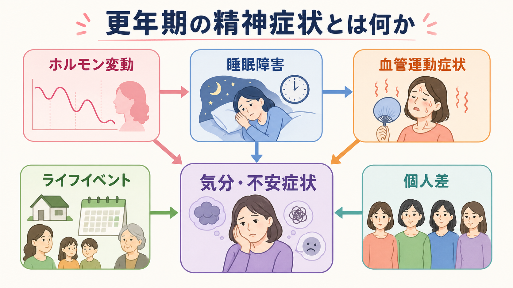
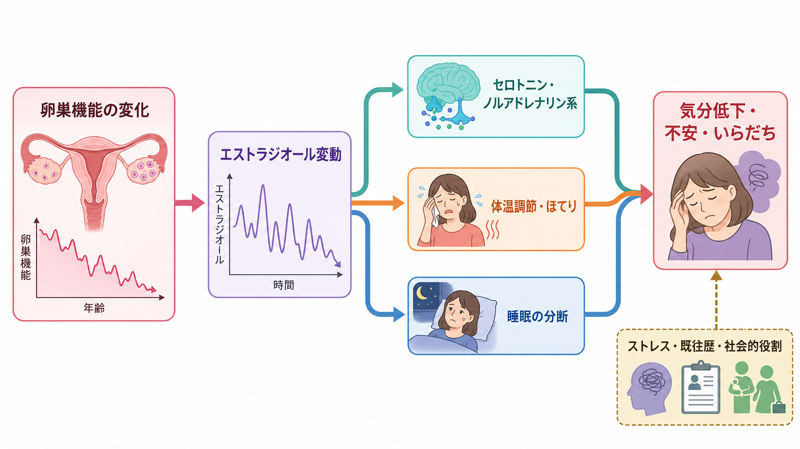
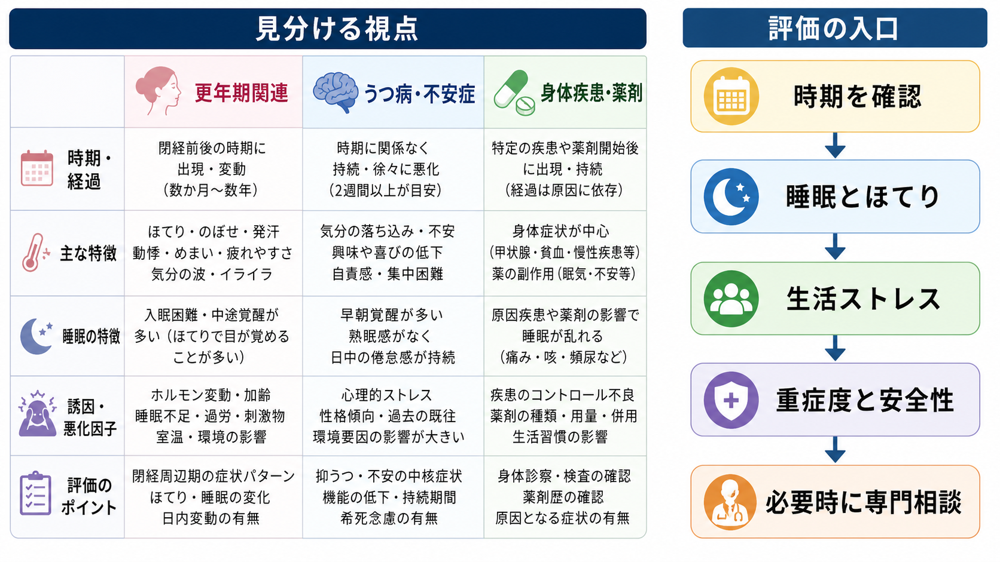

# 更年期の精神症状とは何か

## 要点

- 更年期の精神症状は、閉経前後にみられる抑うつ、不安、いらだち、気分不安定、集中困難、睡眠障害などを、卵巣機能の変化、身体症状、生活上の負荷と合わせて理解するための臨床的な見方である。
- 閉経移行期、とくに月経周期が不規則になりホルモン変動が大きくなる時期は、抑うつ症状のリスクが上がりやすい。ただし、すべての人が精神症状を経験するわけではなく、既往歴、睡眠、血管運動症状、ストレス、社会的支援によって大きく異なる[1][2][3]。
- 「更年期だから仕方ない」でも「すべてホルモンのせい」でもない。[[うつ病とは何か]]、[[不安症群とは何か]]、[[不眠障害とは何か]]、身体疾患、薬剤、生活イベントを並行して評価する必要がある[2][6][7]。

## この記事で答える問い

1. 更年期の精神症状とは、どのような症状のまとまりを指すのか。
2. ホルモン変動、睡眠障害、ほてり・寝汗、ライフイベントはどのようにつながるのか。
3. 通常の気分変動、[[大うつ病性障害とは何か]]、不安症、身体疾患・薬剤性症状をどう見分けるのか。
4. 研究・臨床では、どのような点を評価するのか。

## まず結論

更年期の精神症状は、単一の診断名というより、閉経移行期から閉経後早期に生じやすい精神・身体・生活上の変化をまとめて評価するための枠組みである。中心にあるのは、エストラジオールなどの性ステロイドが安定して低下するだけでなく、大きく揺らぐ時期があること、ほてり・寝汗が睡眠を分断しやすいこと、さらに介護、子どもの独立、職場責任、慢性疾患、喪失体験などのライフイベントが重なりやすいことである[1][2][5]。

そのため、臨床的には「閉経前後の時期だから気分が不安定なのだろう」と短絡しない。症状の時期、月経変化、ほてり・寝汗、睡眠、うつ病・不安症の既往、双極性障害の可能性、希死念慮、身体疾患、薬剤、アルコール、生活ストレスを同時に確認する。これは、[[ライフスパン精神医学とは何か]]の視点から、発達段階と生活史を含めて精神症状を読む作業である。

## 背景

研究では、閉経の時期を単に年齢で決めず、月経周期、最終月経、卵巣機能、FSHやエストラジオールなどの変化を使って段階づける。STRAW+10 は、成人女性の生殖加齢を生殖期、閉経移行期、閉経後に分け、最終月経を中心に早期・後期の段階を整理した基準である[1]。

精神症状との関係で重要なのは、後期閉経移行期では無月経期間が長くなり、ホルモン値の変動が大きく、無排卵周期も増えるという点である[1]。この変動は、気分・不安・睡眠への直接的な影響だけでなく、ほてり・寝汗、体温調節、疲労感、生活上の負荷を介して間接的にも作用しうる。

メタ分析では、閉経前と比べて周閉経期の女性では抑うつ症状や抑うつ診断のリスクが高いことが示されている[8]。2024年の前向きコホート研究の系統的レビュー・メタ分析では、周閉経期の抑うつリスクは閉経前より高かったが、閉経後では同じような有意な上昇は確認されなかった[3]。一方で、研究ごとに閉経段階や抑うつ尺度が異なるため、個人の診断にそのまま当てはめることはできない。

## 基本概念

### 更年期と閉経移行期

「更年期」は日常語としては閉経前後の数年間を広く指すが、研究では閉経移行期、周閉経期、閉経後早期を区別する。閉経移行期は、月経周期のばらつきや無月経期間が増え、最終月経へ向かう時期である[1]。周閉経期は、閉経移行期に閉経後早期を含めて使われることが多い。

### 精神症状

代表的な症状には、抑うつ気分、興味・喜びの低下、不安、緊張、いらだち、感情の波、集中困難、疲労感、睡眠維持困難がある。これらは[[抑うつ気分とは何か]]や[[不安とは何か]]として評価できる症状でもあり、更年期に特有の症状だけではない。

更年期関連の評価で特徴的なのは、精神症状が、ほてり・寝汗、睡眠、月経変化、身体疾患、役割変化と一緒に現れることである。Maki らの周閉経期うつ病ガイドラインは、閉経段階、精神症状、更年期症状、心理社会的要因、鑑別診断、妥当性のある尺度を組み合わせて評価することを強調している[2]。

### 血管運動症状

血管運動症状とは、ほてり、のぼせ、寝汗などを指す。NAMS 2022のホルモン療法ポジションステートメントでは、ホルモン療法は血管運動症状に対して最も有効な治療選択肢と位置づけられているが、リスクと利益は年齢、閉経からの年数、投与経路、用量、既往歴によって個別化される[6]。本記事は治療指示ではなく、精神症状を理解するための評価枠組みを扱う。

## 仕組み

### 1. ホルモン変動と情動調節

閉経移行期では、エストラジオールが単調に下がるというより、周期ごとの変動が大きくなる。Freeman らの縦断研究では、閉経移行期への移行、FSHやLHの上昇、エストラジオール・FSH・LHの個人内変動が、抑うつ症状や抑うつ障害と関連していた[4]。

この関連は、単純な「女性ホルモンが低いほど気分が悪い」という話ではない。性ステロイドは、セロトニン、ノルアドレナリン、ドーパミン、GABA、グルタミン酸、HPA軸、体温調節、概日リズムなど複数の系に関わるため、急な変動に対する神経系の適応が症状として現れる可能性がある。ここは[[セロトニン仮説はうつ病をどこまで説明できるのか]]や[[ノルアドレナリン系は不安と覚醒にどう関わるのか]]とも接続する。

### 2. 睡眠障害と血管運動症状

更年期では睡眠障害が目立ちやすく、とくに夜間覚醒がよくみられる。睡眠レビューでは、更年期の女性の40-60%が睡眠障害を訴えるとされ、ほてり・寝汗などの血管運動症状が睡眠を分断する重要な要因として整理されている[5]。睡眠が分断されると、疲労、集中困難、痛みへの過敏性、いらだち、不安、抑うつが増幅される。

このため、気分症状を評価するときには、睡眠の量だけでなく、入眠困難、中途覚醒、早朝覚醒、夜間のほてり・寝汗、睡眠時無呼吸、むずむず脚、飲酒、カフェイン、勤務時間、介護による中断などを確認する。これは[[睡眠障害とは何か]]、[[精神疾患と睡眠障害はどう関係するのか]]、[[精神科診察で睡眠をどう評価するか]]に直結する。

### 3. ライフイベントとストレス脆弱性

更年期は、身体の変化と社会的役割の変化が重なりやすい。子どもの独立、親の介護、職場での責任増大、パートナー関係の変化、慢性疾患、喪失体験、経済的不安が同時に起こることがある。これらは単なる背景ではなく、睡眠、自己評価、生活リズム、支援の得やすさを通じて症状を維持する。

この点では、[[ストレス脆弱性モデルとは何か]]が役に立つ。ホルモン変動は脆弱性を一時的に高める要因になりうるが、症状の強さは、過去のうつ病・不安症、月経前不快気分症状、産後うつ、慢性ストレス、孤立、身体疾患、支援資源によって変わる[2][4]。

## 図解

1枚目は、ホルモン変動、睡眠障害、血管運動症状、ライフイベント、個人差が気分・不安症状へ集まる全体像を示している。更年期の精神症状は、一本の矢印で説明するより、複数の経路が同時に強まった状態として理解するほうが臨床的に有用である。

2枚目は、卵巣機能の変化からエストラジオール変動、神経伝達系、体温調節、睡眠分断、気分低下・不安へ向かう機序を示している。実際には双方向性があり、気分症状が睡眠を悪化させ、睡眠不足がさらに不安やいらだちを増やす循環も起こる。

3枚目は、評価の視点をまとめたものである。更年期関連の症状、うつ病・不安症、身体疾患・薬剤の3つを分けて考えることで、「見逃し」と「過剰な更年期化」の両方を避けやすくなる。

## 臨床・研究との接続

臨床では、まず安全性と重症度を確認する。希死念慮、自傷リスク、著しい不眠、躁状態・軽躁状態の可能性、精神病症状、生活機能の急激な低下があれば、一般的な更年期不調として扱わず、精神科的評価を優先する。[[双極性障害とうつ病はどう鑑別するのか]]が重要になる場面もある。

次に、身体疾患と薬剤を確認する。甲状腺疾患、貧血、慢性疼痛、睡眠時無呼吸、糖尿病、心血管疾患、ステロイドや一部の薬剤、アルコールは、気分・不安・睡眠に影響する。[[内分泌疾患に伴う精神症状とは何か]]や[[身体疾患に伴う抑うつ症状とは何か]]の視点が必要である。

治療や支援は、症状の主経路によって変わる。うつ病・不安症としての診断基準を満たす場合には、標準的な精神医学的治療が中心になる[2]。血管運動症状と睡眠分断が主に症状を増幅している場合は、婦人科、睡眠医療、生活調整、心理療法を含めた連携が有用である。NAMS 2022やEndocrine Societyのガイドラインは、ホルモン療法や非ホルモン療法を、症状、既往歴、リスク、本人の希望に応じて個別化することを強調している[6][7]。

研究では、閉経段階、ホルモン値、血管運動症状、睡眠、生活ストレス、精神疾患既往を分けて測定することが重要である。抑うつ尺度には睡眠、疲労、食欲など身体症状が含まれるため、更年期症状が抑うつ得点を押し上げる可能性もある[3]。この混入を意識しないと、「更年期がうつ病を起こす」という単純化に流れやすい。

## よくある誤解

### 誤解1: 更年期の精神症状はすべてホルモンで説明できる

ホルモン変動は重要だが、単独原因ではない。睡眠障害、血管運動症状、既往歴、ストレス、身体疾患、薬剤、社会的支援が重なる。ホルモン値が「正常範囲」でも症状がつらいことはあり、逆にホルモン変動があっても精神症状が目立たない人もいる。

### 誤解2: 更年期だから治療や相談は不要である

更年期に関連していても、強い抑うつ、不安、不眠、生活機能低下、希死念慮は評価と支援の対象である。特に、過去のうつ病・不安症、産後うつ、双極性障害、トラウマ、物質使用、身体疾患がある場合は、早めの専門相談が重要になる。

### 誤解3: ホルモン療法は精神症状の万能治療である

ホルモン療法は血管運動症状に有効な選択肢だが、うつ病そのものの標準治療として一律に使うものではない[2][6]。リスクと利益は個別に異なり、精神症状、ほてり・寝汗、睡眠、既往歴、禁忌、本人の希望を分けて検討する必要がある。

## 関連ノート

- [[ライフスパン精神医学とは何か]]
- [[うつ病とは何か]]
- [[大うつ病性障害とは何か]]
- [[不安症群とは何か]]
- [[不眠障害とは何か]]
- [[睡眠障害とは何か]]
- [[精神疾患と睡眠障害はどう関係するのか]]
- [[精神科診察で睡眠をどう評価するか]]
- [[内分泌疾患に伴う精神症状とは何か]]
- [[ストレス脆弱性モデルとは何か]]

今後の作成候補:

- 閉経移行期とは何か
- 血管運動症状とは何か
- 月経前不快気分障害と更年期症状はどう関係するのか
- 女性のライフステージとうつ病リスク
- 更年期の睡眠障害をどう評価するのか

MOC更新候補:

- `content/00_MOC/` 配下の精神医学、睡眠、ライフスパン、女性の健康に関するMOCへ追加候補。並列ジョブとの競合を避けるため、本記事ではMOC本体は更新しない。

## 理解チェック

1. 更年期の精神症状を、独立した診断名ではなく多因子モデルとして扱う理由は何か。
2. ほてり・寝汗と抑うつ・不安のあいだに、睡眠障害はどのように介在しうるか。
3. 「更年期だから仕方ない」と判断する前に確認すべき精神医学的リスクは何か。
4. 抑うつ尺度を使う研究で、更年期症状が結果の解釈を難しくする理由は何か。

## 参考文献

[1] Harlow SD, Gass M, Hall JE, et al. Executive summary of the Stages of Reproductive Aging Workshop +10: addressing the unfinished agenda of staging reproductive aging. *Menopause*. 2012;19(4):387-395. https://doi.org/10.1097/gme.0b013e31824d8f40

[2] Maki PM, Kornstein SG, Joffe H, et al. Guidelines for the evaluation and treatment of perimenopausal depression: summary and recommendations. *Menopause*. 2018;25(10):1069-1085. https://doi.org/10.1097/GME.0000000000001174

[3] Badawy Y, Spector A, Li Z, Desai R. The risk of depression in the menopausal stages: A systematic review and meta-analysis. *Journal of Affective Disorders*. 2024;357:126-133. https://doi.org/10.1016/j.jad.2024.04.041

[4] Freeman EW, Sammel MD, Lin H, Nelson DB. Associations of hormones and menopausal status with depressed mood in women with no history of depression. *Archives of General Psychiatry*. 2006;63(4):375-382. https://doi.org/10.1001/archpsyc.63.4.375

[5] Baker FC, Lampio L, Saaresranta T, Polo-Kantola P. Sleep and sleep disorders in the menopausal transition. *Sleep Medicine Clinics*. 2018;13(3):443-456. https://doi.org/10.1016/j.jsmc.2018.04.011

[6] The 2022 Hormone Therapy Position Statement of The North American Menopause Society Advisory Panel. The 2022 hormone therapy position statement of The North American Menopause Society. *Menopause*. 2022;29(7):767-794. https://doi.org/10.1097/GME.0000000000002028

[7] Stuenkel CA, Davis SR, Gompel A, et al. Treatment of symptoms of the menopause: an Endocrine Society Clinical Practice Guideline. *Journal of Clinical Endocrinology & Metabolism*. 2015;100(11):3975-4011. https://doi.org/10.1210/jc.2015-2236

[8] de Kruif M, Spijker AT, Molendijk ML. Depression during the perimenopause: A meta-analysis. *Journal of Affective Disorders*. 2016;206:174-180. https://doi.org/10.1016/j.jad.2016.07.040
