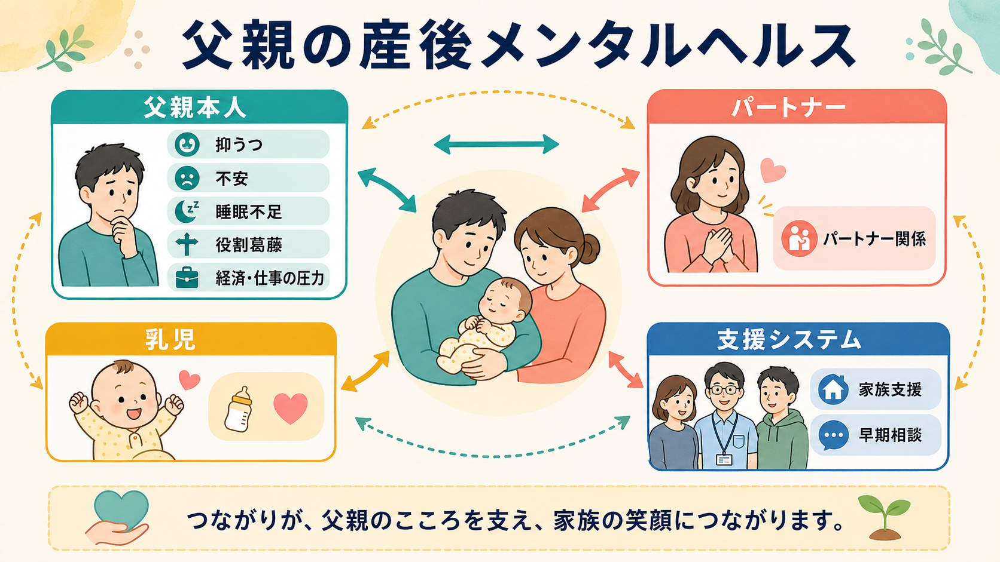
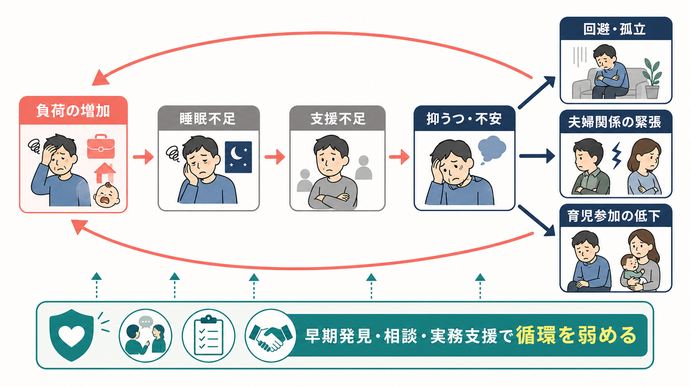
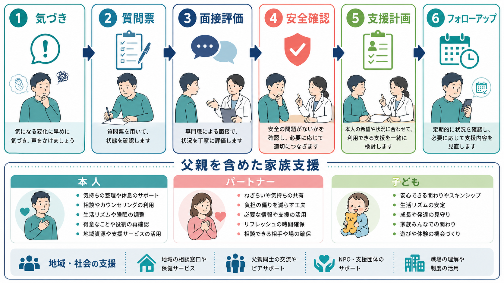

# 父親の産後メンタルヘルスとは何か

## 要点

- 父親にも、妊娠期から産後1年ごろにかけて[[うつ病とは何か|抑うつ]]、[[不安症群とは何か|不安]]、睡眠不足、易怒性、回避、役割葛藤が生じうる。
- 父親の産後メンタルヘルスは「本人だけの弱さ」ではなく、睡眠、仕事、経済不安、育児経験の少なさ、パートナー関係、支援資源の不足が重なって起こる家族システム上の問題である。
- メタ解析では、父親の周産期抑うつは無視できない頻度でみられ、母親の抑うつとも関連する[1][2]。
- 父親の不調は、パートナーの負担、育児参加、親子関係、子どもの発達にも波及しうるが、これは父親を責める根拠ではなく、早期発見と家族支援の必要性を示す根拠である[5][6]。

## この記事で答える問い

- 父親の産後メンタルヘルスとは何を指すのか。
- 抑うつ・不安・役割葛藤は、どのような経路で生じやすいのか。
- 家族支援や臨床・研究では、父親をどのように位置づけるべきか。

## まず結論

父親の産後メンタルヘルスとは、子どもの誕生前後に生じる父親の心理的・社会的適応を扱う概念である。中心には抑うつと不安があるが、それだけでは不十分である。父親では、悲しさよりも怒りっぽさ、無力感、仕事への過剰な没入、飲酒や回避、相談しにくさ、パートナーとの衝突として見えることがある。

したがって支援の焦点は、「父親もスクリーニングする」だけではない。睡眠、育児タスク、経済不安、職場復帰・育休、夫婦間の情報共有、親族・地域資源を含めて、家族全体の負荷を下げることが重要になる。周産期メンタルヘルスの診療ガイドラインは妊産婦を主対象にしていることが多いが、実践上はパートナーを含む支援設計が不可欠である[6][7]。

## 背景

産後のメンタルヘルスは、長く母親の[[うつ病とは何か|産後うつ]]を中心に語られてきた。これは妊娠・出産に伴う身体変化、授乳、産科的リスク、母子保健制度の対象を考えれば当然の側面がある。一方で、子どもの誕生は父親にとっても生活史上の大きな移行であり、睡眠、仕事、家計、夫婦関係、自己像を同時に変える。

JAMAのメタ解析は、妊娠期から産後にかけて父親の抑うつが一定の頻度でみられ、母親の抑うつと中等度に関連することを示した[1]。その後の更新メタ解析でも、父親の抑うつは周産期の公衆衛生上の課題として扱うべきだと整理されている[2]。不安についても、父親の周産期不安は珍しいものではなく、妊娠期から産後にかけて比較的持続しうる[3]。

日本の研究でも、産後4か月の父親でEPDS高値が13.6%にみられ、パートナーの抑うつ、低い夫婦関係満足度、経済不安、過去のメンタルヘルス受診歴などと関連した[4]。これは、父親の不調を個人内の症状だけでなく、関係性と生活条件の中で読む必要があることを示している。

## 基本概念

父親の産後メンタルヘルスは、狭義には父親の周産期抑うつ・不安を指す。広義には、父親が「親になる移行」をどのように経験し、家族内で役割を再編成し、子ども・パートナー・仕事・社会資源と関わるかを含む。

代表的な問題は次のように整理できる。

| 領域 | 典型的な現れ | 注意点 |
|---|---|---|
| 抑うつ | 気分の落ち込み、興味の低下、疲労感、自責感 | 男性では悲哀より易怒性・回避・飲酒として見えることがある |
| 不安 | 子どもの健康、家計、仕事、育児能力への過剰な心配 | [[不眠障害とは何か|不眠]]や身体症状と絡みやすい |
| 役割葛藤 | 「稼ぐ」「支える」「育児する」の同時要求 | 職場文化や育休取得の難しさが影響する |
| 関係性の緊張 | パートナーとの衝突、孤立、相談しにくさ | 母親の不調と父親の不調は相互に関連しうる |
| 親子関係 | 育児参加の低下、距離感、愛着形成の難しさ | 罪責ではなく支援ニーズとして扱う |

ここで重要なのは、父親の産後メンタルヘルスを「母親のケアを支えるための道具」としてだけ扱わないことである。父親自身も支援対象であり、同時にパートナーと子どもに影響を与える家族システムの一部である。

## 仕組み

父親の不調は、単一の原因で説明しにくい。典型的には、負荷の増加、回復時間の減少、支援不足、相談しにくさが重なり、抑うつ・不安・回避が強まる。

### 1. 睡眠不足と慢性疲労

産後は夜間対応、生活リズムの乱れ、仕事との両立により、睡眠と回復時間が削られる。睡眠不足は気分調整、注意、衝動制御を弱め、[[不安症群とは何か|不安]]や[[うつ病とは何か|抑うつ]]の閾値を下げる。

### 2. 役割の増加と承認の少なさ

父親は「働く」「家計を支える」「パートナーを支える」「育児をする」という複数の期待を同時に担うことがある。にもかかわらず、医療・保健の場では母子が中心になり、父親は付き添い・補助者として扱われやすい。支援対象として認識されにくいことは、相談の遅れにつながる。

### 3. パートナー関係との相互作用

父親の抑うつは、パートナーの抑うつや夫婦関係満足度と関連する[1][4]。これは「どちらが原因か」を単純に決める話ではなく、睡眠不足、育児負担、感情的余裕の低下、コミュニケーション不足が相互に増幅しうるという意味で理解するとよい。

### 4. 子どもへの波及

父親の周産期の心理的苦痛は、子どもの社会情緒、認知、言語などの発達指標と小さいが一貫した関連をもつことが、近年のメタ解析で示されている[5]。ただし、これは決定論ではない。子どもの発達は多因子であり、支援、治療、生活調整、もう一方の養育者や周囲の大人による緩衝が働く。

## 図解

父親の産後メンタルヘルスを支援する実践では、症状の有無だけでなく、安全性、生活負荷、家族関係、地域資源を順に確認する。

実務上の見取り図は次のようになる。

| 観点 | 確認すること | 支援の方向 |
|---|---|---|
| 症状 | 抑うつ、不安、易怒性、睡眠、希死念慮 | 質問票と面接を組み合わせる |
| 安全性 | 自傷他害、DV、虐待リスク、精神病症状 | 緊急性があれば速やかに専門支援へつなぐ |
| 生活負荷 | 夜間対応、仕事、家計、休息、孤立 | タスク分担と休息確保を具体化する |
| 関係性 | パートナーとの衝突、相談しにくさ | 夫婦を責めず、情報共有と支援導入を助ける |
| 資源 | 親族、保健師、産後ケア、職場制度、地域支援 | 家族が使える支援を可視化する |

## 臨床・研究との接続

父親の産後メンタルヘルスを臨床で扱う場合、第一に、父親本人の苦痛を過小評価しないことが必要である。産後の父親が「自分がつらいと言ってはいけない」と感じると、相談は遅れ、怒り、回避、飲酒、過労、[[バーンアウトとは何か|バーンアウト]]に近い形で表面化しやすい。

第二に、スクリーニングは単独では支援にならない。ACOGは周産期の抑うつ・不安について、標準化された質問票によるスクリーニング、重症度評価、安全確認、フォローアップ体制を推奨し、治療・支援では重症度、本人の希望、安全性、心理社会的資源を踏まえた管理を重視している[7][8]。AAPも小児医療の場で、保護者の抑うつを乳児の環境リスクとして扱い、家族支援と地域資源につなぐ重要性を強調している[6]。父親に適用する場合も、陽性結果を返すだけで終わらせず、評価と支援への導線を整える必要がある。

第三に、研究では「父親の症状」と「父親の機能」を分けて測る必要がある。症状尺度だけでは、育児参加、親子相互作用、パートナー関係、職場制度、育休取得、社会的支援が見えにくい。日本の研究では、父親の産後抑うつと夫婦関係満足度・経済不安が関連しており、個人心理と生活条件を同時に扱う設計が重要である[4]。

## よくある誤解

### 「産後うつは母親だけの問題である」

母親の産後メンタルヘルスは中心的課題だが、父親にも周産期の抑うつ・不安は生じる。父親を含めることは、母親支援を薄めることではなく、家族全体の支援可能性を広げることである。

### 「父親が不調だと子どもに必ず悪影響が出る」

父親の心理的苦痛と子どもの発達には関連があるが、効果は多因子的であり、決定論ではない[5]。重要なのは、リスクを責める材料にせず、早期支援の理由として使うことである。

### 「質問票で高得点なら診断できる」

EPDS、PHQ-9、GAD-7などの質問票は入口であり、診断そのものではない。睡眠不足、身体疾患、物質使用、双極性障害、希死念慮、家庭内暴力、虐待リスクなどを面接で確認する必要がある[7]。

### 「父親は支援を求めないから対象にしにくい」

支援を求めにくいこと自体が支援設計上の課題である。父親が来る場、たとえば妊婦健診の同席、乳幼児健診、小児科受診、産後ケア、職場の育休面談などで、短い情報提供と相談導線を用意する意義がある。

## 関連ノート

- [[うつ病とは何か]]
- [[不安症群とは何か]]
- [[不眠障害とは何か]]
- [[バーンアウトとは何か]]
- [[児童青年期うつ病とは何か]]
- [[PTSDとは何か]]

### 関連ノート候補

- 周産期メンタルヘルスとは何か
- 産後うつとは何か
- 乳幼児期の親子関係とメンタルヘルス
- 育児ストレスと家族システム
- 父親の育休とメンタルヘルス

### MOC更新候補

- `content/00_MOC/` 配下の精神医学、発達・ライフスパン、家族支援に関するMOCへ追加候補。
- 並列ジョブとの競合を避けるため、本記事ではMOCファイルは更新しない。

## 理解チェック

1. 父親の産後メンタルヘルスを、抑うつだけでなく不安・役割葛藤・家族関係として捉える理由は何か。
2. 父親の不調が「本人の弱さ」ではなく、生活負荷と支援不足の問題として理解できる根拠は何か。
3. スクリーニングを実施するとき、質問票の後に確認すべきことは何か。
4. 父親のメンタルヘルス支援が、母親と子どもの支援にもつながるのはなぜか。

## 参考文献

[1] Paulson, J. F., & Bazemore, S. D. (2010). Prenatal and postpartum depression in fathers and its association with maternal depression: A meta-analysis. *JAMA, 303*(19), 1961-1969. https://doi.org/10.1001/jama.2010.605

[2] Cameron, E. E., Sedov, I. D., & Tomfohr-Madsen, L. M. (2016). Prevalence of paternal depression in pregnancy and the postpartum: An updated meta-analysis. *Journal of Affective Disorders, 206*, 189-203. https://doi.org/10.1016/j.jad.2016.07.044

[3] Leach, L. S., Poyser, C., Cooklin, A. R., & Giallo, R. (2016). Prevalence and course of anxiety disorders and symptom levels in men across the perinatal period: A systematic review. *Journal of Affective Disorders, 190*, 675-686. https://doi.org/10.1016/j.jad.2015.09.063

[4] Nishimura, A., Fujita, Y., Katsuta, M., Ishihara, A., & Ohashi, K. (2015). Paternal postnatal depression in Japan: An investigation of correlated factors including relationship with a partner. *BMC Pregnancy and Childbirth, 15*, 128. https://doi.org/10.1186/s12884-015-0552-x

[5] Le Bas, G., Aarsman, S. R., Rogers, A., Macdonald, J. A., Misuraca, G., Khor, S., et al. (2025). Paternal perinatal depression, anxiety, and stress and child development: A systematic review and meta-analysis. *JAMA Pediatrics, 179*(8), 903-917. https://doi.org/10.1001/jamapediatrics.2025.0880

[6] Earls, M. F., Yogman, M. W., Mattson, G., Rafferty, J., & Committee on Psychosocial Aspects of Child and Family Health. (2019). Incorporating recognition and management of perinatal depression into pediatric practice. *Pediatrics, 143*(1), e20183259. https://doi.org/10.1542/peds.2018-3259

[7] American College of Obstetricians and Gynecologists. (2023). Screening and diagnosis of mental health conditions during pregnancy and postpartum: ACOG Clinical Practice Guideline No. 4. *Obstetrics & Gynecology, 141*(6), 1232-1261. https://doi.org/10.1097/AOG.0000000000005200

[8] American College of Obstetricians and Gynecologists. (2023). Treatment and management of mental health conditions during pregnancy and postpartum: ACOG Clinical Practice Guideline No. 5. *Obstetrics & Gynecology, 141*(6), 1262-1288. https://doi.org/10.1097/AOG.0000000000005202
