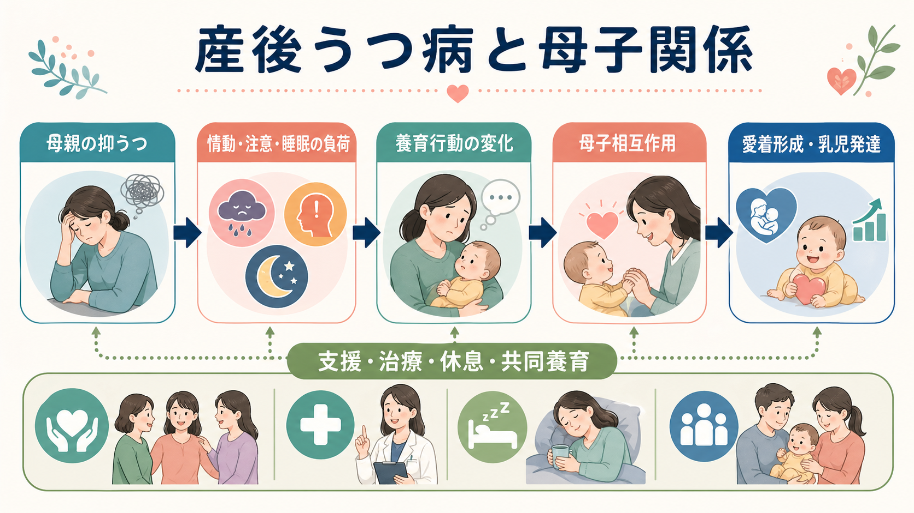
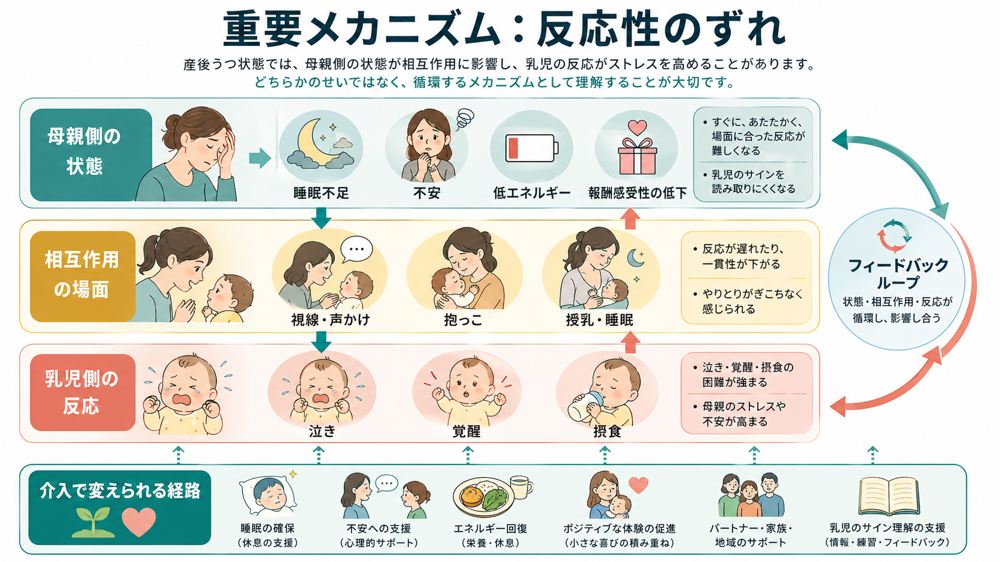
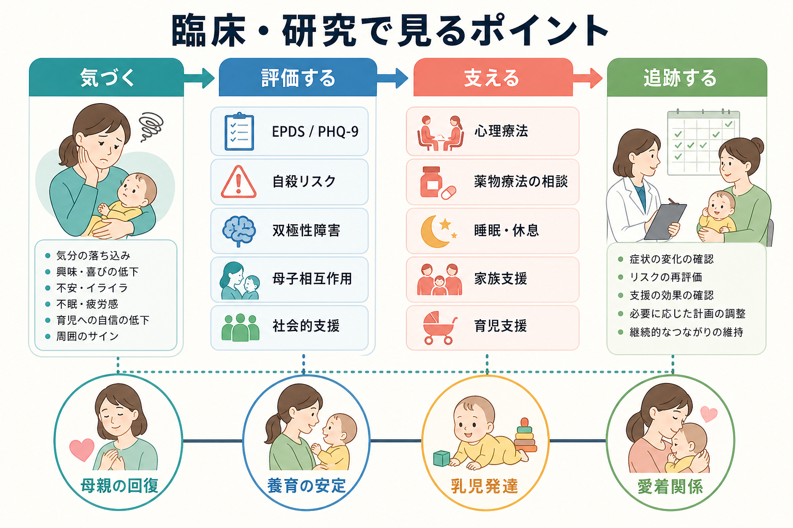

# 産後うつ病は母子関係にどう影響するのか

## 要点

- [[産後うつ病とは何か|産後うつ病]]は、母親の気分だけでなく、睡眠、注意、報酬感受性、乳児のサインの読み取り、養育行動、家族関係に影響しうる。
- 影響の中心は「母親が赤ちゃんを大切に思っていない」ということではなく、抑うつ・不安・疲労によって、温かく、すばやく、状況に合った反応を続ける余力が削られることである[3][4]。
- 観察研究とメタ解析では、産後うつ病は母子相互作用の質、乳児の反応性、愛着の安定性、後の情緒・行動問題と関連する。ただし、影響は決定論ではなく、症状の重さ、持続期間、社会的支援、パートナー支援、治療アクセスで変わる[3][5][6][7]。
- 支援の焦点は、母親を責めることではなく、母親の治療、睡眠と休息、育児支援、家族支援、母子相互作用への介入を組み合わせて、変えられる経路を増やすことである[1][2][8]。

## この記事で答える問い

1. 産後うつ病は、[[乳幼児期の愛着は精神健康にどう関わるのか|愛着形成]]や母子相互作用にどのように関わるのか。
2. 抑うつが養育行動や乳児発達へ影響するメカニズムは何か。
3. 臨床・研究では、母親、乳児、母子関係のどこを評価し、どのように支援へつなげるのか。

## まず結論

産後うつ病は、母親の「愛情の欠如」ではなく、気分、身体、睡眠、注意、対人反応を同時に揺さぶる状態である。赤ちゃんの泣き声、授乳、夜間覚醒、視線、表情といったサインを読み取り、落ち着いて応答するには、相当な認知的・情動的資源が必要になる。抑うつがあると、この資源が減り、反応が遅れる、声かけが単調になる、赤ちゃんのサインを否定的に解釈しやすくなる、過度に不安になって統制的になる、あるいは距離を置くといった形で母子相互作用に表れうる[4][5]。

その結果、乳児側も視線をそらす、泣きが増える、覚醒や睡眠が不安定になる、やりとりへの参加が弱まることがある。これは一方向の因果というより、母親の状態、乳児の反応、家族・社会的支援が循環する「相互作用の問題」として理解した方がよい[3][4]。

## 背景

周産期のメンタルヘルス問題は、妊娠中から産後1年程度までの連続した問題として扱われることが多い。ACOGは、妊娠・産後の抑うつ、不安、双極性障害、自殺リスク、産後精神病を、標準化された尺度と臨床評価を組み合わせて確認することを推奨している[1]。小児科領域でも、AAPは乳児健診を、母親の抑うつと母子関係を見つけ、支援につなぐ重要な接点として位置づけている[2]。

ここで重要なのは、産後うつ病を「母親だけの疾患」として閉じないことである。母親本人の苦痛を軽減することは第一に重要だが、同時に、[[乳幼児精神医学とは何か|乳幼児精神医学]]の視点では、乳児の発達、養育環境、親子関係、社会的支援を一つのシステムとして見る必要がある。

## 基本概念

### 母子相互作用

母子相互作用とは、視線、表情、声、抱き方、授乳、寝かしつけ、泣きへの応答などを通じて、母親と乳児が互いの状態を調整していく過程である。乳児はまだ自分だけで覚醒や不快感を調整できないため、養育者の反応が「外側からの調整」として働く。

産後うつ病では、この調整が弱まることがある。たとえば、母親が赤ちゃんのサインに気づきにくくなる、反応のタイミングが合いにくくなる、声や表情の変化が乏しくなる、逆に不安から過度に介入する、といった変化である[4][5]。

### 愛着形成

[[乳幼児期の愛着は精神健康にどう関わるのか|愛着]]は、乳児が不安や苦痛を感じたときに、特定の養育者へ近づき、安心を回復し、再び探索へ戻るための関係システムである。早期の母親の抑うつは、安定した愛着の可能性を下げ、不安定・無秩序型愛着のリスクを高めることがメタ解析で示されている。ただし、研究間のばらつきはあり、抑うつだけで愛着が決まるわけではない[6]。

### 乳児発達

乳児発達への影響は、言語、認知、情緒、行動、睡眠、摂食など複数の領域に及びうる。Lancetのレビューは、周産期メンタルヘルス問題と子どもの心理・発達上の困難の関連を整理し、親の疾患そのものだけでなく、養育の質、社会的支援、症状の持続期間などの媒介・調整要因が重要だと述べている[3]。

## 仕組み

### 1. 抑うつが反応性を下げる

抑うつでは、興味・喜びの低下、疲労感、集中困難、自己評価の低下、不安、睡眠障害が起こりやすい。赤ちゃんの小さな表情や身体の動きを読み取り、状況に合った反応を返すには、注意の柔軟性と情動調整が必要である。抑うつが強いと、この柔軟性が低下し、母親は「何をしても泣き止まない」「自分はうまくできない」と感じやすくなる。

### 2. 乳児側の反応が母親の負担をさらに増やす

乳児は、養育者の表情、声、身体接触、リズムに敏感である。やりとりがかみ合いにくいと、乳児側の泣き、覚醒、摂食困難、睡眠の不安定さが増えることがある。すると母親の疲労と不安がさらに増し、次のやりとりがいっそう難しくなる。重要なのは、この循環は「どちらかのせい」ではなく、複数の負荷が重なった相互作用として見る点である[3][4]。

### 3. 生活リズムと安全行動にも波及する

Fieldのレビューでは、産後うつ病は早期相互作用だけでなく、授乳、睡眠ルーティン、乳児健診、予防接種、安全行動にも影響しうると整理されている[4]。これは母親の意欲や責任感の問題というより、睡眠不足、疲労、自己効力感の低下、支援不足が、日々の細かな育児行動を難しくするためである。

### 4. 慢性化・重症化すると発達リスクが高まりやすい

母親の抑うつと子どもの内在化・外在化問題の関連は、多数の研究を統合したメタ解析で確認されている。ただし効果は一様ではなく、症状の慢性化、重症度、家族葛藤、貧困、養育者の支援、乳児の気質などで変わる[7]。したがって、研究・臨床では「産後うつ病があるか」だけでなく、「どのくらい続いているか」「誰が支えているか」「母子相互作用がどこで詰まっているか」を見る必要がある。

## 図解

| 図 | 見るポイント | 本文での位置づけ |
|---|---|---|
| 図1 | 抑うつ、養育行動、母子相互作用、愛着・乳児発達、支援要因の全体像 | 産後うつ病を母子関係のシステムとして見る |
| 図2 | 睡眠不足、不安、低エネルギー、報酬感受性低下が反応性のずれへつながる流れ | 最も重要なメカニズム |
| 図3 | スクリーニング、評価、支援、追跡の臨床・研究上の接点 | 支援へつなぐ実践的視点 |

## 臨床・研究との接続

臨床では、母親の抑うつ症状だけでなく、自殺リスク、双極性障害、産後精神病、強迫的な侵入思考、DV、物質使用、睡眠、身体疾患、家族・地域支援を確認する必要がある[1]。母子関係の評価では、授乳や寝かしつけができているかだけでなく、赤ちゃんのサインへの気づき、反応のタイミング、母親の自己評価、赤ちゃんとの時間をどう感じているかを見る。

小児科や乳幼児健診では、乳児を診る場面が、母親の抑うつや親子関係の負荷を見つける機会になる。AAPは、乳児健診での産後うつ病スクリーニング、紹介、母子関係支援、授乳支援、地域資源との連携を推奨している[2]。これは、母親を「小児科の患者」として治療するという意味ではなく、乳児の健康が母子関係と切り離せないためである。

介入研究では、母親個人への心理療法や薬物療法だけでなく、母子相互作用に焦点を当てた心理療法も検討されている。母子心理療法のメタ解析では、短期的な抑うつ症状の改善は示された一方で、長期的な母子相互作用や愛着への効果は一貫せず、介入の種類、強度、対象者の違いを考慮する必要がある[8]。つまり、母親の治療と母子関係支援は対立するものではなく、状況に応じて組み合わせるべき支援である。

## よくある誤解

### 誤解1: 産後うつ病がある母親は、赤ちゃんを愛していない

これは誤りである。多くの場合、母親は赤ちゃんを大切に思っていても、抑うつ、不安、疲労、睡眠不足によって、愛情を感じる余裕や表現する力が低下している。問題は愛情の有無ではなく、愛情を行動に変換するための心身の余力が削られていることである。

### 誤解2: 母子関係への影響は取り返しがつかない

これも誤りである。早期の母子相互作用は重要だが、発達は可塑的であり、支援によって変化しうる。症状の治療、睡眠確保、家族支援、育児支援、母子相互作用への介入は、リスク経路を弱め、保護因子を増やす可能性がある[3][8]。

### 誤解3: 赤ちゃんの発達リスクは母親の責任である

個人責任として読むべきではない。産後うつ病は、妊娠・出産後の身体変化、睡眠分断、社会的孤立、経済的負担、パートナー関係、既往歴、地域資源へのアクセスなどが重なって生じる。したがって、支援の対象は母親個人だけでなく、家族、医療、保健、福祉、地域を含む環境である。

## 関連ノート

- [[産後うつ病とは何か]]
- [[乳幼児期の愛着は精神健康にどう関わるのか]]
- [[乳幼児精神医学とは何か]]
- [[うつ病とは何か]]
- [[子どものアセスメントでは何を確認するのか]]
- [[HPA軸は精神疾患にどう関わるのか]]

### 関連ノート候補

- 周産期メンタルヘルスとは何か
- EPDSとは何か
- 母子相互作用とは何か
- 親子心理療法とは何か
- 乳児の睡眠とメンタルヘルス

### MOC更新候補

- `content/00_MOC/MOC・精神医学.md`
- `content/00_MOC/MOC・発達・愛着・社会心理.md`
- `content/00_MOC/MOC・臨床実践・治療.md`

## 理解チェック

1. 産後うつ病が母子関係に影響するとき、「愛情不足」と説明すると何を見落とすか。
2. 母親の抑うつと乳児の反応は、どのようにフィードバックループを作るか。
3. 愛着形成への影響が「決定論ではない」と言える理由は何か。
4. 臨床で、母親の症状だけでなく母子相互作用や社会的支援を見る必要があるのはなぜか。

## 参考文献

[1] American College of Obstetricians and Gynecologists. (2023). *Screening and Diagnosis of Mental Health Conditions During Pregnancy and Postpartum: ACOG Clinical Practice Guideline No. 4*. https://www.acog.org/clinical/clinical-guidance/clinical-practice-guideline/articles/2023/06/screening-and-diagnosis-of-mental-health-conditions-during-pregnancy-and-postpartum

[2] Earls, M. F., Yogman, M. W., Mattson, G., Rafferty, J., & Committee on Psychosocial Aspects of Child and Family Health. (2019). Incorporating recognition and management of perinatal depression into pediatric practice. *Pediatrics, 143*(1), e20183259. https://doi.org/10.1542/peds.2018-3259

[3] Stein, A., Pearson, R. M., Goodman, S. H., Rapa, E., Rahman, A., McCallum, M., Howard, L. M., & Pariante, C. M. (2014). Effects of perinatal mental disorders on the fetus and child. *The Lancet, 384*(9956), 1800-1819. https://doi.org/10.1016/S0140-6736(14)61277-0

[4] Field, T. (2010). Postpartum depression effects on early interactions, parenting, and safety practices: A review. *Infant Behavior and Development, 33*(1), 1-6. https://doi.org/10.1016/j.infbeh.2009.10.005

[5] Beck, C. T. (1995). The effects of postpartum depression on maternal-infant interaction: A meta-analysis. *Nursing Research, 44*(5), 298-304. https://pubmed.ncbi.nlm.nih.gov/7567486/

[6] Martins, C., & Gaffan, E. A. (2000). Effects of early maternal depression on patterns of infant-mother attachment: A meta-analytic investigation. *Journal of Child Psychology and Psychiatry, 41*(6), 737-746. https://doi.org/10.1111/1469-7610.00661

[7] Goodman, S. H., Rouse, M. H., Connell, A. M., Broth, M. R., Hall, C. M., & Heyward, D. (2011). Maternal depression and child psychopathology: A meta-analytic review. *Clinical Child and Family Psychology Review, 14*(1), 1-27. https://doi.org/10.1007/s10567-010-0080-1

[8] Huang, R., Yang, D., Lei, B., Yan, C., Tian, Y., Huang, X., & Lei, J. (2020). The short- and long-term effectiveness of mother-infant psychotherapy on postpartum depression: A systematic review and meta-analysis. *Journal of Affective Disorders, 260*, 670-679. https://doi.org/10.1016/j.jad.2019.09.056

## 未解決問題

- 母親の症状改善、母子相互作用、乳児の長期発達のどれを主要アウトカムに置くかで、介入研究の結論がどのように変わるか。
- 父親・パートナー、祖父母、保育、地域資源が、産後うつ病と乳児発達の関連をどの程度緩衝するか。
- 日本の保健・産科・小児科・精神科・児童福祉の連携の中で、母子相互作用支援をどのように実装し、評価するか。
