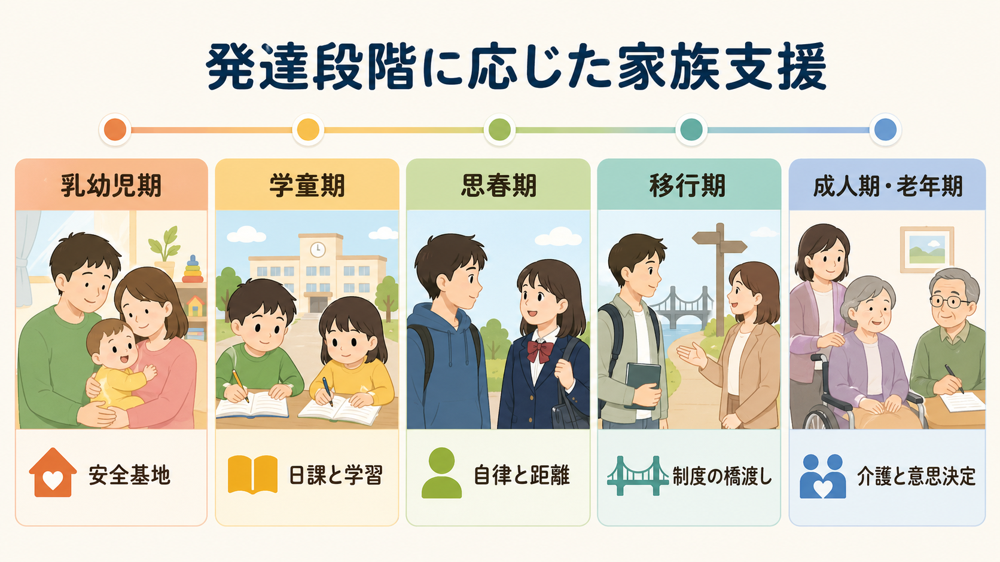
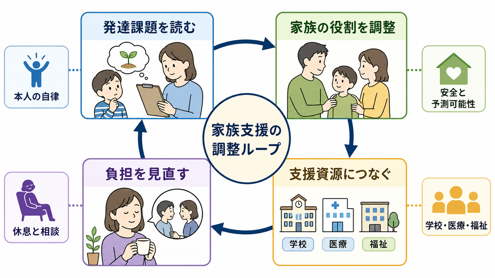
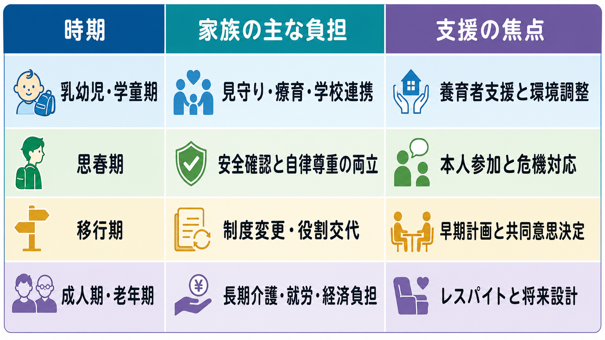

# 発達段階に応じた家族支援とは何か

## 要点

- 発達段階に応じた家族支援とは、家族を「治療の補助者」として一律に動員することではなく、本人の発達課題、家族の役割、制度資源、介護者負担を同時に見直す支援である。
- 乳幼児期・学童期では、家族は日課、安心、療育、学校連携の中心になりやすい。したがって支援者は、家族の努力を増やすだけでなく、家庭で再現しやすい方法と外部資源を整える必要がある[1][2]。
- 思春期では、安全確認と本人の自律尊重が衝突しやすい。家族支援は、秘密保持、危機対応、本人参加、親子間の距離の再調整を扱う。
- 移行期では、小児から成人、学校から就労、保護者主導から本人主導へ支援の重心が移る。移行は単発の紹介ではなく、事前計画と担当者間の橋渡しとして設計する[4]。
- 成人期・老年期では、家族は再発予防、意思決定、就労・経済、長期介護、将来設計に関与する。ここでは家族心理教育、レスパイト、介護者自身の評価が重要になる[5][7][8]。

## この記事で答える問い

1. 発達段階に応じた家族支援は、通常の家族説明や家族面接と何が違うのか。
2. 乳幼児期、学童期、思春期、移行期、成人期・老年期で、家族が担いやすい役割と負担はどう変わるのか。
3. 臨床では、本人の自律と家族の支援をどのように両立させるのか。

## まず結論

発達段階に応じた家族支援は、本人を取り巻く家族の関与を、年齢や診断名だけでなく「いま本人が獲得しようとしている発達課題」と「家族が実際に背負っている調整作業」から組み立てる考え方である。小さい子どもでは家族が環境調整の主役になりやすいが、思春期以降は本人の意思、プライバシー、治療参加を尊重しながら、家族の不安や危機対応を支える必要がある。成人期・老年期では、家族は本人の生活を支える重要な資源である一方、過重な介護者負担や経済的負担を抱えることがあるため、家族自身も支援対象として評価する。

この視点は、[[ライフスパン精神医学とは何か]]、[[児童精神医学とは何か]]、[[思春期精神医学とは何か]]、[[老年精神医学とは何か]]を横断する。家族支援は「家族にもっと頑張ってもらう」ことではなく、本人・家族・学校・医療・福祉の役割を、発達段階に合わせて組み替える作業である。

## 背景

家族は、精神医学・発達支援・介護の多くの場面で最も身近な支援者である。しかし家族の役割は固定的ではない。乳幼児期には生活リズム、食事、睡眠、情緒的安心の調整が中心になる。学童期には学校との連絡、宿題、友人関係、療育や医療の予定管理が加わる。思春期には、本人の秘密保持や自律を尊重しながら、自傷、希死念慮、摂食、物質使用、ひきこもりなどのリスクにどう関わるかが問題になる。成人期以降は、本人の生活設計、就労、服薬、再発予防、家計、介護、相続や成年後見などの長期的課題が前景化する。

小児医療では、patient- and family-centered care coordination が、医療、教育、福祉、地域資源を横断して子どもと家族を支える枠組みとして提案されている[1]。発達の遅れや障害のある子どもに対しては、WHO の caregiver skills training のように、介護者が家庭内で使える関わり方を学び、子どもの活動参加、コミュニケーション、日常生活技能を支えるアプローチが整備されている[2]。一方で、家族中心ケアの系統的レビューは、家族との協働がアクセス、満足度、コミュニケーション、家族機能などと関連する一方、移行期や費用に関するエビデンスはまだ十分でないことも示している[3]。

## 基本概念

### 家族を「資源」と「支援対象」の両方として見る

家族は本人を支える資源である。同時に、家族自身も疲労、不安、罪悪感、孤立、経済的負担、きょうだいへの影響を抱える。[[介護者負担は精神健康にどう影響するのか]]や[[精神疾患と家族負担はどう関係するのか]]で扱うように、家族の負担を放置すると、本人の支援継続にも家族の健康にも影響する。したがって家族支援では、「家族に何を依頼するか」と同じくらい、「家族から何を減らすか」を考える。

### 発達課題に合わせて家族の距離を変える

発達段階は、単なる年齢区分ではない。[[発達段階理論とは何か]]が示すように、各時期には、安心、探索、学習、同年代関係、アイデンティティ、自律、親密性、仕事、介護、喪失への適応などの課題がある。家族支援は、この課題に合わせて距離を調整する。近すぎる関与が本人の自律を妨げることもあれば、早すぎる手放しが安全や継続支援を損なうこともある。

### 本人の同意と情報共有を明確にする

思春期以降では、家族への情報共有は自動的ではない。本人の同意、判断能力、リスク、法制度、家族の安全確保を踏まえ、何を誰と共有するかを明確にする。これは[[共同意思決定とは何か]]や[[家族への説明で何に注意するべきか]]と直結する。家族支援は、本人抜きで家族に指示を出すことではなく、本人の参加可能性を広げる設計である。

## 仕組み

発達段階に応じた家族支援は、次の 4 つのループとして整理できる。

1. 発達課題を読む。年齢、認知機能、言語能力、社会的理解、学校・仕事・家庭での役割を確認する。
2. 家族の役割を調整する。見守り、環境調整、予定管理、危機対応、意思決定支援、介護のどこを家族が担い、どこを外部化するかを決める。
3. 支援資源につなぐ。学校、園、医療、福祉、相談機関、訪問支援、ピアサポート、家族会、レスパイトを組み合わせる。
4. 負担を見直す。家族の睡眠、仕事、経済、きょうだい、心理的疲労、孤立を定期的に評価する。

このループは、診断名を問わず使える。たとえば[[神経発達症とは何か]]に関連する支援では、家庭での構造化、感覚過敏への配慮、学校との情報共有が重要になる。統合失調症や双極性障害など成人期の重い精神疾患では、家族心理教育や再発サインの共有、危機時の連絡経路が重要になる。WHO は、精神病や双極症の維持期に、家族介入、家族心理教育、心理教育などの心理社会的介入を提供することを推奨している[5]。統合失調症の家族介入に関するネットワークメタ解析でも、多くの家族介入モデルが再発予防に有効で、特に家族心理教育が実装しやすい選択肢として示されている[6]。

## 図解

次の図は、発達段階ごとに家族の主な負担と支援の焦点を並べたものである。実際の支援では年齢だけでなく、本人の認知・言語・社会的理解、疾患の経過、家族構成、文化的背景、経済状況を合わせて調整する。

| 時期 | 家族が担いやすい役割 | 支援の焦点 |
|---|---|---|
| 乳幼児期 | 安心、日課、睡眠・食事、発達相談、療育参加 | 養育者を責めず、家庭で使える関わり方を小さく具体化する |
| 学童期 | 学校連携、宿題、友人関係、受診・療育の予定管理 | 家庭・学校・医療の情報共有を整え、本人の強みを見える化する |
| 思春期 | 危機の見守り、受診継続、親子間の距離調整 | 本人の自律と安全確認を両立させ、情報共有ルールを決める |
| 移行期 | 小児から成人、学校から就労、保護者主導から本人主導への移行 | 早期から移行計画を作り、担当者・制度・本人の役割を橋渡しする |
| 成人期 | 再発予防、生活支援、就労・経済、服薬・危機対応 | 家族心理教育、危機計画、家族自身の相談先を整える |
| 老年期 | 介護、認知機能低下、身体疾患、意思決定、将来設計 | 介護者負担を評価し、レスパイト、長期ケア、意思決定支援につなぐ |

## 臨床・研究との接続

### 乳幼児期・学童期

乳幼児期・学童期の支援では、家族が毎日の環境を調整できることが大きな意味をもつ。ただし、これは家族に専門職の役割を背負わせることではない。支援者は、観察の視点、声かけ、活動の区切り、予測可能な日課、肯定的な関わりを、家庭で実行可能な単位に落とし込む。WHO の caregiver skills training は、2-9 歳の発達の遅れや障害のある子どもの家族に対し、活動参加、コミュニケーション、肯定的行動、日常生活技能を促すための介護者向け技能を扱う[2]。

ここでは[[子どものアセスメントでは何を確認するのか]]や[[乳幼児期の愛着は精神健康にどう関わるのか]]と接続して、親子関係だけでなく、睡眠、食事、感覚特性、園・学校、きょうだい、親のメンタルヘルスを確認する。

### 思春期

思春期は、本人の自律が進む一方で、家族がリスク管理を手放しきれない時期である。家族支援では、親の過干渉を単純に批判するのではなく、不安の背景を確認しながら、本人と家族の間で「何を共有し、何を本人に任せ、何が起きたら家族に知らせるか」を具体化する。自傷、希死念慮、摂食、物質使用、暴力、ひきこもりがある場合は、秘密保持より安全確保が優先される場面もある。

この時期の支援は、[[児童青年期の自傷行為はどう理解するのか]]、[[思春期の自殺リスクはどう評価するのか]]、[[青年期のひきこもりはどう理解するのか]]と関連する。家族を排除するのではなく、本人の同意を得られる範囲を増やしながら、危機時の連絡先、受診基準、家庭内の安全確保を共有する。

### 移行期

移行期支援では、「紹介状を書いたら終わり」では不十分である。NICE の移行期ガイドラインは、子ども・若者が小児サービスから成人サービスへ移る前、移る最中、移った後を対象にし、若者と親・介護者がよりよい移行経験を得られるよう、計画的な移行、本人参加、支援担当者、移行前後の継続支援を重視している[4]。

精神科でも、成人診療への移行、大学・就労への移行、障害福祉制度への接続、家族による代理的管理から本人の自己管理への移行が重なる。ここでは、家族が急に後退するのではなく、本人が担える部分を増やし、家族が担い続ける部分を明示し、専門職が橋渡しする。

### 成人期・老年期

成人期の家族支援では、本人の権利と家族の支援ニーズを同時に扱う。NICE は精神病・統合失調症の支援で、本人が同意する場合には家族や介護者の関与が有用であり、家族・介護者には情報提供、危機時の支援、介護者自身のニーズ評価、教育と支援を提供することを勧めている[7]。これは[[家族面接では何を評価するべきか]]や[[精神科で多職種連携はなぜ重要なのか]]の実践課題でもある。

老年期では、家族介護は長期化しやすく、身体疾患、認知機能低下、服薬管理、転倒、財産管理、意思決定が重なる。National Academies の報告は、高齢者ケアにおいて家族介護者が長期サービス・支援の大きな部分を担い、医療・地域サービスへのアクセスにも中心的役割を果たす一方、介護者支援が見落とされやすい課題であることを指摘している[8]。したがって、老年期の家族支援では、本人の支援計画だけでなく、介護者の休息、相談、社会的支援、将来設計を含める。

## よくある誤解

### 「家族支援」とは家族に頑張ってもらうことではない

家族支援は、家族の責任を増やすことではない。むしろ、家族がすでに担っている見えにくい作業を言語化し、分担し直すことである。家族の努力だけで回っている支援は、本人にも家族にも脆い。

### 発達段階は年齢表ではない

同じ年齢でも、認知機能、経験、文化、学校・職場環境、疾患の経過によって必要な支援は異なる。発達段階は、年齢で機械的に分類するためではなく、本人がいまどの課題に向き合っているかを考えるための手がかりである。

### 家族を入れれば常に良いわけではない

家族関係に虐待、支配、暴力、強い対立がある場合、家族関与は慎重に扱う必要がある。本人の安全、意思、秘密保持、法的義務を確認し、必要に応じて家族から距離をとる支援も含める。[[虐待は発達と精神疾患にどう影響するのか]]や[[高齢者虐待は精神科でどう評価するのか]]と接続して考える。

## 関連ノート

- [[ライフスパン精神医学とは何か]]
- [[発達段階理論とは何か]]
- [[神経発達症とは何か]]
- [[児童精神医学とは何か]]
- [[思春期精神医学とは何か]]
- [[老年精神医学とは何か]]
- [[家族面接では何を評価するべきか]]
- [[家族への説明で何に注意するべきか]]
- [[共同意思決定とは何か]]
- [[介護者負担は精神健康にどう影響するのか]]
- [[精神疾患と家族負担はどう関係するのか]]
- [[ヤングケアラーの精神健康問題とは何か]]
- [[社会的支援は健康にどう影響するのか]]

## MOC更新候補

- `content/00_MOC/` 配下の精神医学、発達・ライフスパン、臨床実践、家族支援に関する MOC がある場合、本記事へのリンクを追加する候補になる。
- 並列生成ジョブとの競合を避けるため、本記事では MOC 本体は更新しない。

## 理解チェック

1. 乳幼児期・学童期の家族支援で、家族に「さらに努力を求める」前に確認すべきことは何か。
2. 思春期の支援で、本人の秘密保持と家族への情報共有を調整する際、どのような条件を明確にする必要があるか。
3. 移行期支援が単なる紹介状では不十分な理由は何か。
4. 成人期・老年期の家族支援で、本人だけでなく家族自身も評価対象にする理由は何か。

## 限界と未解決問題

- 家族中心ケアや家族心理教育のエビデンスは比較的蓄積しているが、文化、制度、家族構成、経済状況によって実装可能性は大きく変わる。
- 移行期支援では、ガイドラインはあるものの、精神科領域でどの移行モデルがどの集団に最も有効かは、まだ検討の余地がある。
- 家族支援の効果は、本人の症状だけでなく、家族の負担、社会参加、サービス利用、費用、きょうだいへの影響など複数のアウトカムで評価する必要がある。
- 本記事は教育・研究目的の概説であり、個別の診断や治療指示を行うものではない。

## 参考文献

[1] Council on Children With Disabilities and Medical Home Implementation Project Advisory Committee. (2014). Patient- and family-centered care coordination: A framework for integrating care for children and youth across multiple systems. *Pediatrics*, 133(5), e1451-e1460. https://doi.org/10.1542/peds.2014-0318

[2] World Health Organization. (2022). *Caregiver skills training for families of children with developmental delays or disabilities: Introduction*. https://www.who.int/publications/i/item/9789240048836

[3] Kuhlthau, K. A., Bloom, S., Van Cleave, J., Knapp, A. A., Romm, D., Klatka, K., Homer, C. J., Newacheck, P. W., & Perrin, J. M. (2011). Evidence for family-centered care for children with special health care needs: A systematic review. *Academic Pediatrics*, 11(2), 136-143.e8. https://doi.org/10.1016/j.acap.2010.12.014

[4] National Institute for Health and Care Excellence. (2016). *Transition from children's to adults' services for young people using health or social care services* (NICE guideline NG43). https://www.nice.org.uk/guidance/ng43

[5] World Health Organization. (2023). *Psychoeducation, family interventions and cognitive-behavioural therapy: Psychosis and bipolar disorders evidence centre*. https://www.who.int/teams/mental-health-and-substance-use/treatment-care/mental-health-gap-action-programme/evidence-centre/psychosis-and-bipolar-disorders/psychoeducation-family-interventions-and-cognitive-behavioural-therapy

[6] Rodolico, A., Bighelli, I., Avanzato, C., Concerto, C., Cutrufelli, P., Mineo, L., Schneider-Thoma, J., Siafis, S., Signorelli, M. S., Wu, H., Wang, D., Furukawa, T. A., Pitschel-Walz, G., Aguglia, E., & Leucht, S. (2022). Family interventions for relapse prevention in schizophrenia: A systematic review and network meta-analysis. *The Lancet Psychiatry*, 9(3), 211-221. https://doi.org/10.1016/S2215-0366(21)00437-5

[7] National Institute for Health and Care Excellence. (2014). *Psychosis and schizophrenia in adults: Prevention and management* (Clinical guideline CG178), families and carers. https://www.nice.org.uk/guidance/cg178

[8] National Academies of Sciences, Engineering, and Medicine. (2016). *Families Caring for an Aging America*. Washington, DC: The National Academies Press. https://doi.org/10.17226/23606
