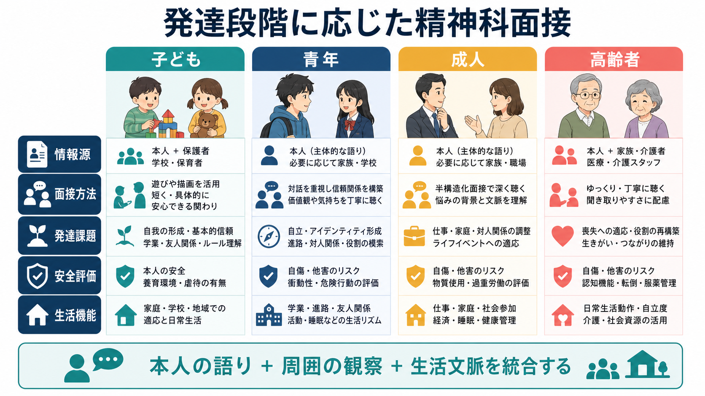
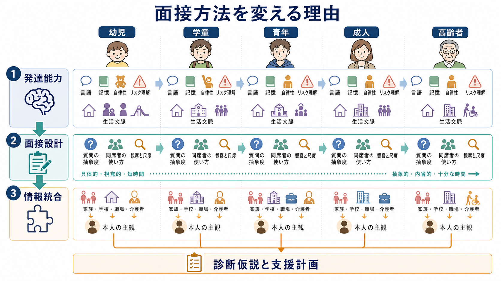
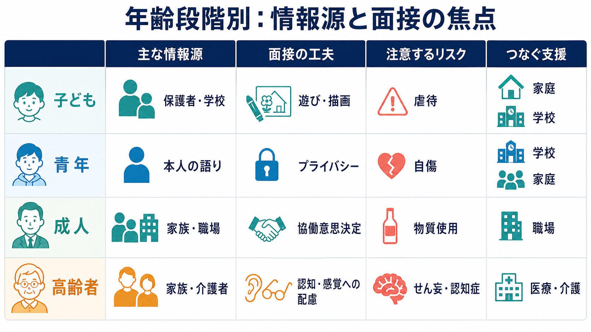

# 発達段階に応じた精神科面接とは何か

## 要点

- 発達段階に応じた精神科面接とは、同じ症状名を同じ質問で確認するのではなく、言語能力、記憶、抽象化、自律性、生活場面、同席者の役割に合わせて、面接の組み立てを変えることである。
- 子どもでは本人の言葉だけでなく、保護者、学校、遊びや観察から情報を統合する。子どもは家庭・学校・地域の文脈から切り離して評価できない[1][2]。
- 青年では本人の主観を中心にしつつ、プライバシー、同意、家族との情報共有、安全確保の境界を最初に説明する必要がある[5]。
- 成人では本人の語り、精神症状、物質使用、自殺・他害リスク、身体健康、文化的背景、治療意思決定を体系的に扱う[3][6]。
- 高齢者では認知機能、感覚機能、身体疾患、薬剤、せん妄・認知症、介護環境を評価し、可能な範囲で家族や介護者からの情報を加える[7]。
- 本記事は教育・研究目的の整理であり、個別の診断や治療指示ではない。

## この記事で答える問い

1. なぜ年齢や発達段階によって、精神科面接の方法を変える必要があるのか。
2. 子ども、青年、成人、高齢者では、誰からどのような情報を得るべきか。
3. 発達段階に応じた面接は、診断、支援計画、研究デザインにどう接続するのか。

## まず結論

発達段階に応じた精神科面接の中心は、「本人の語りを尊重しながら、その語りだけに閉じない」ことである。幼い子どもでは言語化できる範囲が限られ、青年では語れるが家族や学校に知られたくない内容が増え、成人では生活上の役割や治療選択が前景化し、高齢者では認知・感覚・身体疾患・介護環境が面接そのものに影響する。

したがって、[[精神科面接とは何か]]をライフスパンに沿って行うには、質問文を年齢相応に変えるだけでは不十分である。必要なのは、発達能力、生活場面、情報源、同席者、秘密保持、安全評価、支援資源を同時に設計することである。

## 背景

精神科面接はしばしば「本人に症状を尋ねる場」と考えられる。しかし、精神症状は本人の内面だけで完結しない。行動、学業、就労、家族関係、睡眠、食事、介護、身体疾患、文化的期待の中で現れる。AACAP の児童青年期精神科評価パラメータは、子ども・青年の評価を、発達的視点に立つ診断・治療計画の過程として位置づけ、親面接、本人面接、必要な探索領域、尺度の使用を一連の評価に含めている[1]。

WHO の mhGAP-IG でも、子ども・青年の精神・行動上の問題は、本人、養育者、教師、地域・社会サービスの懸念として現れることが整理されている。たとえば、同じ「学校に行けない」という訴えでも、不安、いじめ、学習困難、家庭内葛藤、睡眠問題、発達特性、身体疾患によって面接で確認すべき情報源は変わる[2]。

成人では、本人の同意と自己決定を前提に、精神症状、治療歴、トラウマ、物質使用、自殺・他害リスク、身体健康、文化的背景、定量的評価、治療意思決定を体系的に扱うことが重視される[3]。高齢者では、本人の主観を尊重しながらも、認知機能低下やせん妄、感覚障害、薬剤性の影響、日常生活機能の変化を見落とさないために、よく知る家族や介護者からの情報が重要になる[7]。

DSM-5 の文化的定式化面接の補助モジュールも、学齢期・青年期、高齢者、介護者など、同じ面接枠組みを年齢と役割に応じて調整する考え方を示している[4]。また、成人の初回精神科評価でも、本人が十分な病歴を語れない場合や臨床的に有用な場合には、家族・介護者などの補足情報を求めることが推奨される[8]。

## 基本概念

### 発達段階

ここでいう発達段階は、単なる年齢区分ではない。言語で説明できる力、時間を順序立てて思い出す力、他者の視点を想像する力、危険を予測する力、秘密保持を理解する力、生活上の責任を引き受ける力が、どの程度発達しているかを含む。[[ライフスパン精神医学とは何か]]で扱うように、精神科評価は「ある時点の症状」だけでなく、発達と生活文脈の中で症状を読む作業である。

### 情報源

情報源とは、本人、保護者、家族、学校、職場、介護者、医療・福祉スタッフ、診療録、尺度、観察などである。発達段階に応じた面接では、情報源を増やすこと自体が目的ではない。本人の主観、周囲の観察、生活機能への影響がどこで一致し、どこで食い違うかを見ることが目的である。

### 同席者と秘密保持

同席者は、面接を助けることも、本人の語りを制限することもある。子どもでは保護者の同席が安心と情報の源になる一方、虐待、いじめ、家族葛藤、自傷、性、物質使用では本人だけの時間が必要になる。青年では、秘密保持の範囲と例外を最初に説明し、本人が安心して話せる場を作ることが、アクセスと率直な情報共有を支える[5]。

### 発達的妥当性

発達的妥当性とは、質問、説明、尺度、観察、同意の取り方が、その人の発達能力と生活文脈に合っていることである。抽象的な質問が難しい子どもには、最近の出来事、遊び、絵、具体例を使う。認知機能が低下した高齢者には、短い質問、聞こえやすさ、眼鏡・補聴器、疲労への配慮、家族からの補足を組み合わせる。

## 仕組み

発達段階に応じて面接が変わる仕組みは、次の三層で理解できる。

第一に、発達能力が質問の形式を決める。幼い子どもでは「いつから、どれくらい、なぜ」という抽象的な質問より、「学校に行く前の朝は何が起きるか」「眠る前に怖いことを考えるか」のような具体的質問が適している。青年では価値観、所属、将来、親密な関係、自己像を扱えるが、恥や秘密保持への感度も高い。成人では役割、責任、治療選択、仕事・家庭との両立が中心になる。高齢者では記憶、注意、聴覚、身体症状、服薬、介護負担が面接の質を左右する。

第二に、生活文脈が情報源を決める。子どもは家庭と学校で行動が大きく変わるため、[[子どものアセスメントでは何を確認するのか]]で扱うように、保護者・教師・本人の情報を統合する必要がある[1][2]。青年では本人の語りを中心にしながら、本人の同意と安全上の必要性に応じて家族・学校と連携する。成人では本人の同意のもとで家族や職場情報を補助的に使う。高齢者では、日常生活機能や認知変化について、本人をよく知る人からの情報が診断仮説の精度を高める[7]。

第三に、安全評価が面接構造を決める。自傷、他害、虐待、ネグレクト、家庭内暴力、物質使用、せん妄、認知症、転倒、服薬ミスなどは、発達段階ごとに現れ方が異なる。安全確保が必要な場合、秘密保持には例外があることを、脅しではなく臨床上の約束として説明する。

## 図解

| 年齢段階 | 主な情報源 | 面接の工夫 | 注意するリスク | 支援への接続 |
|---|---|---|---|---|
| 子ども | 本人、保護者、学校、観察 | 短く具体的に尋ねる。遊び、描画、行動観察を使う | 虐待、発達の遅れ、いじめ、不登校、家庭内葛藤 | 家庭、学校、地域、福祉 |
| 青年 | 本人、必要に応じて家族・学校 | 秘密保持と例外を説明し、本人だけの時間を確保する | 自傷、自殺、物質使用、性被害、孤立 | 家族、学校、相談機関、若者支援 |
| 成人 | 本人、同意に基づく家族・職場情報 | 症状、生活機能、治療希望、役割負担を統合する | 自殺・他害、物質使用、過重労働、家庭内暴力 | 医療、職場、家族、地域支援 |
| 高齢者 | 本人、家族、介護者、医療・介護記録 | 認知・感覚・身体疾患・薬剤を確認し、疲労に配慮する | せん妄、認知症、転倒、服薬ミス、介護者負担 | 医療、介護、地域包括、家族支援 |

## 臨床・研究との接続

### 子ども

子どもの面接では、本人が語った内容を「信頼できるか、できないか」と単純に扱わない。子どもは年齢、言語、恐怖、忠誠葛藤、叱責への不安によって話し方が変わる。保護者の説明もまた、保護者自身のストレスや期待、学校との関係によって偏る可能性がある。したがって、本人、保護者、学校、観察を照合し、生活機能と安全を中心に仮説を作る[1][2]。

臨床では、[[家族面接では何を評価するべきか]]と連動し、養育者の責任追及ではなく、子どもの安全、関係性、睡眠、食事、学習、遊び、感覚過敏、発達歴を確認する。研究では、親報告、教師報告、本人報告、観察尺度が一致しないこと自体が重要なデータになる。

### 青年

青年期は、[[思春期精神医学とは何か]]と深く関係する。青年は自分の体験を語る力を持つ一方、親に知られたくない内容、仲間関係、性、物質使用、自傷、オンライン上の経験を抱えやすい。AAP の青年期秘密保持に関する報告は、秘密保持が質の高いアクセスしやすいケアの基盤であり、ただし安全上の重大なリスクがある場合には開示が必要になりうることを整理している[5]。

そのため、青年の面接では「何でも秘密にする」とも「すべて保護者に伝える」とも言わない。最初に、本人だけで話す時間、保護者と共有する内容、危険が高いときの例外を説明する。これにより、本人の自律性と安全確保を両立させる。

### 成人

成人の面接では、本人の語りと自己決定が基本である。ただし、本人の同意が得られ、臨床的に必要な場合には、家族、パートナー、職場、過去の診療録から補足情報を得る。APA の成人精神科評価ガイドラインは、精神症状、トラウマ歴、精神科治療歴、物質使用、自殺・他害リスク、文化的要因、身体健康、定量的評価、治療意思決定を評価項目として整理している[3][6]。

成人では、症状の有無だけでなく、仕事、家庭、経済、睡眠、身体疾患、育児・介護、文化的背景、本人が望む治療目標を確認する。[[精神科診断面接で尺度をどう使うか]]は有用だが、尺度は面接を置き換えるものではない。尺度は、本人の語りを定量的に補助し、経過を追跡する道具である。

### 高齢者

高齢者の面接では、「年齢のせい」と「精神症状」を安易に分けない。抑うつ、不安、不眠、幻覚、妄想、意欲低下は、身体疾患、疼痛、薬剤、孤立、喪失、認知機能低下、せん妄と絡み合う。NICE の認知症ガイドラインは、疑いがある場合、本人と、可能なら本人をよく知る人から、認知・行動・心理症状と日常生活への影響を聴取し、身体診察、血液・尿検査、認知検査を組み合わせることを勧めている[7]。

したがって、高齢者では [[認知症とは何か]] や [[せん妄と認知症はどう違うのか]] と接続して、急性発症、変動、注意障害、服薬変更、脱水、感染、視聴覚障害、転倒、介護者負担を確認する。本人の尊厳を守るためにも、家族・介護者の情報は本人を置き去りにするためではなく、本人の生活と意思決定を支えるために使う。

## よくある誤解

### 「子どもはうまく話せないから、保護者だけに聞けばよい」

保護者情報は重要だが、本人の体験を省いてよいわけではない。子どもは言葉以外にも、遊び、表情、沈黙、回避、身体反応で困りごとを示す。本人に合った方法で聞くことが必要である。

### 「青年には大人と同じように聞けばよい」

青年は大人に近い語りができるが、秘密保持、親との関係、仲間関係、オンライン環境、将来不安の影響を強く受ける。本人だけの時間と安全上の例外説明が重要である[5]。

### 「成人では本人の語りだけで十分である」

成人では本人の自己決定を尊重する。ただし、認知機能低下、重い抑うつ、精神病症状、物質使用、家庭内暴力、自殺・他害リスクなどでは、本人の同意や安全上の必要性を踏まえて補足情報が重要になる[3]。

### 「高齢者の訴えは認知症か加齢で説明できる」

高齢者の訴えは、認知症、せん妄、うつ病、身体疾患、薬剤、孤立、感覚障害が重なっていることが多い。認知検査だけで結論を出さず、日常生活の変化と周囲からの情報を統合する[7]。

## 関連ノート

- [[精神科面接とは何か]]
- [[家族面接では何を評価するべきか]]
- [[子どものアセスメントでは何を確認するのか]]
- [[ライフスパン精神医学とは何か]]
- [[思春期精神医学とは何か]]
- [[精神科診断面接で尺度をどう使うか]]
- [[認知症とは何か]]
- [[せん妄と認知症はどう違うのか]]

### MOC更新候補

- `content/00_MOC/` 配下の精神医学、発達・ライフスパン、面接・診断関連 MOC に、本記事 `[[発達段階に応じた精神科面接とは何か]]` を追加する候補。
- 並列ジョブとの競合を避けるため、本タスクでは MOC ファイル自体は更新しない。

## 理解チェック

1. 子どもの精神科面接で、本人・保護者・学校の情報が食い違うとき、なぜ「誰が正しいか」だけで判断してはいけないのか。
2. 青年の面接で、秘密保持の範囲と例外を最初に説明する臨床的理由は何か。
3. 成人の精神科面接で、本人の同意に基づく補足情報が特に重要になる場面を三つ挙げよ。
4. 高齢者の精神科面接で、認知症だけでなく、せん妄、薬剤、身体疾患、感覚障害を確認する理由は何か。

## 未解決問題

- 発達段階ごとの面接技法を、診断精度、治療同盟、本人満足度、安全アウトカムで比較した研究はまだ十分ではない。
- 青年の秘密保持と家族連携を、法制度、学校制度、電子カルテ環境の中でどう実装するかは地域差が大きい。
- 高齢者の精神科面接では、本人の意思決定支援と家族・介護者情報の統合をどう両立するかが継続的課題である。

## 参考文献

[1] American Academy of Child and Adolescent Psychiatry. (1997). Practice parameters for the psychiatric assessment of children and adolescents. *Journal of the American Academy of Child & Adolescent Psychiatry, 36*(10 Suppl), 4S-20S. https://doi.org/10.1097/00004583-199710001-00002

[2] World Health Organization. (2016). *mhGAP Intervention Guide for mental, neurological and substance use disorders in non-specialized health settings: Version 2.0*. https://iris.who.int/bitstream/handle/10665/250239/9789241549790-eng.pdf

[3] Silverman, J. J., Galanter, M., Jackson-Triche, M., Jacobs, D. G., Lomax, J. W., Riba, M. B., Tong, L. D., Watkins, K. E., Fochtmann, L. J., Rhoads, R. S., & Yager, J. (2015). The American Psychiatric Association practice guidelines for the psychiatric evaluation of adults. *American Journal of Psychiatry, 172*(8), 798-802. https://doi.org/10.1176/appi.ajp.2015.1720501

[4] American Psychiatric Association. (2013). *Cultural Formulation Interview: Supplementary modules to the Core CFI*. https://www.psychiatry.org/File%20Library/Psychiatrists/Practice/DSM/APA_DSM5_Cultural-Formulation-Interview-Supplementary-Modules.pdf

[5] Chung, R. J., Lee, J. B., Hackell, J. M., & AAP Committee on Adolescence. (2024). Confidentiality in the care of adolescents: Technical report. *Pediatrics, 153*(5), e2024066327. https://doi.org/10.1542/peds.2024-066327

[6] APA Work Group on Psychiatric Evaluation. (2020). The American Psychiatric Association Practice Guidelines for the Psychiatric Evaluation of Adults: Guideline V. Assessment of Cultural Factors. *Focus, 18*(1), 71-74. https://doi.org/10.1176/appi.focus.18105

[7] National Institute for Health and Care Excellence. (2018). *Dementia: assessment, management and support for people living with dementia and their carers* (NICE guideline NG97). https://www.nice.org.uk/guidance/NG97/chapter/recommendations

[8] Merck Manual Professional Edition. (2025). Initial psychiatric assessment. https://www.merckmanuals.com/professional/psychiatric-disorders/approach-to-the-patient-with-psychiatric-symptoms/initial-psychiatric-assessment
