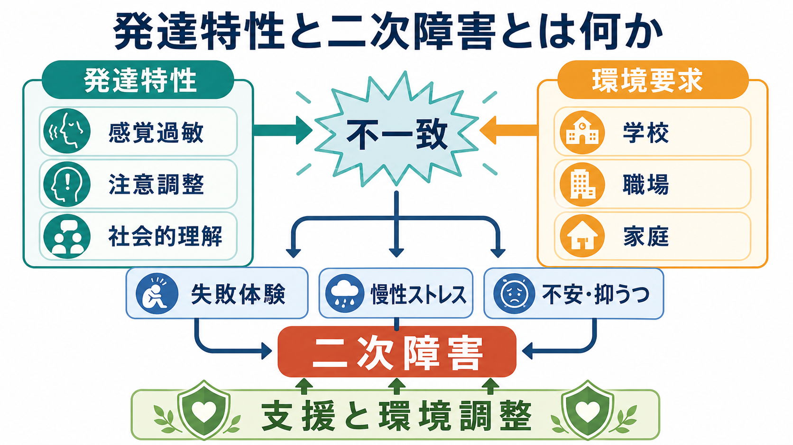
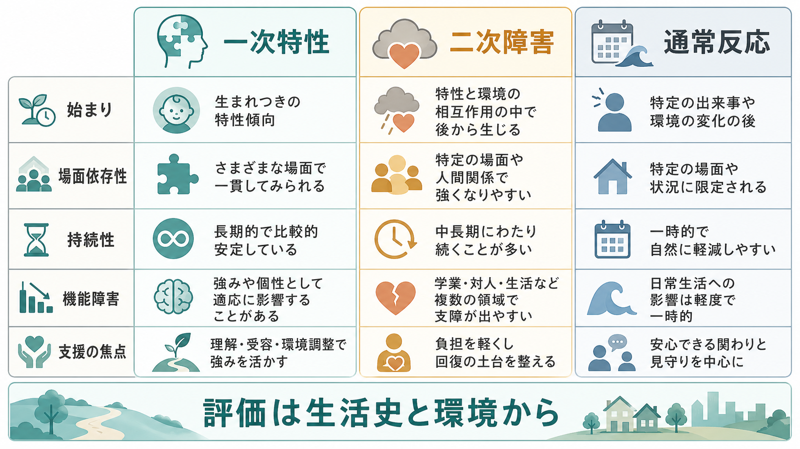
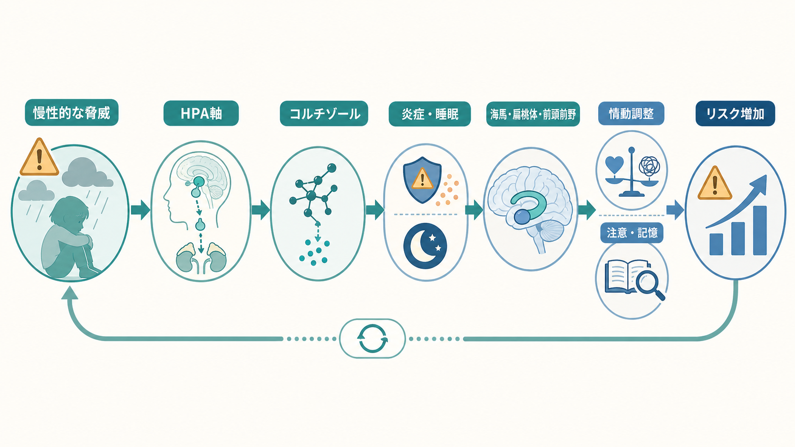

# 発達特性と二次障害とは何か

## 要点

- 発達特性は、注意、感覚、社会的理解、こだわり、実行機能、学習様式などの比較的持続する認知・行動上の偏りである。
- 二次障害は、発達特性そのものではなく、環境要求との不一致、叱責、孤立、失敗体験、慢性ストレスが重なって生じる不安、抑うつ、不眠、身体症状、回避、自傷リスクなどを指す臨床的な整理である。
- 重要なのは「本人の特性が悪い」と見ることではなく、「どの場面で、どの要求が、どの負荷を作っているか」を生活史と環境から評価することである。
- 支援の焦点は、特性を消すことではなく、環境調整、見通し、休息、合理的配慮、心理的安全性、併存する精神症状への標準的評価を組み合わせることにある。
- 本稿は教育・研究目的の整理であり、個別の診断や治療方針を指示するものではない。

## この記事で答える問い

1. 発達特性と二次障害はどう違うのか。
2. なぜ発達特性があると、不安、抑うつ、不登校、バーンアウト、対人回避などが生じやすくなることがあるのか。
3. 二次障害を「性格」「怠け」「反抗」と誤解しないためには、何を評価すればよいのか。
4. 臨床・研究では、発達特性、併存症、環境要因をどう分けて考えるべきか。

## まず結論

二次障害とは、発達特性の直接の症状名ではない。むしろ、発達特性をもつ人が、学校、職場、家庭、対人関係の要求に合わない状態に長く置かれたときに、後から形成される精神的・行動的な困難を指す実践的な概念である。たとえば、感覚過敏のある子どもが騒がしい教室で疲弊し続ける、注意調整が難しい人が「やる気がない」と叱責され続ける、社会的文脈の読み取りに困難がある人が対人失敗を反復する、といった状況では、特性そのものよりも「不一致の累積」が症状化の主因になることがある[1][2]。

この見方は、[[ADHDとは何か]]、自閉スペクトラム症、限局性学習症などを「固定した欠陥」として扱うのではなく、本人の特性と環境要求の相互作用として読むための入口である。NICE の自閉スペクトラム症ガイドラインも、行動上の困難を評価するときに、併存する不安・抑うつ、身体疾患、感覚環境、社会環境、予測可能性の欠如、発達上の変化、搾取や虐待などを確認するよう求めている[3]。

## 背景

日本語の臨床・教育・福祉の現場では、「二次障害」という語は、発達障害の診断名に直接含まれない不安、抑うつ、引きこもり、職場不適応などを説明するためによく使われる。発達障害情報・支援センターも、発達障害のある人が気分障害、不安障害、ひきこもり、職場不適応などの二次障害を主訴として精神科を受診することがあると説明している[1]。

ただし、二次障害は DSM や ICD の独立した診断名ではない。臨床的には、[[うつ病とは何か]]、[[不安症群とは何か]]、[[PTSDとは何か]]、[[不眠障害とは何か]]、[[バーンアウトとは何か]]、[[不登校に関連する精神疾患には何があるのか]]などの既存の診断・症候群と重なる。したがって、「二次障害」と呼んだ時点で評価を終えるのではなく、どの精神症状が、どの程度、どの場面で、どれだけ生活機能を損なっているのかを具体的に見直す必要がある。

発達特性と精神症状の重なりは珍しくない。自閉スペクトラム症における精神疾患併存のメタ分析では、ADHD、不安症、睡眠・覚醒障害、抑うつ症、強迫症などが一般人口より高頻度に推定されている[4]。成人 ADHD でも、気分症、不安症、物質使用症、パーソナリティ関連の困難などがしばしば併存し、診断と支援を複雑にする[5]。ここで大事なのは、「併存が多い」ことと「すべてが発達特性から自動的に生じる」ことを混同しないことである。

## 基本概念

### 発達特性

発達特性とは、発達早期からみられやすく、年齢や環境によって形を変えながら続く認知・感覚・行動の偏りである。たとえば、感覚刺激への敏感さ、見通しの立たない状況への不安、注意の切り替えにくさ、衝動性、社会的合図の読み取りにくさ、読み書きや計算の偏り、運動の不器用さなどが含まれる。厚生労働省の資料でも、発達障害の特性は一律の欠陥ではなく、理解や表現の仕方、課題量、座席、ルール提示、ストレスケアなどの配慮と結びつけて説明されている[2]。

発達特性は、必ずしも障害や症状として現れるわけではない。同じ感覚過敏でも、静かで予測可能な環境では強みや集中につながることがあり、騒音や急な変更が多い環境では疲弊や回避につながることがある。したがって、特性を評価するときは「本人の中に何があるか」だけでなく、「どの環境でどのように現れるか」を見る。

### 二次障害

二次障害は、発達特性と環境要求の不一致が続いた結果として生じる二次的な精神症状や行動上の困難である。典型的には、不安、抑うつ、睡眠障害、身体化、怒り、回避、孤立、不登校、退職、依存、摂食の乱れ、自傷リスクなどが問題になる。

ただし、二次障害という語には注意が必要である。第一に、発達特性がある人に生じた精神症状がすべて二次障害とは限らない。[[併存症とは何か]]で扱うように、発達特性と独立して気分症や不安症が生じることもある。第二に、「二次」と呼ぶことで、うつ病や不安症の評価と支援が軽く扱われてはいけない。第三に、二次障害は本人の努力不足ではなく、反復する不一致と負荷の結果として理解する必要がある。

### 一次特性・併存症・通常反応の違い

| 見る観点 | 一次特性 | 二次障害 | 通常反応 |
|---|---|---|---|
| 始まり | 発達早期からの傾向として確認されやすい | 失敗体験、孤立、過剰適応、慢性ストレスの後に目立つ | 特定の出来事や環境変化の後に一時的に生じる |
| 場面依存性 | 環境によって目立ち方が変わるが、複数場面で手がかりがある | 特定場面で強く、しだいに生活全体へ広がることがある | 状況が落ち着くと軽くなりやすい |
| 持続性 | 比較的持続する | 中長期に続き、回避や孤立で固定化しうる | 短期で波がある |
| 評価の焦点 | 発達歴、認知・感覚・行動特性、機能 | 精神症状、生活機能、リスク、環境負荷 | 出来事、回復過程、支援資源 |
| 支援の焦点 | 合理的配慮、見通し、得意な処理様式の活用 | 安全確保、症状評価、休息、治療、環境調整 | 見守り、心理教育、生活リズム |

## 仕組み

### 1. 特性と環境要求の不一致

二次障害の出発点は、多くの場合、特性と環境要求の不一致である。注意調整が難しい人に長時間の一斉指示だけで行動を求める、感覚過敏のある人に騒音や照明の強い空間を強いる、社会的文脈の読み取りが苦手な人に暗黙のルールを要求する、といった状況では、本人は能力以前に「環境の形式」によって失敗しやすくなる。

この段階で重要なのは、失敗をすぐに「本人の意欲」「性格」「家庭のしつけ」に帰属しないことである。[[基本的帰属錯誤とは何か]]で扱うように、人は他者の困難を内的要因に帰しやすい。発達特性をもつ人の困難では、この帰属の偏りが叱責、羞恥、孤立を増幅しやすい。

### 2. 失敗体験と自己評価の低下

不一致が反復すると、本人は「また失敗する」「自分は普通にできない」「何をしても怒られる」と予測しやすくなる。これは[[学習性無力感とは何か]]と近い形で、行動選択を狭める。回避は短期的には安心をもたらすが、長期的には成功経験、社会的支援、修正学習の機会を減らす。

自閉スペクトラム症では、周囲に合わせるために特性を隠すカモフラージュやマスキングが問題になることがある。カモフラージュ研究の系統的レビューは、この方略が社会参加を助ける場合もある一方で、疲弊、自己理解の困難、メンタルヘルスの悪化と関連しうることを整理している[6]。また、成人自閉スペクトラム症の調査では、自己報告されたカモフラージュが全般不安、社会不安、抑うつ症状と関連した[7]。

### 3. 慢性ストレスと症状化

反復する失敗、叱責、孤立、過剰適応は、慢性ストレスとして蓄積する。慢性ストレスは、睡眠、注意、記憶、情動調整、身体症状に波及しやすい。結果として、最初は特定場面の困難だったものが、朝起きられない、学校や職場に近づくと身体症状が出る、対人場面を避ける、何も楽しくない、急に怒りが爆発する、といった広い生活機能の問題へ広がる。

この過程は、[[ストレス脆弱性モデルとは何か]]の発想とも接続できる。脆弱性は本人の中に固定された弱さとしてだけあるのではなく、睡眠不足、孤立、過密な予定、感覚負荷、評価不安、経済的困難、支援不足の組み合わせとして現れる。

### 4. 回避・孤立・安全感の低下が循環を作る

二次障害が固定化するのは、症状そのものだけでなく、症状を避けるための行動が生活をさらに狭めるからである。不登校、欠勤、対人回避、昼夜逆転、過度なオンライン依存、家族との衝突は、短期的には負荷から逃れる手段になる。しかし、長期的には学習機会、所属感、将来の見通し、自己効力感を失わせることがある。

したがって支援では、無理に参加させることよりも、まず安全感、見通し、休息、失敗しても戻れる足場を作ることが重要である。NICE の ADHD ガイドラインも、評価と支援では症状だけでなく、併存症、社会・家族・教育・職業状況、本人の目標、レジリエンス、保護因子を含めた包括的な計画を重視している[8]。

## 図解

| 図 | 役割 | 読み方 |
|---|---|---|
| 図1 | 概念地図 | 発達特性と環境要求の不一致が、失敗体験・慢性ストレスを介して二次障害に至る流れを見る。 |
| 図2 | メカニズム | 慢性的な脅威、睡眠・炎症・情動調整・注意記憶の変化が循環を作る点を見る。 |
| 図3 | 比較表 | 一次特性、二次障害、通常反応を、始まり、場面依存性、持続性、機能障害、支援焦点から分ける。 |

## 臨床・研究との接続

### 臨床評価

二次障害を疑うときは、次の順に整理すると混乱しにくい。

1. 現在の主訴を確認する。不安、抑うつ、不眠、身体症状、自傷念慮、不登校、退職、依存、怒り、対人回避などを具体的に聞く。
2. 発達歴を確認する。幼少期からの注意、感覚、対人、こだわり、学習、運動、言語の特徴を見る。
3. 生活史を確認する。いじめ、叱責、転校、就職、昇進、出産、介護、喪失、家庭内葛藤など、症状が強まった時期を探す。
4. 環境要求を確認する。音、光、人混み、暗黙のルール、作業量、締切、評価、対人密度、予測不能性を具体化する。
5. リスクを確認する。希死念慮、自傷、他害、虐待、搾取、セルフネグレクト、物質使用、医療中断を見逃さない。
6. 支援資源を確認する。家族、学校、職場、医療、福祉、ピアサポート、合理的配慮、休息場所、経済的支援を整理する。

### 支援の方向性

支援は「発達特性をなくす」ことではなく、二次障害を強める循環を切ることに向ける。たとえば、見通しを増やす、作業量を調整する、音や光の負荷を下げる、評価基準を明確にする、休息を予定に組み込む、失敗しても戻れる手続きを作る、対人要求を段階化する、といった環境調整がある。症状がうつ病、不安症、PTSD、不眠症などの診断水準にある場合は、それぞれの標準的評価と治療につなぐ。

研究では、発達特性、併存症、環境負荷、社会的支援を同時に測る縦断研究が重要である。横断研究だけでは、「発達特性が二次障害を生んだ」のか、「二次障害によって特性が目立つようになった」のか、「第三の環境要因が両方を強めた」のかを分けにくい。

## よくある誤解

### 誤解1: 二次障害は発達障害なら必ず起こる

必ず起こるわけではない。発達特性があっても、早期から理解、配慮、安心できる関係、得意さを活かせる環境があれば、二次障害を予防・軽減できる可能性がある。ここでは[[レジリエンスは発達過程でどう育つのか]]の視点が重要になる。

### 誤解2: 二次障害なら診断や治療は不要である

不要ではない。二次障害という説明は、背景理解のための枠組みであって、現在のうつ病、不安症、不眠、自傷リスクを軽く扱う理由にはならない。むしろ、発達特性を考慮したうえで、精神症状を丁寧に評価する必要がある。

### 誤解3: 本人が環境に慣れれば解決する

慣れで解決する場合もあるが、慢性的な感覚負荷、叱責、過剰適応、いじめ、排除が続くと、慣れではなく疲弊が進む。合理的配慮や環境調整は甘やかしではなく、学習や参加の前提を整える手段である。

### 誤解4: 発達特性とパーソナリティの問題は同じである

同じではない。対人困難、感情調整困難、衝動性、孤立は見かけ上似ることがあるが、発達早期からの特性、生活史、トラウマ、現在の環境負荷、自己像の不安定さなどを分けて評価する必要がある。詳しくは[[パーソナリティ障害と発達特性はどう鑑別するのか]]と接続できる。

## 関連ノート

- [[ADHDとは何か]]
- [[うつ病とは何か]]
- [[不安症群とは何か]]
- [[PTSDとは何か]]
- [[不眠障害とは何か]]
- [[バーンアウトとは何か]]
- [[不登校に関連する精神疾患には何があるのか]]
- [[パーソナリティ障害と発達特性はどう鑑別するのか]]
- [[ライフスパン精神医学とは何か]]
- [[ストレス脆弱性モデルとは何か]]
- [[学習性無力感とは何か]]
- [[レジリエンスは発達過程でどう育つのか]]

## MOC更新候補

- `content/00_MOC/MOC_精神医学.md`
- `content/00_MOC/MOC_発達・ライフスパン.md`
- `content/00_MOC/MOC_臨床心理学.md`

## 未解決問題

- 二次障害という日本語臨床概念を、国際的な診断分類、併存症研究、生活機能評価とどう対応づけるか。
- 発達特性、カモフラージュ、慢性ストレス、抑うつ・不安の因果方向を、縦断研究でどう分けるか。
- 学校・職場の合理的配慮が、どの症状経路をどの程度予防するのか。
- 二次障害を説明するとき、本人の主体性を奪わず、かつ環境責任を見えなくしない言葉をどう設計するか。

## 理解チェック

1. 発達特性と二次障害の違いを、「始まり」と「環境との関係」から説明できるか。
2. 不登校や職場不適応を見たとき、本人要因だけでなく環境要求を少なくとも3つ挙げられるか。
3. 「二次障害」と説明した後に、それでも評価すべき精神症状とリスクを挙げられるか。
4. 支援の焦点を「本人を変える」ではなく「循環を変える」と表現できるか。

## 参考文献

[1] 国立障害者リハビリテーションセンター 発達障害情報・支援センター. 医療機関. https://www.rehab.go.jp/ddis/aware/adult/hospital

[2] 厚生労働省. 発達障害の特性（代表例）. https://www.mhlw.go.jp/seisakunitsuite/bunya/koyou_roudou/koyou/shougaishakoyou/shisaku/jigyounushi/e-learning/hattatsu/characteristic.html

[3] National Institute for Health and Care Excellence. Autism spectrum disorder in under 19s: support and management. NICE guideline CG170. https://www.nice.org.uk/guidance/cg170/chapter/recommendations

[4] Lai, M. C., Kassee, C., Besney, R., Bonato, S., Hull, L., Mandy, W., Szatmari, P., & Ameis, S. H. (2019). Prevalence of co-occurring mental health diagnoses in the autism population: a systematic review and meta-analysis. *The Lancet Psychiatry*, 6(10), 819-829. https://doi.org/10.1016/S2215-0366(19)30289-5

[5] Katzman, M. A., Bilkey, T. S., Chokka, P. R., Fallu, A., & Klassen, L. J. (2017). Adult ADHD and comorbid disorders: clinical implications of a dimensional approach. *BMC Psychiatry*, 17, 302. https://doi.org/10.1186/s12888-017-1463-3

[6] Cook, J., Hull, L., Crane, L., & Mandy, W. (2021). Camouflaging in autism: A systematic review. *Clinical Psychology Review*, 89, 102080. https://doi.org/10.1016/j.cpr.2021.102080

[7] Hull, L., Levy, L., Lai, M. C., Petrides, K. V., Baron-Cohen, S., Allison, C., Smith, P., & Mandy, W. (2021). Is social camouflaging associated with anxiety and depression in autistic adults? *Molecular Autism*, 12, 13. https://doi.org/10.1186/s13229-021-00421-1

[8] National Institute for Health and Care Excellence. Attention deficit hyperactivity disorder: diagnosis and management. NICE guideline NG87. https://www.nice.org.uk/guidance/ng87/chapter/Recommendations
