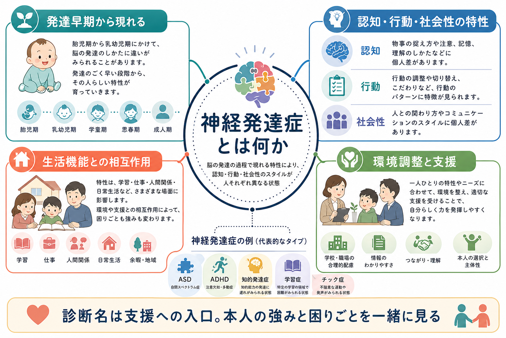
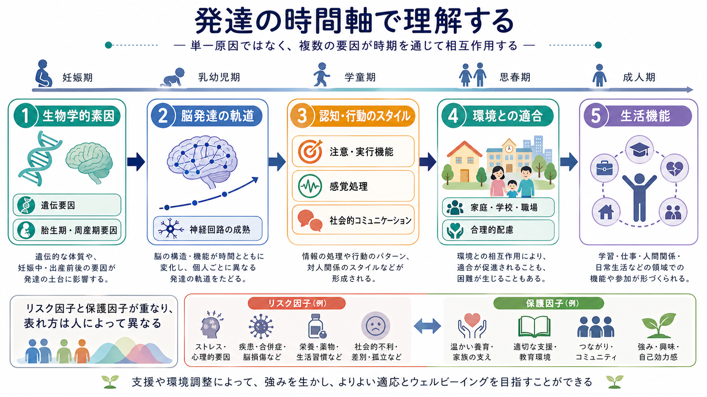

# 神経発達症とは何か

## 要点

- 神経発達症は、発達早期から現れる認知、行動、運動、学習、コミュニケーション、社会性などの特性が、本人の生活機能や参加に影響する疾患群である。
- 診断分類では、自閉スペクトラム症、ADHD、知的発達症、限局性学習症、発達性言語症、発達性協調運動症、チック症などが近接して扱われる。
- 原因を一つに還元するより、遺伝的要因、胎生期・周産期要因、脳発達の軌道、環境との適合、発達段階による変化を合わせて考える必要がある。
- 診断名は「本人を説明し尽くすラベル」ではなく、困りごと、強み、合理的配慮、併存症評価、長期的支援を組み立てる入口である。

## この記事で答える問い

この記事では、神経発達症を「子どもの診断名の一覧」としてではなく、発達の時間軸で現れる神経・認知・行動の多様な特性として整理する。特に、[[DSMとICDは何が違うのか]]のような分類体系、[[発達歴は成人精神科でもなぜ重要なのか]]という臨床評価、[[GAFやWHODASは何を評価するのか]]で扱う生活機能評価と接続して理解する。

## まず結論

神経発達症とは、脳と行動の発達過程に関連する特性が、発達早期から現れ、学習、対人関係、家庭、学校、仕事、日常生活への参加に影響する状態の総称である。DSM-5-TRでは「神経発達症群」として、知的能力、コミュニケーション、ASD、ADHD、限局性学習、運動、チックなどの領域がまとめられている[1]。ICD-11でも、神経発達症群は発達期に発症し、認知、コミュニケーション、運動、学習、行動などの発達機能の獲得と遂行に困難をもたらす群として整理される[2]。

重要なのは、神経発達症を「脳だけの問題」や「育て方の問題」と単純化しないことである。発達は、遺伝的素因、胎生期・周産期の要因、神経回路の成熟、学習経験、家庭・学校・地域環境、文化的期待の相互作用として進む[3][4]。そのため同じ診断名でも、困りごとの現れ方、支援ニーズ、強み、併存症、年齢による変化は大きく異なる。

## 背景

「神経発達症」という用語は、精神疾患を成人期に突然始まる症状だけで捉えるのではなく、発達早期からの特性、神経発達の連続性、生活環境との相互作用を重視する見方を反映している。たとえば[[自閉スペクトラム症とは何か]]では社会的コミュニケーションと限定反復行動、[[ADHDとは何か]]では不注意・多動性・衝動性、[[限局性学習症とは何か]]では読み書き計算などの学習領域が中心になるが、実際の臨床ではこれらが重なって現れることも多い。

この重なりを理解するために、GillbergはESSENCEという考え方を提案した。これは、幼児期早期から注意、社会性、言語、運動、睡眠、気分、行動など複数領域にまたがる発達上のサインが現れ、後にASD、ADHD、言語症、協調運動症、知的発達症などの診断と関係しうるという臨床的枠組みである[5]。つまり、初期の相談では「どの診断名か」を急いで一つに決めるより、複数領域の発達プロフィールと支援ニーズを丁寧に見ることが重要になる。

## 基本概念

神経発達症の基本単位は、診断名そのものではなく、発達機能の偏りと生活上の意味である。代表的には、知的発達、言語・コミュニケーション、社会的相互作用、注意と実行機能、感覚処理、学習、運動協調、チックや反復運動などが評価対象になる。これらは独立した箱ではなく、互いに影響し合う。注意の調整が難しければ学習に影響し、感覚過敏が強ければ学校や職場での疲労が増え、社会的コミュニケーションの違いは対人関係の誤解につながることがある。

診断分類は、研究、支援制度、専門家間のコミュニケーションに役立つ。一方で、分類名だけでは個人の支援計画は立てられない。臨床では、診断分類、発達歴、現在の症状、認知・言語・運動・学習プロフィール、生活機能、本人の主観的困難、家族や学校・職場の環境を合わせて評価する。これは[[知的発達症とは何か]]や[[発達性言語症とは何か]]、[[発達性協調運動症とは何か]]を個別に理解するときにも共通する視点である。

## 仕組み

神経発達症の仕組みは、単一の病変や単一遺伝子だけで説明されるものではない。稀な単一遺伝子変異やコピー数変異が強い影響をもつ場合もあるが、多くは多数の遺伝的変異、発達期の環境要因、神経回路の可塑性、学習経験が重なって、認知・行動のスタイルとして現れる[4][6]。

このとき「リスク因子」は必ず診断へ直結するわけではない。同じリスクから異なる転帰が生じる多終局性と、異なる経路から似た症状が生じる等終局性がある。たとえば注意困難はADHDだけでなく、不安、睡眠不足、感覚過敏、トラウマ、知的発達、学習困難、うつ状態などでも目立つことがある。逆に同じADHD診断でも、学業困難が中心の人、情動調整が中心の人、成人期の職場管理が中心の人では支援が異なる。

## 図解

上の図は、神経発達症を「発達の時間軸」で見るための概念図である。生物学的素因は出発点の一部だが、そこから脳発達の軌道、注意・実行機能、感覚処理、社会的コミュニケーション、家庭・学校・職場との適合が重なり、最終的に生活機能として現れる。したがって、支援は「症状を消す」ことだけではなく、環境を調整し、本人が使える方略を増やし、強みを発揮しやすくすることを含む。

## 臨床・研究との接続

臨床では、まず本人と家族が何に困っているのかを具体化する。困りごとは、家庭、学校、職場、友人関係、睡眠、食事、余暇、自己理解など複数の場面で異なる。次に、発達歴と現在の機能を照合する。幼児期からの言語、運動、遊び、社会性、学習、感覚、睡眠、情動調整の情報は、成人診療でも重要である。

研究では、診断カテゴリに基づく群比較だけでなく、症状次元、認知機能、神経回路、遺伝的負荷、環境要因、生活機能を横断的に見る方向が強まっている。ASDとADHDの併存、知的発達症とてんかん、学習症と不安、チック症と強迫症状など、診断横断的な重なりを扱うことが、発達精神病理学と計算論的研究の重要な課題になっている[3][6]。

## よくある誤解

第一に、「神経発達症は子どもだけの問題」という誤解がある。多くの特性は成人期にも続きうるが、現れ方は年齢、役割、環境要求によって変わる。成人期には、職場での段取り、対人調整、疲労管理、金銭管理、親密関係、子育てなどで困難が目立つことがある。

第二に、「診断名があれば支援は自動的に決まる」という誤解がある。診断名は入口であり、実際の支援は機能評価と本人の目標から組み立てる必要がある。合理的配慮、環境調整、心理教育、家族支援、学校・職場との連携、併存する不安・抑うつ・睡眠問題への対応は、個別性が高い。

第三に、「神経発達症は育て方のせい」という誤解がある。養育環境は困難を軽くも重くもするが、それは原因を親に帰すという意味ではない。発達特性と環境要求のミスマッチを減らし、本人と周囲が理解しやすい形に変えることが支援の焦点である。

第四に、「早期診断だけが重要」という誤解がある。早期の気づきと支援は重要だが、診断が遅れた人にも、成人期からの自己理解、環境調整、併存症治療、生活スキル支援は意味をもつ。

## 関連ノート

- [[発達障害群とは何か]]
- [[自閉スペクトラム症とは何か]]
- [[ADHDとは何か]]
- [[限局性学習症とは何か]]
- [[知的発達症とは何か]]
- [[発達性言語症とは何か]]
- [[発達性協調運動症とは何か]]
- [[チック症とは何か]]
- [[発達歴は成人精神科でもなぜ重要なのか]]
- [[DSMとICDは何が違うのか]]
- [[GAFやWHODASは何を評価するのか]]

## 理解チェック

1. 神経発達症を「診断名の一覧」だけで理解すると、何が見えにくくなるか。
2. 同じ診断名でも支援が異なる理由を、生活機能と環境適合の観点から説明できるか。
3. 「リスク因子」と「原因」を混同すると、どのような誤解が生じるか。
4. 成人精神科で発達歴を確認する意義を説明できるか。

## 未解決問題

- DSMやICDの診断カテゴリと、神経回路・遺伝・認知機能の次元的モデルをどう統合するか。
- 早期支援の効果を、症状軽減だけでなく、本人の参加、自己理解、ウェルビーイングとしてどう測定するか。
- 文化、学校制度、職場環境、家族資源の違いが、診断率や支援アクセスに与える影響をどう評価するか。
- 併存症をもつ人に対して、診断横断的で個別化された支援計画をどう設計するか。

## 参考文献

[1] American Psychiatric Association. (2022). *Diagnostic and Statistical Manual of Mental Disorders, Fifth Edition, Text Revision (DSM-5-TR)*. American Psychiatric Association Publishing. https://doi.org/10.1176/appi.books.9780890425787

[2] World Health Organization. (2024). *ICD-11 for Mortality and Morbidity Statistics: Neurodevelopmental disorders*. https://icd.who.int/browse/2024-01/mms/en

[3] Thapar, A., Cooper, M., & Rutter, M. (2017). Neurodevelopmental disorders. *The Lancet Psychiatry, 4*(4), 339-346. https://doi.org/10.1016/S2215-0366(16)30376-5

[4] Parenti, I., Rabaneda, L. G., Schoen, H., & Novarino, G. (2020). Neurodevelopmental disorders: From genetics to functional pathways. *Trends in Neurosciences, 43*(8), 608-621. https://doi.org/10.1016/j.tins.2020.05.004

[5] Gillberg, C. (2010). The ESSENCE in child psychiatry: Early Symptomatic Syndromes Eliciting Neurodevelopmental Clinical Examinations. *Research in Developmental Disabilities, 31*(6), 1543-1551. https://doi.org/10.1016/j.ridd.2010.06.002

[6] Jeste, S. S. (2015). Neurodevelopmental behavioral and cognitive disorders. *Continuum, 21*(3 Behavioral Neurology and Neuropsychiatry), 690-714. https://doi.org/10.1212/01.CON.0000466661.89908.3c

[7] American Psychiatric Association. (2022). *Autism Spectrum Disorder Fact Sheet*. https://www.psychiatry.org/getmedia/604671b1-68ef-4d0c-bc35-92e681004d8e/APA-DSM5TR-AutismSpectrumDisorder.pdf

[8] Faraone, S. V., Banaschewski, T., Coghill, D., et al. (2021). The World Federation of ADHD International Consensus Statement: 208 evidence-based conclusions about the disorder. *Neuroscience & Biobehavioral Reviews, 128*, 789-818. https://doi.org/10.1016/j.neubiorev.2021.01.022
