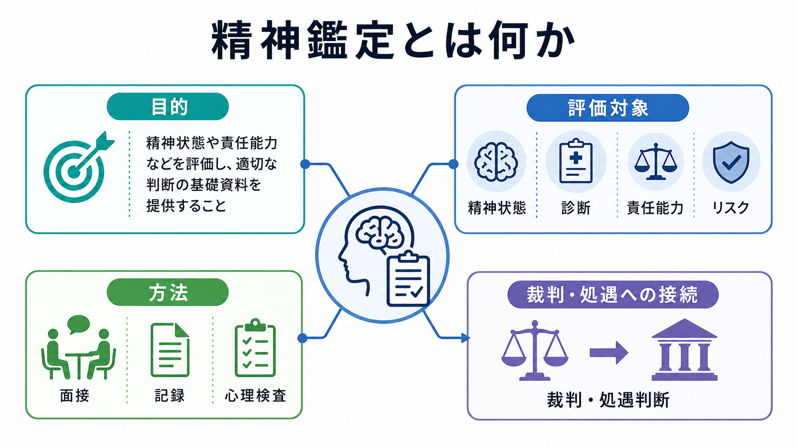
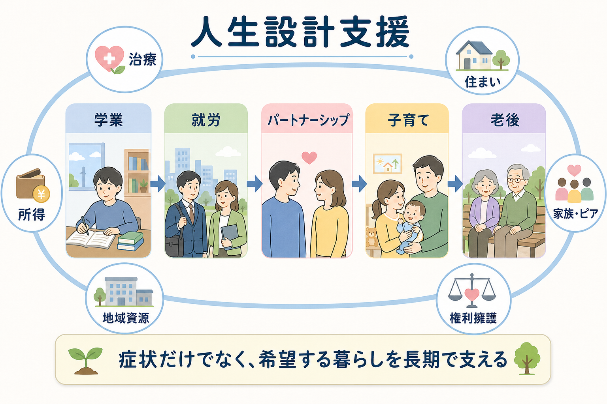

# 移行期支援とは何か

## 要点

- 移行期支援とは、年齢や所属の変化に伴って支援が途切れやすい時期に、本人の目標、生活機能、医療、教育、就労、家族支援をつなぎ直す実践である。
- 典型的には、児童精神科から成人精神科への移行、学校から高等教育・就労・地域生活への移行が問題になる。
- 成功の鍵は「紹介状を出すこと」ではなく、早期準備、準備性評価、共同面接、情報共有、移行後フォローを組み合わせることである[1][2]。
- 精神医学では、移行期は症状の増減だけでなく、自己決定、服薬・受診の自己管理、家族役割の変化、生活機能の変化として見る必要がある。
- 本稿は教育・研究目的の整理であり、個別の診断や治療方針を指示するものではない。

## この記事で答える問い

1. 移行期支援は、単なる「転院」や「卒業後の進路支援」と何が違うのか。
2. 児童精神科から成人精神科への移行では、何が切れ目になりやすいのか。
3. 学校から社会への移行では、医療・福祉・教育・就労支援をどう接続するのか。
4. 本人中心の支援と、家族・支援者の連携をどう両立させるのか。

## まず結論

移行期支援は、「支援機関を変える手続き」ではなく、本人が次の生活環境で支援を使いながら自分の生活を組み立てられるようにする過程である。児童精神科から成人精神科への移行では、受診先、診療文化、家族同席の程度、本人への説明責任、薬物療法や心理社会的支援の継続が変わる。学校から社会への移行では、担任やスクールカウンセラーのような身近な支援者が減り、本人が福祉、医療、就労、地域資源を自分で使う場面が増える。

したがって、移行期支援は[[児童精神医学とは何か]]、[[ライフスパン精神医学とは何か]]、[[神経発達症とは何か]]、[[発達特性と二次障害とは何か]]をつなぐ実践である。特に神経発達症、慢性精神疾患、身体疾患を併存する若者では、診断名だけでなく、学業、就労、対人関係、睡眠、金銭管理、通院継続、家族関係を含めた生活機能を見なければならない。

## 背景

青年期から若年成人期は、教育段階、居住、家族関係、就労、対人関係、医療制度上の扱いが同時に変わる時期である。精神疾患の多くはこの時期までに発症し、児童青年期に始まった困難が成人期の生活機能へ続くことも少なくない[3]。一方で、児童精神科と成人精神科は、対象年齢、診療枠、家族への関わり方、学校連携の慣習が異なるため、単に成人科へ紹介するだけでは支援の連続性が失われやすい。

英国 NICE の移行支援ガイドラインは、子ども・若者が成人サービスへ移る際には、移行を一回のイベントではなく、準備から移行後フォローまでの過程として扱うこと、本人と家族が理解できる情報提供を行うこと、移行を調整する担当者を明確にすることを推奨している[1]。米国の Got Transition は、医療移行を実装する枠組みとして、方針、対象者把握、準備性評価、計画、転送、完了確認という Six Core Elements を示している[2]。

日本でも、小児期発症疾患の成人移行や、発達障害・精神障害のある若者の就労・地域生活への移行が課題になっている。日本小児科学会は、移行期医療を「自立・自律を支えながら、小児期医療から成人期医療へ移る過程」として整理しており、疾患管理だけでなく本人の意思決定能力と生活支援を含める必要がある[4]。

## 基本概念

### 移行と転送を分ける

「転送」は、紹介状、診療情報提供書、予約、担当者変更のような具体的手続きである。「移行」は、それより広く、本人が新しい支援者と関係を作り、新しい制度を理解し、自分の健康・生活を管理する力を段階的に高める過程である。転送だけを整えても、本人が成人精神科の受診スタイルを理解していない、服薬管理を家族任せにしている、学校の支援がなくなった後の相談先がない場合には、支援は途切れる。

### 本人中心

本人中心とは、本人を一人で放り出すことではない。本人の希望、価値観、理解度、意思表示の仕方に合わせて、家族や支援者が情報を整理し、選択肢を比較し、本人が参加できる意思決定を支えることである。知的障害、発達特性、不安、うつ、トラウマ反応がある場合でも、支援者が「本人には難しい」と決めつけず、説明の形式、時間、環境、同席者を調整する。

### 切れ目のない支援

切れ目のない支援は、同じ支援者が永遠に関わることではない。むしろ、支援者が変わることを前提に、情報、役割、緊急時対応、移行後の確認時期を明示することを意味する。児童精神科の主治医、成人精神科、学校、相談支援、就労支援、家族が、互いに「誰が何を担うか」を曖昧にしないことが重要である。

## 仕組み

移行期支援は、次のような段階で整理できる。

| 段階 | 目的 | 具体例 |
|---|---|---|
| 早期準備 | 移行を突然の出来事にしない | 14-16歳頃から成人期の受診、進学、就労、福祉利用を話題にする |
| 対象者把握 | 支援が必要な人を見落とさない | 慢性疾患、神経発達症、自傷リスク、不登校、家族負担を確認する |
| 準備性評価 | 本人が何を理解し、何を支援される必要があるかを見る | 診断理解、服薬、予約、緊急時相談、金銭管理、通学・通勤を確認する |
| 移行計画 | 支援者間の役割を明確にする | 成人科予約、情報提供書、学校・福祉・就労支援との連携、同意範囲を決める |
| 共同面接・引き継ぎ | 関係の断絶を減らす | 児童科と成人科の共同面接、家族同席から本人中心面接への移行 |
| 定着確認 | 移行後の脱落を早期に見つける | 初回受診後の確認、未受診時の連絡、支援計画の見直し |

CAMHS から成人精神保健サービスへの移行研究では、移行の経験はしばしば不十分で、若者・家族・臨床家の間で情報不足、準備不足、成人サービスの受け皿不足が問題になることが報告されている[5]。この知見は、日本の制度へそのまま当てはめるのではなく、地域の医療資源、精神保健福祉制度、学校制度に合わせて翻訳する必要がある。

## 図解

移行期支援を図で見ると、医療の移行と生活の移行は別々ではなく、同じ本人の生活上で重なる。児童精神科から成人精神科へ移る時期は、高校卒業、大学入学、就職、ひとり暮らし、福祉サービス利用、家族からの自立が重なりやすい。したがって、医療者は症状の変化だけでなく、学業・就労・住まい・所得・対人関係・家族役割を一緒に見る必要がある。

## 臨床・研究との接続

### 児童精神科から成人精神科へ

児童精神科では、家族、学校、児童相談、福祉、地域支援が診療に深く関わる。一方、成人精神科では、本人の同意、自己決定、服薬・受診の自己管理、就労・生活支援との接続がより前面に出る。移行期支援では、本人が成人科で何を話す必要があるか、家族がどの範囲で関与するか、緊急時に誰へ連絡するかを明確にする。

特に、[[児童青年期のうつ病はどう現れるのか]]、[[児童青年期の不安症はどう現れるのか]]、[[思春期の自殺リスクはどう評価するのか]]に関連するケースでは、移行期に受診中断が起こるとリスク評価が途切れる。移行計画には、症状悪化時のサイン、危機時の相談先、家族・本人の同意範囲を含める。

### 学校から社会へ

学校から社会への移行では、学校内の支援が卒業とともに終わり、本人が医療、福祉、就労支援、地域資源を自分で使う必要が増える。障害福祉サービスの就労移行支援は、一般就労を希望する障害のある人に対して、職業訓練、求職活動、職場定着に向けた支援を行う制度である[6]。精神障害や発達障害のある若者では、就労準備だけでなく、睡眠、通勤、対人ストレス、服薬、相談行動を含む生活全体の支援が重要になる。

重い精神疾患をもつ人への就労支援では、Individual Placement and Support（IPS）のように、本人の希望を重視し、訓練してから就労するのではなく、実際の仕事と支援を同時に進めるモデルに一定のエビデンスがある[7]。学校から社会への移行でも、本人の希望を抽象的に聞くだけでなく、実際の環境で試し、困難を評価し、支援を調整する発想が有用である。

### 研究デザイン上の課題

移行期支援の研究では、「移行できたか」を一回の受診成立だけで測ると不十分である。評価指標には、受診継続、救急受診・入院、症状、生活機能、学業・就労、本人の満足、家族負担、自己管理スキル、サービス利用の公平性を含める必要がある。さらに、支援が届きにくい人ほど研究から脱落しやすいため、未受診や中断を失敗として記録できる設計が重要である。

## よくある誤解

### 「18歳になったら成人科へ移せばよい」

年齢は目安であって、移行の準備度そのものではない。疾患の安定度、本人の理解、家族関与、生活環境、成人科の受け入れ体制を見ながら、移行の時期と方法を調整する必要がある。

### 「本人中心とは、家族を外すことである」

本人中心は、家族排除ではない。本人の意思とプライバシーを尊重しつつ、本人が望む範囲で家族や支援者を活用することである。特に若年者では、家族が服薬、金銭、受診、危機対応を支えている場合があるため、家族の役割を急に断つと支援が崩れる。

### 「移行期支援は医療だけの問題である」

医療移行は重要だが、学校から社会への移行、住まい、所得、就労、友人関係、福祉制度の利用も同時に変わる。医療だけを整えても、生活の足場が崩れれば症状は悪化しうる。

### 「支援すれば自立を妨げる」

適切な支援は自立を妨げるものではなく、自立の条件を整えるものである。自立は「支援なしで生きること」ではなく、「必要な支援を理解し、選び、使いながら生活を組み立てること」と考えるほうが実践的である。

## 関連ノート

- [[児童精神医学とは何か]]
- [[思春期精神医学とは何か]]
- [[ライフスパン精神医学とは何か]]
- [[神経発達症とは何か]]
- [[発達特性と二次障害とは何か]]
- [[不登校は精神医学的にどう理解するのか]]
- [[大学生のメンタルヘルス問題には何があるのか]]
- [[青年期のひきこもりはどう理解するのか]]

MOC更新候補: `content/00_MOC/` 配下の精神医学、発達・ライフスパン、臨床実践、キャリア・学習支援関連 MOC。並列ジョブとの競合を避けるため、本稿では MOC 本体は更新していない。

## 理解チェック

1. 「転送」と「移行」は何が違うか。
2. 児童精神科から成人精神科へ移るとき、家族の関与はどのように変化しうるか。
3. 学校から社会への移行で、医療者が就労・福祉・地域生活を確認する理由は何か。
4. 本人中心の支援が「本人任せ」にならないためには、どのような工夫が必要か。
5. 移行期支援の研究では、受診成立以外にどのようなアウトカムを測るべきか。

## 参考文献

[1] National Institute for Health and Care Excellence. (2016). *Transition from children's to adults' services for young people using health or social care services (NICE guideline NG43).* https://www.nice.org.uk/guidance/ng43

[2] Got Transition. (2024). *Six Core Elements of Health Care Transition.* https://www.gottransition.org/six-core-elements/

[3] Kessler, R. C., Amminger, G. P., Aguilar-Gaxiola, S., Alonso, J., Lee, S., & Ustun, T. B. (2007). Age of onset of mental disorders: A review of recent literature. *Current Opinion in Psychiatry, 20*(4), 359-364. https://doi.org/10.1097/YCO.0b013e32816ebc8c

[4] 日本小児科学会. (n.d.). *移行期医療について.* https://www.jpeds.or.jp/modules/activity/index.php?content_id=221

[5] Hovish, K., Weaver, T., Islam, Z., Paul, M., & Singh, S. P. (2012). Transition experiences of mental health service users, parents, and professionals in the United Kingdom: A qualitative study. *Psychiatric Rehabilitation Journal, 35*(3), 251-257. https://doi.org/10.2975/35.3.2012.251.257

[6] 厚生労働省. (n.d.). *障害福祉サービスについて.* https://www.mhlw.go.jp/stf/seisakunitsuite/bunya/hukushi_kaigo/shougaishahukushi/service/index.html

[7] Bond, G. R., Drake, R. E., & Becker, D. R. (2020). An update on Individual Placement and Support. *World Psychiatry, 19*(3), 390-391. https://doi.org/10.1002/wps.20784

[8] Singh, S. P., Paul, M., Ford, T., Kramer, T., Weaver, T., McLaren, S., Hovish, K., Islam, Z., Belling, R., & White, S. (2010). Process, outcome and experience of transition from child to adult mental healthcare: Multiperspective study. *The British Journal of Psychiatry, 197*(4), 305-312. https://doi.org/10.1192/bjp.bp.109.075135

## 未解決問題

- 日本の精神科医療圏で、児童精神科と成人精神科の共同面接や移行外来をどの程度実装できるか。
- 神経発達症、知的障害、慢性身体疾患、家族困難が重なる若者に対し、どの準備性評価が実用的か。
- 移行期支援の効果を、受診継続だけでなく生活機能、本人の自己決定、家族負担、就労・学業の継続で測る研究設計をどう作るか。
